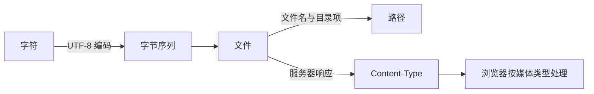

# 文件、目录、路径、扩展名、文本编码与压缩包

## 是什么

文件是带名称的持久数据；目录用于组织文件和子目录。路径是定位资源的字符串：绝对路径从文件系统根开始，相对路径从当前工作目录或当前文档开始。扩展名是文件名末尾用于提示格式的部分，不能保证内容真实类型。文本编码定义字符与字节的映射；Web 文本通常使用 UTF-8。压缩包把一个或多个文件封装并可压缩，ZIP、tar.gz 是常见格式。

## 为什么需要

HTML 的 `href`、`src`，命令行参数、构建配置都依赖路径。错误编码会产生乱码；隐藏扩展名会造成 `index.html.txt` 等错误；解压不可信文件可能发生路径穿越或覆盖。

## 从字符到文件的结构



文件名、内容和媒体类型是三个不同信息。把 `photo.jpg` 改名为 `photo.html` 不会把 JPEG 字节转换成 HTML；浏览器处理网络资源时主要依据响应的 `Content-Type`，并受 `X-Content-Type-Options: nosniff` 等安全策略影响。

## 文件名、路径、编码与媒体类型规则

- POSIX 使用 `/`；Windows 常用 `\`，URL 始终使用 `/`。
- `.` 是当前目录，`..` 是父目录；路径是否区分大小写取决于文件系统。
- Web 项目使用小写、连字符、无空格文件名；不要依赖本机大小写不敏感特性。
- HTML 声明 `<meta charset="utf-8">`，文件本身也必须保存为 UTF-8。
- 扩展名不是 MIME 类型；服务器通过 `Content-Type` 告知浏览器资源类型。

## 最小目录与相对路径示例

```text
site/
├── index.html
└── assets/
    └── logo.svg
```

`index.html` 中使用 `./assets/logo.svg`；`assets` 内文件引用首页可用 `../index.html`。ZIP 解压前先查看清单，确认没有绝对路径、`../` 或意外可执行文件。

在 macOS/Linux 终端可验证文件类型与编码：

```sh
pwd
file --mime index.html
python3 -c 'from pathlib import Path; print(Path("index.html").read_text(encoding="utf-8")[:40])'
unzip -l release.zip
tar -tzf release.tar.gz
```

`file` 的判断来自内容特征，不等于服务器最终发送的媒体类型。Python 命令会在 UTF-8 非法时明确失败，适合验证文件是否真能按 UTF-8 解码。列出归档清单不会解压内容；确认路径安全后再解压到新建空目录。

## 路径解析步骤

解析相对路径时要先确定基准：

| 使用位置 | 相对路径基准 |
| --- | --- |
| shell 命令参数 | 当前工作目录，可用 `pwd` 查看 |
| HTML 的 `href`、`src` | 当前文档 URL，受 `base` 元素影响 |
| CSS `url()` | 声明所在样式表的 URL |
| JavaScript `import` | 由模块解析规则和运行环境决定 |
| Markdown 本地链接 | 当前 Markdown 文件所在目录 |

规范化路径会处理 `.` 和 `..`，但不要用字符串替换模拟安全检查。服务端处理用户输入的文件路径时，必须把最终解析结果限制在允许目录内，并拒绝符号链接绕过、绝对路径和路径穿越。

## 路径、编码和归档失败模式

不要在 HTML 中写本机绝对路径；部署后不可访问。重命名只改大小写在部分系统不会生效，可用中间名过渡。BOM 通常不必添加。压缩与归档不同：tar 主要归档，gzip 压缩单一字节流。

## URL、Git 与归档的相邻边界

URL 百分号编码与文件编码不是同一机制；Git 记录路径和内容，不记录空目录；可用 `.gitkeep` 约定保留空目录，但它不是 Git 特性。

## 进入完整案例前的最小验证

建立 `site/index.html`、`site/assets/logo.svg` 和 `site/docs/guide.html`，在两个 HTML 文件中互相链接并引用同一图片。完成标准：从本地 HTTP 服务器打开两页时链接均有效；Network 中资源返回正确 `Content-Type`；所有文本可按 UTF-8 解码；把项目移动到另一个绝对路径后仍能工作。

## 完整案例：接收并检查一个网站素材包

输入是设计同事提供的 `landing-assets.zip`。需求是把包中的文本、图片和字体放进项目，但不能覆盖现有文件，也不能把不安全路径写到项目外。

### 1. 在隔离目录查看清单

先建立全新的检查目录，不直接解压进仓库：

```sh
mkdir -p archive-review/extracted
cp landing-assets.zip archive-review/
cd archive-review
unzip -l landing-assets.zip
```

清单应逐项检查：文件名是否含 `../`，是否以 `/` 开始，是否有不认识的可执行文件，是否存在与项目相同但大小异常的文件。ZIP 条目名使用 `/` 作为分隔符；解压工具仍可能把它映射为本机路径。

预期清单可以包含：

```text
assets/logo.svg
assets/hero.webp
content/intro.txt
fonts/readme.txt
```

以下条目必须停止解压并要求重新打包：

```text
../../.ssh/config
/tmp/install.sh
assets/../../../package.json
```

路径穿越的风险不是文件名难看，而是解压后的规范化目标可能落到指定目录之外。安全解压器应根据最终目标路径执行边界检查；人工查看清单是额外检查，不替代工具自身的安全实现。

### 2. 解压并验证实际文件

```sh
unzip landing-assets.zip -d extracted
find extracted -type f -print
file --mime extracted/content/intro.txt
file --mime extracted/assets/logo.svg
```

`find` 的输出是实际落盘结果。`file --mime` 可给出内容识别和候选字符集，但这只是本地检测结果；部署时仍要核对服务器响应头。

再验证 UTF-8 文本：

```sh
python3 - <<'PY'
from pathlib import Path

for path in Path("extracted").rglob("*.txt"):
    text = path.read_text(encoding="utf-8", errors="strict")
    print(path, len(text), "characters")
PY
```

输出中的字符数不等于文件字节数。中文字符在 UTF-8 中通常占多个字节，换行在不同平台也可能有不同字节表示。

### 3. 建立目标映射而不是整体覆盖

| 输入 | 项目目标 | 处理决定 |
| --- | --- | --- |
| `assets/logo.svg` | `public/assets/logo.svg` | 查看 SVG 是否含脚本或外部引用后复制 |
| `assets/hero.webp` | `public/assets/hero.webp` | 检查尺寸、格式和许可证后复制 |
| `content/intro.txt` | 不直接部署 | 作为内容输入，人工合并进 HTML |
| `fonts/readme.txt` | `docs/font-license.txt` | 保留许可证信息，不把说明文件当字体 |

复制前使用 `git status` 确认工作区，复制后使用 `git diff --stat` 与内容审查确认变化。不要以压缩包文件名或扩展名推断可信度。

### 4. 浏览器侧验证

启动本地 HTTP 服务器后，在 Network 检查：SVG 应返回 `image/svg+xml`，WebP 应返回 `image/webp`，HTML 应声明 UTF-8。页面源代码使用仓库相对的 URL，不使用 `/Users/...` 等本机路径。

失败分支包括：文本严格解码抛出 `UnicodeDecodeError`，说明文件不是有效 UTF-8；图片返回 `text/plain`，说明服务器媒体类型配置错误；移动项目后路径失效，说明代码依赖了本机绝对路径。每种失败都应修正源文件或服务器配置，不用浏览器端字符串替换掩盖。

案例完成输出是经过审查的少量项目文件、保留的许可证信息和一份干净的 Git diff。验收时从另一个目录启动服务器，所有资源仍可加载，且解压目录之外没有新增文件。

## 常见文件操作决策

- 需要保留原始层级但不压缩时使用 tar 归档；需要压缩 tar 字节流时再配合 gzip 等压缩算法。
- 文本乱码先确认原始字节与声明编码，不对已乱码字符串反复“转码”。
- 文件名大小写修正要通过 Git 可观察的两步重命名，确保大小写不敏感文件系统也记录变化。
- 服务器无法识别新扩展名时配置媒体类型，不把扩展名改成错误格式。
- 外部资源进入仓库前记录来源、许可证、生成方式和可重复优化步骤。

## 来源

- [MDN：Dealing with files](https://developer.mozilla.org/en-US/docs/Learn_web_development/Getting_started/Environment_setup/Dealing_with_files) — 访问日期：2026-07-17
- [Unicode Standard：UTF-8](https://www.unicode.org/versions/Unicode17.0.0/core-spec/chapter-3/) — 访问日期：2026-07-17
- [IANA：Media Types](https://www.iana.org/assignments/media-types/media-types.xhtml) — 访问日期：2026-07-17
