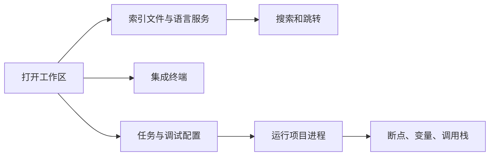

# VS Code：文件、搜索、终端、插件与调试

## 是什么与为什么需要

VS Code 是以文件夹或工作区为边界的代码编辑器。Explorer 管文件，Search 跨文件检索，Terminal 运行 shell，Extensions 增加语言和工具支持，Run and Debug 控制调试器。统一在工作区内操作能让路径、任务、源码控制和调试配置一致。

## 编辑、搜索、终端、插件与调试能力

- 用“打开文件夹”而非逐个打开文件；项目级配置存入 `.vscode/`。
- Search 支持普通文本、大小写、全词和正则，并可包含/排除 glob。
- 集成终端的初始目录通常是工作区根；终端使用系统已有 shell。
- 插件代码拥有较高权限，只安装可信发布者、检查权限与维护状态。
- 调试器依靠断点、调用栈、变量、监视表达式；配置通常在 `.vscode/launch.json`。

## 工作区的配置层级

VS Code 可以打开单文件、单文件夹或多根工作区。项目开发应至少打开项目文件夹，使搜索、任务、Git 和终端拥有共同边界。

| 层级 | 典型位置 | 适用内容 |
| --- | --- | --- |
| 默认设置 | VS Code 内置 | 产品默认值，只读参考 |
| 用户设置 | 用户配置目录 | 字体、主题、个人快捷方式 |
| 工作区设置 | `.vscode/settings.json` | 团队共享的格式化、文件排除和语言设置 |
| 语言设置 | `[javascript]` 等作用域 | 只覆盖指定语言 |
| 文件夹设置 | 多根工作区中的单个根 | 只影响对应根目录 |

更具体的作用域通常覆盖更宽泛的作用域。修改前在 Settings 编辑器中查看该值来自哪个层级，不要把个人绝对路径、账户信息或令牌写入可提交配置。



## 最小工作区操作流程

1. `File > Open Folder` 打开项目。
2. `Cmd/Ctrl+Shift+F` 搜索 `TODO`；`Cmd/Ctrl+\`` 打开终端。
3. 在行号左侧设置断点，从 Run and Debug 启动；观察 Variables 和 Call Stack。
4. 将团队需要的插件写入 `.vscode/extensions.json` 的 `recommendations`，不要提交个人敏感设置。

```json
{
  "recommendations": ["dbaeumer.vscode-eslint"]
}
```

`extensions.json` 只表达推荐，不会静默安装插件。共享调试配置时，可用 `${workspaceFolder}` 代替开发者机器上的绝对路径：

```json
{
  "version": "0.2.0",
  "configurations": [
    {
      "name": "运行当前 Node 文件",
      "type": "node",
      "request": "launch",
      "program": "${file}",
      "cwd": "${workspaceFolder}",
      "skipFiles": ["<node_internals>/**"]
    }
  ]
}
```

调试时依次观察：当前暂停行、Call Stack 中的调用顺序、Variables 中各作用域值、Watch 表达式和 Debug Console。条件断点适合只在特定输入出现时暂停；日志断点能输出信息而不修改源码。

## 配置、终端、插件和 source map 失败模式

终端命令报错不等于编辑器报错，先确认终端工作目录和 shell。插件之间可能冲突；禁用后重载定位。浏览器 JavaScript 调试可能需要正确 source map。不要把 `.vscode/settings.json` 中的令牌提交到 Git。

## Workspace Trust 与命令发现

Workspace Trust 可限制不可信目录中任务、调试和插件的自动执行；Command Palette 是发现命令和快捷键的统一入口。

Restricted Mode 会限制或关闭可能执行工作区代码的功能，包括任务、调试、部分设置和扩展。它不能证明扩展安全；安装扩展前仍要核对发布者、源码或隐私声明、更新记录和所需权限。

## 调试案例的前置验证

打开一个练习仓库，完成一次跨文件重命名、正则搜索、终端命令和断点调试。完成标准：搜索排除 `node_modules`；调试器能停在预期行并说明调用栈；`.vscode` 中没有绝对个人路径和秘密；在不信任的副本中能识别 Restricted Mode 限制。

## 完整案例：定位订单总价计算错误

输入是一个包含 `src/price.js`、`src/main.js` 和 `test/price.test.js` 的 Node 项目。现象是折扣订单偶尔出现负数总价。任务是在不修改生产数据的前提下找到触发路径、修复代码并留下团队可复用的调试配置。

### 1. 先确认工作区边界

通过 `File > Open Folder` 打开仓库根目录，而不是只打开 `price.js`。Explorer 应同时看到 `package.json`、`src` 和 `test`。集成终端运行：

```sh
pwd
git status --short
npm test
```

`pwd` 的输出应为仓库根目录。测试失败是当前输入证据；如果命令提示找不到 `package.json`，说明终端目录错误，应先修正目录，不修改 npm 配置。

### 2. 用搜索建立调用范围

在全局 Search 搜索 `calculateTotal(`，启用大小写匹配并排除 `node_modules`、`dist`：

```text
files to exclude: **/node_modules/**, **/dist/**
```

记录函数定义、生产调用和测试调用。再使用 Rename Symbol 修改测试副本中的局部变量，确认语言服务能区分符号引用与同名文本。普通文本替换不理解作用域，可能误改日志、文档或其他对象的属性名。

### 3. 建立最小调试配置

`.vscode/launch.json` 使用工作区变量和 Node 内置测试运行器：

```json
{
  "version": "0.2.0",
  "configurations": [
    {
      "name": "调试价格测试",
      "type": "node",
      "request": "launch",
      "runtimeExecutable": "node",
      "runtimeArgs": ["--test", "test/price.test.js"],
      "cwd": "${workspaceFolder}",
      "skipFiles": ["<node_internals>/**"]
    }
  ]
}
```

JSON 必须能解析；路径不写开发者用户名。若项目不准备共享调试配置，就不要提交该文件；若团队共享，应在变更说明中写明所需 Node 版本。

### 4. 用断点读取真实状态

在折扣计算行设置普通断点，在入口设置条件断点 `discount > subtotal`。启动“调试价格测试”，暂停后检查：

| 视图 | 需要确认的证据 |
| --- | --- |
| Variables | `subtotal`、`discount`、`tax` 的数值和类型 |
| Call Stack | 测试怎样进入 `calculateTotal` |
| Watch | `subtotal - discount + tax` 的中间结果 |
| Breakpoints | 条件表达式是否只命中异常输入 |
| Debug Console | 只读取表达式，不执行有副作用的生产操作 |

Step over 观察每行之后的变量，Step into 只在需要检查被调用函数时使用。若 source map 映射错误，暂停位置可能偏离源代码；先确认当前运行的是源码、转译产物还是旧构建。

### 5. 修复、验证和留下输出

假设业务规则是折扣不能超过小计，修复应同时包含输入约束和测试，而不是只用 CSS 隐藏负数。运行单个测试、完整测试和类型/静态检查，再查看 Source Control diff。

预期输出包括：失败测试先稳定复现；修复后测试通过；Call Stack 能解释调用路径；共享配置中没有秘密和绝对路径；Git diff 只包含修复、测试和必要配置。

失败分支：断点不命中时检查是否运行了错误配置、代码是否被构建到另一个文件、断点是否未绑定；变量显示旧值时停止旧进程并重新启动；插件造成异常时用“Disable (Workspace)”逐个排除，而不是删除全部用户设置。

## 工作区安全检查

不熟悉的仓库先保持 Restricted Mode，阅读 `package.json` scripts、`.vscode/tasks.json`、`.vscode/launch.json` 和工作区设置。任务、调试和扩展都可能启动进程。授予信任是允许执行工作区能力的决定，不是代码安全证明。

团队应提交稳定且与项目相关的配置，例如格式化器选择、推荐插件和可移植调试入口；主题、字体、个人 shell、账户令牌和本机路径属于用户配置。冲突时在 Settings UI 检查值的来源和作用域，不凭猜测重复写覆盖项。

## 来源

- [VS Code：Core Editor Features](https://code.visualstudio.com/docs/core-editor/overview) — 访问日期：2026-07-17
- [VS Code：User and workspace settings](https://code.visualstudio.com/docs/configure/settings) — 访问日期：2026-07-17
- [VS Code：Terminal Basics](https://code.visualstudio.com/docs/terminal/basics) — 访问日期：2026-07-17
- [VS Code：Debugging](https://code.visualstudio.com/docs/debugtest/debugging) — 访问日期：2026-07-17
- [VS Code：Workspace Trust](https://code.visualstudio.com/docs/editing/workspaces/workspace-trust) — 访问日期：2026-07-17
