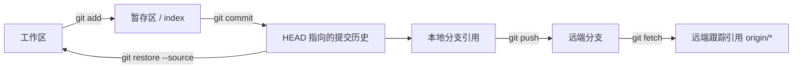

# Git：仓库、工作区、暂存区、提交、分支、合并与远端

## 是什么

Git 是分布式版本控制系统。仓库存储对象和引用；工作区是检出的可编辑文件；暂存区（index）是下一次提交的候选快照；提交记录快照、父提交和作者信息。分支是指向提交的可移动引用，合并组合历史，远端是另一个仓库的命名地址。

## 为什么需要

Git 提供可审查历史、并行开发、回退依据和跨设备同步。暂存区允许一次只提交一个逻辑变化，分支隔离实验。

## 三棵树与引用



提交对象记录根目录树、父提交、作者、提交者和消息。分支不是提交副本，而是会随新提交向前移动的引用。`HEAD` 通常符号指向当前分支；在 detached HEAD 状态下直接指向某个提交，新提交若未建立分支引用，之后可能难以找到。

## 核心命令与状态变化

```sh
git init
git status
git add README.md
git diff --staged
git commit -m "docs: add readme"
git switch -c feature/nav
git switch main
git merge feature/nav
git remote add origin https://github.com/OWNER/REPO.git
git push -u origin main
git fetch origin
git pull --ff-only
```

提交前分别看 `git diff` 与 `git diff --staged`。解决冲突后删除冲突标记，测试，再 `git add` 和提交。

推荐的一次小变更循环：

```sh
git status --short
git diff -- README.md
git add README.md
git diff --staged -- README.md
git commit -m "docs: clarify installation"
git log --oneline --decorate -5
```

`git fetch` 只更新远端跟踪引用和对象，不改工作区；`git pull` 是获取后再集成，具体可能合并或变基。初学阶段使用 `git pull --ff-only` 可在不能快进时明确停止，先检查双方历史再决定合并策略。

| 命令 | 主要影响 | 是否改写已有提交 |
| --- | --- | --- |
| `git restore file` | 工作区文件 | 否，但可能丢弃未提交修改 |
| `git restore --staged file` | 从暂存区撤下 | 否 |
| `git revert <commit>` | 新建一个反向提交 | 否，适合共享历史 |
| `git commit --amend` | 用新提交替换当前提交 | 是 |
| `git reset` | 移动分支并按模式影响 index/工作区 | 可能，执行前必须确认模式 |

## 提交、分支与远端引用不变量

- 提交的是暂存区，不是整个工作区。
- `origin/main` 是远端跟踪分支；本地 `main` 与它不是同一引用。
- `.gitignore` 不会停止追踪已纳入仓库的文件。
- commit 哈希标识内容和历史；改写历史会产生新哈希。

## 历史、秘密和二进制文件边界

不要提交密码、令牌和私钥；删除后仍可能存在历史中。共享分支避免强制推送。合并冲突不是 Git 判断哪方正确，需根据意图处理。Git 不适合直接存大量频繁变化的二进制文件。

## restore、reset 与 revert 的恢复边界

`HEAD` 通常指向当前分支；detached HEAD 指向具体提交。`git restore`、`reset`、`revert`语义不同，执行前读官方文档并确认是否改写历史。

## 合并前的冲突与秘密处理原则

冲突文件中的 `<<<<<<<`、`=======`、`>>>>>>>` 只标识不同版本片段，不说明哪个业务结果正确。解决后运行测试，并用 `git diff --check` 查残留空白问题。`.gitignore` 只影响未跟踪文件；秘密一旦提交，应立即撤销凭据、通知相关方，再按仓库策略清理历史。

练习：建立仓库，在两个分支修改同一行并制造冲突，然后保留正确组合。完成标准：提交前能解释 staged diff；历史包含可读的小提交；冲突标记全部删除；测试通过；远端没有强制推送和秘密。

## 完整案例：在功能分支修复导航并合并

输入是一个干净的 `main` 分支和需求“将帮助链接从 `/help-old` 改为 `/help`，增加回归测试”。目标是形成两个逻辑提交：测试与实现，不混入编辑器临时文件。

### 1. 建立分支前确认基线

```sh
git status --short
git branch --show-current
git fetch origin
git log --oneline --decorate --graph -5
```

`status --short` 应无输出，当前分支应为 `main`。`fetch` 更新远端跟踪引用，但不保证本地 main 已包含远端提交。若 `main` 落后，可在没有本地分叉时执行 `git merge --ff-only origin/main`。

如果工作区已有他人或自己的未提交变化，不要用 `reset --hard` 清理；应先识别归属，提交到正确分支、建立补丁、暂存或与负责人协调。

### 2. 创建分支并先写失败测试

```sh
git switch -c fix/help-link
git status --short
```

修改测试后只暂存测试文件：

```sh
git diff -- test/navigation.test.js
git add test/navigation.test.js
git diff --staged
git commit -m "test: cover help navigation target"
```

提交前运行测试，应看到新测试因旧路径失败。这个失败是需求已被测试捕获的证据。若测试直接通过，可能测试没有检查真实 href、运行了旧构建或需求已被实现，需要先调查。

### 3. 修改实现并检查两类 diff

```sh
git diff
git status --short
git add src/navigation.js
git diff --staged -- src/navigation.js
git commit -m "fix: update help navigation target"
```

`git diff` 比较工作区与 index；`git diff --staged` 比较 index 与 HEAD。若临时日志没有被 add，它应留在工作区而不进入提交；更好的做法是删除调试日志并让工作区恢复干净。

### 4. 制造并处理一个真实冲突

假设 main 同期把链接文字从“帮助”改成“帮助中心”：

```sh
git switch main
git merge --ff-only origin/main
git switch fix/help-link
git merge main
```

冲突文件会出现双方片段。先查看：

```sh
git status
git diff --cc
```

正确业务结果可能需要同时保留 main 的文字和功能分支的 URL。编辑为最终 HTML/对象值，删除所有冲突标记，运行：

```sh
git diff --check
git add src/navigation.js
git status
git commit
```

`git add` 在冲突阶段表示“该路径已解决”，不是确认业务正确。测试与人工验证仍是必需步骤。

### 5. 合并与远端同步

功能分支先推送并建立上游：

```sh
git push -u origin fix/help-link
```

代码审查通过后按仓库策略合并。若在本地执行：

```sh
git switch main
git merge --no-ff fix/help-link
git push origin main
```

`--no-ff` 是否适用是仓库历史策略，不是 Git 正确性的要求。团队也可能使用 fast-forward、squash 或托管平台合并。

### 6. 输出、验证与失败分支

预期 `git log --graph` 能看到基线、测试、实现和可能的合并提交；`git status` 干净；测试通过；远端 PR diff 不含临时文件。

推送被拒绝通常表示远端目标已有本地未包含的提交。先 fetch 并审查历史，不用 `--force` 绕过。误提交秘密时先撤销秘密本身，再处理历史；仅删除当前文件不能使旧提交中的秘密失效。误删未提交文件时 Git 只可能恢复此前跟踪版本，未跟踪内容没有 Git 快照保障。

## 提交身份与内容身份

作者记录原始创作者，提交者记录实际创建该提交对象的人；变基、cherry-pick 等操作可能改变提交者和哈希。用户名与邮箱是提交元数据，不构成密码学身份验证。签名提交可提供额外验证，但验证含义取决于密钥管理和托管平台信任策略。

## 来源

- [Git：gitglossary](https://git-scm.com/docs/gitglossary) — 访问日期：2026-07-17
- [Git：gittutorial](https://git-scm.com/docs/gittutorial) — 访问日期：2026-07-17
- [Git：git-diff](https://git-scm.com/docs/git-diff) — 访问日期：2026-07-17
- [Git：git-restore](https://git-scm.com/docs/git-restore) — 访问日期：2026-07-17
- [Git：gitignore](https://git-scm.com/docs/gitignore) — 访问日期：2026-07-17
