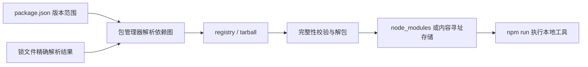

# Node.js、包管理器、package.json、依赖与脚本

## 是什么

Node.js 是基于 V8 的 JavaScript 运行时。包管理器解析、下载并记录项目依赖。`package.json` 是包的清单，包含名称、版本、脚本、依赖和模块类型；锁文件记录已解析的精确依赖图。`dependencies` 是运行所需依赖，`devDependencies` 是开发和构建所需依赖。

## 为什么需要

前端工具链、开发服务器、测试器和构建器通常运行于 Node.js。清单与锁文件让团队和 CI 能重建接近一致的依赖环境。

## 安装与执行链路



`package.json` 描述直接依赖的允许范围；锁文件记录完整解析图、实际版本和完整性信息。锁文件提高可复现性，但不能保证所有平台得到逐字节相同结果：可选依赖、原生扩展、操作系统、CPU、Node 版本和安装脚本仍会造成差异。

## 清单、安装与脚本的最小流程

```sh
node --version
npm --version
npm init -y
npm install lodash
npm install --save-dev eslint
npm run test
npm ci
```

```json
{
  "private": true,
  "type": "module",
  "scripts": {
    "dev": "vite",
    "build": "vite build",
    "test": "node --test"
  },
  "engines": { "node": ">=22" },
  "dependencies": { "lodash": "^4.17.21" },
  "devDependencies": { "vite": "^7.0.0" }
}
```

字段边界：

| 字段 | 作用 | 重要边界 |
| --- | --- | --- |
| `private` | 阻止意外发布当前包 | 应用仓库通常设为 `true` |
| `type` | 决定 `.js` 默认按 ESM 或 CommonJS 解释 | `module` 与 `commonjs` 会改变导入导出行为 |
| `scripts` | 命名项目命令 | 可执行任意 shell 命令，运行不可信仓库前先审查 |
| `dependencies` | 应用运行所需包 | 前端打包后是否随部署携带取决于构建方式 |
| `devDependencies` | 开发、测试、构建工具 | 若生产环境现场构建，仍需在构建阶段安装 |
| `engines` | 声明支持的运行时范围 | 默认常是提示；是否强制取决于包管理器配置 |

## 清单与锁文件不变量

- 提交 `package.json` 和所选包管理器的锁文件，不提交 `node_modules`。
- 同一项目避免混用 npm、pnpm、Yarn 锁文件。
- `npm run` 会把本地 `node_modules/.bin` 加入 PATH。
- 语义版本范围不保证升级无缺陷；升级后必须测试。
- 安装脚本可执行代码，依赖不是天然可信。

## 全局工具、CI 与安装脚本风险

全局安装项目工具会导致版本漂移；优先项目内依赖。不要手改锁文件。`npm install` 可更新锁文件，CI 通常使用 `npm ci` 做冻结安装。不要把前端可见环境变量当秘密。

`npm ci` 要求存在锁文件，并在锁文件与清单不一致时失败；它会移除已有 `node_modules` 后执行干净安装，不用于新增单个依赖。`npm run` 会把依赖提供的可执行文件目录加入 `PATH`，因此脚本可直接写 `vite`，无需全局安装。

安装包可能运行 `preinstall`、`install`、`postinstall` 等生命周期脚本。审查未知依赖，保持最小权限，并在适合的 CI 环境使用安装脚本策略；跳过脚本可能导致依赖未正确构建，因此需要测试而不是盲目禁用。

## engines、审计与版本环境

Node 的 `engines` 可声明支持版本但不必然强制；可配合版本管理器。定期使用审计工具，但漏洞报告仍需结合代码是否实际可达判断。

## 完整案例的验收目标

创建一个 `private` 项目，加入一个运行依赖和一个测试依赖，编写 `test` 脚本并提交清单与锁文件。删除 `node_modules` 后运行 `npm ci` 和 `npm test`。完成标准：安装不会改动锁文件；项目使用本地工具；换到声明支持的 Node 版本仍通过；能解释直接依赖、传递依赖和开发依赖的区别。

## 完整案例：建立可复现的前端工具项目

输入是一台已安装受支持 Node.js 和 npm 的电脑，目标是建立一个不会发布到 registry 的应用，使用 Vite 构建，并用 Node 测试运行器执行纯函数测试。

### 1. 记录运行环境并初始化

```sh
node --version
npm --version
mkdir package-lab
cd package-lab
npm init -y
```

版本输出是后续复现证据。`npm init -y` 会写入 `package.json`，执行后立即检查内容，不把默认字段都视为适合应用。

将关键字段改为：

```json
{
  "name": "package-lab",
  "private": true,
  "type": "module",
  "scripts": {
    "dev": "vite",
    "build": "vite build",
    "test": "node --test"
  },
  "engines": {
    "node": ">=22"
  }
}
```

`name` 便于工具标识项目；`private` 防止误发布；`type: module` 使 `.js` 按 ESM 解释；scripts 提供稳定入口；engines 声明支持范围但是否强制取决于配置。

### 2. 安装直接依赖

```sh
npm install lodash
npm install --save-dev vite
git status --short
```

预期新增或修改 `package.json`、`package-lock.json` 和本地 `node_modules`。仓库应忽略 `node_modules/`，提交清单和锁文件。检查 `npm ls --depth=0` 可看到直接依赖，但完整依赖图包含更多传递包。

不要从示例中机械采用版本号。安装命令按当前 registry 解析版本并更新锁文件，因此代码审查要同时检查清单范围和锁文件变化。

### 3. 建立可测试代码

`src/total.js`：

```js
export function total(values) {
  if (!Array.isArray(values) || values.some((value) => !Number.isFinite(value))) {
    throw new TypeError('values must be an array of finite numbers');
  }
  return values.reduce((sum, value) => sum + value, 0);
}
```

`test/total.test.js`：

```js
import assert from 'node:assert/strict';
import test from 'node:test';
import { total } from '../src/total.js';

test('adds finite values', () => {
  assert.equal(total([12, 8, 5]), 25);
});

test('rejects invalid values', () => {
  assert.throws(() => total([12, Number.NaN]), TypeError);
});
```

运行 `npm test`。预期两个测试通过；失败分支被显式验证，而不是只展示成功输入。

### 4. 验证 clean install

先确保清单与锁文件已经保存，再删除可重建目录：

```sh
rm -R node_modules
npm ci
npm test
npm run build
git status --short
```

`npm ci` 会按锁文件执行干净安装。预期不会修改 `package.json` 或锁文件；测试与构建均通过。若它报告清单与锁文件不一致，应在开发分支用 `npm install` 正确更新锁文件并审查，而不是在 CI 中忽略。

### 5. 审查依赖与脚本

```sh
npm explain vite
npm outdated
npm audit
```

`npm explain` 展示包为何存在；`outdated` 比较当前、期望和最新版本；`audit` 报告已知漏洞线索。任何升级都要看实际可达性、变更说明和测试结果，不能仅根据数量自动强制修复。

失败分支：Node 版本不满足 engines 时，不同环境可能仅警告或直接失败；原生依赖可能因平台工具链失败；安装脚本可能执行不可信代码；registry 或代理错误会中断下载；可选依赖失败不一定使整体安装失败。诊断时保存精确命令、版本、平台和首个错误，不只复制最后一行。

### 6. 案例验收输出

最终仓库包含清单、一个锁文件、源码和测试，不包含 `node_modules`。全新克隆在支持的 Node 版本上执行 `npm ci && npm test && npm run build` 成功，且命令没有改动锁文件。任何前端构建变量都被视为公开配置，秘密只存在于受控服务端或 CI secret 存储中。

## 来源

- [Node.js：Introduction to Node.js](https://nodejs.org/en/learn/getting-started/introduction-to-nodejs) — 访问日期：2026-07-17
- [npm：package.json](https://docs.npmjs.com/cli/configuring-npm/package-json) — 访问日期：2026-07-17
- [npm：Scripts](https://docs.npmjs.com/cli/using-npm/scripts/) — 访问日期：2026-07-17
- [npm：npm ci](https://docs.npmjs.com/cli/commands/npm-ci/) — 访问日期：2026-07-17
