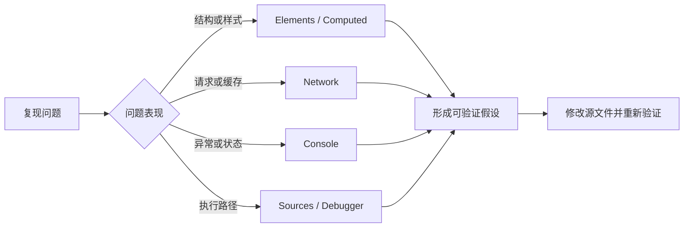

# 浏览器 DevTools：Elements、Console、Network 与 Sources

## 是什么与为什么需要

DevTools 是浏览器内置诊断工具。Elements 检查实时 DOM 和计算样式；Console 查看消息并在页面上下文执行 JavaScript；Network 记录请求、响应、时序和缓存；Sources 查看资源、设置断点和单步执行。它提供运行时证据，不能只靠阅读源码替代。



DevTools 面板不是互相替代的。一个图片未显示可能同时需要检查 DOM 中的 `src`、Network 状态和响应类型、Console 的安全错误以及 Sources 中生成 URL 的代码。

## 四个核心面板的证据类型

1. Elements 选择节点，在 Styles 临时切换声明，在 Computed 看最终值和来源。
2. Console 运行 `document.querySelector('main')`，检查错误堆栈；不要粘贴不可信代码。
3. 打开 Network 后刷新，查看主文档的 Status、Headers、Timing、Response、Initiator。
4. Sources 在事件处理函数设断点，使用 Step over/into/out、Scope、Watch 定位状态变化。

### Elements 与样式

- DOM 树显示浏览器解析后的实时节点，不一定与原始 HTML 文本相同。
- Styles 显示匹配规则和被覆盖声明；Computed 显示最终计算值，并可追溯来源。
- Event Listeners、Properties 和 Accessibility 视图可进一步检查事件、DOM 属性和无障碍名称。

### Network 的请求证据

| 字段 | 回答的问题 |
| --- | --- |
| Status | HTTP 层是否成功、重定向或失败 |
| Type / Content-Type | 浏览器怎样解释资源，服务器声明是否正确 |
| Initiator | 哪个文档、样式或脚本触发请求 |
| Timing | 队列、连接、等待响应和下载分别耗时多少 |
| Size | 来自网络、内存缓存还是磁盘缓存 |
| Request/Response Headers | 方法、缓存、认证、跨源等协议事实 |

只在客户端展示问题时导出 HAR 前，应检查其中可能包含 Cookie、Authorization、查询参数和响应数据，脱敏后再共享。

### Sources 调试

普通断点暂停在指定行；条件断点只在表达式为真时暂停；DOM 断点可在节点变化时暂停；XHR/fetch 断点按 URL 片段暂停。Step over 执行当前行但不进入被调用函数，Step into 进入调用，Step out 运行到当前函数返回。

## 运行时检查的关键规则

- Elements 中修改默认只存在于当前页面会话，刷新会丢失。
- Network 只记录面板打开后的活动；复现加载问题先打开再刷新。
- “Disable cache”通常仅在 DevTools 打开时生效。
- Console 当前执行上下文可能是 iframe 或扩展，不一定是顶层页面。
- 生产代码经过转译或压缩时，source map 决定能否映射到源文件。

## 状态码、缓存与跨浏览器边界

404 是资源不存在，控制台的 CORS 报错还需看 Network 响应。缓存命中会使请求时序与首次访问不同。临时修改 DOM 不能修复源文件。DevTools 展现的是特定浏览器实现，跨浏览器问题需在目标浏览器复测。

## 日志、节流、发起者和可访问性树

保留日志可跨导航观察；Network 节流是模拟，不等同真实网络。可从 Initiator 追踪是谁触发请求，从 Accessibility 树核对语义。

## 完整案例的复现准备

准备一个路径错误的图片和一个抛出异常的按钮。先记录现象，再分别用 Network 和 Sources 找到根因，修复源文件后刷新验证。完成标准：能给出请求 URL、状态、发起者和异常堆栈；能说明临时 Styles 修改为何刷新后消失；Console 无未解释错误；键盘焦点和无障碍名称可在 Accessibility 视图核对。

## 完整案例：商品图片和购买按钮同时失效

输入证据是页面显示图片占位，点击“加入购物车”无反应。源码包含图片元素和事件脚本，但不能先假设是同一个根因。

### 1. 固定复现条件

打开 DevTools，Network 勾选 Preserve log，选择 Disable cache 后刷新。记录页面 URL、浏览器版本、视口和复现步骤。缓存禁用仅在 DevTools 打开期间生效，测试完成后要恢复正常条件再次验证。

### 2. 用 Elements 检查解析结果

在 Elements 选中图片，确认实际 DOM：

```html

```

检查 Properties 中 `currentSrc`、`naturalWidth`、`complete`。`complete` 为 true 不等于成功解码，失败图片也可能处于完成状态；`naturalWidth` 为 0 是进一步证据。

再检查按钮是否真是：

```html
<button type="button" data-product-id="42">加入购物车</button>
```

如果运行时 DOM 是 `div`，问题可能在模板生成或脚本替换，不能用临时添加 `role` 作为修复。

### 3. 在 Network 定位图片失败层

过滤 `Img`，选择请求并记录：

| 观察项 | 实际证据 | 结论方向 |
| --- | --- | --- |
| Request URL | 是否为预期绝对 URL | 路径基准是否错误 |
| Status | 404、403、200 等 | 路由、权限或响应可用性 |
| Content-Type | 应为受支持图片类型 | 服务器可能返回 HTML 错误页 |
| Response | 是否真是图片字节/错误文档 | 状态 200 也可能内容错误 |
| Initiator | HTML、CSS 或脚本 | 找到负责生成 URL 的源 |

若状态 404 且 Initiator 是主 HTML，修复 `src`。若状态 200 但 Content-Type 为 `text/html`，可能服务器把缺失资源回退到 SPA HTML；应修复服务器资源路由，不在图片元素上重试同一 URL。

### 4. 用 Console 和 Sources 查按钮

Console 第一条未处理异常为：

```text
TypeError: Cannot read properties of null (reading 'addEventListener')
```

点击堆栈进入 Sources，在异常处暂停。Scope 显示查询选择器返回 null，而脚本使用了 `.buy-button`，DOM 使用 `[data-product-id]`。用 Console 只读验证：

```js
document.querySelector('.buy-button')
document.querySelector('[data-product-id="42"]')
```

预期第一个为 null，第二个返回按钮。临时在 Console 手工绑定事件只能验证假设，刷新会丢失，最终必须修改源码。

### 5. 验证修复的交互与网络

修改选择器并重新加载。设置事件监听断点或在处理函数设断点，点击按钮后检查 Call Stack、请求负载和响应。成功不只看按钮颜色，还要确认：

- 键盘 Tab 能聚焦按钮，Enter 与 Space 能激活。
- Network 中加入购物车请求方法、状态和正文符合契约。
- 重复点击时不会创建意外重复订单。
- Console 没有未解释异常。
- Accessibility 树的 Name 是“加入购物车”，Role 是 button。

失败分支：如果断点命中旧代码，检查 Network 是否加载旧 bundle、source map 是否对应当前构建、Service Worker 或缓存是否拦截。若请求被 CORS 阻止，Network 仍可能显示响应线索；修复服务端跨源策略，不用关闭浏览器安全功能作为生产方案。

### 6. 输出与证据链

案例输出包括修正的资源 URL、选择器与回归测试。问题记录应写明复现输入、失败请求、异常堆栈、源码位置、修复 diff 和修复后的观察结果。截图可辅助沟通，但状态、头和代码文本更适合审查与搜索。

## 面板数据的限制

Network 节流是浏览器的模拟参数，不包含所有真实无线网络、设备 CPU 和服务端拥塞。Performance、Memory 和 Lighthouse 各有不同采样与审计模型，不能用单次分数替代真实用户数据。跨浏览器实现问题必须在目标浏览器的开发工具中复测。

## 来源

- [Chrome DevTools：Overview](https://developer.chrome.com/docs/devtools/overview) — 访问日期：2026-07-17
- [Chrome DevTools：Inspect network activity](https://developer.chrome.com/docs/devtools/network/) — 访问日期：2026-07-17
- [Chrome DevTools：Console reference](https://developer.chrome.com/docs/devtools/console/reference/) — 访问日期：2026-07-17
- [Chrome DevTools：JavaScript debugging](https://developer.chrome.com/docs/devtools/03-javascript/) — 访问日期：2026-07-17
- [Chrome DevTools：Accessibility features reference](https://developer.chrome.com/docs/devtools/accessibility/reference/) — 访问日期：2026-07-17
