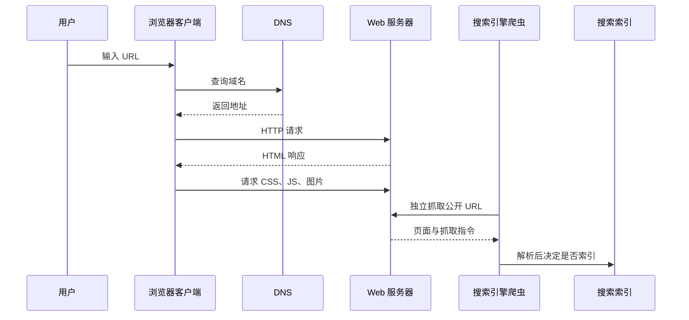

# 客户端、服务器、浏览器与搜索引擎

## 是什么与为什么需要

客户端发起网络请求；服务器监听请求并返回资源或计算结果。浏览器是 Web 客户端，负责请求、解析、渲染和执行页面。搜索引擎通过爬取、索引、排序提供检索，搜索结果页不是浏览器也不是目标网站。区分角色有助于判断故障发生在页面代码、网络、服务端还是索引系统。

## 四个角色的能力边界

- 同一程序可在一次通信中是客户端、另一次是服务器；角色由交互决定。
- Web 服务器既可指机器，也可指处理 HTTP 的软件。
- 浏览器先请求 HTML，再根据文档继续请求 CSS、脚本、图片等资源。
- 搜索引擎能否发现页面取决于链接、抓取许可、可访问响应与索引策略；提交 URL 不保证收录。

## 一次页面访问中的角色



浏览器访问页面与搜索引擎建立索引是两条独立链路。浏览器可以访问某 URL，不代表爬虫允许抓取或搜索引擎选择收录；页面已收录也不保证对某关键词排名靠前。

| 角色 | 输入 | 主要输出 | 常见故障 |
| --- | --- | --- | --- |
| 浏览器 | URL、用户操作 | DOM、渲染结果、网络请求 | 缓存、脚本异常、不兼容 |
| Web 服务器 | HTTP 请求 | 状态、响应头、响应体 | 路由、权限、依赖、过载 |
| 搜索爬虫 | 可发现 URL | 抓取到的文档 | robots 规则、认证、响应错误 |
| 索引系统 | 抓取文档和规范化信号 | 可检索条目 | 重复内容、质量或索引策略 |

## 从主文档开始的故障定位

在 Network 刷新页面：第一行通常是主 HTML 文档，查看其状态；再检查后续资源。直接输入 URL 是导航；在搜索框输入关键词是向搜索服务查询，两者路径不同。

定位故障时从可观察边界开始：

1. 浏览器地址栏确认最终 URL 和重定向。
2. Network 查看主文档是否获得可用 HTTP 响应。
3. 查看响应体是否确为预期 HTML，而不是代理错误页。
4. 检查后续资源和 Console。
5. 只在页面本身可访问后，再检查抓取、canonical、robots 和搜索平台报告。

## 响应、缓存与搜索摘要边界

“服务器正常”不代表应用响应正确；需检查状态、响应体和控制台。浏览器缓存可能隐藏服务端变化。搜索结果摘要可能过时。浏览器也可展示 PDF、图片等非 HTML 资源。

## Internet、Web 与多层站点架构

互联网是通信基础设施，Web 是其上的服务；邮件等服务不属于 Web。一个网站可由 CDN、反向代理、应用服务器和数据库共同提供。

## 完整案例的观察目标

选择一个公开页面，记录主文档、一个样式表和一张图片的请求链路，并说明浏览器、服务器和搜索引擎各自能看到什么。完成标准：不把搜索结果页当作网站本身；能区分网络失败、HTTP 错误、页面脚本错误和索引问题；不根据单次缓存访问推断服务端始终正常。

## 完整案例：公开文章能访问但搜索不到

输入证据是文章 URL `https://example.com/guide/http-cache` 在浏览器中能打开，但使用站点搜索和公共搜索引擎都找不到。目标是区分浏览器访问、站点后端、爬虫抓取和索引选择四个环节。

### 1. 验证浏览器实际拿到什么

在无登录的私密窗口直接输入 URL，打开 Network 并刷新。记录主文档最终 URL、状态、Content-Type、重定向链和响应体。可用命令补充：

```sh
curl -I https://example.com/guide/http-cache
curl -L --max-redirs 5 -o /dev/null -w '%{url_effective} %{http_code}\n' \
  https://example.com/guide/http-cache
```

`curl -I` 使用 HEAD，服务器实现可能与 GET 不完全一致；最终仍要在浏览器或普通 GET 中验证。若未登录请求被重定向到登录页，该文章对公共爬虫也不是公开正文。

### 2. 检查正文是否在响应中

查看 Response 或页面源代码，搜索文章标题和关键段落。若只有空壳与脚本，浏览器可能依赖 JavaScript 请求 API 后渲染。搜索引擎可能执行脚本，但执行资源、权限和索引策略不同；关键公开内容应在可抓取、稳定的响应路径中提供。

| 观察 | 可能问题 | 下一步 |
| --- | --- | --- |
| 404/5xx | 服务器或路由失败 | 修复状态和内容后再谈索引 |
| 200 但正文是错误页 | 错误状态伪装 | 返回正确 4xx/5xx |
| 302 到登录 | 页面不公开 | 调整权限或接受不可索引 |
| 200 且 HTML 含正文 | 访问层基本可用 | 检查爬取与索引信号 |

### 3. 检查爬虫可发现性

文章应从站内正常 `a[href]` 链接可达，不依赖只能点击脚本按钮生成 URL。检查导航、栏目页、sitemap 和内部链接。sitemap 是 URL 发现提示，不替代链接结构，也不保证收录。

检查 `robots.txt` 是否禁止路径，并查看页面 robots meta 或响应 `X-Robots-Tag`。如果 robots.txt 阻止抓取，爬虫可能无法读取页面内的 `noindex`；若目标是移除索引，通常需要允许抓取后读取 noindex，具体按搜索平台规则处理。

### 4. 区分抓取与索引

使用站点所接入搜索平台的 URL 棖查工具查看最近抓取、抓取响应、用户声明 canonical 和平台选择 canonical。抓取成功仍可能因重复内容、质量、规范化或平台策略不索引。

canonical 是信号：如果文章错误地指向栏目首页，平台可能把文章视为重复页。修正为真实首选 URL，同时保持内部链接、sitemap、重定向和页面内容信号一致。

### 5. 验证站内搜索是另一系统

站内搜索可能查询自有数据库或索引服务，与公共搜索引擎无关。检查文章是否进入发布状态、索引任务是否成功、语言/权限过滤是否把它排除。不能因为公共 URL 可访问就断言站内索引同步成功。

### 6. 输出与失败分支

案例输出是一条证据链：公开 GET 返回 200 HTML；正文可见；robots 允许抓取；没有 noindex；canonical 自指；站内链接和 sitemap 可发现；搜索平台报告已抓取。之后仍不能承诺排名或收录，只能等待和持续观察平台状态。

失败分支：浏览器缓存让已删除页面看似可用，应禁用缓存复测；CDN 与源站响应不一致，应记录实际边缘响应；搜索摘要仍旧是索引刷新延迟，不应通过关键词堆砌强制更新；敏感页面不应靠 robots 隐藏，必须用认证授权。

## 客户端与服务器角色的变化

服务端应用调用支付 API 时，它对支付服务是客户端；支付服务回调应用 Webhook 时，应用又是服务器。角色按一次交互的请求发起者和响应者定义，不按机器永久分类。故障定位要标明具体连接、请求方向和责任边界。

## 来源

- [MDN：How the web works](https://developer.mozilla.org/en-US/docs/Learn_web_development/Getting_started/Web_standards/How_the_web_works) — 访问日期：2026-07-17
- [MDN：What is a web server](https://developer.mozilla.org/en-US/docs/Learn_web_development/Howto/Web_mechanics/What_is_a_web_server) — 访问日期：2026-07-17
- [Google Search Central：How Search works](https://developers.google.com/search/docs/fundamentals/how-search-works) — 访问日期：2026-07-17
- [Google Search Central：robots.txt introduction](https://developers.google.com/search/docs/crawling-indexing/robots/intro) — 访问日期：2026-07-17
