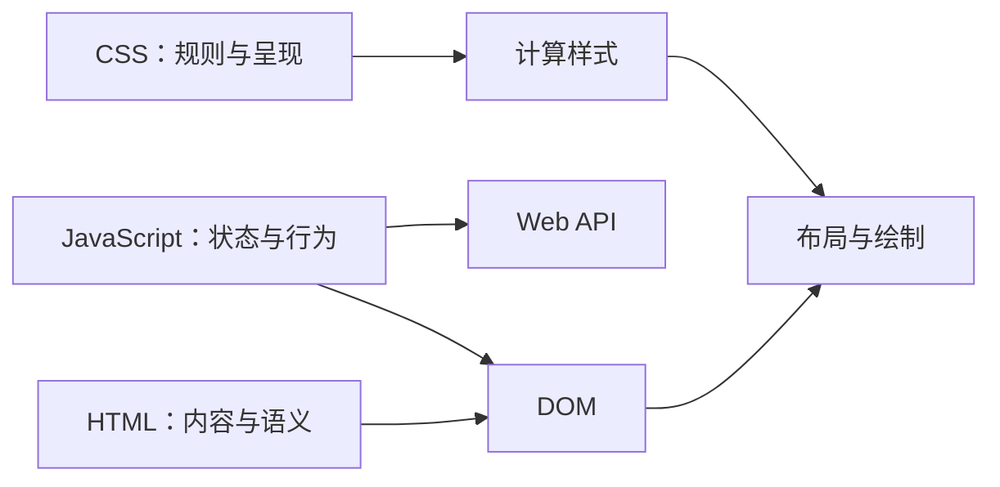

# HTML、CSS 与 JavaScript 的职责

## 是什么与为什么需要

HTML 表达内容结构和语义，CSS 控制呈现与布局，JavaScript 实现计算、状态变化和行为。明确职责能保留无脚本内容、复用样式，并让辅助技术理解原生语义。

## 内容、呈现与行为的基本规则

- HTML 用适合含义的元素，不按默认外观选标签。
- CSS 通过选择器匹配元素，层叠后形成计算样式；不应承载关键文本内容。
- JavaScript 操作 DOM 和 Web API；脚本失败时基础信息与导航应尽量可用。
- 浏览器解析 HTML 建 DOM，解析 CSS 建样式规则，执行脚本后计算布局与绘制；三者会相互影响但职责不相同。

## 三层如何连接



HTML 属性可提供初始状态和原生行为，CSS 伪类可反映部分交互状态，JavaScript 可读取和修改 DOM。职责边界应按信息是否仍可理解、交互是否需要状态计算以及平台是否已有原生能力来选择，而不是按文件扩展名机械划分。

## 三层连接的最小示例

```html
<!doctype html>
<html lang="zh-CN">
  <head>
    <meta charset="utf-8">
    <meta name="viewport" content="width=device-width, initial-scale=1">
    <title>草稿状态</title>
    <link rel="stylesheet" href="app.css">
    <script src="app.js" defer></script>
  </head>
  <body>
    <main>
      <h1>编辑草稿</h1>
      <button class="save" type="button">保存</button>
      <p class="status" aria-live="polite">尚未保存</p>
    </main>
  </body>
</html>
```

```css
.save { color: white; background: #1463ff; }
.save:focus-visible { outline: 3px solid #f79009; outline-offset: 3px; }
```

```js
const button = document.querySelector('.save');
const status = document.querySelector('.status');

button.addEventListener('click', () => {
  status.textContent = '已保存';
});
```

关闭 CSS 后，按钮、标题和状态仍有结构；关闭 JavaScript 后，页面内容仍可阅读但保存行为不可用。生产表单应让 HTML 提供可提交的基础路径，脚本只增强体验，并由服务端完成授权、校验和持久化。

## 原生语义、样式状态与脚本失败边界

不要用 `div` 模拟按钮；会丢失键盘和表单行为。不要用 JS 完成纯样式状态。CSS 也能提供有限交互，HTML 也有原生交互元素，职责边界以语义、可维护性和降级为准，而不是绝对禁止重叠。

## 渐进增强与生成位置

渐进增强先建立可工作的 HTML，再添加呈现和增强行为。服务端也可生成 HTML、CSS 或 JS；“生成位置”不改变文件在浏览器中的职责。

## 选择与验证表

| 需求 | 首选层 | 原因 |
| --- | --- | --- |
| 表达章节、链接、按钮和表单 | HTML | 原生语义与行为 |
| 布局、颜色、响应式和视觉状态 | CSS | 层叠、媒体条件和呈现职责 |
| 业务计算、异步请求、复杂状态迁移 | JavaScript | 可编程控制流与 Web API |
| 认证、授权、金额和数据约束 | 服务端 | 客户端可被用户修改，不能作为安全边界 |

练习：实现一个可提交的联系表单，再用 CSS 改善布局、用 JavaScript 增加字符计数。完成标准：无 CSS 时字段关系清楚；无 JavaScript 时仍能提交；键盘可完成操作；服务端不信任客户端校验结果。

## 完整案例：渐进增强的订阅表单

输入需求是收集邮箱并提交到 `/subscribe`。基础环境可能没有 JavaScript，网络可能失败，用户可能只用键盘。目标是让核心提交由 HTML 完成，CSS 提供呈现，JavaScript 增强异步反馈。

### 1. HTML 定义内容、关系和基础提交

```html
<!doctype html>
<html lang="zh-CN">
  <head>
    <meta charset="utf-8">
    <meta name="viewport" content="width=device-width, initial-scale=1">
    <title>订阅更新</title>
    <link rel="stylesheet" href="app.css">
    <script src="app.js" defer></script>
  </head>
  <body>
    <main>
      <h1>订阅产品更新</h1>
      <form action="/subscribe" method="post">
        <label for="email">邮箱</label>
        <input id="email" name="email" type="email" autocomplete="email" required>
        <button type="submit">订阅</button>
        <p id="status" aria-live="polite"></p>
      </form>
    </main>
  </body>
</html>
```

关闭 CSS 和 JavaScript 后，标题、标签、输入、按钮和 POST 提交仍存在。浏览器原生 email 校验是即时帮助，服务端仍需重新校验地址、速率和授权。

### 2. CSS 只改变呈现

```css
:root { font-family: system-ui, sans-serif; color-scheme: light dark; }
body { margin: 0; }
main { max-width: 36rem; margin: 3rem auto; padding: 1rem; }
form { display: grid; gap: 0.75rem; }
input, button { min-height: 2.75rem; font: inherit; }
button:focus-visible, input:focus-visible {
  outline: 3px solid #f79009;
  outline-offset: 3px;
}
```

CSS 不生成“邮箱”这一关键标签，也不决定提交 URL。若样式表 404，页面仍应可理解和操作。用伪元素插入的重要文字可能不稳定地进入可访问性树，也无法像真实文本一样被复制和翻译。

### 3. JavaScript 增强异步提交

```js
const form = document.querySelector('form');
const status = document.querySelector('#status');

form.addEventListener('submit', async (event) => {
  if (!form.reportValidity()) return;
  event.preventDefault();

  const button = form.querySelector('button[type="submit"]');
  button.disabled = true;
  status.textContent = '正在提交…';

  try {
    const response = await fetch(form.action, {
      method: form.method,
      body: new FormData(form),
    });
    if (!response.ok) throw new Error(`HTTP ${response.status}`);
    status.textContent = '订阅成功。';
    form.reset();
  } catch (error) {
    status.textContent = '提交失败，请检查网络后重试。';
    console.error(error);
  } finally {
    button.disabled = false;
  }
});
```

脚本先保留原生校验，再取消默认导航。加载状态、成功、错误和恢复按钮都明确。`fetch` 收到 500 时不会自动拒绝，所以检查 `response.ok`。

### 4. 可观察输出

成功输入 `user@example.com` 时，Network 应出现 POST `/subscribe`，状态区域依次为“正在提交…”和“订阅成功”。服务器拒绝重复邮箱时，应返回契约状态并让页面显示可修正反馈，而不是始终显示成功。

JavaScript 加载失败时，浏览器走 HTML 原生提交并导航到服务端响应。CSS 加载失败时布局变为默认样式但字段关系不变。这两条失败分支验证了职责分离的实际价值。

### 5. 验证清单

- HTML 通过一致性检查，label 与 id 匹配。
- 禁用 CSS 后阅读顺序和控件名称正确。
- 禁用 JavaScript 后服务端提交可用。
- 键盘焦点可见，Enter 可提交。
- 服务端对缺失、格式错误、重复和速率限制分别处理。
- 状态文本不是只靠颜色表达，控制台无未处理拒绝。

## 职责重叠时的决策

HTML 的 `details`、`dialog` 和表单校验已有交互；CSS 的媒体查询和伪类能响应环境与状态；JavaScript 能驱动任意变化。优先使用能直接表达语义和状态的原生能力，再增加脚本。安全、金额和权限不属于这三层在客户端可保证的事项，必须在受控服务端执行。

## 来源

- [MDN：The web standards model](https://developer.mozilla.org/en-US/docs/Learn_web_development/Getting_started/Web_standards/The_web_standards_model) — 访问日期：2026-07-17
- [WHATWG HTML Living Standard](https://html.spec.whatwg.org/multipage/) — 访问日期：2026-07-17
- [W3C：CSS Snapshot 2025](https://www.w3.org/TR/css-2025/) — 访问日期：2026-07-17
- [ECMA-262：ECMAScript Language Specification](https://tc39.es/ecma262/) — 访问日期：2026-07-17
