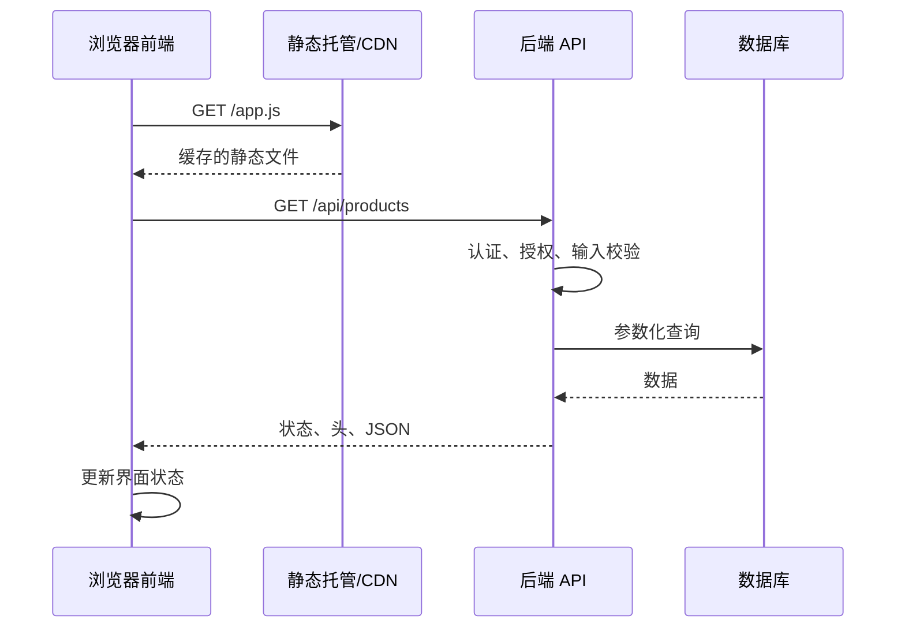

# 静态网站、动态网站、前端、后端与 API

## 是什么

静态服务器把已有文件按请求直接返回；动态服务器运行应用逻辑，可能读取数据库并生成响应。前端是用户设备中呈现和交互的部分，后端处理服务端业务、数据与权限。API 是组件间约定的接口；Web API 常通过 HTTP 暴露数据或操作。

## 为什么需要

架构选择影响部署、缓存、安全和开发边界。静态不等于无交互：静态页面仍可运行 JavaScript 并调用 API；动态不等于每次返回 HTML，也可返回 JSON。

## 请求与责任边界



前端负责收集输入、提供即时反馈和呈现响应；后端负责身份确认、对象级授权、业务不变量、持久化和审计。数据库约束可以作为数据不变量的最终防线，但不能替代应用层授权。

## 静态响应、动态响应与前端调用

静态响应：`GET /about.html` 直接读取文件。动态响应：`GET /users/42` 校验权限、查询数据库、返回 JSON。前端调用：

```js
async function loadProducts(signal) {
  const response = await fetch('/api/products', {
    headers: { Accept: 'application/json' },
    signal,
  });

  if (!response.ok) {
    const problem = await response.text();
    throw new Error(`HTTP ${response.status}: ${problem.slice(0, 120)}`);
  }

  const contentType = response.headers.get('content-type') ?? '';
  if (!contentType.includes('application/json')) {
    throw new TypeError('服务器没有返回 JSON');
  }

  return response.json();
}
```

`fetch` 的 Promise 在建立请求或读取响应失败时拒绝；收到 404、500 等 HTTP 响应时通常仍会兑现，因此必须检查 `ok` 或 `status`。解析 JSON 也可能失败，运行时数据仍需按契约校验。

### API 契约最小表面

| 项目 | 必须明确的内容 |
| --- | --- |
| 请求 | 方法、路径、查询、头、正文媒体类型与字段 |
| 身份 | 凭据传递方式、会话生命周期、CSRF/CORS 边界 |
| 授权 | 当前主体能否对目标对象执行该动作 |
| 成功 | 状态码、响应结构、副作用与幂等要求 |
| 失败 | 稳定错误码、用户可处理信息、是否可重试 |
| 演进 | 兼容字段、弃用流程和版本策略 |

## 客户端、服务端与 API 契约边界

- 客户端代码和请求可被用户查看、修改，安全校验必须在后端执行。
- API 契约至少明确方法、URL、输入、成功响应、错误、鉴权和版本策略。
- 前后端是职责划分，不必是不同仓库或团队。
- 静态文件更易被 CDN 缓存；动态响应能否缓存取决于语义和响应头。

## 客户端秘密、Fetch 和数据库误区

不要把 API key 写入浏览器包。`fetch` 只在网络失败时拒绝，HTTP 404/500 需检查 `response.ok`。页面内容来自数据库不代表浏览器直接连接数据库。

## 渲染位置与 API 风格

服务端渲染在服务器生成 HTML，客户端渲染在浏览器用数据建立 UI；混合方案可同时使用。API 不限 REST，还包括 GraphQL、RPC、浏览器 Web API 等。

## 完整案例的状态覆盖目标

为“创建待办事项”写一份 API 契约，并分别模拟加载、成功、400、401、403、409、500 和网络中断。完成标准：前端对每种状态有可恢复反馈；后端拒绝越权对象和非法字段；重复请求的处理规则明确；日志不记录凭据；缓存不会把私人响应提供给其他用户。

## 完整案例：创建待办事项 API

具体输入是已登录用户提交标题“复习 Fetch”，客户端生成请求：

```http
POST /api/todos HTTP/1.1
Content-Type: application/json
Accept: application/json

{"title":"复习 Fetch"}
```

### 1. 契约定义

成功响应使用 201，并通过 Location 指向新资源：

```http
HTTP/1.1 201 Created
Content-Type: application/json
Location: /api/todos/8f4a

{"id":"8f4a","title":"复习 Fetch","completed":false}
```

错误结构保持稳定机器码与面向用户的说明：

```json
{
  "code": "TITLE_REQUIRED",
  "message": "请输入待办标题",
  "field": "title"
}
```

| 状态 | 条件 | 客户端处理 |
| ---: | --- | --- |
| 201 | 创建成功 | 加入列表并显示确认 |
| 400 | JSON/字段格式错误 | 关联字段并保留输入 |
| 401 | 未认证或会话过期 | 引导重新认证，避免丢失草稿 |
| 403 | 已认证但无权限 | 说明无权限，不循环重试 |
| 409 | 幂等键或业务冲突 | 查询现有结果或提示冲突 |
| 429 | 触发速率限制 | 按 Retry-After 和产品策略重试 |
| 500 | 未预期服务端失败 | 显示可恢复错误并记录请求标识 |

### 2. 后端处理顺序

服务端先限制正文大小并解析 JSON，再验证身份，执行对象/动作授权，规范化和验证字段，最后在事务中写数据库。成功后再返回生成 ID。顺序可按威胁模型优化，但绝不能信任客户端隐藏按钮或 required 属性。

数据库中 `title` 非空、长度限制和所有者外键是数据不变量的补充防线。日志记录请求 ID、主体 ID 和错误码，不记录认证令牌或完整敏感正文。

### 3. 前端状态实现

```js
async function createTodo(title, signal) {
  const response = await fetch('/api/todos', {
    method: 'POST',
    headers: {
      'Content-Type': 'application/json',
      Accept: 'application/json',
    },
    body: JSON.stringify({ title }),
    signal,
  });

  const data = await response.json().catch(() => null);
  if (!response.ok) {
    const error = new Error(data?.message ?? `HTTP ${response.status}`);
    error.code = data?.code ?? 'UNKNOWN';
    error.status = response.status;
    throw error;
  }
  return data;
}
```

调用界面需要区分 idle、submitting、success 和 error。提交期间可禁用同一按钮防止普通重复点击，但这不是幂等保障；网络超时后客户端无法确定服务端是否已创建，关键操作应使用幂等键或可查询结果。

### 4. 静态与动态边界

待办应用的 HTML、CSS、JS 可作为带内容哈希的静态文件由 CDN 返回；用户待办是动态且私有的 API 响应。静态资源可长期共享缓存，私人 API 响应必须配置正确的缓存控制和 `Vary` 等语义，避免跨用户泄漏。

客户端包中只能包含公开 API 基址等配置。数据库密码、签名密钥和第三方秘密只能在服务端受控环境使用；给变量名加 `PUBLIC_` 只是构建约定，不提供加密。

### 5. 验证与失败注入

用浏览器 Network 或 API 测试分别发送：合法标题、空标题、超长标题、非法 JSON、过期会话、他人对象和重复请求。检查状态、Content-Type、错误码、数据库结果和日志请求 ID。

网络中断时 `fetch` 拒绝，但服务端可能已经提交。客户端不要自动无限重发创建请求。500 响应正文可能不是 JSON，示例通过 `catch` 处理解析失败。成功响应也要进行运行时结构校验后再更新复杂应用状态。

### 6. 案例验收输出

最终输出包括 API 契约、服务端验证测试、前端状态测试和一次端到端创建。验收要求越权始终被服务端拒绝；失败后用户输入可恢复；重复请求结果符合约定；静态资源和私人 API 的缓存策略分离；监控能用请求 ID 关联客户端错误与服务端日志。

## 来源

- [MDN：What is a web server](https://developer.mozilla.org/en-US/docs/Learn_web_development/Howto/Web_mechanics/What_is_a_web_server) — 访问日期：2026-07-17
- [MDN：Client-server overview](https://developer.mozilla.org/en-US/docs/Learn_web_development/Extensions/Server-side/First_steps/Client-Server_overview) — 访问日期：2026-07-17
- [WHATWG Fetch Standard](https://fetch.spec.whatwg.org/) — 访问日期：2026-07-17
- [OpenAPI Specification 3.2](https://spec.openapis.org/oas/v3.2.0.html) — 访问日期：2026-07-17
