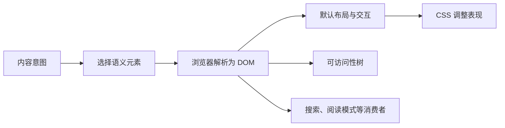

# 标题、段落、列表、链接、图片、音视频与表格

HTML 内容元素的职责不是控制字号、间距或颜色，而是声明内容的类型及内容之间的关系。浏览器据此创建 DOM，提供默认行为，并把可识别的结构暴露给搜索引擎、阅读模式和辅助技术；CSS 再负责视觉表现。

本文讨论正文中最常见的内容元素。阅读前应已掌握元素、属性、嵌套和文档骨架；这些基础见 [HTML 基础语法：从源代码到 DOM](01-html-syntax.md)。

## 1. 从 HTML 源码到可用内容

同一段文字写进不同元素，会得到不同的语义、键盘行为和无障碍信息。例如，带 `href` 的 `a` 元素能获得链接语义和浏览器导航能力，带下划线的 `span` 仍然只是普通文本。



选择元素时按以下顺序判断：

1. 先确定内容是什么，例如章节标题、步骤列表、可导航链接或二维数据。
2. 使用语义最匹配的原生 HTML 元素。
3. 使用属性补充目标、替代文本、表头关系等信息。
4. 最后使用 CSS 调整表现，不因默认样式不合适而改用错误元素。

## 2. 标题：`h1` 到 `h6`

### 2.1 是什么

`h1`、`h2`、`h3`、`h4`、`h5`、`h6` 表示所在章节的标题，数字表示标题级别。标题使长文档形成可导航的层级，也帮助读者快速扫描页面。

```html
<h1>前端学习记录</h1>

<h2>HTML</h2>
<h3>内容元素</h3>
<h3>表单元素</h3>

<h2>CSS</h2>
<h3>选择器</h3>
```

这段结构表示“内容元素”和“表单元素”属于“HTML”，“HTML”和“CSS”处于同一级别。标题不是编号工具；需要显示 `1.2.3` 等章节号时，应通过正文、CSS 计数器或构建工具生成。

### 2.2 为什么需要稳定层级

- 屏幕阅读器可列出标题并按标题跳转。
- 浏览器扩展、阅读模式和文档生成工具可利用标题组织内容。
- 视觉用户可通过标题快速定位，但仅改变字体大小不会产生标题语义。

项目中可以采用“每页一个描述页面主题的 `h1`”这一清晰规则。HTML 标准不把多个 `h1` 一概判为语法错误，但浏览器并不会根据嵌套的 `section` 自动把所有 `h1` 计算成不同级别，因此显式使用与实际层级一致的 `h1`–`h6` 更可靠。

### 2.3 使用规则

- 标题文本应能说明后续内容，避免空标题和只有“更多”“详情”的标题。
- 通常不要从 `h2` 直接跳到 `h4`。跳级并非所有场景下的语法错误，但会让层级难以理解。
- 不要为获得大号文字而使用 `h1`，也不要为缩小字号而把 `h2` 改成 `h4`；用 CSS 设置字号。
- 不要把副标题机械地写成下一级标题。副标题若只是对主标题的补充，可放在同一 `header` 中使用 `p`。

## 3. 段落与必要换行：`p`、`br`、`hr`

### 3.1 `p` 表示段落

`p` 表示一段相关的文本或短语内容。它只能包含短语内容，不能包含 `div`、`section`、`ul`、`table` 等流内容。

```html
<p>订单已创建，系统将在付款后开始处理。</p>
<p>如需修改收货地址，请在发货前联系客服。</p>
```

错误嵌套：

```html
<p>
  操作步骤：
  <ul>
    <li>确认订单</li>
    <li>完成支付</li>
  </ul>
</p>
```

HTML 解析器会在遇到 `ul` 前自动结束 `p`，所以实际 DOM 与源码缩进不同。应改为两个并列元素：

```html
<p>操作步骤：</p>
<ul>
  <li>确认订单</li>
  <li>完成支付</li>
</ul>
```

### 3.2 `br` 是内容内部的换行

`br` 用于换行本身属于内容的场景，例如地址、诗句或歌词。它不是段落间距工具。

```html
<address>
  上海市浦东新区示例路 10 号<br>
  软件园 A 座 201 室
</address>
```

不要用连续的 `<br><br>` 分隔段落；使用多个 `p`，再用 CSS 设置段落间距。

### 3.3 `hr` 是段落级主题转换

`hr` 表示同一章节内部的主题转换，不只是视觉横线。纯装饰线应由 CSS 边框或背景实现。

## 4. 列表：`ul`、`ol`、`li`、`dl`、`dt`、`dd`

### 4.1 无序列表 `ul`

当项目的先后顺序不改变含义时使用 `ul`：

```html
<ul>
  <li>HTML</li>
  <li>CSS</li>
  <li>JavaScript</li>
</ul>
```

`ul` 的直接子元素应是 `li`。每个 `li` 内可以包含段落、链接、图片或嵌套列表。

### 4.2 有序列表 `ol`

当顺序、排名或步骤编号属于内容时使用 `ol`：

```html
<ol>
  <li>创建订单</li>
  <li>完成支付</li>
  <li>等待发货</li>
</ol>
```

常用编号属性：

| 属性 | 作用 | 示例与限制 |
| --- | --- | --- |
| `start` | 指定第一项的起始整数 | `<ol start="3">` 从 3 开始 |
| `reversed` | 反向计数的布尔属性 | `<ol reversed>`；DOM 顺序不变 |
| `type` | 指定标记类型 | `1`、`a`、`A`、`i`、`I`；仅在编号形式本身有意义时使用，普通视觉样式优先交给 CSS |
| `li[value]` | 从某一列表项重新指定整数值 | 只适用于 `ol` 内的 `li`，后续项继续计数 |

不要用手写的 `1.`、`2.` 段落代替 `ol`，否则增删步骤时需要人工重排，也会丢失列表语义。

### 4.3 描述列表 `dl`

`dl` 表示由名称与描述组成的多组关联数据；`dt` 是名称，后续一个或多个 `dd` 是对应描述。它适合术语解释、元数据和值，不表示任意两列布局。

```html
<dl>
  <dt>状态</dt>
  <dd>已支付</dd>
  <dt>支付时间</dt>
  <dd><time datetime="2026-07-17T09:30:00+08:00">2026-07-17 09:30</time></dd>
</dl>
```

## 5. 链接：`a`

### 5.1 链接何时成立

带 `href` 的 `a` 元素表示超链接，浏览器提供聚焦、回车激活、复制地址、在新标签页打开等能力。没有 `href` 的 `a` 是占位元素，不应被当成按钮或可用链接。

```html
<a href="/help/payment">支付帮助</a>
<button type="button">打开筛选面板</button>
```

导航到资源使用链接；触发当前页面内的操作使用 `button`。不要用 `href="#"` 配合脚本模拟按钮，它会改变 URL 或滚动位置，并引入错误的交互语义。

### 5.2 常见 URL 形式

| 形式 | 示例 | 含义 |
| --- | --- | --- |
| 绝对 URL | `https://example.com/docs` | 包含协议和主机，可指向其他站点 |
| 根相对 URL | `/help/payment` | 从当前站点根路径解析 |
| 路径相对 URL | `../images/chart.png` | 相对当前文档 URL 解析，不是相对编辑器文件树的视觉位置 |
| 片段 URL | `#table-demo` | 定位到当前文档中对应 `id` 的元素 |
| 邮件 URL | `mailto:support@example.com` | 请求系统打开已配置的邮件程序 |
| 电话 URL | `tel:+8613800000000` | 请求支持的设备处理电话号码 |

片段目标的 `id` 在文档中应唯一：

```html
<a href="#requirements">跳到学习要求</a>
<!-- 中间内容省略 -->
<h2 id="requirements">学习要求</h2>
```

### 5.3 可读链接与安全属性

- 链接文字应说明目标或动作。“查看 HTML 元素参考”优于孤立的“点击这里”。
- 相邻链接应能互相区分，避免多个链接都叫“详情”。
- `target="_blank"` 会请求新的浏览上下文。若必须使用，应在文字或界面中告知用户；普通链接通常让用户自行决定打开方式。
- 对新窗口链接显式添加 `rel="noopener"` 可阻止新页面通过 `window.opener` 控制来源页面。现代 HTML 对 `_blank` 已定义隐式 `noopener` 行为，但显式书写仍能表达安全意图；`noreferrer` 还会抑制 `Referer` 信息，需按业务分析要求决定。
- `download` 表示下载意图，不保证浏览器一定下载；文件名、跨源限制和响应头都可能影响结果。

## 6. 图片：`img`、`figure`、`figcaption`

### 6.1 最小可用图片

```html

```

`img` 是替换元素：其内容来自外部图片资源，本身不能包含子节点。核心属性如下：

| 属性 | 作用 | 使用要点 |
| --- | --- | --- |
| `src` | 图片资源 URL | URL 错误、网络失败或格式无法解码时图片不会正常显示 |
| `alt` | 图片的文本替代 | 描述图片在当前上下文中的信息或功能，而不是机械描述像素 |
| `width`、`height` | 图片的固有宽高提示，单位为 CSS 像素 | 同时提供时可在资源下载前建立宽高比并减少布局移动；实际显示尺寸仍可由 CSS 改变 |
| `loading` | 加载时机提示 | `lazy` 可延迟视口外图片；首屏关键图片通常不应懒加载 |
| `decoding` | 图片解码方式提示 | `async`、`sync`、`auto` 是给浏览器的提示，不是完成时限保证 |
| `fetchpriority` | 获取优先级提示 | `high`、`low`、`auto`；只给确实关键的少量资源设置，不能替代资源优化 |

响应式候选资源 `srcset`、`sizes` 和 `picture` 会在 [响应式图片](10-responsive-images.md) 中单独讨论。

### 6.2 `alt` 根据图片用途编写

| 图片用途 | `alt` 处理 | 示例 |
| --- | --- | --- |
| 信息图片 | 表达页面需要读者获得的信息 | 图表写出关键趋势或结论，并在附近提供完整数据 |
| 功能图片 | 描述链接或按钮执行的动作 | 搜索图标按钮应有可访问名称“搜索”，而不是“放大镜” |
| 装饰图片 | 使用空替代文本 `alt=""` | 辅助技术可忽略该图片 |
| 复杂图表 | `alt` 给出简短结论，附近提供数据表或长说明 | 不把大量数据全部塞进 `alt` |

省略 `alt` 与 `alt=""` 不等价：空值明确表示图片不提供内容；缺失时浏览器和辅助技术无法确定作者意图，可能读出文件名或 URL。替代文本通常不需要以“图片”“图像”开头，因为元素角色已经表明它是图片。

如果图片是链接中唯一内容，图片的 `alt` 应描述链接目的：

```html
<a href="/">
  
</a>
```

### 6.3 图片与说明的整体关系

`figure` 表示正文引用的独立内容单元，`figcaption` 为其标题或说明。并非每张图片都必须使用 `figure`。

```html
<figure>
  
  <figcaption>图 1：四月至五月的销量变化。</figcaption>
</figure>
```

`figcaption` 是所有用户可见的说明，`alt` 是图片不可见时的替代，两者职责不同；可以共享必要信息，但应避免无意义的完整重复。

## 7. 音频和视频：`audio`、`video`、`source`、`track`

### 7.1 提供播放控件和候选资源

```html
<video controls preload="metadata" poster="cover.webp" width="720" height="405">
  <source src="demo.webm" type="video/webm">
  <source src="demo.mp4" type="video/mp4">
  <track
    default
    kind="captions"
    src="demo.zh.vtt"
    srclang="zh-CN"
    label="中文"
  >
  <p>浏览器无法播放视频。<a href="demo.mp4">下载视频文件</a>。</p>
</video>
```

浏览器按顺序检查 `source`，选择它支持的候选资源。`type` 能帮助浏览器在下载前判断媒体类型，但实际编码仍必须与声明一致。不同容器可以包含不同编码；扩展名相同不代表所有浏览器都能解码。

### 7.2 常用属性

| 属性 | 适用元素 | 作用与边界 |
| --- | --- | --- |
| `controls` | `audio`、`video` | 显示浏览器提供的播放、暂停、进度和音量控件；没有自定义控件时应提供 |
| `autoplay` | `audio`、`video` | 请求资源可用后自动播放；带声音的自动播放通常受用户设置和浏览器策略限制 |
| `muted` | `audio`、`video` | 初始静音；静音视频更可能满足自动播放策略，但不保证一定播放 |
| `loop` | `audio`、`video` | 播放结束后重新开始 |
| `preload` | `audio`、`video` | `none`、`metadata`、`auto` 是加载提示；浏览器可根据环境采用不同策略，`autoplay` 通常优先 |
| `poster` | `video` | 视频数据可用前显示的封面图 |
| `width`、`height` | `video` | 提供视频显示区域的尺寸提示；响应式布局仍需 CSS |

不要默认自动播放带声音的媒体。即使自动播放成功，突然发声也会干扰用户；应让用户主动开始播放。

### 7.3 文本轨道与替代内容

`track` 引用 WebVTT 文本轨道：

- `kind="captions"`：包含对白和重要非语言声音，适用于听不到音频的用户。
- `kind="subtitles"`：翻译或转写对白，通常假定用户仍能听到其他声音。
- `kind="descriptions"`：描述视频中的重要视觉信息。
- `kind="chapters"`：章节导航数据。
- `kind="metadata"`：供脚本使用，不直接显示给用户。

`srclang` 声明轨道语言，`label` 提供轨道选择器中的名称，`default` 指定没有用户偏好时优先启用的轨道。字幕不能替代所有场景的文字稿；包含重要音频信息的内容还可在媒体附近提供可搜索、可复制的完整文字稿。

媒体元素内部的回退内容只在浏览器不支持该元素时显示。支持 `video` 但资源加载失败时，不能依赖这段回退文字自动出现，因此页面应在元素外也提供下载链接、文字稿或错误处理。

## 8. 数据表格：`table`

### 8.1 表格表达二维数据

表格用于表示行和列之间存在关系的数据，不用于页面布局。基本结构：

```html
<div class="table-scroll" role="region" tabindex="0" aria-label="月度销量表，可横向滚动">
  <table>
    <caption>2026 年第二季度月度销量</caption>
    <thead>
      <tr>
        <th scope="col">月份</th>
        <th scope="col">销量</th>
        <th scope="col">环比</th>
      </tr>
    </thead>
    <tbody>
      <tr>
        <th scope="row">四月</th>
        <td>100</td>
        <td>—</td>
      </tr>
      <tr>
        <th scope="row">五月</th>
        <td>112</td>
        <td>+12%</td>
      </tr>
    </tbody>
  </table>
</div>
```

| 元素 | 作用 |
| --- | --- |
| `table` | 表格整体 |
| `caption` | 表格的可见标题，应是 `table` 的第一个子元素 |
| `thead`、`tbody`、`tfoot` | 把表头、主体、汇总行分组；不代替表头单元格 |
| `tr` | 一行单元格 |
| `th` | 表头单元格，声明一组数据的标题 |
| `td` | 数据单元格 |
| `colgroup`、`col` | 按列应用语义有限的分组或样式配置，不承载单元格内容 |

`caption` 说明整张表是什么，页面附近的标题说明当前章节是什么，两者可同时存在。不要仅依赖视觉位置推断关系。

### 8.2 建立表头与数据的关联

简单表格使用 `scope` 明确表头方向：

- `scope="col"`：该 `th` 是当前列的表头。
- `scope="row"`：该 `th` 是当前行的表头。
- `scope="colgroup"`、`scope="rowgroup"`：表头适用于一组列或行，结构必须与相应分组一致。

具有多层交叉表头、合并单元格或不规则关系的复杂表格，可以给 `th` 设置唯一 `id`，再在每个 `td` 的 `headers` 中列出所有相关表头 ID。能拆成多张简单表时，优先降低结构复杂度。

`rowspan` 和 `colspan` 会改变网格中单元格占据的位置。编写后应逐行核对每个单元格对应的列，并用浏览器可访问性检查工具确认表头关联。

### 8.3 窄屏处理

数据列不能合理压缩时，可在表格外增加横向滚动容器，并保留 `table` 自身的表格显示类型。滚动区域需要可发现、可聚焦，并有清晰名称。不要通过把 `tr`、`td` 全部改成 `display: block` 来获得卡片外观，除非已经验证表格语义和读取顺序没有被破坏。

## 9. 可运行的完整示例

把以下代码保存为 `common-content-elements.html`。其中的数据 URI 只用于让练习文件不依赖外部图片；生产项目应使用可缓存、可优化的真实图片资源。

```html
<!doctype html>
<html lang="zh-CN">
  <head>
    <meta charset="utf-8">
    <meta name="viewport" content="width=device-width, initial-scale=1">
    <title>本周学习进度</title>
    <style>
      body { max-width: 50rem; margin: 2rem auto; padding: 0 1rem; font: 1rem/1.6 system-ui; }
      img, video { display: block; max-width: 100%; height: auto; }
      a:focus-visible, .table-scroll:focus-visible { outline: 3px solid #f79009; }
      .table-scroll { max-width: 100%; overflow-x: auto; }
      table { width: 100%; min-width: 36rem; border-collapse: collapse; }
      th, td { padding: .6rem; border: 1px solid #aaa; text-align: left; }
    </style>
  </head>
  <body>
    <main>
      <h1>本周前端学习进度</h1>
      <p>本周学习 HTML 内容元素，并完成键盘和窄屏验证。</p>
      <p><a href="#progress">查看进度表</a></p>

      <section aria-labelledby="plan-heading">
        <h2 id="plan-heading">学习计划</h2>
        <ol>
          <li>阅读元素语义和属性规则</li>
          <li>编写完整页面</li>
          <li>检查 DOM 和可访问性树</li>
        </ol>
        <dl>
          <dt>负责人</dt><dd>justCDQ</dd>
          <dt>当前进度</dt><dd>3 / 5 个知识点</dd>
        </dl>
      </section>

      <section aria-labelledby="result-heading">
        <h2 id="result-heading">学习结果</h2>
        <figure>
          
          <figcaption>图 1：本周知识点完成趋势。</figcaption>
        </figure>
      </section>

      <section id="progress" aria-labelledby="progress-heading">
        <h2 id="progress-heading">进度数据</h2>
        <div class="table-scroll" role="region" tabindex="0" aria-label="学习进度表，可横向滚动">
          <table>
            <caption>2026 年第二季度学习数据</caption>
            <thead>
              <tr><th scope="col">月份</th><th scope="col">知识点</th><th scope="col">项目</th></tr>
            </thead>
            <tbody>
              <tr><th scope="row">四月</th><td>18</td><td>4</td></tr>
              <tr><th scope="row">五月</th><td>24</td><td>5</td></tr>
            </tbody>
          </table>
        </div>
      </section>
    </main>
  </body>
</html>
```

直接用浏览器打开文件，或在文件所在目录运行 `python3 -m http.server 8000` 后访问 `http://localhost:8000/common-content-elements.html`。预期可观察到：

1. “查看进度表”可聚焦，激活后定位到表格章节。
2. 图片加载前已有稳定的宽高比；禁用图片后，`alt` 仍传达图表结论。
3. 表格中列标题和行标题均为 `th`；窄屏时表格区域可横向滚动，页面本身不产生横向溢出。

## 10. 常见错误、调试与验证

### 10.1 常见错误

| 错误 | 后果 | 修正 |
| --- | --- | --- |
| 用标题元素控制字号 | 文档层级与视觉设计耦合 | 保持真实标题层级，用 CSS 控制字号 |
| 在 `p` 中放 `ul` 或 `table` | 解析器提前关闭 `p`，DOM 与源码不同 | 把块级结构放到 `p` 外 |
| 用多个 `br` 制造间距 | 内容结构不明确，样式难维护 | 使用 `p` 和 CSS 外边距 |
| 用 `a href="#"` 执行操作 | 产生错误链接语义和意外导航 | 操作用 `button`，导航用 `a` |
| 图片缺少 `alt` | 图片用途无法可靠传达 | 按信息、功能或装饰用途编写替代文本 |
| 媒体只提供单一编码且无文字替代 | 部分环境无法播放，部分用户无法获取信息 | 提供候选资源、字幕、文字稿或下载链接 |
| 用 `td` 模拟粗体表头 | 丢失表头与数据关联 | 使用 `th` 并设置合适的 `scope` |
| 用表格排版页面 | 阅读顺序、响应式布局和维护变复杂 | 使用语义容器和 CSS 布局 |

### 10.2 浏览器验证步骤

1. 在开发者工具 Elements 面板检查 DOM，确认 `p` 没有因非法嵌套被提前关闭。
2. 只用 `Tab`、`Shift+Tab` 和 `Enter` 操作链接，确认焦点可见且导航目标正确。
3. 暂时删除图片 `src` 或在网络面板阻止图片，确认替代文本仍能表达用途。
4. 使用可访问性树检查标题级别、链接名称、图片名称、表格角色及表头关系。
5. 在窄屏视口检查图片、视频和表格；媒体不应超出容器，表格滚动不应让整页横向溢出。
6. 查看控制台和 Network 面板，排查资源 404、媒体类型错误、轨道加载失败和混合内容问题。

## 11. 练习

创建一个“本周学习进度”页面，要求：

- 只有一个页面主题 `h1`，至少两个 `h2`，标题级别能表达真实层级。
- 使用一个 `p` 说明目标，一个 `ol` 表示有顺序的学习步骤，一个 `dl` 表示状态和值。
- 提供一个片段链接，能跳到页面中的进度表。
- 放置一张信息图片，写出与当前上下文匹配的 `alt`，并提供 `width`、`height`。
- 放置一个带 `controls` 的媒体元素，并在元素外提供文字稿或等价说明。
- 创建含 `caption`、列标题和行标题的数据表；窄屏时仅表格容器横向滚动。

完成标准：HTML 验证器无结构错误；键盘可激活所有链接；关闭 CSS 后内容顺序仍合理；阻止图片和媒体资源后仍可理解关键信息；可访问性树中的标题级别、链接名称、图片名称和表头关系与页面意图一致。

## 来源

- [WHATWG HTML Living Standard：Sections（标题）](https://html.spec.whatwg.org/multipage/sections.html#headings-and-outlines) — 访问日期：2026-07-17
- [WHATWG HTML Living Standard：Grouping content（段落、列表与 figure）](https://html.spec.whatwg.org/multipage/grouping-content.html) — 访问日期：2026-07-17
- [WHATWG HTML Living Standard：Text-level semantics（链接）](https://html.spec.whatwg.org/multipage/text-level-semantics.html#the-a-element) — 访问日期：2026-07-17
- [WHATWG HTML Living Standard：Embedded content（图片与音视频）](https://html.spec.whatwg.org/multipage/embedded-content.html) — 访问日期：2026-07-17
- [WHATWG HTML Living Standard：Tabular data](https://html.spec.whatwg.org/multipage/tables.html) — 访问日期：2026-07-17
