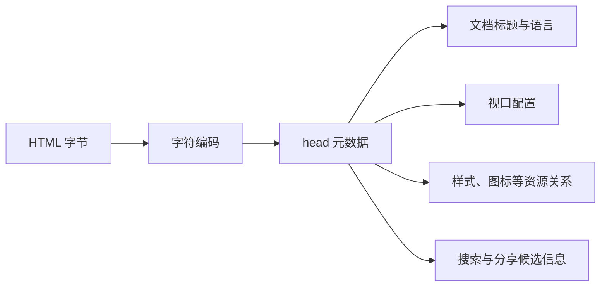

# head、元数据、favicon、语言与页面标题

## 是什么与为什么需要

`head` 保存文档元数据和资源关系，不是可见主内容。字符集影响解码；`lang` 声明主要语言；`title` 命名文档并用于标签页、历史和搜索结果；favicon 标识站点；viewport 控制移动视口。



`head` 中多数元素不会直接生成正文盒，但会改变文档如何被解码、命名、呈现和关联。`html[lang]` 不位于 `head`，仍属于文档级元数据的一部分。

## 编码、语言、标题、视口与资源关系

- `meta charset` 应尽早声明并与响应头和文件实际编码一致。
- `lang` 写在 `html` 上，局部语言变化再由子元素覆盖。
- 每个文档必须有一个非空且能区分页面的 `title`。
- `meta viewport` 应允许用户缩放，不能用它解决布局问题。
- `link` 表达 favicon、样式表、canonical 等资源关系，URL 解析受文档地址影响。

| 元素或属性 | 作用 | 缺失或错误时的结果 |
| --- | --- | --- |
| `meta charset="utf-8"` | 声明 HTML 文档编码 | 声明太晚或与字节不符可能造成误解码 |
| `html lang` | 声明主要自然语言 | 发音、翻译和拼写工具可能选择错误规则 |
| `title` | 提供文档级名称 | 标签页、历史和辅助技术难以区分页面 |
| viewport `meta` | 配置移动布局视口 | 未配置时移动浏览器可能使用较宽虚拟视口再缩放 |
| description `meta` | 提供页面摘要候选 | 搜索平台可忽略或改写，不属于正文替代 |
| `link rel="icon"` | 声明图标候选 | 浏览器可能继续尝试约定路径或显示默认图标 |
| `link rel="stylesheet"` | 引入外部样式表 | 资源失败时 HTML 内容仍应可理解 |

## 最小完整文档

```html
<!doctype html>
<html lang="zh-CN">
<head>
  <meta charset="utf-8">
  <meta name="viewport" content="width=device-width, initial-scale=1">
  <title>购物车（2 件商品）｜狸力商店</title>
  <meta name="description" content="查看并修改购物车商品，继续结算。">
  <link rel="icon" href="/favicon.svg" type="image/svg+xml">
  <link rel="stylesheet" href="/assets/app.css">
</head>
<body>...</body></html>
```

可维护写法应规范缩进并提供真实正文：

```html
<body>
  <main>
    <h1>购物车</h1>
    <p>当前有 2 件商品。</p>
  </main>
</body>
</html>
```

字符集声明应位于文档前部。每页只有一个非空 `title`，内容具体且能区分页面。`lang` 使用有效 BCP 47 标签，局部语言变化在子元素覆盖。favicon 可提供多个尺寸/格式，路径须部署可达。

## 元数据失败模式

`title` 属性工具提示不等于页面 `<title>`。`meta keywords` 对主流搜索排序通常无实际作用。description 可能被搜索引擎改写。不要禁止缩放。资源相对路径受文档 URL 和可选 `base` 影响，`base` 会改变全部相对 URL，应谨慎。

## HTTP 编码、base 与动态导航边界

HTTP `Content-Type` 的 charset 可能影响解码；文档声明与实际编码应一致。动态单页应用导航后也应更新标题并管理焦点。

`base[href]` 会改变文档中相对 URL 的解析基准，且文档只能有一个生效的 `base`。它会同时影响链接、图片、脚本和片段导航，通常比直接使用清楚的相对或绝对 URL 更难排查。

## 完整案例：为购物车页面建立可区分的文档元数据

输入是公开地址 `https://shop.example.com/cart`，页面主要语言为简体中文，当前购物车有 2 件商品，样式表位于 `/assets/app.css`，站点提供 SVG favicon。目标是让浏览器、辅助技术和搜索系统获得一致且可验证的文档信息。

### 1. 建立完整输入，而不是孤立 head 片段

```html
<!doctype html>
<html lang="zh-CN">
  <head>
    <meta charset="utf-8">
    <meta name="viewport" content="width=device-width, initial-scale=1">
    <title>购物车（2 件商品）｜狸力商店</title>
    <meta name="description" content="查看购物车中的商品、数量与结算金额。">
    <link rel="icon" href="/favicon.svg" type="image/svg+xml">
    <link rel="stylesheet" href="/assets/app.css">
  </head>
  <body>
    <main>
      <h1>购物车</h1>
      <p>当前有 2 件商品。</p>
    </main>
  </body>
</html>
```

输入中的商品数属于页面状态，可以进入标题帮助用户区分多个标签页；店铺名保持稳定后缀。标题不应只写“购物车”或整个站点所有页面相同。

### 2. 逐步解释浏览器读取结果

`doctype` 选择标准模式。浏览器在读取早期字节时需要确定编码，因此 charset 声明应位于文档前部并与 HTTP 头及文件字节一致。UTF-8 声明不能修复已经用其他编码保存的文件。

`lang="zh-CN"` 使用 BCP 47 语言标签，声明整个文档默认语言。正文中出现英文段落时可局部覆盖：

```html
<p lang="en">Your order is ready.</p>
```

`title` 是文档级名称，`h1` 是正文主题。二者可相近但用途不同。`description` 是摘要候选，不会显示成正文，也不保证成为搜索摘要。

viewport 的 `width=device-width` 请求布局视口匹配设备宽度，`initial-scale=1` 设置初始缩放。不要添加 `user-scalable=no` 或过度限制最大缩放；响应式布局问题应由 CSS 修复。

两个 `link` 分别声明图标和样式关系。以 `/` 开始的 URL 从 origin 根解析；如果应用部署到子路径，应根据托管结构和构建工具生成正确 URL。

### 3. 可观察输出

打开页面后，标签页显示“购物车（2 件商品）｜狸力商店”，favicon 请求成功，正文显示 `h1` 和商品数。Console 可读取：

```js
console.log(document.characterSet);
console.log(document.documentElement.lang);
console.log(document.title);
console.log(document.querySelector('meta[name="viewport"]')?.content);
```

预期分别得到 `UTF-8`、`zh-CN`、完整标题和 viewport 内容。属性值的大小写/序列化可能由 DOM API 规范化，验证应关注语义而不是字符串排版。

### 4. 动态更新购物车标题

单页应用改变商品数后，应在页面状态成功提交后同步标题：

```js
function updateCartTitle(itemCount) {
  if (!Number.isInteger(itemCount) || itemCount < 0) {
    throw new TypeError('itemCount must be a non-negative integer');
  }
  document.title = `购物车（${itemCount} 件商品）｜狸力商店`;
}
```

输入 `3` 后标题更新为 3 件。失败输入 `-1` 或字符串会抛出错误，不把非法业务状态展示给用户。路由变化还要更新主标题、主要内容和焦点，不能只改标签页文字。

### 5. Network 与无障碍验证

在 Network 检查主文档 `Content-Type` 包含正确 HTML 媒体类型和 charset，favicon 返回 `image/svg+xml`，样式表返回 `text/css`，均无 404。使用窄屏视口和页面缩放确认内容可放大且不被裁切。

在 Accessibility 树或屏幕阅读器中确认页面标题可区分，中文使用正确发音规则，局部英文切换语言。仅看可视界面无法验证这些信息。

### 6. 失败分支与修复

如果页面乱码，先检查响应 charset、meta charset 和文件实际字节；不要对乱码文本再次编码。如果 favicon 404，核对部署根和 URL，不用 data URL 掩盖路径配置。如果所有路由标题相同，按页面状态生成稳定标题并对路由测试。

如果添加 `<base href="/app/">` 后片段链接、图片和脚本全部改变，说明 base 扩大了相对 URL 影响面。除非确有统一基准需求，优先由构建和路由配置生成明确 URL。

### 7. 验收结果

在 DevTools Elements 检查最终 `head`，在 Console 读取 `document.title`、`document.documentElement.lang` 和 `document.characterSet`，在 Network 核对 favicon 与样式表状态。再建立首页、产品页和结算页；完成标准：三个页面标题可在标签页中区分，语言和编码正确，移动视口允许缩放，图标无 404，禁用 CSS 后正文仍完整，动态标题不接受非法商品数。

## 来源

- [WHATWG HTML：Document metadata](https://html.spec.whatwg.org/multipage/semantics.html#semantics) — 访问日期：2026-07-17
- [WHATWG HTML：The `html` element](https://html.spec.whatwg.org/multipage/semantics.html#the-html-element) — 访问日期：2026-07-17
- [W3C WAI：Page title](https://www.w3.org/WAI/test-evaluate/easy-checks/page-title/) — 访问日期：2026-07-17
- [IETF BCP 47：Tags for Identifying Languages](https://www.rfc-editor.org/info/bcp47) — 访问日期：2026-07-17
