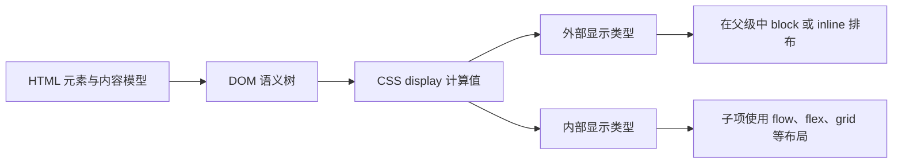

# 块级与行内内容

## 是什么与为什么需要

“块级/行内元素”是历史简化说法。现代规范把 HTML 语义分类与 CSS 布局分开：CSS `display` 的外部显示类型决定盒子在父级中以 block 或 inline 参与布局，内部显示类型决定子内容布局。理解它能解释换行、尺寸和正常流。

## HTML 内容模型与 CSS 盒的两层规则

HTML 内容模型回答“一个元素允许出现在哪里、可以包含什么”；CSS display 回答“元素生成什么盒并怎样参与布局”。两者属于不同层。



| 概念 | 控制对象 | 例子 |
| --- | --- | --- |
| flow content、phrasing content | HTML 的允许嵌套与语义分类 | `p` 只能包含 phrasing content |
| 外部显示类型 | 元素自身怎样参与父级布局 | `block`、`inline` |
| 内部显示类型 | 元素的子项怎样布局 | `flow`、`flow-root`、`flex`、`grid` |
| 内部/外部角色组合 | `display` 的完整行为 | `inline flex`，传统单值为 `inline-flex` |

## block、inline、inline-block 与 inline-flex

默认情况下 `p`、`div` 常生成块盒并占据可用行向空间；`a`、`span` 常生成行内盒并随文本断行。CSS 可改变：

```css
a.card { display: block; }
.badge { display: inline-block; width: 6rem; }
.actions { display: inline-flex; gap: .5rem; }
```

`inline` 盒的 `width/height` 通常不按块盒方式生效；`inline-block` 在外部随行排布，内部形成独立盒。改变 display 不改变 HTML 语义，`span {display:block}` 仍不是段落或区域。

行内格式化上下文把文本和行内盒组织成行盒。行内内容可在允许位置断行；非替换 inline 盒的垂直 margin 不会像块盒那样推开相邻行。`vertical-align` 在行内或表格单元格上下文中生效，不是通用垂直居中属性。

```html
<p>
  订单状态：<span class="badge">已支付</span>
  <a class="card" href="/orders/42">查看订单详情</a>
</p>
```

即使 `.card` 被设为 `display: block`，它仍是链接；键盘激活和导航语义来自 `a[href]`。

## 嵌套、基线、空白与 display 边界

不要依据“是否换行”选择 HTML 元素。块元素可包含什么由 HTML 内容模型决定，不由 CSS display 决定。行内格式化中的空白、基线和可断行位置会影响间隙；图片底部空隙常来自基线对齐。

## 书写模式、隐藏与 `display: contents`

书写模式会改变 block/inline 物理方向，因此现代 CSS 使用 `inline-size`、`block-size` 等逻辑属性。`display: contents` 会移除自身盒但可能影响可访问性实现，使用前测试。

`display: none` 使元素及后代不生成盒，通常也从可访问性树移除；`visibility: hidden` 保留布局空间但隐藏绘制和交互。它们与只在视觉上隐藏、仍提供给辅助技术的模式不是同一需求。

## 完整案例：同一组订单操作的三种显示方式

输入是一段订单摘要：状态是文本，订单号链接到详情，取消订单是当前页面动作。HTML 必须先表达这些不同语义，再由 CSS 决定行内或块级呈现。

### 1. 编写不依赖外观的 HTML

```html
<article class="order-card">
  <h2>订单 #A1024</h2>
  <p>
    状态：<span class="badge">已支付</span>
  </p>
  <div class="actions">
    <a class="detail-link" href="/orders/A1024">查看订单</a>
    <button type="button">取消订单</button>
  </div>
</article>
```

`article` 表示可独立理解的订单条目，`h2` 是条目标题，`p` 是状态段落，`span` 只提供可样式化的短语容器，`a` 导航到 URL，`button` 执行操作。`div` 是无额外语义的布局分组。

把链接改成 `span` 再绑定 click 会丢失导航、键盘和链接菜单能力；把按钮改成链接会把动作伪装成导航。display 不能修复错误元素选择。

### 2. 默认 flow 中的盒

不写 CSS 时，article、h2、p、div 常按浏览器样式生成块级盒，span、a 在行内格式化中随文本排列，button 是具有自身默认显示行为的替换/表单控件。

浏览器默认样式不是 HTML 规范语义的一部分。另一个用户代理可以使用不同间距或字体，但元素关系仍相同。

### 3. 方案 A：操作在同一行

```css
.actions {
  display: flex;
  align-items: center;
  gap: 0.75rem;
}
```

`.actions` 自身以块级 flex 容器参与父级 flow，子项成为 flex items。链接和按钮的 HTML 语义不变。此方案适合有足够横向空间的卡片。

### 4. 方案 B：容器随文本同行

```css
.actions {
  display: inline-flex;
  gap: 0.75rem;
  vertical-align: middle;
}
```

`inline-flex` 的外部显示类型是 inline，内部是 flex。整个容器作为行内级盒参与当前行，同时内部对子项执行 flex 布局。`vertical-align` 在这个行内上下文中调整基线对齐，不是对任意块容器的通用居中。

如果内容过宽，行内 flex 盒可能整体换行或溢出，需根据文案长度和窄屏测试决定是否适用。

### 5. 方案 C：链接扩大为整行目标

```css
.detail-link {
  display: block;
  padding: 0.75rem;
}
```

链接生成块级盒并占据可用行向空间，但仍是一个链接。扩大点击区域时要避免把其他交互控件嵌入该链接；交互内容的嵌套受到 HTML 内容模型限制。

### 6. inline 尺寸与空白现象

```css
.badge {
  display: inline;
  width: 8rem;
  height: 3rem;
  margin-block: 2rem;
}
```

对普通非替换 inline 盒，width/height 不按块盒方式建立固定尺寸，垂直 margin 也不会像块布局那样推开相邻行。需要可设置尺寸且仍随行排列时使用 `inline-block`：

```css
.badge {
  display: inline-block;
  min-inline-size: 4rem;
  padding: 0.125rem 0.5rem;
  text-align: center;
}
```

HTML 源码中相邻 inline-block 之间的空白字符可能形成可见间隙。优先用 flex/grid 的 `gap` 控制布局，不用把标签挤在一行或设置负 margin。

### 7. 可观察输出和调试

在 Elements 的 Computed 中记录 `.actions` 的 `display` 计算值，查看 Box Model 和 Layout 面板。切换 A/B/C 声明时，Accessibility 树中链接和按钮角色应保持不变。

Console 可验证：

```js
const link = document.querySelector('.detail-link');
console.log(getComputedStyle(link).display);
console.log(link.tagName, link.href);
```

输出 display 会随 CSS 方案改变，而 `tagName` 始终是 `A`、href 始终解析为绝对 URL。这直接证明呈现与语义是不同层。

### 8. 失败分支

把 `ul` 放进 `p` 时 HTML 解析器会提前关闭段落，DOM 与源码缩进不一致；修复 HTML 嵌套，不用 display 强行摆回。图片底部间隙常来自行盒基线，可用合适的 `display: block` 或 `vertical-align` 处理，不通过负 margin 猜测。

`display: none` 会隐藏盒和通常的可访问性暴露；如果隐藏区域内仍保存焦点，需要先移动焦点。`display: contents` 移除元素自身盒但保留子盒，辅助技术映射曾存在实现差异，使用时要在目标组合验证。

### 9. 验收练习

让同一个语义链接分别以 inline、block、inline-flex 容器中的子项呈现。完成标准：三种外观下链接语义和键盘行为不变；能解释宽高、基线和换行差异；HTML 验证无非法嵌套；窄屏无意外横向溢出；关闭 CSS 后内容关系仍正确；不依据默认换行选择元素。

## 来源

- [WHATWG HTML：Kinds of content](https://html.spec.whatwg.org/multipage/dom.html#kinds-of-content) — 访问日期：2026-07-17
- [W3C CSS Display Module Level 3](https://www.w3.org/TR/css-display-3/) — 访问日期：2026-07-17
- [W3C CSS 2.1：Inline formatting context](https://www.w3.org/TR/CSS22/visuren.html#inline-formatting) — 访问日期：2026-07-17
- [MDN：Block and inline layout](https://developer.mozilla.org/en-US/docs/Web/CSS/Guides/Display/Block_and_inline_layout) — 访问日期：2026-07-17
