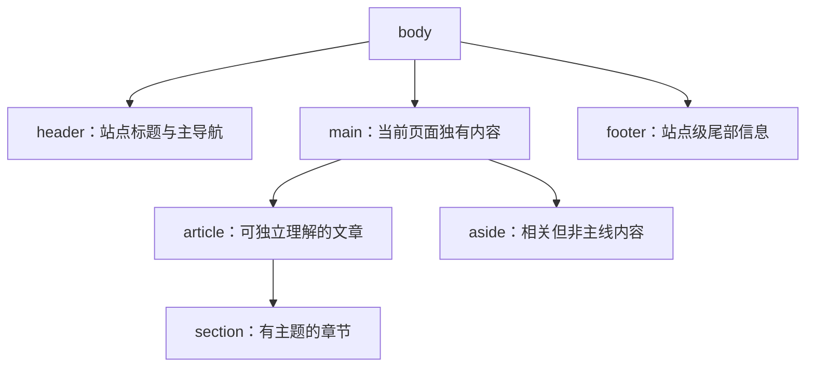

# 语义页面区域：header、nav、main、article、section、aside、footer

## 是什么与为什么需要

这些元素表达页面区域与内容关系，并可映射为辅助技术地标。`header/footer` 是所属页面或章节的头尾；`nav` 是主要导航；`main` 是页面独有主要内容；`article` 可独立分发；`section` 是有主题的章节；`aside` 与周边内容间接相关。

## 区域元素与地标映射

- 元素按内容关系选择，不能根据默认样式或视觉位置选择。
- 页面通常只有一个可见 `main`；重复类型地标应提供可区分名称。
- `section` 表示有主题的章节且通常有标题，纯布局容器使用 `div`。
- `article` 应能在离开当前页面上下文后独立理解或分发。
- DOM 源顺序应先满足阅读和键盘顺序，再使用 CSS 改变视觉布局。



| 元素 | 判断问题 | 常见隐式地标/边界 |
| --- | --- | --- |
| `header` | 这是页面或最近章节的介绍、导航或辅助信息吗 | 顶层且未嵌在部分章节元素内时通常映射 banner |
| `nav` | 这里是一组主要导航链接吗 | navigation；多个时应命名 |
| `main` | 这是当前文档独有的主要内容吗 | main；文档通常仅一个可见 main |
| `article` | 离开当前上下文后仍能独立理解或分发吗 | article，不一定是地标 |
| `section` | 这是有主题、通常有标题的通用章节吗 | 有可访问名称时可映射 region |
| `aside` | 内容与周边主线间接相关吗 | complementary，具体映射受上下文影响 |
| `footer` | 这是页面或最近章节的作者、版权或相关信息吗 | 顶层时通常映射 contentinfo |

## 最小语义页面结构

```html
<header>
  <a href="/">工程周刊</a>
  <nav aria-label="主导航"><a href="/issues">往期</a></nav>
</header>
<main>
  <article>
    <h1>HTTP 缓存</h1>
    <section><h2>验证缓存</h2><p>验证缓存通过条件请求确认资源是否改变。</p></section>
  </article>
  <aside aria-labelledby="related-heading">
    <h2 id="related-heading">相关阅读</h2>
    <a href="/http/headers">缓存响应头</a>
  </aside>
</main>
<footer><p>版权与联系信息</p></footer>
```

页面通常只有一个可见 `main`。多个 `nav` 用可访问名称区分。`section` 通常应有标题；无章节语义的纯样式容器使用 `div`。`article` 内可拥有自己的 header/footer。

## section、article、aside 与视觉布局边界

不要把所有容器改成 `section`。`header` 不等于只能出现一次；`footer` 不保证固定在视口底部。视觉两栏不自动意味着 `main + aside`，需看内容关系。源顺序应先有逻辑，再用 CSS 布局。

## 隐式角色、地标名称与导航负担

原生元素已有隐式角色时通常无需重复 `role`。地标过多会增加导航负担，命名应简洁且相同地标类型可区分。

地标名称优先来自可见标题并通过 `aria-labelledby` 关联；没有合适可见文字时才用 `aria-label`。名称不要包含角色本身，例如用“主导航”作为名称后，辅助技术可能组合读成“主导航，导航”。名称应按真实界面和目标辅助技术验证。

## 完整案例：组织一篇技术文章详情页

输入包括站点品牌、主导航、文章“HTTP 缓存”、两个正文章节、相关阅读和站点版权信息。目标是让无 CSS 文档顺序、标题结构和地标导航都与内容关系一致。

### 1. 先列出内容关系

| 内容 | 独立性与关系 | 选择 |
| --- | --- | --- |
| 品牌与主导航 | 整页介绍信息 | 顶层 `header` |
| 文章正文 | 当前页主要内容 | `main` 内的 `article` |
| “强缓存”“验证缓存” | 文章内有标题的章节 | `section` |
| 相关阅读 | 与文章相关但不属于论述主线 | `aside` |
| 作者和发布日期 | 当前文章的尾部信息 | article 内 `footer` |
| 全站版权 | 整页尾部信息 | body 直接后代的 `footer` |

视觉设计中的顶部、右栏和底部不能直接决定元素。若“相关阅读”是文章完成任务不可缺少的步骤，它可能应进入正文 section，而不是 aside。

### 2. 编写完整 HTML

```html
<!doctype html>
<html lang="zh-CN">
  <head>
    <meta charset="utf-8">
    <meta name="viewport" content="width=device-width, initial-scale=1">
    <title>HTTP 缓存｜工程周刊</title>
  </head>
  <body>
    <header>
      <a href="/">工程周刊</a>
      <nav aria-label="主导航">
        <a href="/issues">往期文章</a>
        <a href="/about">关于</a>
      </nav>
    </header>
    <main>
      <article>
        <header>
          <h1>HTTP 缓存</h1>
          <p>解释缓存复用与重新验证。</p>
        </header>
        <section>
          <h2>强缓存</h2>
          <p>新鲜响应可按缓存规则直接复用。</p>
        </section>
        <section>
          <h2>验证缓存</h2>
          <p>陈旧响应可通过条件请求确认是否更新。</p>
        </section>
        <footer>
          <p>作者：justCDQ；发布于 <time datetime="2026-07-17">2026 年 7 月 17 日</time>。</p>
        </footer>
      </article>
      <aside aria-labelledby="related-title">
        <h2 id="related-title">相关阅读</h2>
        <a href="/http/headers">HTTP 响应头</a>
      </aside>
    </main>
    <footer>
      <nav aria-label="页脚导航"><a href="/privacy">隐私说明</a></nav>
      <p>© 工程周刊</p>
    </footer>
  </body>
</html>
```

### 3. 解释重复元素的上下文

页面有两个 header 和两个 footer。article 内的 header/footer 归属于文章，顶层 header/footer 归属于整页。元素名重复不等于地标重复；浏览器根据上下文和 HTML-AAM 映射可访问性语义。

页面有两个 nav，因此用“主导航”和“页脚导航”区分。`aria-label` 提供的是地标名称，名称文字不必重复“导航”角色；实际朗读由辅助技术组合决定，应测试最终结果。

`main` 只包围当前页面独有内容，不包含全站 header/footer。文档只有一个可见 main。打印或隐藏备用 main 时，仍要确认同一时刻的可访问性树不出现无法区分的主要地标。

### 4. 可观察输出

关闭 CSS 后，DOM 顺序是品牌与导航、文章标题和章节、相关阅读、全站尾部。标题列表为 h1“HTTP 缓存”以及三个 h2；地标列表能区分主导航、main、相关阅读 region/complementary 和页脚导航。

在 Console 检查：

```js
console.log(document.querySelectorAll('main').length);
console.log([...document.querySelectorAll('h1,h2')].map((node) => `${node.tagName}:${node.textContent}`));
console.log([...document.querySelectorAll('nav')].map((node) => node.getAttribute('aria-label')));
```

预期 main 数量为 1，标题顺序与正文一致，两个 nav 名称不同。

### 5. CSS 布局不能改变逻辑顺序

可以用 Grid 把 aside 放到右栏，但 DOM 中仍让文章在先、相关阅读在后。不要用 `order` 把视觉顺序改成与键盘和屏幕阅读器顺序冲突。窄屏切为单列时自然回到 DOM 顺序。

### 6. 失败分支

把每个 `div` 都改成 section 会产生大量无主题章节，地标列表和标题结构变得嘈杂；无章节语义的包装继续用 div。删除 section 标题只保留视觉分隔会让章节目的不可识别；应恢复描述性标题或重新判断是否需要 section。

把侧栏放在 main 外不一定错误，但要看它是否属于当前页面主要内容。把 footer 固定在视口底部是 CSS 问题，不能通过移动 DOM 到错误上下文解决。

原生 nav 已有语义，不重复写 `role="navigation"`。错误 role 可能覆盖原生语义；只有规范允许且确有必要时才补 ARIA。

### 7. 验收练习

关闭 CSS 检查源顺序，用浏览器 Accessibility 树列出地标和名称，再只用标题导航阅读。继续标记一个商品列表页。完成标准：每页一个可见 `main`；重复 `nav` 可区分；无标题的 `section` 已改成有主题章节或普通 `div`；文章离开聚合页仍可独立理解；视觉重排不改变键盘与阅读顺序；完整 HTML 通过一致性检查。

## 来源

- [WHATWG HTML：Sections](https://html.spec.whatwg.org/multipage/sections.html) — 访问日期：2026-07-17
- [W3C ARIA in HTML](https://www.w3.org/TR/html-aria/) — 访问日期：2026-07-17
- [W3C APG：Landmark regions](https://www.w3.org/WAI/ARIA/apg/practices/landmark-regions/) — 访问日期：2026-07-17
- [W3C WAI：Page regions](https://www.w3.org/WAI/tutorials/page-structure/regions/) — 访问日期：2026-07-17
