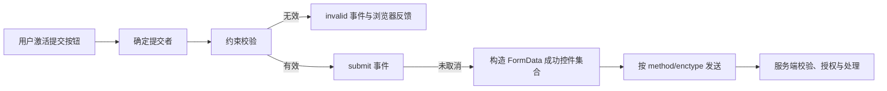

# 表单控件、按钮、原生校验、自动填充与提交

## 是什么与为什么需要

`form` 组织可提交控件。`input`、`select`、`textarea` 收集值，`button` 触发动作。约束属性提供客户端校验，`autocomplete` 令浏览器识别字段，提交把“成功控件”的 `name=value` 按方法和编码发送。

## 控件、约束、自动填充与成功控件规则

- 控件需要稳定 `name` 才能进入表单数据，并用可见 `label` 提供名称。
- `type`、`required`、`min/max/step` 和 `pattern` 描述浏览器可执行的基础约束。
- `autocomplete` 使用标准 token 描述字段用途，而不是把关闭自动填充当安全措施。
- 提交前的客户端校验改善反馈，服务端仍必须重新验证、授权和防重放。
- 提交失败应保留有效输入，并把错误关联到字段和错误摘要。

## 提交流程



成功控件通常需要 `name`、未被禁用并符合控件特定规则。未选中的 checkbox/radio、禁用控件和没有 `name` 的控件不会以普通字段进入表单数据；提交按钮的名称和值只在它是本次提交者时加入。

### 常用控件与值

| 控件 | 核心行为 | 关键边界 |
| --- | --- | --- |
| `input[type=text/email/password]` | 单行字符串 | `type=email` 提供基础格式检查，不证明地址存在 |
| `textarea` | 多行字符串 | 初始值来自元素文本，当前值由 `value` 属性读取 |
| `select` / `option` | 从选项提交 `value` | 未写 value 时使用 option 文本；多选可重复同名字段 |
| checkbox | 选中时提交 value | 未写 value 时默认值通常为 `on`；未选中不提交 |
| 同名 radio | 组内选择一个值 | 每项应有明确 value 和共享 name |
| file | 选择本地文件句柄 | 上传需要 multipart；客户端文件名和媒体类型不可信 |
| button | 提交、重置或普通动作 | 表单内默认类型为 submit，应显式写 type |

## `form` 元素的属性

`form` 自身决定提交目标、HTTP 方法、编码和校验开关。控件可以通过 `form` 属性关联到不在祖先链中的表单，因此“位于表单内部”和“属于该表单”不是同一概念。

| 属性 | 值与作用 | 特殊行为 |
| --- | --- | --- |
| `action` | 接收提交的 URL | 省略或为空时使用当前文档 URL；服务端仍应使用明确路由 |
| `method` | `get`、`post`、`dialog` | 缺失值默认 `get`；`dialog` 用于关闭所属 `dialog`，不执行普通网络提交 |
| `enctype` | `application/x-www-form-urlencoded`、`multipart/form-data`、`text/plain` | 只影响 `post`；含文件时使用 multipart；`text/plain` 主要用于调试，不适合作为结构化生产协议 |
| `target` | `_self`、`_blank`、命名浏览上下文等 | 决定响应打开位置；新窗口行为仍受浏览器安全策略约束 |
| `autocomplete` | `on` 或 `off` | 是表单级默认提示；控件自己的值可以覆盖 |
| `novalidate` | 布尔属性 | 提交时跳过浏览器交互式约束校验，不影响服务端校验 |
| `name` | 表单名称 | 可用于脚本和浏览上下文命名；不等于提交字段名 |
| `accept-charset` | 字符编码声明 | HTML 表单提交使用 UTF-8；不要依赖旧式多编码列表 |
| `rel` | 当前文档与提交目标的关系 | 常见 token 包括 `noreferrer`、`noopener` 等，是否产生效果取决于提交目标和浏览上下文 |

不要嵌套 `form`。HTML 解析器会修正或忽略部分嵌套标记，最终关联关系可能与源码缩进不同。需要跨布局组织控件时，给控件写 `form="form-id"`：

```html
<form id="profile-form" action="/profile" method="post"></form>

<label for="display-name">显示名称</label>
<input id="display-name" name="displayName" form="profile-form" required>
<button type="submit" form="profile-form">保存</button>
```

## `input` 类型逐项说明

缺失 `type` 或使用未知值时，`input` 进入 Text 状态。类型不仅改变外观，也改变值的语义、可用属性、键盘提示、约束校验和提交结果。

### 文本与凭据类型

| `type` | 用途 | 原生行为与边界 |
| --- | --- | --- |
| `text` | 普通单行文本 | 支持 `minlength`、`maxlength`、`pattern`、`placeholder`、`readonly`、`list` 等 |
| `search` | 搜索词 | 语义是搜索输入；浏览器可能提供清除控件，不能依赖其外观 |
| `tel` | 电话号码 | 通常提供电话键盘，但没有通用号码格式校验；号码规则随地区和业务变化 |
| `url` | 绝对 URL 输入 | 非空值必须符合 URL 语法才通过 typeMismatch；仍需限制允许的协议和目标 |
| `email` | 邮箱地址 | 检查基础邮箱语法；`multiple` 允许逗号分隔的多个地址；不证明邮箱存在或归属 |
| `password` | 敏感单行文本 | 屏蔽显示不等于加密；应配合 HTTPS、密码管理器 token、服务端哈希和日志脱敏 |

文本控件的 DOM `value` 是当前值；HTML `value` 属性是默认值来源。修改 `defaultValue` 与修改 `value` 的语义不同，表单重置会回到默认值。

### 数值、日期与范围类型

| `type` | 值语义 | 主要约束 |
| --- | --- | --- |
| `number` | 可转换为数字的字符串 | `min`、`max`、`step`；显示格式和小数分隔受本地化 UI 影响，提交值使用规定格式 |
| `range` | 范围滑块 | 始终需要一个可用值，默认范围通常是 0–100；必须给出可见标签和当前值反馈 |
| `date` | 年-月-日 | 提交形如 `YYYY-MM-DD`；UI 可本地化；不含时区 |
| `month` | 年和月 | 提交形如 `YYYY-MM` |
| `week` | 周序号和周所属年份 | 使用规定的 week 字符串，不等同于任意地区的自然周显示 |
| `time` | 本地时间 | 不含日期和时区；`step` 可控制秒级精度 |
| `datetime-local` | 本地日期时间 | 不包含时区或 UTC 偏移；必须在业务层明确解释所用时区 |
| `color` | 颜色值 | 基础值通常是 sRGB 十六进制颜色；高级颜色能力需要检查目标浏览器支持 |

`valueAsNumber` 和 `valueAsDate` 可在适用类型上读取结构化值；转换失败时可能得到 `NaN` 或 `null`。不要把 `number` 用于邮编、银行卡号、电话号码等“由数字字符组成但不参与算术”的标识符，否则会丢失前导零并得到不合适的调节 UI。

`step` 的合法值是正数或 `any`。步进校验以类型定义的 step base、`min` 或初始值为基准，不只是检查小数位数。例如金额是否允许 0.01 的增量，应明确写 `step="0.01"`，同时在服务端使用适合金额的精确表示。

### 选择、文件与按钮类型

| `type` | 提交规则 | 关键属性与边界 |
| --- | --- | --- |
| `checkbox` | 仅选中时提交 | `checked` 表示默认选中；同名多个 checkbox 会产生重复字段 |
| `radio` | 同一表单、同一 `name` 的组中通常只选一个 | 每项必须写不同 `value`；组的可访问名称需由 `fieldset`/`legend` 或其他正确关系提供 |
| `file` | 提交 `File` 对象 | `accept` 和 `capture` 只是选择提示；`multiple` 允许多个文件；脚本不能任意填充本地路径 |
| `hidden` | 提交不可见值 | 不可聚焦，也不参与多数约束；用户可修改请求，不能保存可信权限、价格或身份结论 |
| `submit` | 发起表单提交 | 本次提交者的 `name=value` 才进入数据；可覆盖表单提交属性 |
| `image` | 用图片作为提交按钮 | 需要 `alt`；会提交点击坐标的 `name.x`、`name.y`，而不是普通按钮值 |
| `reset` | 把控件恢复到默认值 | 容易误清输入，通常不应放在普通业务表单中 |
| `button` | 无默认提交行为 | 用脚本实现普通动作；仍需可访问名称 |

`input type="button"` 与 `button type="button"` 都可触发普通动作；`button` 可以包含文本和允许的短语内容，通常更适合图标加文字。按钮内不要放交互元素。

## 常用 `input` 属性的适用范围

属性不是对所有类型都生效。浏览器忽略不适用于当前类型的属性；这不会自动产生错误，因此必须按类型选择。

| 属性 | 作用 | 主要适用范围与特殊行为 |
| --- | --- | --- |
| `name` | 形成提交字段名 | 所有可提交控件；缺失时通常不进入 entry list |
| `value` | 默认值或提交值 | 文本类是默认字符串；checkbox/radio 是选中时提交值；按钮类是提交者值 |
| `required` | 要求提供值或选择 | 文本、日期、文件、checkbox、radio、select、textarea 等；不适用于 hidden、button，range/color 本身已有默认值语义 |
| `minlength` / `maxlength` | 约束用户编辑的文本长度 | 文本类和 textarea；按 UTF-16 code unit 计数，服务端若按 Unicode 字符或字节限制需明确另一套规则 |
| `pattern` | 用正则约束整个值 | text、search、tel、url、email、password；正则按 HTML 规定编译，概念上匹配整个值，不需手写 `^...$` |
| `min` / `max` | 数值或时间上下界 | number、range 与日期时间类；字符串格式必须符合对应类型 |
| `step` | 合法增量 | number、range 与日期时间类；`any` 关闭步进不匹配检查 |
| `multiple` | 允许多个值 | email 和 file；select 使用自身的 `multiple` |
| `accept` | 文件类型提示 | file；可写扩展名、MIME type 或通配类别，不能代替内容检测 |
| `capture` | 建议使用面向用户或环境的采集设备 | file；移动端实现差异明显，不保证直接打开相机或麦克风 |
| `checked` | 默认选中 | checkbox、radio；当前状态由 `checked` IDL 属性表示 |
| `readonly` | 值不可由用户编辑，但仍可聚焦和提交 | 主要是文本、数值和日期时间类；不适用于 checkbox、radio、file、select |
| `disabled` | 禁止交互并排除提交 | 广泛适用；继承自 disabled fieldset 时也可能生效 |
| `placeholder` | 空值时的短提示 | 文本类和 textarea；不是 label，不应承载唯一格式说明 |
| `list` | 关联 `datalist` 建议值 | 多种文本、数值、日期时间和颜色类型；建议不是强制选项 |
| `inputmode` | 提示虚拟键盘类型 | 不改变数据类型和校验；可与 text 等类型组合 |
| `enterkeyhint` | 提示虚拟键盘 Enter 键标签/动作 | 不提交业务语义，实际显示由设备决定 |
| `dirname` | 额外提交文本方向 | 适用文本输入与 textarea；生成一个额外的 `dirname=ltr|rtl` 条目 |
| `size` | 建议可见宽度 | 部分单行文本类型；不是最大长度 |
| `autofocus` | 页面或 dialog 显示时请求焦点 | 同一作用域避免多个；自动夺取焦点可能影响键盘和读屏用户 |

## `select`、`textarea` 与 `button`

### `select` 和 `option`

单选 `select` 提交选中 `option` 的 `value`；缺少 `value` 时使用该 option 的文本。`multiple` 允许多个选中项，每项形成同名条目。`size` 控制建议显示行数，不限制选项数量。

空提示选项可写为：

```html
<label for="country">国家或地区</label>
<select id="country" name="country" required>
  <option value="">请选择</option>
  <option value="CN">中国</option>
  <option value="SG">新加坡</option>
</select>
```

`disabled` option 不可选择且不提交；`optgroup` 用 `label` 给相关选项分组。不要只靠视觉分隔符构造不可读的伪分组。

### `textarea`

`textarea` 的初始值写在开始和结束标签之间，不使用 `value` 内容属性。常用属性包括 `rows`、`cols`、`minlength`、`maxlength`、`placeholder`、`wrap`、`readonly`、`required` 和 `dirname`。

- `wrap="soft"` 不在提交值中强制插入显示换行。
- `wrap="hard"` 会按控件换行行为向提交值加入换行，并需要 `cols`。
- DOM 当前值读取 `textarea.value`，默认值读取 `textarea.defaultValue`。

### `button` 与提交覆盖属性

`button` 的 `type` 有 `submit`、`reset`、`button`。表单内缺失或无效 `type` 时通常是 submit，因此所有普通按钮都应显式写 `type="button"`。

提交按钮以及 `input type="submit|image"` 可以覆盖所属表单：

| 控件属性 | 覆盖的表单属性 | 用途 |
| --- | --- | --- |
| `formaction` | `action` | 把草稿和正式提交发送到不同端点 |
| `formmethod` | `method` | 为该提交分支选择 get、post 或 dialog |
| `formenctype` | `enctype` | 为 post 分支选择编码 |
| `formtarget` | `target` | 为该分支选择响应浏览上下文 |
| `formnovalidate` | `novalidate` | 跳过交互式客户端校验，例如保存不完整草稿 |
| `form` | 祖先 form 关联 | 通过 ID 指向所属表单 |

```html
<button type="submit" name="intent" value="publish">发布</button>
<button
  type="submit"
  name="intent"
  value="draft"
  formaction="/articles/draft"
  formnovalidate
>保存草稿</button>
```

服务端使用稳定的路由和 `intent` 值区分分支，不根据可翻译的按钮文字判断。

## 成功控件与表单数据集

浏览器提交的不是页面上所有输入，而是构造 entry list 时符合条件的控件和值。以下规则直接决定 `FormData` 和网络请求内容：

1. 控件必须与目标 form 关联并属于可提交元素。
2. 通常必须有非空 `name`；image submitter 的坐标是特殊条目。
3. `disabled` 控件不进入数据。被 disabled `fieldset` 包含的后代也被排除，但第一个 `legend` 内的控件有例外。
4. checkbox 和 radio 只有选中时进入数据。
5. submit/button/image 只有本次 submitter 进入数据；普通 button 不进入。
6. `select` 为每个已选且未禁用的 option 产生条目；multiple 因此可以出现重复 name。
7. file 为每个已选文件产生 `File` 条目；没有选择时的具体空文件条目按表单数据算法处理，服务端仍应把“无文件”作为正常分支。
8. `dirname` 产生额外的方向条目。
9. `readonly` 控件仍进入数据；隐藏、CSS 不可见或移出视口也不会因此自动排除。

重复字段不能无条件转成普通对象，否则只保留最后一个值：

```js
const data = new FormData(form);
const topics = data.getAll('topic');

// Object.fromEntries(data) 会折叠重复 name，不能代替 getAll()。
console.log(topics);
```

服务端解析器对重复键、空字符串和缺失键可能采用不同数据结构。API 契约应明确字段是单值还是多值，并拒绝不允许的重复敏感字段。

## Constraint Validation API 与 `ValidityState`

候选控件是否参与约束校验由类型和状态决定。`disabled` 控件、hidden、部分 readonly 控件和非提交按钮等不会按普通可编辑字段参与校验。`form.noValidate` 和 submitter 的 `formNoValidate` 控制提交时是否运行交互式校验，但不改变服务端责任。

`control.validity` 返回 `ValidityState`：

| 属性 | 为 `true` 的条件 | 常见来源 |
| --- | --- | --- |
| `valueMissing` | required 控件缺少要求的值或选择 | 空文本、未选必选 checkbox/radio、空必选 select |
| `typeMismatch` | 值不符合 email 或 URL 类型语法 | `type=email|url` |
| `patternMismatch` | 非空值不符合 `pattern` | 支持 pattern 的文本类型 |
| `tooLong` | 用户编辑值超过 `maxlength` | 文本输入、textarea；脚本直接赋值与交互校验时机需单独测试 |
| `tooShort` | 非空用户编辑值短于 `minlength` | 文本输入、textarea |
| `rangeUnderflow` | 数值低于 `min` | number、range、日期时间类 |
| `rangeOverflow` | 数值高于 `max` | 同上 |
| `stepMismatch` | 值不在合法 step 序列 | number、range、日期时间类 |
| `badInput` | 浏览器无法把用户输入转换成类型值 | 常见于 number 的本地化或不完整输入 |
| `customError` | `setCustomValidity()` 保存了非空消息 | 自定义单字段或跨字段规则 |
| `valid` | 其他错误属性全部为 false | 只说明客户端当前约束通过 |

`validationMessage` 是浏览器生成或自定义的本地化消息，不能作为稳定程序逻辑。`willValidate` 表示控件当前是否是约束校验候选。

- `control.checkValidity()`：返回布尔值；无效时在控件上触发不可冒泡的 `invalid` 事件。
- `control.reportValidity()`：执行检查，并在错误未被取消时请求浏览器显示反馈。
- `form.checkValidity()` / `form.reportValidity()`：对表单内候选控件执行相应操作。
- `setCustomValidity(message)`：非空字符串设置 `customError`；规则恢复后必须传空字符串清除。

`novalidate`、`formnovalidate` 以及脚本绕过只能影响客户端流程。攻击者可以直接构造请求，所以唯一约束、权限、库存、价格和文件安全必须在服务端或数据库中执行。

## `autocomplete` token 结构

自动填充值可以是 `on`、`off`，也可以是按顺序组合的 token：

```text
[section-*] [shipping|billing] [home|work|mobile|fax|pager] field-name [webauthn]
```

- `section-*` 让同一页面的重复地址或乘客表单分区，例如 `section-sender` 与 `section-recipient`。
- `shipping`、`billing` 区分配送和账单信息。
- `home`、`work` 等联系类型只适用于相应电话、邮箱或即时通信字段。
- field-name 是核心字段用途。
- `webauthn` 作为末尾 token，可提示条件式 WebAuthn 凭据交互；还需要正确的凭据 API 流程。

常用 field-name：

| 类别 | token | 用途 |
| --- | --- | --- |
| 姓名 | `name`、`honorific-prefix`、`given-name`、`additional-name`、`family-name`、`honorific-suffix` | 全名或拆分姓名 |
| 账号 | `username`、`new-password`、`current-password`、`one-time-code` | 登录标识、新密码、现有密码、一次性验证码 |
| 组织 | `organization-title`、`organization` | 职位和组织名称 |
| 地址 | `street-address`、`address-line1`、`address-line2`、`address-line3`、`address-level1` 至 `address-level4`、`country`、`country-name`、`postal-code` | 结构化地址；不要同时混用 street-address 与 address-line 系列表达同一地址 |
| 支付 | `cc-name`、`cc-given-name`、`cc-family-name`、`cc-number`、`cc-exp`、`cc-exp-month`、`cc-exp-year`、`cc-csc`、`cc-type` | 支付卡字段；仍需合规支付处理和安全边界 |
| 联系 | `tel`、`tel-country-code`、`tel-national`、`tel-area-code`、`tel-local`、`email`、`impp` | 电话、邮箱和即时通信地址 |
| 其他 | `language`、`bday`、`bday-day`、`bday-month`、`bday-year`、`sex`、`url`、`photo` | 语言、生日、性别描述、URL 和照片 |
| 交易 | `transaction-currency`、`transaction-amount` | 交易币种和金额 |

登录表单通常使用 `username` + `current-password`；注册或改密使用 `new-password`；验证码使用 `one-time-code`。不要为了“安全”普遍关闭密码管理器。`autocomplete="off"` 是提示而非强制命令，浏览器可能按用户利益和凭据策略忽略。

## 提交事件与 API 的完整顺序

用户激活提交按钮或调用 `requestSubmit()` 时，关键顺序是：

1. 确定 submitter；它决定提交按钮值和 `form*` 覆盖属性。
2. 若未跳过约束校验，对候选控件运行交互式校验。
3. 每个无效控件获得 `invalid` 事件；存在未处理的无效控件时，不继续触发 `submit`。
4. 有效时在 form 上触发可取消的 `submit` 事件；`SubmitEvent.submitter` 指向提交者。
5. 未取消时构造 entry list，并触发 `formdata` 事件；事件的 `formData` 可增加或修改非安全关键派生字段。
6. 根据 action、method、enctype、target 和 submitter 覆盖值执行提交或 dialog 行为。

| API | 约束校验 | `submit` 事件 | submitter |
| --- | --- | --- | --- |
| 用户激活 submit 按钮 | 执行，除非跳过 | 触发 | 被激活按钮 |
| `form.requestSubmit()` | 执行 | 触发 | 无参数时按表单自身提交；可传有效 submitter |
| `form.requestSubmit(button)` | 执行 | 触发 | 指定按钮，应用其 name/value 与覆盖属性 |
| `form.submit()` | 跳过 | 不触发 | 无 |

控件如果使用 `name="submit"` 或 `id="submit"`，可能遮蔽 `form.submit` 方法，导致“submit is not a function”。避免用表单 API 名称作为控件 name；界面流程优先使用 `requestSubmit()`。

拦截异步提交时保留 submitter：

```js
form.addEventListener('submit', async (event) => {
  event.preventDefault();
  const data = event.submitter
    ? new FormData(form, event.submitter)
    : new FormData(form);
  const response = await fetch(event.submitter?.formAction || form.action, {
    method: 'POST',
    body: data,
  });
  if (!response.ok) {
    // 把服务端字段错误关联回控件，并保留用户输入。
  }
});
```

真实生产代码还需处理取消、超时、重复提交、跨站请求保护、响应内容类型和服务端错误 schema。按钮临时 disabled 只是交互保护，数据库唯一约束或幂等键才承担数据不变量。

## 最小注册表单与 Constraint Validation API

```html
<form action="/signup" method="post">
 <label for="email">邮箱</label>
 <input id="email" name="email" type="email" autocomplete="email" required>
 <label for="password">密码</label>
 <input id="password" name="password" type="password" autocomplete="new-password" minlength="12" required>
 <button type="submit">注册</button>
 <button type="button" id="preview">预览</button>
</form>
```

用 JavaScript 增加跨字段约束时，不要替代服务端规则：

```js
const form = document.querySelector('form');
const password = form.elements.password;

password.addEventListener('input', () => {
  const hasSpace = password.value.includes(' ');
  password.setCustomValidity(hasSpace ? '密码不能包含空格' : '');
});

form.addEventListener('formdata', (event) => {
  event.formData.set('client-timezone', Intl.DateTimeFormat().resolvedOptions().timeZone);
});
```

`setCustomValidity('')` 清除自定义错误，非空字符串使控件处于 customError 状态。`checkValidity()` 检查并对无效控件触发 `invalid`，`reportValidity()` 还请求浏览器显示反馈；具体提示样式和语言由浏览器决定。

控件必须有 `name` 才进入提交数据；checkbox 未选中通常不提交。表单内 `button` 默认是 submit，因此非提交按钮显式写 `type="button"`。使用准确 `type`、`required`、`min/max/step/pattern`；复杂跨字段规则再调用 Constraint Validation API。

## 客户端校验、自动填充与提交方法边界

客户端校验可被绕过，服务端必须重新验证、授权和防伪造。`placeholder` 不是 label。`autocomplete="off"` 可能被浏览器忽略，登录字段应使用标准 token。`form.submit()` 不触发约束校验和 submit 事件，通常用 `requestSubmit()`。

## GET、POST、文件上传与控件状态

GET 把表单数据放查询串，适合安全、幂等检索；敏感或改变状态通常 POST，但 HTTPS 才保护传输。文件上传需 `enctype="multipart/form-data"`。

`disabled` 控件不可交互且不提交；`readonly` 主要适用于部分文本控件，仍可聚焦并提交。不要用禁用状态作为服务端授权依据。`formnovalidate`、`formaction`、`formmethod` 和 `formenctype` 可由具体提交按钮覆盖表单设置，适合“保存草稿”等明确分支。

## 完整案例：支持服务端回退的注册表单

输入字段是邮箱、密码、服务条款同意和可选头像。要求浏览器提供即时约束反馈，支持密码管理器，JavaScript 不可用时仍能提交，服务端拒绝重复邮箱、越权字段和非法文件。

### 1. 完整 HTML 输入

```html
<form action="/signup" method="post" enctype="multipart/form-data">
  <label for="email">邮箱</label>
  <input id="email" name="email" type="email" autocomplete="email" required>

  <label for="password">密码</label>
  <input
    id="password"
    name="password"
    type="password"
    autocomplete="new-password"
    minlength="12"
    aria-describedby="password-help"
    required
  >
  <p id="password-help">至少 12 个字符，不能包含空格。</p>

  <label for="avatar">头像（PNG 或 JPEG，最大 2 MB）</label>
  <input id="avatar" name="avatar" type="file" accept="image/png,image/jpeg">

  <label>
    <input name="terms" type="checkbox" value="accepted" required>
    我同意服务条款
  </label>

  <button type="submit">创建账户</button>
  <button type="button" id="preview">预览头像</button>
</form>
```

`enctype="multipart/form-data"` 是文件上传所需编码。`accept` 只给文件选择器提供候选过滤，不是安全验证；服务端必须检查文件大小、实际格式、解码结果和存储策略。

checkbox 仅在选中时提交 `terms=accepted`。未选中不是提交空字符串。服务端不能因为字段缺失就跳过必选规则。

### 2. 增加自定义密码约束

```js
const form = document.querySelector('form');
const password = form.elements.password;

password.addEventListener('input', () => {
  password.setCustomValidity(
    password.value.includes(' ') ? '密码不能包含空格' : '',
  );
});

form.addEventListener('submit', (event) => {
  if (!form.checkValidity()) {
    event.preventDefault();
    form.reportValidity();
  }
});
```

非空 custom validity 使控件无效，清空字符串恢复由其他约束决定的状态。`checkValidity()` 返回布尔值并对无效控件触发 `invalid`；`reportValidity()` 请求浏览器显示反馈。不能依赖提示文案和样式在所有浏览器完全一致。

这个 submit 处理器没有在有效时取消默认提交，因此 JavaScript 只补充约束，最终仍由浏览器导航到服务端响应。

### 3. 观察 FormData 输出

在有效输入后执行：

```js
const data = new FormData(form);
for (const [name, value] of data) {
  console.log(name, value instanceof File ? `${value.name}:${value.size}` : value);
}
```

预期包含 email、password、avatar File 和 terms。预览按钮没有 name 且不是提交者，不进入数据。把 checkbox 取消后 terms 消失；把 email 禁用后 email 也不提交。`readonly` 邮箱若适用则仍会提交，但用户无法编辑。

### 4. 正常提交与 requestSubmit

另一个“提交注册”控件需要程序触发时使用：

```js
form.requestSubmit();
```

它遵循提交按钮、约束校验和 submit 事件流程。`form.submit()` 直接启动较低层提交，不触发约束校验和 submit 事件，通常不是界面操作的正确选择。

若使用多个提交按钮，可为“保存草稿”设置 `formnovalidate` 和独立 `formaction`，但服务端必须通过明确路由或动作字段区分，不根据按钮文字猜测。

### 5. 服务端处理与输出

服务端接收 multipart 后依次限制请求大小、解析字段、校验邮箱规范、检查密码策略、确认条款、验证文件，再在事务中创建账户。成功响应明确告诉用户账户已创建；重复邮箱返回稳定冲突错误并保留非敏感输入。

密码不得回填到 HTML value，也不应写入日志。头像原始文件名和 Content-Type 来自客户端，不可信；生成服务端文件名并把上传目录隔离于可执行代码。

### 6. 失败分支

输入 `abc` 时 email typeMismatch；11 字符密码触发 tooShort；含空格密码触发 customError；未选条款触发 valueMissing。浏览器校验被禁用或请求被手工构造时，服务端仍返回相同业务错误。

网络超时后用户可能再次提交，创建账户流程应通过唯一邮箱约束或幂等策略避免重复。按钮 disabled 只减少普通重复点击，不是数据不变量。

`autocomplete="off"` 可能不阻止浏览器对登录字段的策略；正确 token 能帮助密码管理器理解用途。安全目标是正确认证流程，不是阻止用户使用密码管理器。

### 7. 验证与验收

在 Console 用 `new FormData(form)` 检查实际字段，在 Network 查看 multipart 请求，并分别关闭 JavaScript、篡改 HTML 约束、上传伪装文件。完成标准：字段均有 name 和 label；错误可定位；有效非敏感值在失败后保留；`requestSubmit()` 触发正常校验；服务端重新验证、授权并拒绝非法文件、越权字段和重复请求；HTML 通过一致性检查。

## 来源

- [WHATWG HTML：Forms](https://html.spec.whatwg.org/multipage/forms.html) — 访问日期：2026-07-17
- [WHATWG HTML：Form submission](https://html.spec.whatwg.org/multipage/form-control-infrastructure.html#form-submission-2) — 访问日期：2026-07-17
- [MDN：Constraint validation](https://developer.mozilla.org/en-US/docs/Web/HTML/Guides/Constraint_validation) — 访问日期：2026-07-17
- [WHATWG HTML：Autofill](https://html.spec.whatwg.org/multipage/form-control-infrastructure.html#autofill) — 访问日期：2026-07-17
