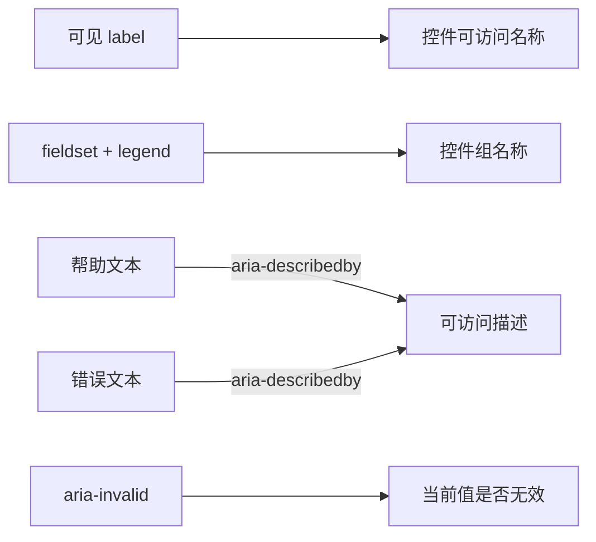
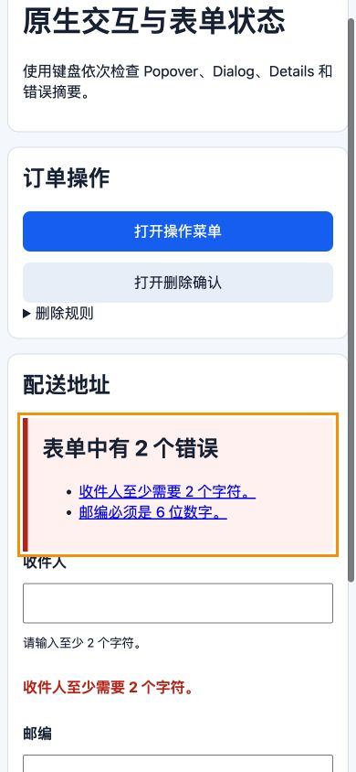

# label、fieldset、legend、错误提示与帮助文本

## 是什么与为什么需要

`label` 为控件提供可访问名称并扩大点击区域；`fieldset/legend` 为相关控件建立组名；帮助文本说明格式，错误提示说明问题与修正方法。这些关系必须能被程序确定，不能只靠位置或颜色。



名称回答“这个控件是什么”，描述回答“怎样填写或哪里出错”，状态回答“当前是否无效”。`aria-describedby` 不会把描述变成名称，也不会显示或隐藏任何内容。

## 名称、组名、描述与无效状态

```html
<fieldset>
  <legend>通知方式（必选）</legend>
  <label><input type="radio" name="notify" value="email" required> 邮件</label>
  <label><input type="radio" name="notify" value="sms"> 短信</label>
</fieldset>
<label for="username">用户名</label>
<input id="username" name="username" aria-describedby="username-help username-error" aria-invalid="true" required>
<p id="username-help">4–20 个字母或数字。</p>
<p id="username-error">用户名含空格，请删除空格。</p>
```

显式 label 的 `for` 必须精确匹配唯一 `id`。错误出现后设置 `aria-invalid="true"`，用 `aria-describedby` 关联说明；提交后提供错误摘要、指向字段的链接并把焦点移到合适位置。

### 提交后的错误顺序

1. 服务端或客户端按同一业务规则获得字段错误。
2. 在字段附近显示具体错误，说明问题与修正方法。
3. 将错误元素 ID 加入控件 `aria-describedby`，并把 `aria-invalid` 设为 `true`。
4. 在表单顶部生成错误摘要，每项链接到对应控件。
5. 把焦点移动到摘要标题或第一个无效字段，选择一种稳定策略并测试。
6. 用户修正后清除错误文本、关联和无效状态；不要留下过时信息。

动态逐键校验要避免输入尚未完成就持续播报。更适合在提交、失焦或格式已足够明确时反馈，并允许用户完成输入。

## placeholder、title、live region 与输入保留边界

不要仅用 placeholder、`title` 或图标代替可见 label。不要把整个复杂区域包进 label。`aria-describedby` 不控制视觉显示。动态错误可用 live region 通知，但避免每次输入都打断用户。服务端错误返回时保留非敏感输入。

## 必填说明与最小数据收集

必填状态应在 label/legend 文本中可理解；星号需解释。只收集完成任务所需字段可降低填写负担。

## 完整案例：带错误摘要的配送地址表单

输入要求用户选择配送方式并填写收件人、邮编。提交后服务端返回两个错误：收件人为空，邮编格式错误。页面必须同时提供字段附近错误和可键盘定位的错误摘要。

### 1. 初始 HTML

```html
<form action="/checkout/address" method="post" novalidate>
  <div id="error-summary" tabindex="-1" hidden></div>

  <fieldset>
    <legend>配送方式（必选）</legend>
    <label><input type="radio" name="delivery" value="standard" required> 标准配送</label>
    <label><input type="radio" name="delivery" value="express"> 次日达</label>
  </fieldset>

  <label for="recipient">收件人</label>
  <input id="recipient" name="recipient" autocomplete="shipping name" required>
  <p id="recipient-help">请填写证件或门禁可识别的姓名。</p>
  <p id="recipient-error" hidden></p>

  <label for="postal-code">邮编</label>
  <input id="postal-code" name="postalCode" inputmode="numeric" autocomplete="shipping postal-code">
  <p id="postal-code-help">填写 6 位数字。</p>
  <p id="postal-code-error" hidden></p>

  <button type="submit">保存并继续</button>
</form>
```

这里用 `novalidate` 是为了演示应用统一错误界面，不表示放弃校验。服务端始终执行最终规则。若项目使用浏览器原生气泡，可以移除 novalidate，但仍需处理服务端错误。

显式 label 的 `for` 与控件唯一 id 匹配。radio 使用包裹式 label，共享 name 形成一组；legend 提供组名。帮助文本目前尚未关联，下一步由脚本组合描述 ID。

### 2. 定义具体错误输入

```js
const errors = {
  recipient: '请输入收件人姓名。',
  'postal-code': '邮编必须是 6 位数字。',
};
```

键使用 DOM id，仅用于界面映射；真实 API 应返回稳定字段路径和错误码，不把任意服务端字符串直接插入 HTML。

### 3. 将错误关联到字段

```js
const descriptionIds = {
  recipient: ['recipient-help', 'recipient-error'],
  'postal-code': ['postal-code-help', 'postal-code-error'],
};

for (const [fieldId, message] of Object.entries(errors)) {
  const field = document.getElementById(fieldId);
  const error = document.getElementById(`${fieldId}-error`);
  error.textContent = message;
  error.hidden = false;
  field.setAttribute('aria-invalid', 'true');
  field.setAttribute('aria-describedby', descriptionIds[fieldId].join(' '));
}
```

Name 仍来自 label，Description 依次包含帮助和错误，Invalid 状态为 true。`aria-describedby` 中 ID 顺序表达期望组合，但实际播报细节受辅助技术影响。

### 4. 创建错误摘要

```js
const summary = document.getElementById('error-summary');
const heading = document.createElement('h2');
heading.textContent = `表单中有 ${Object.keys(errors).length} 个错误`;

const list = document.createElement('ul');
for (const [fieldId, message] of Object.entries(errors)) {
  const item = document.createElement('li');
  const link = document.createElement('a');
  link.href = `#${fieldId}`;
  link.textContent = message;
  item.append(link);
  list.append(item);
}

summary.replaceChildren(heading, list);
summary.hidden = false;
summary.focus();
```

使用 textContent 防止把错误文本当 HTML 执行。摘要容器 `tabindex="-1"` 可程序聚焦但不进入正常 Tab 序列。焦点移到摘要后，用户先获得错误数量，再通过链接定位字段。

片段链接对 input 的焦点行为存在实现差异，可在摘要链接 click 中显式 `document.getElementById(fieldId).focus()`，同时保留 href 作为无脚本导航语义。

### 5. 修正后的状态清理

字段通过验证后必须移除过时状态：

```js
function clearFieldError(fieldId) {
  const field = document.getElementById(fieldId);
  const error = document.getElementById(`${fieldId}-error`);
  error.textContent = '';
  error.hidden = true;
  field.removeAttribute('aria-invalid');
  field.setAttribute('aria-describedby', `${fieldId}-help`);
}
```

不能只把错误视觉隐藏而保留 aria-describedby，否则辅助技术仍可能读取旧错误。也不要在用户每输入一个字符时反复移动焦点或播报整个摘要。

### 6. 可观察输出

提交错误输入后，视觉上出现两个字段错误和顶部摘要；`document.activeElement.id` 为 `error-summary`；Accessibility 树中收件人 Name 为“收件人”，Description 包含帮助与错误，Invalid 为 true。

仓库中的 [原生交互与表单状态 demo](../../examples/html/html-interactions-demo.html) 可直接复现该错误状态。桌面视口提交空表单后，错误摘要包含 2 项并取得焦点：


390×844 窄屏下页面宽度与视口一致，没有横向溢出：



真实浏览器检查中 Console warning/error 为 0。截图只展示状态；字段名称、描述和无效状态仍需通过 demo 源码与 Accessibility 树验证。

修正收件人后调用清理函数，错误隐藏、描述只保留帮助、Invalid 恢复默认。邮编错误仍存在，摘要应重新生成而不是继续显示错误数 2。

### 7. 失败分支

只使用红色边框无法说明错误原因；placeholder 会在输入后消失且不是稳定标签；title 依赖 hover 并不能可靠替代可见 label；给每次键入都使用 `role="alert"` 会造成连续打断。

服务端返回页面时，如果把密码、证件号或支付数据回填，会扩大泄漏风险。只保留允许恢复的非敏感字段，并按业务要求处理地址等个人信息。

fieldset 被 CSS `display: contents` 或复杂重排影响时，要验证 legend 与 radio 组关系。纯视觉边框和标题不能替代 fieldset/legend 的程序化分组。

### 8. 验收练习

只用键盘提交空表单、从摘要逐项定位并修正。完成标准：点击 label 能聚焦或选择控件；Accessibility 树中的 Name、Description、Invalid 与界面同步；组名和字段名可见；错误不只靠颜色；摘要错误数实时准确；修正后移除旧关联；服务端返回错误时只保留允许的非敏感输入。

## 来源

- [W3C WAI：Labeling controls](https://www.w3.org/WAI/tutorials/forms/labels/) — 访问日期：2026-07-17
- [W3C WAI：Grouping controls](https://www.w3.org/WAI/tutorials/forms/grouping/) — 访问日期：2026-07-17
- [W3C WAI：Form instructions](https://www.w3.org/WAI/tutorials/forms/instructions/) — 访问日期：2026-07-17
- [W3C WAI：User notifications](https://www.w3.org/WAI/tutorials/forms/notifications/) — 访问日期：2026-07-17
