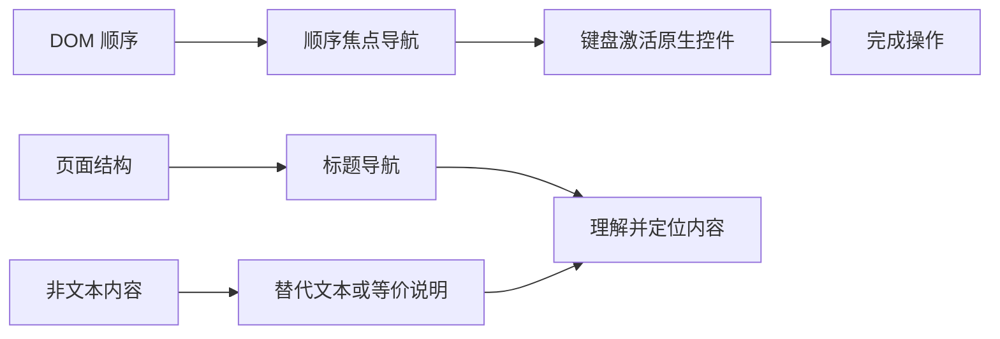

# 标题层级、替代文本、焦点顺序与键盘操作

## 是什么与为什么需要

标题建立内容层级；替代文本提供非视觉等价信息；焦点是当前接收键盘输入的元素；焦点顺序决定顺序导航路径。它们使屏幕阅读器和键盘用户能理解、定位并操作页面。

## 标题、替代文本、焦点与顺序导航规则

这四个主题共同决定用户能否建立页面结构、理解非文本内容并按可预测顺序操作。

| 能力 | 程序化信息 | 主要验证 |
| --- | --- | --- |
| 标题层级 | `h1`–`h6` 的级别与文本 | 标题列表、DOM、无障碍树 |
| 图片替代 | `img[alt]` 或周边等价内容 | 阻止图片、检查可访问名称 |
| 焦点 | 当前 `document.activeElement` | 可见焦点样式、焦点事件 |
| 顺序导航 | DOM 顺序与原生可聚焦元素 | Tab、Shift+Tab 全流程 |



## 最小跳过链接与键盘结构

- 页面以描述性 `h1` 开始，章节按实际层级用 `h2`、`h3`；不因字号跳级。
- 信息图片的 `alt` 表达用途/信息，装饰图 `alt=""`；复杂图在正文提供数据或说明。
- DOM 顺序应符合阅读与操作顺序；使用自然可聚焦的 `a[href]`、`button`、表单控件。
- 避免正 `tabindex`；需程序聚焦的容器可用 `tabindex="-1"`。所有鼠标功能必须可由键盘完成并有可见焦点。

```html
<a href="#main" class="skip-link">跳到主要内容</a>
<main id="main" tabindex="-1">
  <h1>账户设置</h1>
  <h2>登录信息</h2>
  <button type="button">修改密码</button>
</main>
```

跳转到片段后浏览器焦点行为存在实现和目标元素差异。若需要可靠地把焦点移到主内容，可在激活跳过链接后调用 `main.focus()`，同时用 `tabindex="-1"` 允许程序聚焦但不把静态容器加入正常 Tab 顺序。

### `tabindex` 值

| 值 | 行为 | 建议 |
| ---: | --- | --- |
| 缺失 | 按元素原生规则决定能否聚焦 | 原生链接、按钮和控件首选 |
| `0` | 加入按 DOM 顺序的顺序焦点导航 | 只用于确实需要自定义交互角色的元素 |
| `-1` | 可程序聚焦，不进入正常 Tab 顺序 | 错误摘要、主内容等焦点目标 |
| 正整数 | 在普通 DOM 顺序前建立人工顺序 | 避免；维护成本高且易与视觉顺序冲突 |

原生键盘行为因控件而异：链接通常用 Enter 激活，按钮用 Enter 或 Space，复选框用 Space，单选组通常用方向键移动选择。自定义组件必须遵循对应组件模式，不能把所有按键统一成点击模拟。

## CSS 重排、outline、tabindex 与冗余替代边界

CSS 重排视觉顺序可能与 DOM/焦点顺序分离。不要移除 outline 而不提供等价焦点样式。不可给每个静态元素 `tabindex="0"`。图中文字若正文已完整重复可避免冗余 alt。

## 原生控件键盘约定与焦点恢复

键盘测试至少覆盖 Tab、Shift+Tab、Enter、Space、方向键和 Escape，具体键取决于原生控件或规范化组件模式。

焦点不能被颜色之外的唯一变化隐藏。不要在全局写 `outline: none`；使用 `:focus-visible` 提供足够明显的样式。模态界面打开、关闭、删除当前焦点元素和路由导航时，都要明确下一个合理焦点位置。

## 完整案例：可键盘操作的账户设置页

输入页面包含站点导航、账户主题、信息图、修改密码按钮和保存表单。要求跳过重复导航，标题可浏览，图片不可用时仍传达结论，键盘顺序与视觉顺序一致。

### 1. HTML 结构

```html
<a class="skip-link" href="#main">跳到主要内容</a>
<header>
  <nav aria-label="主导航">
    <a href="/">首页</a>
    <a href="/account" aria-current="page">账户</a>
  </nav>
</header>
<main id="main" tabindex="-1">
  <h1>账户设置</h1>
  <section>
    <h2>安全状态</h2>
    <figure>
      
      <figcaption>安全评分依据密码、双重验证和恢复方式计算。</figcaption>
    </figure>
    <button type="button">修改密码</button>
  </section>
  <section>
    <h2>联系邮箱</h2>
    <form action="/account/email" method="post">
      <label for="email">邮箱</label>
      <input id="email" name="email" type="email" autocomplete="email" required>
      <button type="submit">保存邮箱</button>
    </form>
  </section>
</main>
```

h1 表示页面主题，两个 h2 是同级章节。图像 alt 给出评分和缺失项，figcaption 解释指标来源，两者不是完全重复。按钮执行当前页面动作，链接负责导航。

### 2. 焦点可见样式

```css
.skip-link {
  position: absolute;
  inset-inline-start: 1rem;
  inset-block-start: -10rem;
}
.skip-link:focus { inset-block-start: 1rem; }
:focus-visible {
  outline: 3px solid #f79009;
  outline-offset: 3px;
}
```

跳过链接在获得焦点时必须可见。不要使用 `display: none` 隐藏，否则它无法进入焦点顺序。全局 focus-visible 样式需要在所有背景上保持清晰，组件不能用更具体规则无意覆盖。

### 3. 明确片段焦点

```js
const skipLink = document.querySelector('.skip-link');
const main = document.querySelector('#main');

skipLink.addEventListener('click', () => {
  requestAnimationFrame(() => main.focus());
});
```

href 保留片段导航；脚本在导航后明确聚焦 main。`tabindex="-1"` 允许程序聚焦但不让 main 成为每次 Tab 都经过的交互项。

### 4. 可观察键盘序列

从地址栏按 Tab，预期顺序是跳过链接、首页、账户、修改密码、邮箱、保存邮箱。激活跳过链接后焦点移动到 main，再按 Tab 到修改密码。Shift+Tab 反向遍历，不进入静态标题和图片。

Console 可随时检查：

```js
console.log(document.activeElement);
console.log([...document.querySelectorAll('h1,h2')].map((node) => [node.tagName, node.textContent]));
```

标题输出应是 H1、H2、H2。焦点元素应与可见焦点环一致。

### 5. 图片失败验证

在 Network 阻止 `security-score.svg` 或临时改错 src。用户仍能从 alt 获得“80 分，缺少恢复邮箱”，并从 figcaption 得知评分依据。若图中包含完整多项数据，应在正文提供表格或长描述，而不是把数十项塞进 alt。

装饰背景不应使用信息 alt；功能图标若是按钮唯一内容，需要按钮可访问名称，通常通过可见文字或 `aria-label`，而不是描述图标外形。

### 6. 失败分支

CSS Grid 把“联系邮箱”视觉放到“安全状态”前，但 DOM 不变，会造成视觉与焦点顺序冲突；修正 DOM 使主要阅读顺序一致。正 `tabindex` 只能暂时掩盖问题，并会在新增控件后失控。

删除 outline 且只在 hover 改色会让键盘用户无法定位。给所有 h2 加 `tabindex="0"` 会制造多余停靠点；标题导航由辅助技术提供，不应强迫普通 Tab 遍历静态内容。

关闭对话框后若触发按钮已被删除，应把焦点放到合理后续位置，例如结果标题，而不是 body。焦点管理属于状态转换的一部分。

### 7. 验收练习

拔掉鼠标，从地址栏开始完成修改密码和保存邮箱，记录每次焦点位置与按键结果，再用可访问性树检查标题和图片名称。完成标准：标题顺序真实；图片不可用时信息仍完整；无正 `tabindex`；焦点始终可见；激活方式符合原生控件；视觉顺序与 DOM/焦点顺序一致；200% 缩放后焦点不被固定区域遮挡。

## 来源

- [W3C WAI：Page structure—Headings](https://www.w3.org/WAI/tutorials/page-structure/headings/) — 访问日期：2026-07-17
- [W3C WAI：Images tutorial](https://www.w3.org/WAI/tutorials/images/) — 访问日期：2026-07-17
- [W3C WCAG 2.2：Understanding Focus Order](https://www.w3.org/WAI/WCAG22/Understanding/focus-order.html) — 访问日期：2026-07-17
- [WHATWG HTML：Focus](https://html.spec.whatwg.org/multipage/interaction.html#focus) — 访问日期：2026-07-17
- [W3C APG：Developing a Keyboard Interface](https://www.w3.org/WAI/ARIA/apg/practices/keyboard-interface/) — 访问日期：2026-07-17
