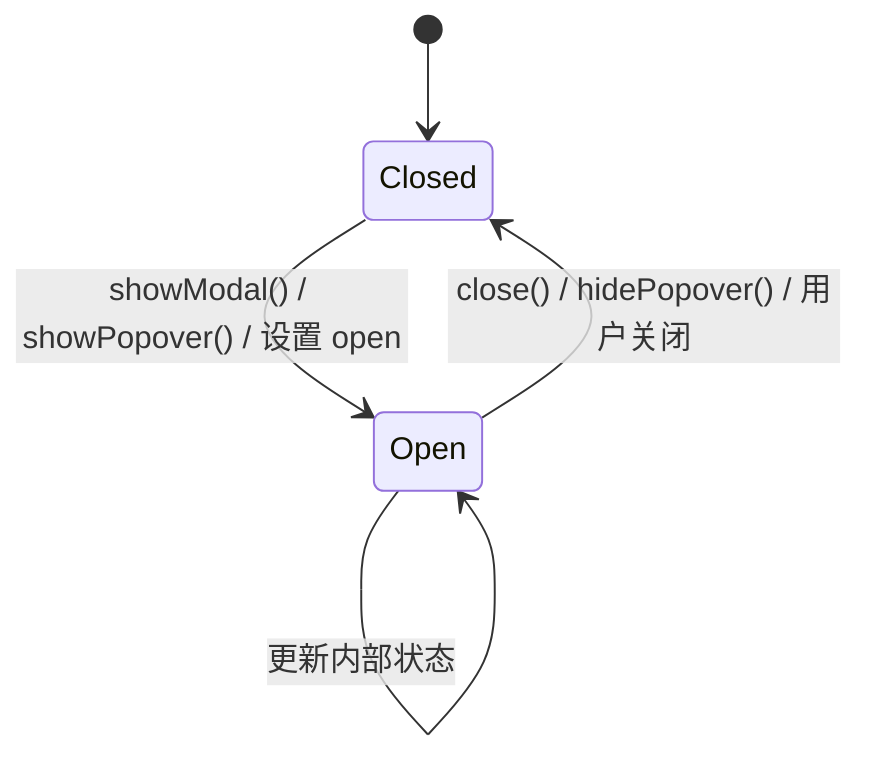
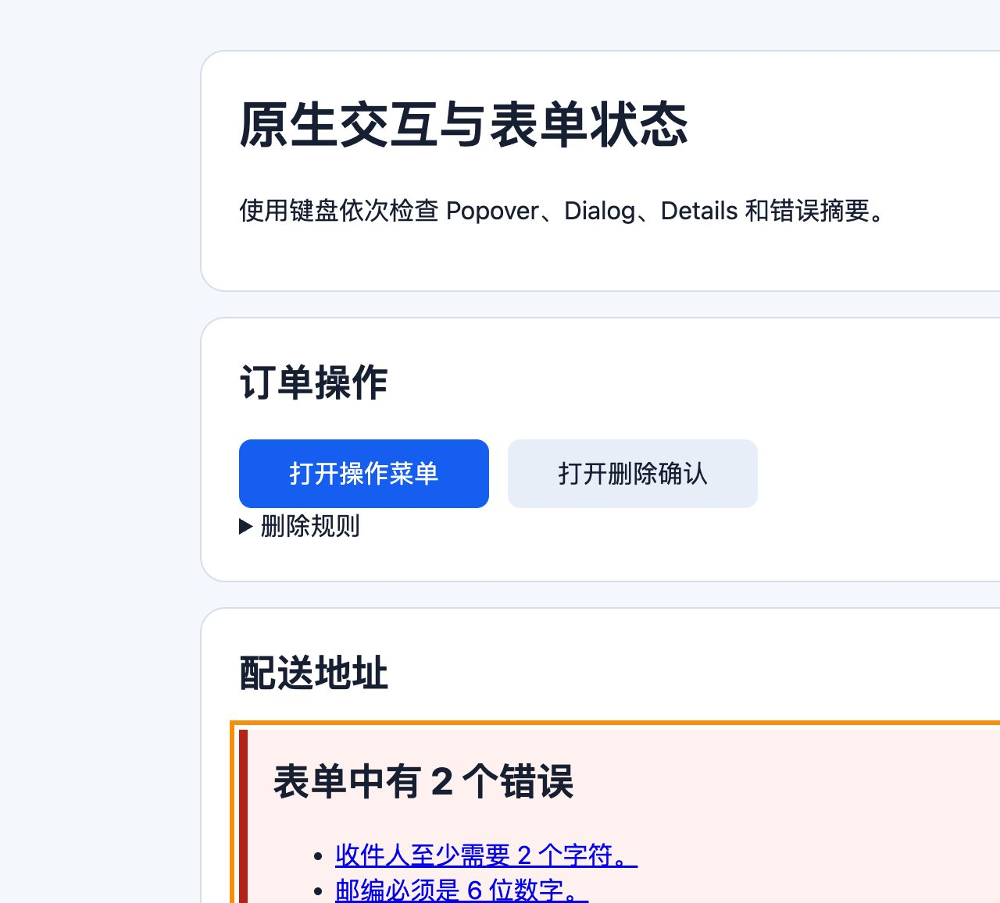

# Dialog、Popover 与 Details 原生交互元素

## 是什么与为什么需要

`dialog` 表示模态或非模态对话框；Popover API 把元素置于 top layer 并提供声明式显示/关闭；`details/summary` 提供可展开内容。原生能力能减少自制组件所需的焦点、Escape、层级与状态代码。

## Dialog、Popover 与 Details 的状态和能力

- `showModal()` 创建真正模态的 dialog；只设置 `open` 不会阻止背景交互。
- 模态打开时焦点进入对话框，关闭后应回到触发点或合理后续位置。
- popover 始终是非模态；`auto` 支持轻关闭，`manual` 由应用显式管理。
- `summary` 是 details 的可操作标签，文案应说明将展开的内容。
- 原生元素仍需测试标题、关闭路径、焦点顺序、窄屏和辅助技术支持。

| 能力 | `dialog` | Popover | `details` |
| --- | --- | --- | --- |
| 主要用途 | 需要独立交互上下文的对话 | 非模态浮层 | 展开/折叠附加内容 |
| 模态 | `showModal()` 可模态 | 始终非模态 | 非模态 |
| top layer | 模态 dialog 进入 | 显示时进入 | 不进入 |
| 轻关闭 | 模态通常支持 Escape 关闭请求 | `auto` 支持外部交互/Escape | 再次激活 summary |
| 状态 | `open`，`close`/`cancel` 事件 | `:popover-open`、`toggle` | `open`、`toggle` |



## 三种原生交互的最小组合

```html
<button id="open-confirm" type="button">删除</button>
<dialog id="confirm" aria-labelledby="confirm-title">
  <h2 id="confirm-title">确认删除？</h2>
  <p>删除后无法恢复。</p>
  <form method="dialog">
    <button value="cancel">取消</button>
    <button value="confirm">确认删除</button>
  </form>
</dialog>
<button type="button" popovertarget="actions">操作</button>
<div id="actions" popover><a href="/orders/42">查看订单</a></div>
<details><summary>系统要求</summary><p>需要 Node.js 22 或更高版本。</p></details>
<script>
  const dialog = document.querySelector('#confirm');
  const openButton = document.querySelector('#open-confirm');

  openButton.addEventListener('click', () => dialog.showModal());
  dialog.addEventListener('close', () => {
    if (dialog.returnValue === 'confirm') {
      console.log('执行删除请求');
    }
  });
</script>
```

模态对话框用 `showModal()`，关闭用 `close()`/表单 `method="dialog"`；必须有清楚标题和关闭途径。popover 默认 `auto` 可点击外部或 Escape 轻关闭，`manual` 需显式关闭。`summary` 应描述展开内容。

`show()` 打开非模态 dialog，`showModal()` 打开模态 dialog；对已经以不兼容方式打开的 dialog 再调用可能抛出 `InvalidStateError`。`close(value)` 和 `method="dialog"` 提交可设置 `returnValue`。用户按 Escape 请求关闭模态对话框时会产生可取消的关闭相关事件；只有确有业务必要时才阻止关闭，并提供明确替代路径。

Popover 的 `auto` 状态参与轻关闭，并通常一次只保留相关链上的浮层；`manual` 不自动轻关闭，应用必须提供按钮、状态同步和恢复焦点策略。Popover 不让背景失效，因此确认删除等必须阻止背景交互的流程仍应使用模态 dialog。

多个 `details` 可通过相同 `name` 形成互斥展开组；这是内容折叠，不应被当作要求方向键导航的 ARIA tab 组件。

## 模态、焦点、Popover 和兼容性边界

Popover 永远非模态，需要阻止背景交互时使用 dialog。不要给 dialog 自身设置 `tabindex`。只写 dialog 的 `open` 属性不会获得 `showModal()` 的模态行为。`command`/`commandfor` 可以声明式控制 dialog，但并非所有目标浏览器都支持；使用前检查兼容范围并提供回退。基础示例采用支持更广的 `showModal()`，并测试键盘和屏幕阅读器。

## Top layer 与 backdrop

这些组件进入浏览器 top layer 后不受普通 `z-index` 层级限制；可使用 `::backdrop` 设置背景层样式。

## 完整案例：订单操作菜单与删除确认

输入流程是从订单卡片打开非模态操作菜单，选择“删除”后进入模态确认；页面另有可展开的“删除规则”。成功、取消、Escape 和服务端失败都要有明确状态。

### 1. 完整 HTML

```html
<button type="button" popovertarget="order-actions">订单操作</button>
<div id="order-actions" popover="auto">
  <a href="/orders/42">查看订单</a>
  <button id="open-delete" type="button">删除订单</button>
</div>

<details name="order-help">
  <summary>删除规则</summary>
  <p>已发货订单不能删除。</p>
</details>

<dialog id="delete-dialog" aria-labelledby="delete-title">
  <h2 id="delete-title">确认删除订单？</h2>
  <p>订单 #42 将从列表移除，此操作不能撤销。</p>
  <p id="delete-error" role="alert" hidden></p>
  <form method="dialog">
    <button value="cancel">取消</button>
    <button value="confirm">确认删除</button>
  </form>
</dialog>
```

Popover 保持背景可操作，适合动作列表；dialog 的 showModal 使其余文档在模态交互期间失效；details 用于内容披露，不承担菜单或模态职责。

### 2. 打开与关闭状态

```js
const dialog = document.querySelector('#delete-dialog');
const openDelete = document.querySelector('#open-delete');
const popover = document.querySelector('#order-actions');
const error = document.querySelector('#delete-error');

openDelete.addEventListener('click', () => {
  popover.hidePopover();
  error.hidden = true;
  dialog.showModal();
});
```

先关闭 popover 再打开 dialog，使界面只保留一个明确交互上下文。对已打开模态 dialog 再调用 showModal 可能抛出状态异常，因此触发器需要避免重复调用。

### 3. 根据 returnValue 执行业务动作

```js
dialog.addEventListener('close', async () => {
  if (dialog.returnValue !== 'confirm') return;

  try {
    const response = await fetch('/api/orders/42', { method: 'DELETE' });
    if (!response.ok) throw new Error(`HTTP ${response.status}`);
    document.querySelector('[data-order-id="42"]')?.remove();
  } catch (reason) {
    error.textContent = '删除失败，请稍后重试。';
    error.hidden = false;
    dialog.showModal();
    console.error(reason);
  }
});
```

表单按钮 value 成为 dialog.returnValue。取消或 Escape 关闭时不发送删除请求。确认后才调用服务端；客户端移除 DOM 不是授权边界，服务端仍检查订单归属和状态。

失败后重新打开对话框并显示错误。实际应用还要避免 close 监听器因程序重开形成重复请求，可把请求状态建模为 idle/submitting/error，并在 submitting 期间禁用确认按钮。

### 4. 取消与焦点恢复

模态 dialog 默认处理 Escape 的关闭请求。关闭后浏览器通常把焦点恢复到先前聚焦元素，但业务删除成功后该元素可能已被移除；此时程序应把焦点移动到订单列表标题或下一条订单。

不要把 dialog 自身加入 tabindex。初始焦点应落在最合理的内部控件或静态说明目标，危险确认通常不应自动获得焦点；具体策略按内容长度和操作风险测试。

### 5. 可观察状态

```js
console.table({
  popoverOpen: popover.matches(':popover-open'),
  dialogOpen: dialog.open,
  returnValue: dialog.returnValue,
  activeElement: document.activeElement?.textContent?.trim(),
});
```

打开菜单时 popoverOpen 为 true、dialogOpen 为 false；选择删除后相反；取消关闭后两者均为 false且没有 DELETE；确认成功后订单节点消失。

可运行的 [原生交互与表单状态 demo](../../examples/html/html-interactions-demo.html) 同时覆盖 Popover、Dialog 和 Details。桌面渲染结果如下：



真实浏览器已验证：Popover 打开后点击外部会自动关闭；Dialog 打开再取消后，焦点返回触发按钮；Console warning/error 为 0。窄屏验证见 [表单错误与窄屏结果](07-form-labels-groups-errors-help.md#6-可观察输出)。

details 的 `open` 属性反映展开状态，toggle 事件可观察变化。共享 name 的 details 可以形成互斥组，但不获得 tablist 的方向键模式。

### 6. 失败与兼容分支

Popover 始终非模态，不能用它做必须阻止背景的确认。只给 dialog 写 open 属性不会建立 showModal 的模态行为。把菜单内容放在 hover 才可见会排除键盘和触屏操作。

在不支持所需 Popover 能力的目标浏览器中，应通过特性检测选择可用实现；不要让触发按钮指向不存在的行为。原生支持也不免除键盘、屏幕阅读器和窄屏测试。

### 7. 验收练习

用 Tab、Shift+Tab、Enter、Space 和 Escape 完成打开、操作、取消、确认与失败恢复；在每次状态变化后检查 `document.activeElement`、`dialog.open`、`:popover-open` 和 `details.open`。完成标准：模态背景不可操作；取消不发请求；失败可重试；删除后焦点落到合理位置；组件名称清楚；窄屏无裁切；控制台无未解释异常；目标浏览器不支持时有回退。

## 来源

- [WHATWG HTML：The `dialog` element](https://html.spec.whatwg.org/multipage/interactive-elements.html#the-dialog-element) — 访问日期：2026-07-17
- [WHATWG HTML：The popover attribute](https://html.spec.whatwg.org/multipage/popover.html) — 访问日期：2026-07-17
- [WHATWG HTML：The `details` element](https://html.spec.whatwg.org/multipage/interactive-elements.html#the-details-element) — 访问日期：2026-07-17
- [W3C ARIA APG：Dialog modal pattern](https://www.w3.org/WAI/ARIA/apg/patterns/dialog-modal/) — 访问日期：2026-07-17
