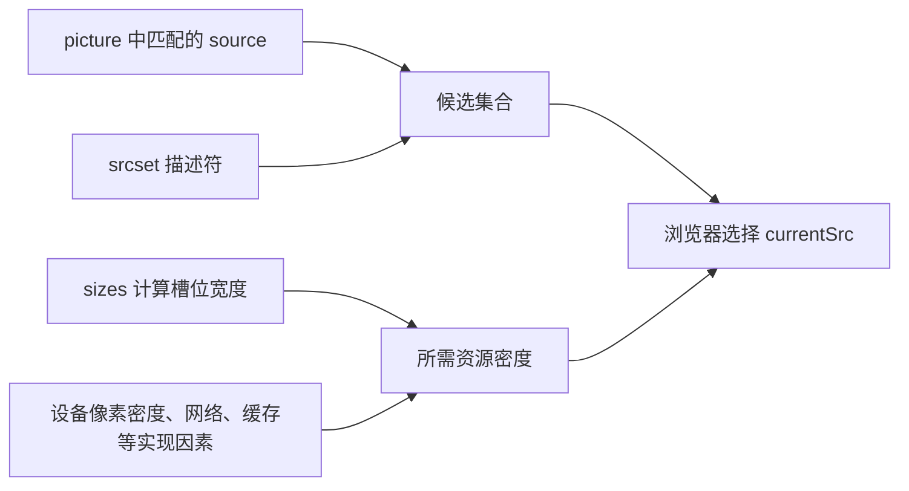

# 响应式图片、picture、srcset 与懒加载

## 是什么与为什么需要

`srcset` 提供候选资源，`sizes`描述图片槽位宽度，浏览器结合视口与像素密度选择候选；`picture/source` 用于艺术方向或格式切换；`loading="lazy"` 延迟非关键图加载。目标是降低传输、适配密度并控制裁切。

## 候选、槽位、艺术方向、格式和加载提示

- `w` 描述符声明资源固有宽度并与 `sizes` 配合；`x` 描述符用于固定槽位的像素密度候选。
- `picture` 按 source 顺序匹配媒体条件和类型，最终 `img` 提供语义与回退。
- 浏览器根据当前环境选择候选，开发者不能假设某个候选一定被下载。
- 图片显式 `width` 和 `height` 可建立宽高比，减少加载期间布局偏移。
- 首屏关键图通常不应懒加载，非关键图再使用 `loading="lazy"`。

## 浏览器选择候选的输入



`sizes` 描述图片在当前条件下预计占用的 CSS 像素宽度，不是图片文件宽度。浏览器用槽位宽度和 `w` 候选的固有宽度计算有效像素密度，再结合实现策略选择资源。

| 方案 | 适用条件 | 不能解决 |
| --- | --- | --- |
| `srcset` + `w` + `sizes` | 同一构图、不同像素宽度 | 不同裁切或内容重点 |
| `srcset` + `1x/2x` | CSS 槽位基本固定，只切换密度 | 复杂响应式槽位 |
| `picture` + `media` | 艺术方向，不同视口使用不同构图 | 仅靠格式压缩的全部策略 |
| `picture` + `type` | 为支持的浏览器提供现代格式 | `img` 仍必须提供回退与 alt |
| `loading="lazy"` | 推迟视口外非关键图片 | 首屏关键图和布局稳定性 |

## picture 与 srcset 的组合示例

```html
<picture>
  <source
    media="(max-width: 40rem)"
    srcset="hero-crop-480.avif 480w, hero-crop-800.avif 800w"
    sizes="100vw"
    type="image/avif"
  >
  <source
    srcset="hero-640.avif 640w, hero-1280.avif 1280w"
    sizes="(max-width: 70rem) 100vw, 60rem"
    type="image/avif"
  >
  
</picture>

```

`w` 描述符必须是资源固有宽度，搭配 `sizes`；固定 CSS 尺寸且仅适配密度时用 `1x/2x`。picture 内最终必须有 img 作为语义载体与回退。首屏关键图通常不懒加载；始终提供 width/height 减少布局偏移。

## 候选选择、重复下载与替代文本边界

浏览器选择是提示驱动，不保证每次换宽度重新下载。不要在同一候选混用 `w` 与 `x`。CSS/JS 替换可能在预加载扫描后造成重复下载。`alt` 描述内容，与响应式资源无关。

## currentSrc、固有比例与加载调度

可在控制台读取 `img.currentSrc`，并在 Network 禁用缓存后核对实际候选；现代格式切换应保留浏览器可用的回退资源。

`loading` 是提示而非精确调度接口。延迟加载依赖 JavaScript 可用是 HTML 标准中的隐私边界之一；浏览器可能按距离、资源优先级和环境决定实际加载时机。关键图片可通过正常文档发现、合理格式和尺寸优化，不应同时使用懒加载。

`width`、`height` 给浏览器提供固有比例；艺术方向候选比例不同时，可在对应 `source` 上提供尺寸属性，并在目标浏览器验证布局。CSS 应使用 `max-width: 100%; height: auto` 等规则防止替换元素溢出，同时避免无意拉伸。

## 完整案例：文章首图与相关推荐缩略图

输入是文章首图，桌面构图 16:9，移动端需要 4:3 裁切；每种构图有 AVIF 和 JPEG，并有多个宽度。相关推荐图在首屏下方。目标是首图及时加载、槽位稳定、浏览器获得合适候选，非关键缩略图延迟加载。

### 1. 准备真实候选数据

| 文件 | 固有尺寸 | 用途 |
| --- | ---: | --- |
| `hero-mobile-480.avif/jpg` | 480×360 | 窄屏 4:3 |
| `hero-mobile-800.avif/jpg` | 800×600 | 高密度窄屏 4:3 |
| `hero-800.avif/jpg` | 800×450 | 普通桌面 16:9 |
| `hero-1600.avif/jpg` | 1600×900 | 宽屏/高密度 16:9 |
| `related-640.jpg` | 640×360 | 视口外缩略图 |

`w` 描述符必须等于文件固有像素宽度。文件名中的数字不是证据，应使用图片工具或浏览器 naturalWidth 验证。

### 2. 完整 picture

```html
<picture>
  <source
    media="(max-width: 40rem)"
    type="image/avif"
    srcset="hero-mobile-480.avif 480w, hero-mobile-800.avif 800w"
    sizes="100vw"
    width="800"
    height="600"
  >
  <source
    media="(max-width: 40rem)"
    srcset="hero-mobile-480.jpg 480w, hero-mobile-800.jpg 800w"
    sizes="100vw"
    width="800"
    height="600"
  >
  <source
    type="image/avif"
    srcset="hero-800.avif 800w, hero-1600.avif 1600w"
    sizes="(max-width: 75rem) 100vw, 72rem"
  >
  
</picture>
```

浏览器按 source 顺序检查 media 和 type，匹配后从该候选集合选择；最终 img 提供语义、JPEG 回退和默认尺寸。首图不使用 loading=lazy。`fetchpriority="high"` 只是获取优先级提示，应只用于少量真正关键资源并通过性能数据验证。

### 3. CSS 槽位必须匹配 sizes

```css
picture, picture > img {
  display: block;
  max-inline-size: 72rem;
  inline-size: 100%;
}
picture > img {
  block-size: auto;
}
```

当视口不超过 75rem 时槽位接近 100vw，宽屏最大 72rem，与 sizes 一致。如果容器实际只有 50vw 而 sizes 写 100vw，浏览器可能选择过大的资源，造成额外传输。

### 4. 非关键图延迟加载

```html

```

`loading="lazy"` 请求延迟视口外图片，实际阈值由浏览器决定。`decoding="async"` 是解码提示，不保证某个时间点完成。始终提供尺寸，避免开始加载时页面跳动。

### 5. 可观察输出

在 Console 读取：

```js
const hero = document.querySelector('picture img');
console.table({
  currentSrc: hero.currentSrc,
  naturalWidth: hero.naturalWidth,
  naturalHeight: hero.naturalHeight,
  renderedWidth: hero.getBoundingClientRect().width,
});
```

不同视口、DPR、格式支持和缓存状态可能选择不同 currentSrc。验证目标是候选合理、无意外重复请求和清晰图像，不是强制某个设备始终选择固定文件。

### 6. 失败分支

把 `640w` 写在实际 1280 像素文件上会让选择算法依据错误密度；修正描述符而不是调整 CSS。混用 w 与 x 描述符使候选集合无效。缺少 sizes 时 w 集合采用规范默认槽位提示，常与复杂布局不符。

使用 CSS background-image 做信息首图会失去 img 替代文本和响应候选语义。移动裁切改变了图中信息时，所有候选仍需表达同一 alt 结论；若移动图传达不同信息，应重新设计内容而非只换资源。

### 7. 验收练习

在不同视口和 DPR 下禁用缓存刷新，记录 `currentSrc`、自然尺寸、显示尺寸、传输大小和布局移动。完成标准：候选描述符等于真实固有宽度；`sizes` 与 CSS 槽位一致；桌面和移动构图都保留核心信息；无重复下载；首屏图不懒加载；缩略图在需要前延迟；图片失败时 alt 可用；CLS 不由尺寸缺失造成。

## 来源

- [WHATWG HTML：Images](https://html.spec.whatwg.org/multipage/images.html) — 访问日期：2026-07-17
- [WHATWG HTML：Lazy loading attributes](https://html.spec.whatwg.org/multipage/urls-and-fetching.html#lazy-loading-attributes) — 访问日期：2026-07-17
- [MDN：Responsive images](https://developer.mozilla.org/en-US/docs/Web/HTML/Guides/Responsive_images) — 访问日期：2026-07-17
- [web.dev：Optimize Cumulative Layout Shift](https://web.dev/articles/optimize-cls) — 访问日期：2026-07-17
