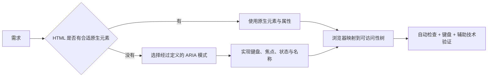

# ARIA 的使用边界：优先正确的原生元素

## 是什么与为什么需要

ARIA 通过 role、state、property 补充可访问性语义，主要用于 HTML 没有等价原生语义的复杂组件。它不会自动添加键盘行为、焦点管理、样式、校验或业务逻辑。

## Role、State、Property 与命名规则

ARIA 向可访问性 API 提供角色、状态和属性。它通常不改变 DOM 行为或视觉外观；错误语义可能覆盖原生元素本来正确的信息。



| 类别 | 例子 | 作者责任 |
| --- | --- | --- |
| role | `dialog`、`tab`、`status` | 角色必须允许用于该元素且符合实际交互 |
| state | `aria-expanded`、`aria-checked`、`aria-selected` | 每次 UI 状态变化都同步值 |
| property | `aria-controls`、`aria-describedby` | ID 引用必须存在且关系真实 |
| naming | `aria-labelledby`、`aria-label` | 名称应稳定、简洁，并优先保留可见文字 |

## 原生按钮控制展开区域

优先 `<button>` 而非 `<div role="button">`，优先 `<nav>` 而非 `<div role="navigation">`。原生语义不足时再补充：

```html
<button aria-expanded="false" aria-controls="filters">筛选条件</button>
<section id="filters" hidden>...</section>
<nav aria-label="页脚导航">...</nav>
```

同步展开状态的完整最小行为：

```js
const button = document.querySelector('[aria-controls="filters"]');
const panel = document.querySelector('#filters');

button.addEventListener('click', () => {
  const expanded = button.getAttribute('aria-expanded') === 'true';
  button.setAttribute('aria-expanded', String(!expanded));
  panel.hidden = expanded;
});
```

`aria-controls` 只声明控制关系，不会自动打开面板；`aria-expanded` 只暴露状态，不会隐藏内容；`hidden` 控制呈现，也不会自动更新按钮状态。三者必须由实现保持一致。

### 名称与描述优先级边界

`aria-labelledby` 通过元素 ID 引用可见或隐藏文本，适合组合现有标题；`aria-label` 直接提供字符串，可能覆盖元素内容形成的名称。不要给包含清楚文字的按钮随意添加不同 `aria-label`，否则视觉文字与语音输入/屏幕阅读器名称可能不一致。

`aria-hidden="true"` 会把元素及后代从可访问性树隐藏，但不会取消 DOM 焦点或阻止点击。不得让其后代仍能获得焦点。真正隐藏交互区域时，应同时使用与状态匹配的 HTML/CSS 机制并管理焦点。

ARIA 不得覆盖成与原生行为冲突的角色。状态必须与实际 UI 同步。每个交互组件需有可访问名称、正确键盘模式、焦点处理，并在真实浏览器与辅助技术组合中测试。

## 角色、键盘、aria-hidden 与名称覆盖边界

`role="button"` 不会响应 Space/Enter。`aria-hidden="true"` 不应放在仍可聚焦元素或其祖先上。名称、描述和内容不是一回事，不要滥用 `aria-label` 覆盖有用可见文本。“无 ARIA”优于错误 ARIA，但缺失必要语义也需修复。

## WAI-ARIA、ARIA in HTML 与 APG 的职责

APG 是实现模式指南而非规范或 UI 设计系统；规范符合不代表所有辅助技术实现一致。自动化检查只能覆盖部分问题，必须键盘和屏幕阅读器人工验证。

ARIA in HTML 规定角色和属性在 HTML 元素上的允许范围；WAI-ARIA 定义语义模型；APG 展示可用模式和键盘约定。三者职责不同。选择 APG 模式后仍需根据应用内容、浏览器和辅助技术组合验证。

## 完整案例：筛选面板中的原生语义与必要 ARIA

输入是商品列表页的“筛选条件”按钮、可隐藏面板、价格表单和结果状态。HTML 已有 button、form、label 等原生能力；ARIA 只补充控制关系、展开状态和动态结果通知。

### 1. 初始 HTML

```html
<button id="filter-toggle" type="button" aria-expanded="false" aria-controls="filters">
  筛选条件
</button>

<section id="filters" aria-labelledby="filters-title" hidden>
  <h2 id="filters-title">筛选条件</h2>
  <form>
    <label for="minimum-price">最低价格</label>
    <input id="minimum-price" name="minPrice" type="number" min="0" step="1">
    <button type="submit">应用筛选</button>
  </form>
</section>

<p id="result-status" role="status">共 24 件商品</p>
```

button 已有按钮角色、焦点和 Enter/Space 激活，不添加 `role="button"`。section 通过可见 h2 获得名称。label 提供输入名称。status 适合非紧急结果更新，不应被用来反复播报静态正文。

### 2. 同步展开状态

```js
const toggle = document.querySelector('#filter-toggle');
const panel = document.querySelector('#filters');

function setExpanded(expanded) {
  toggle.setAttribute('aria-expanded', String(expanded));
  panel.hidden = !expanded;
}

toggle.addEventListener('click', () => {
  setExpanded(toggle.getAttribute('aria-expanded') !== 'true');
});
```

状态不变量是 `aria-expanded="true"` 时 panel.hidden 为 false。`aria-controls` 只声明关系，不自动切换；hidden 控制呈现，不自动更新 ARIA。

字符串属性读取需要明确比较 `'true'`，不能用 `Boolean(getAttribute(...))`，因为字符串 `'false'` 也是真值。

### 3. 折叠前处理面板内焦点

如果用户在最低价格输入框中，外部逻辑直接折叠面板，焦点会留在被隐藏的后代或被浏览器重置。折叠前恢复到触发按钮：

```js
function closeFilters() {
  if (panel.contains(document.activeElement)) {
    toggle.focus();
  }
  setExpanded(false);
}
```

这不是 aria-expanded 自带功能。焦点管理属于组件行为，必须由应用实现并测试。

### 4. 更新结果状态

```js
const form = panel.querySelector('form');
const status = document.querySelector('#result-status');

form.addEventListener('submit', async (event) => {
  event.preventDefault();
  const params = new URLSearchParams(new FormData(form));
  const response = await fetch(`/api/products?${params}`);
  if (!response.ok) {
    status.textContent = '筛选失败，请重试。';
    return;
  }
  const data = await response.json();
  status.textContent = `共 ${data.total} 件商品`;
  closeFilters();
});
```

role=status 通常以礼貌方式通知文本变化。确定的 total 仍需运行时校验；失败分支给出可恢复反馈，不把错误伪装成 0 件商品。

### 5. 可观察输出

初始 Accessibility 树中按钮名称“筛选条件”、Expanded false；面板因 hidden 不暴露。激活后 Expanded true，面板、标题和表单出现；Tab 可进入输入和提交按钮。

执行：

```js
console.table({
  expanded: toggle.getAttribute('aria-expanded'),
  hidden: panel.hidden,
  controlsTargetExists: Boolean(document.getElementById(toggle.getAttribute('aria-controls'))),
  activeElement: document.activeElement?.id,
});
```

每个状态下 expanded 与 hidden 必须一致，controls 目标存在。关闭时 activeElement 应是 filter-toggle。

### 6. 为什么不使用自制按钮

```html
<div role="button" tabindex="0">筛选条件</div>
```

这段只增加角色和焦点，不提供 Space/Enter 完整行为、disabled 语义、表单边界和默认样式。实现者必须补齐所有行为，收益为零，因此原生 button 更合适。

同理，`nav role="navigation"` 通常重复，checkbox 不应改成 switch 只为视觉外观。角色必须与交互模型和用户预期一致。

### 7. 失败分支

将 `aria-hidden="true"` 放在仍含可聚焦输入的面板上会造成 DOM 可聚焦但辅助技术不可见的冲突。应使用 hidden/inert 等符合需求的机制，并确保焦点先移出。

给按钮添加 `aria-label="打开"` 会覆盖可见文字“筛选条件”，导致语音命令和视觉名称不一致。用可见文字作为名称，aria-expanded 表达状态，不把“已展开”硬编码进 label。

自动检查可能发现无效角色、缺失 ID 和名称，但不能证明键盘顺序、播报时机和业务结果正确。必须人工运行状态转换。

### 8. 验收练习

完成标准：按钮原生可激活；aria-expanded 与 hidden 始终相反；引用 ID 唯一存在；展开后表单可键盘完成；关闭时焦点恢复；成功与失败状态可感知；无冲突角色或名称覆盖；自动检查、Accessibility 树和人工键盘检查均通过。

## 来源

- [W3C：WAI-ARIA 1.2](https://www.w3.org/TR/wai-aria-1.2/) — 访问日期：2026-07-17
- [W3C：ARIA in HTML](https://www.w3.org/TR/html-aria/) — 访问日期：2026-07-17
- [W3C APG：Read Me First](https://www.w3.org/WAI/ARIA/apg/practices/read-me-first/) — 访问日期：2026-07-17
- [W3C APG：Providing Accessible Names and Descriptions](https://www.w3.org/WAI/ARIA/apg/practices/names-and-descriptions/) — 访问日期：2026-07-17
