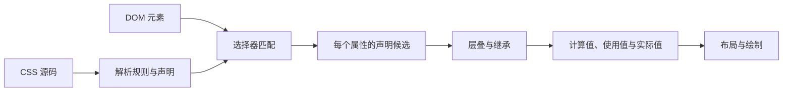

# 选择器、声明、单位、颜色、背景、边框与字体

CSS（Cascading Style Sheets）使用规则把元素映射到呈现属性。本文从零建立规则语法和值类型，并用一张商品卡片贯穿选择器、长度、颜色、背景、边框和字体。

## 1. CSS 规则怎样作用于元素



解析错误通常不会停止整个样式表。浏览器会按 CSS 错误处理规则丢弃无效声明或规则，继续解析后续内容。这让渐进增强成为可能，也意味着“页面有样式”不能证明每条声明都生效。

## 2. 规则、选择器与声明

```css
.product-card {
  color: #172033;
  padding: 1rem;
}
```

| 部分 | 示例 | 作用 |
| --- | --- | --- |
| 选择器 | `.product-card` | 选择 class 包含 product-card 的元素 |
| 声明块 | `{ ... }` | 包含零个或多个声明 |
| 属性 | `color` | 指定要设置的呈现特征 |
| 值 | `#172033` | 必须符合该属性定义的值语法 |
| 声明 | `color: #172033` | 属性、冒号、值和可选分号 |

最后一个声明的分号在普通声明块中通常可省略，项目代码仍统一保留，便于追加和生成 diff。CSS 注释使用 `/* ... */`，不能使用 JavaScript 的 `//`。

### 2.1 常用选择器

| 选择器 | 匹配对象 | 示例 |
| --- | --- | --- |
| 类型 | 指定元素名 | `button` |
| class | class token | `.card` |
| ID | 唯一 id | `#checkout` |
| 属性 | 属性存在或满足条件 | `input[required]`、`[data-state="open"]` |
| 伪类 | 元素状态或结构关系 | `:hover`、`:focus-visible`、`:first-child` |
| 伪元素 | 不直接来自 DOM 元素的生成盒/片段 | `::before`、`::selection` |

组合器描述关系：空格是后代，`>` 是子元素，`+` 是紧邻后续兄弟，`~` 是后续兄弟。选择器应表达稳定结构，避免依赖易变的深层 DOM 路径。

```css
.product-card > h2 { margin-block: 0; }
.product-card a:hover { text-decoration-thickness: 0.15em; }
input[required] + .hint { color: #667085; }
```

选择器匹配和层叠是不同步骤。某元素可同时匹配多条规则，最终声明由来源、重要性、层、优先级、作用域接近度和出现顺序等决定，详见下一篇。

## 3. 值、关键字与函数

CSS 属性定义自己的值语法。值可由关键字、数字、尺寸、百分比、颜色、字符串、URL 和函数组合。

```css
.panel {
  display: grid;
  opacity: 0.9;
  inline-size: min(100%, 40rem);
  background-image: url("pattern.svg");
}
```

全局关键字可用于大多数属性：

| 关键字 | 行为 |
| --- | --- |
| `initial` | 使用属性规范定义的初始值 |
| `inherit` | 明确使用父元素计算值 |
| `unset` | 继承属性表现为 inherit，非继承属性表现为 initial |
| `revert` | 回滚当前层叠来源的结果 |
| `revert-layer` | 回滚当前 cascade layer 的声明 |

它们不是字符串。属性不接受某个普通值时，整个声明在语法或计算阶段可能无效。

## 4. 长度与单位

CSS 长度由数字和单位组成；零长度可写 `0`。选择单位要根据参照对象，而不是统一使用一种单位。

| 单位 | 参照 | 常见用途与边界 |
| --- | --- | --- |
| `px` | CSS 参考像素 | 边框、图标和精确最小尺寸；不等于固定设备物理像素 |
| `em` | 通常相对当前元素字体尺寸；具体属性可能有特殊参照 | 让间距随组件字号缩放；嵌套字体会累乘 |
| `rem` | 根元素字体尺寸 | 全局间距和字号尺度，尊重用户字体设置 |
| `%` | 由具体属性定义参照 | inline-size 常相对包含块；不能跨属性推断 |
| `vw`、`vh` | 初始包含块视口尺寸 | 视口相关装饰；移动浏览器动态 UI 需考虑新视口单位 |
| `svh`、`lvh`、`dvh` | 小、大、动态视口高度 | 移动端全高布局，分别强调稳定最小、最大或实时变化 |
| `ch` | 字体中字符 `0` 的前进宽度 | 近似限制文本行宽，不代表任意字符数 |

字体不能只用固定 px 并阻止缩放。常用方式是根字号保留用户默认，正文使用 rem，局部图标/间距按组件需要选择 em。

### 4.1 数学函数

```css
.page-title {
  font-size: clamp(2rem, 1.4rem + 2vw, 3.5rem);
}
.layout {
  inline-size: min(100% - 2rem, 72rem);
  margin-inline: auto;
}
```

`min()` 取最小结果，`max()` 取最大结果，`clamp(min, preferred, max)` 把首选值限制在上下界。`calc()` 可组合兼容的尺寸，例如 `calc(100% - 2rem)`；不能相加不兼容类型。

## 5. 颜色

`color` 设置文本前景色，并可通过 `currentColor` 供边框、SVG 等使用。常见颜色语法：

```css
.message {
  color: #172033;
  border-color: currentColor;
  background-color: rgb(238 244 255 / 80%);
}
.warning { color: hsl(24 94% 35%); }
```

十六进制、rgb、hsl 等表示法可表达同一颜色空间中的颜色。带 alpha 的颜色是透明合成，不等于降低整个元素 `opacity`；后者会连同子内容一起合成变透明。

颜色不能作为状态的唯一信息。错误还需要文字或图标/结构，链接应有非颜色线索，前景与背景要验证对比度。系统颜色、`color-scheme` 和现代颜色空间会在主题专题展开。

## 6. 背景

元素可以拥有多层背景图和一个背景色。背景绘制在边框之内，不影响盒的几何尺寸，也不提供内容语义。

```css
.hero {
  background-color: #eef4ff;
  background-image: linear-gradient(90deg, rgb(21 94 239 / 15%), transparent), url("dots.svg");
  background-repeat: no-repeat, repeat;
  background-position: center, left top;
  background-size: cover, 1.5rem;
}
```

多层属性以逗号对应，从最前一层绘制在最上方。`background-size: cover` 保持图像比例并覆盖区域，可能裁切；`contain` 保持完整可见，可能留空。信息图片使用 HTML `img` 和替代文本，不用 CSS 背景承载。

`background` 简写会重置未写出的 background 长属性。修改一项时若不希望重置其他层，使用具体长属性。

## 7. 边框

边框由宽度、样式和颜色组成。没有非 `none` 的 border-style 时，即使写宽度也不会绘制可见边框。

```css
.card {
  border: 1px solid #d0d5dd;
  border-radius: 0.75rem;
}
```

border 在标准 content-box 模型中增加外部尺寸，在 `box-sizing: border-box` 中包含于声明尺寸。outline 不占布局空间，常用于焦点提示，不应为了外观把焦点 outline 删除。

逻辑边框 `border-inline-start` 等随书写模式映射物理方向，适合国际化布局。

## 8. 字体与文本基本属性

```css
body {
  font-family: system-ui, sans-serif;
  font-size: 1rem;
  line-height: 1.6;
}
h1 {
  font-size: 2.25rem;
  font-weight: 700;
  line-height: 1.2;
}
```

| 属性 | 作用 | 重要边界 |
| --- | --- | --- |
| `font-family` | 有序字体候选与通用族 | 字体名含空格时引用；末尾给通用族 |
| `font-size` | 字形尺寸基础 | 会影响 em、行盒和可读性 |
| `font-weight` | 字重值或关键字 | 实际可用字重取决于字体，浏览器可能合成 |
| `font-style` | normal/italic/oblique 等 | italic 字形与倾斜合成不是同一来源 |
| `line-height` | 行框高度 | 无单位数可按各后代字号计算，正文常更稳健 |
| `font` | 多个字体长属性简写 | 会重置未写字体属性，且语法要求关键字段 |

Web 字体涉及 `@font-face`、格式、加载和性能，不在本篇展开。字体加载失败时必须有可用回退，布局应容忍字形度量差异。

## 9. 完整案例：可响应的商品卡片

HTML 输入：

```html
<article class="product-card">
  <p class="product-card__eyebrow">键盘</p>
  <h2 class="product-card__title">Lili 机械键盘</h2>
  <p class="product-card__description">支持有线连接和可更换轴体。</p>
  <p class="product-card__price"><span class="visually-hidden">价格：</span>¥699</p>
  <a class="product-card__link" href="/products/keyboard">查看详情</a>
</article>
```

完整 CSS：

```css
:root {
  font-family: system-ui, sans-serif;
  color: #172033;
  background: #f5f7fb;
}
* { box-sizing: border-box; }
.product-card {
  inline-size: min(100%, 28rem);
  padding: clamp(1rem, 0.75rem + 1vw, 1.5rem);
  border: 1px solid #d0d5dd;
  border-radius: 1rem;
  background: linear-gradient(145deg, #fff, #eef4ff);
  box-shadow: 0 0.75rem 2rem rgb(23 32 51 / 10%);
}
.product-card__eyebrow {
  margin: 0 0 0.5rem;
  color: #155eef;
  font-size: 0.875rem;
  font-weight: 700;
  text-transform: uppercase;
  letter-spacing: 0.08em;
}
.product-card__title { margin: 0; font-size: clamp(1.5rem, 1.2rem + 1vw, 2rem); line-height: 1.2; }
.product-card__description { color: #475467; line-height: 1.6; }
.product-card__price { font-size: 1.5rem; font-weight: 700; }
.product-card__link {
  display: inline-block;
  padding: 0.65rem 1rem;
  border: 2px solid currentColor;
  border-radius: 0.5rem;
  color: #155eef;
  font-weight: 700;
}
.product-card__link:focus-visible { outline: 3px solid #f79009; outline-offset: 3px; }
.visually-hidden {
  position: absolute;
  inline-size: 1px;
  block-size: 1px;
  overflow: hidden;
  clip-path: inset(50%);
  white-space: nowrap;
}
```

### 9.1 可观察输出

卡片最大 28rem，窄容器占满可用宽度；内边距和标题字号在上下界内流动；背景渐变是装饰；链接保持原生语义并具有可见焦点。

DevTools Styles 应显示所有声明有效，Computed 可观察实际 font-family、font-size、inline-size 和颜色。把 `padding: 1rme` 故意写错后，该声明被丢弃并在 Styles 中标为无效，其他声明继续生效。

### 9.2 失败分支

- `font: 700 2rem system-ui` 缺少可选 line-height 仍可有效，但使用简写会重置 font-style 等长属性；不清楚重置范围时用长属性。
- `width: 100% - 2rem` 不是合法数学表达，必须写 `calc(100% - 2rem)`。
- 把商品名称放进 `background-image` 会丢失文本、翻译和辅助技术语义。
- 只用蓝色区分链接且去掉下划线可能使其难以识别；保留文字线索和焦点状态。
- 超长商品名可能换行，不能用固定高度裁掉内容而不给完整访问方式。

## 10. 调试、验证与练习

1. 在 Elements 确认选择器匹配目标节点。
2. 在 Styles 查看声明是否被划掉、无效或被覆盖。
3. 在 Computed 展开属性，找到最终值来源。
4. 在不同根字号、200% 缩放和窄容器下检查溢出。
5. 禁用背景图和 Web 字体，确认内容与布局仍可用。
6. 使用颜色对比检查工具验证文本、链接和焦点。

练习：为订单状态卡编写 normal、warning、error 三种状态。完成标准：CSS 语法检查通过；状态不只靠颜色；相对单位能随根字号缩放；背景图失败不丢信息；边框包含于预期尺寸；长文本和窄屏无裁切；所有交互焦点可见。

## 来源

- [W3C CSS Syntax Module Level 3](https://www.w3.org/TR/css-syntax-3/) — 访问日期：2026-07-17
- [W3C Selectors Level 4](https://www.w3.org/TR/selectors-4/) — 访问日期：2026-07-17
- [W3C CSS Values and Units Level 4](https://www.w3.org/TR/css-values-4/) — 访问日期：2026-07-17
- [W3C CSS Color Module Level 4](https://www.w3.org/TR/css-color-4/) — 访问日期：2026-07-17
- [W3C CSS Backgrounds and Borders Level 3](https://www.w3.org/TR/css-backgrounds-3/) — 访问日期：2026-07-17
