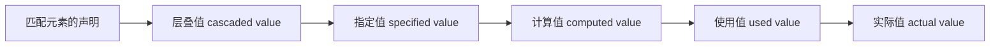

# Cascade、Specificity、Inheritance 与默认样式

CSS 层叠把同一元素同一属性的多个声明候选排序为一个胜出值；继承再决定子元素是否从父元素取得计算值。理解完整顺序后，样式覆盖可以通过设计层和选择器完成，不需要不断增加 `!important`。

## 1. 从声明值到实际值



层叠值来自排序胜出的声明；若没有胜出声明，指定值由继承或初始值产生。计算值会解析部分相对值，使用值在布局条件已知后确定，实际值可能受设备取整和实现限制影响。

DevTools 的 Computed 通常展示计算后或接近使用阶段的信息，具体展示方式由浏览器工具决定。

## 2. 层叠排序顺序

对同一属性的声明，不能只比较选择器。主要排序维度依次包括：

1. 来源与重要性。
2. 封装上下文。
3. style 属性。
4. cascade layer 顺序。
5. specificity。
6. scope proximity（使用 `@scope` 时）。
7. 出现顺序。

只有前一维相同才比较后一维。“后写覆盖前写”只在此前所有维度打平时成立。

### 2.1 来源与重要性

常见来源是用户代理、用户和作者。动画与过渡也在层叠中拥有特定位置。作者普通声明通常覆盖用户代理普通默认；用户重要声明可覆盖作者重要声明，确保用户可为可访问性建立必要样式。

`!important` 改变重要性排序，不是增加 specificity：

```css
.notice { color: red !important; }
#main .notice { color: blue; }
```

即使第二个选择器 specificity 更高，普通声明也不能越过作者 important。不要在应用样式中把 `!important` 当默认覆盖工具。

### 2.2 Cascade layers

```css
@layer reset, base, components, utilities;

@layer base {
  a { color: #155eef; }
}

@layer components {
  .button { color: white; background: #155eef; }
}
```

普通声明中，层顺序靠后的 layer 优先于靠前 layer，且这一比较发生在 specificity 之前。未分层的作者普通声明位于隐式末层，通常比命名层普通声明更强。

对 important 声明，layer 优先顺序反转，使基础层可以保护关键 important 约束。这个反转是重要声明覆盖机制的一部分，不能按普通层顺序推断。

## 3. Specificity 如何计算

常用记法按 ID、class/属性/伪类、类型/伪元素三列比较：

| 选择器 | specificity |
| --- | --- |
| `button` | 0-0-1 |
| `.button` | 0-1-0 |
| `[disabled]` | 0-1-0 |
| `.button:hover` | 0-2-0 |
| `#checkout .button` | 1-1-0 |
| `article > h2::before` | 0-0-3 |

按列从左到右比较，不转换成十进制总分。大量 class 不能“进位”成 ID。

### 3.1 `:is()`、`:not()`、`:has()` 与 `:where()`

`:is()`、`:not()`、`:has()` 本身不增加普通伪类权重，其参数列表中最具体的复杂选择器参与 specificity。`:where()` 及其参数 specificity 始终为 0，适合提供易覆盖默认值。

```css
:where(.prose) :where(h2, h3) { scroll-margin-block-start: 5rem; }
.prose h2 { scroll-margin-block-start: 7rem; }
```

第二条可以轻松覆盖第一条。选择器嵌套同样需要检查展开后的 specificity，不能只看缩进层级。

style 属性中的普通声明在其独立层叠位置优于普通样式规则；仍可被更高来源/重要性覆盖。项目应避免把可维护样式大量写进 style 属性。

## 4. 出现顺序与 `@scope`

当来源、重要性、层和 specificity 均相同，文档顺序靠后的声明胜出。独立 link 样式表按文档链接顺序组合，`@import` 按规范位置展开。

`@scope` 可定义作用域根和可选下界。在其他维度打平后，更靠近作用域根的声明可通过 scope proximity 胜出。该能力仍应按目标浏览器支持策略决定使用范围，不把实验性/变化中的行为当作所有环境通用约定。

## 5. 继承

继承发生在属性值层，不等于选择器“匹配后代”。常见继承属性包括 `color`、`font-family`、`font-size`、`line-height`；`margin`、`padding`、`border`、`background` 通常不继承。

```css
.card { color: #172033; font-family: system-ui, sans-serif; }
.card__title { color: inherit; }
```

子元素若自身有层叠胜出的 color，就不使用父元素 color。`inherit` 强制使用父元素计算值，即使该属性通常不继承。

### 5.1 全局关键字

| 值 | 指定值来源 |
| --- | --- |
| `inherit` | 父元素计算值 |
| `initial` | 属性规范初始值，不是浏览器默认样式表值 |
| `unset` | 继承属性用 inherit，其他用 initial |
| `revert` | 回退当前 origin 的级联结果 |
| `revert-layer` | 回退当前 layer 的结果 |

`all` 简写可把几乎所有属性设为这些全局值，但不会覆盖 direction 和 unicode-bidi。大范围重置会影响可访问性与组件状态，应明确恢复必要属性。

## 6. 用户代理默认样式

浏览器通常为 h1、p、button、input 等提供用户代理样式。默认 margin、字体和控件外观来自 UA 样式表，不是元素语义强制的固定设计。

`initial` 不等于“恢复浏览器默认”。例如某元素 UA 样式可能设置 display:block，而 display 的规范初始值是 inline。需要回退作者覆盖时更可能使用 revert，仍应验证目标属性和环境。

## 7. 完整案例：解释按钮颜色为何不是预期值

HTML：

```html
<section id="checkout" class="checkout theme-dark">
  <button class="button button--primary" type="button">支付 ¥99</button>
</section>
```

CSS 输入：

```css
@layer reset, base, components, utilities;

@layer base {
  body { color: #172033; font-family: system-ui, sans-serif; }
  button { color: inherit; font: inherit; }
}

@layer components {
  .theme-dark { color: #f9fafb; }
  .button { color: #172033; background: #e8eef8; }
  .button--primary { color: white; background: #155eef; }
}

@layer utilities {
  :where(.theme-dark) .button { color: #f9fafb; }
}
```

### 7.1 候选分析

按钮 color 候选：base 中 `button { color: inherit }`；components 中 `.button`、`.button--primary`；utilities 中 `:where(.theme-dark) .button`。

先比较 layer：utilities 普通声明晚于 components，因此 utilities 胜出，不需要比较其较低 specificity。按钮最终 color 为 #f9fafb。

如果删除 utilities 规则，components 内 `.button` 与 `.button--primary` specificity 都是 0-1-0，后写的 primary 胜出。base 的 inherit 先因 layer 较早失败，继承不是额外加权。

### 7.2 调试步骤

1. 在 Elements 选中按钮。
2. Styles 过滤 `color`，列出所有匹配和被覆盖声明。
3. 先记录每条声明的 origin、importance 和 layer。
4. 只有 layer 相同时再比较 specificity。
5. 在 Computed 展开 color，确认最终来源与计算值。
6. 临时禁用胜出声明，观察下一候选，不直接增加 `!important`。

### 7.3 继承验证

删除三个组件/工具层 color 后，base 的 `color: inherit` 胜出，按钮从 theme-dark 容器继承 #f9fafb。再删除 theme-dark，容器从 body 继承 #172033，按钮链式继承同一值。

### 7.4 失败分支

- 在 `.button` 加 `!important` 会跨过普通 layer 顺序，使以后主题覆盖困难。
- 增加 `#checkout .theme-dark .button.button--primary` 虽可提高 specificity，却让组件依赖页面 ID。
- 把工具层放在 components 前面会改变普通声明层优先级，需在入口集中声明 layer 顺序。
- 误以为 color initial 是父颜色会得到规范初始色，而不是继承；应使用 inherit。
- 重置 `all: unset` 会让 button 丢失许多默认呈现，需要完整重建，不适合作为随手修复。

## 8. 建议的层叠设计

项目可用低 specificity 基础规则、稳定命名层和显式组件状态。`:where()` 适合可覆盖默认容器，class 适合组件，ID 保留给片段/脚本不必进入样式。

第三方样式可放入较早 layer，使应用组件无需提高 specificity 就能覆盖。关键无障碍保护若使用 important，要在专用早期层定义并记录原因。

## 9. 验证与练习

练习建立 base、components、utilities 三层，包含默认链接、按钮组件和一个文字颜色工具类。为同一按钮制造至少四个 color 候选，逐项写出 origin、importance、layer、specificity 和 order。

完成标准：预测值与 DevTools 一致；删除胜出声明后能预测下一候选；不使用 ID 和无理由 important；能区分 inherit、initial、unset、revert、revert-layer；用户增大字体和高对比设置不会被作者重置破坏。

## 来源

- [W3C CSS Cascading and Inheritance Level 5](https://www.w3.org/TR/css-cascade-5/) — 访问日期：2026-07-17
- [W3C CSS Cascading and Inheritance Level 6](https://www.w3.org/TR/css-cascade-6/) — 访问日期：2026-07-17
- [W3C Selectors Level 4：Specificity](https://www.w3.org/TR/selectors-4/#specificity-rules) — 访问日期：2026-07-17
- [MDN：Cascade](https://developer.mozilla.org/en-US/docs/Web/CSS/Guides/Cascade/Introduction) — 访问日期：2026-07-17
- [MDN：Inheritance](https://developer.mozilla.org/en-US/docs/Web/CSS/Guides/Cascade/Inheritance) — 访问日期：2026-07-17
