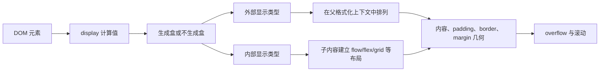

# Box Model、Normal Flow、display、溢出与滚动

CSS 布局把元素树转换为盒树。盒模型定义每个盒的内容、内边距、边框和外边距；normal flow 决定未脱离流的块级和行内内容如何排列；display 决定盒的外部与内部布局类型；overflow 决定内容超出边界时怎样裁剪或滚动。

## 1. 从元素到盒



一个元素通常生成主盒，但伪元素、列表标记、匿名盒和 display:contents 等会让 DOM 与盒树不是一一对应。语义和事件仍来自 DOM，不来自盒的外观。

## 2. 四个盒区域

从内向外依次是：

1. content box：文本、子盒或替换内容所在区域。
2. padding box：内容外围的内边距，背景通常延伸到这里。
3. border box：边框包围 padding。
4. margin box：与相邻盒保持外部距离；margin 透明。

```text
┌──────────── margin ────────────┐
│  ┌───────── border ─────────┐  │
│  │  ┌────── padding ─────┐  │  │
│  │  │      content       │  │  │
│  │  └────────────────────┘  │  │
│  └──────────────────────────┘  │
└────────────────────────────────┘
```

### 2.1 content-box 与 border-box

```css
.box {
  inline-size: 20rem;
  padding-inline: 1rem;
  border-inline: 0.25rem solid;
}
```

`box-sizing: content-box` 时，20rem 只指定 content inline-size，border box 为 `20 + 1×2 + .25×2 = 22.5rem`。`border-box` 时，声明的 20rem 包含 padding 和 border，content 剩 `17.5rem`，前提是尺寸足够容纳非内容区域。

常用全局设置：

```css
*, *::before, *::after { box-sizing: border-box; }
```

box-sizing 不继承，因此显式覆盖元素和伪元素。它不会使 margin 包含进声明尺寸，也不会自动解决 min-content 导致的溢出。

### 2.2 逻辑尺寸与边距

`inline-size`、`block-size` 随书写模式映射；水平中文中通常对应 width、height。`margin-inline`、`padding-block` 等可避免把布局硬编码为 left/right。

百分比 padding/margin 的参照由规范定义，不能凭属性方向直觉推断。DevTools Box Model 可显示最终像素使用值。

## 3. Normal Flow

未浮动、未绝对定位且未被特定布局接管的内容按 normal flow 排列。块格式化中块级盒通常沿 block 方向依次排列；行内格式化中行内盒和文本形成 line boxes 并在允许位置换行。

```html
<h2>订单</h2>
<p>订单状态：<strong>已支付</strong>，预计明日发货。</p>
```

h2 和 p 通常生成块级盒，先后排列；strong 在 p 的行内格式化上下文中随文字排列。默认样式可变，但内容顺序来自 DOM。

### 3.1 Margin collapsing

块布局中的相邻 block-axis margin 在特定条件下会折叠，不是简单相加。父子之间没有 border/padding/inline content 分隔时也可能折叠；空块自身上下 margin 也可能折叠。

```css
h2 { margin-block-end: 2rem; }
p { margin-block-start: 1rem; }
```

在可折叠场景中间距通常取折叠结果而非 3rem。负 margin 参与规则时结果更复杂。Flex/grid items 的 margin 不按普通块 margin 折叠。

设计垂直节奏可让容器用 `display: flow-root`、padding 或 `gap` 建立明确边界，但不要为了“阻止折叠”随意添加不可见 border。

## 4. `display` 的外部和内部类型

| 写法 | 外部类型 | 内部类型 | 典型含义 |
| --- | --- | --- | --- |
| `block` | block | flow | 独占块方向位置，子内容普通流 |
| `inline` | inline | flow | 参与行内格式化 |
| `inline-block` | inline | flow-root | 整体随行，内部独立格式化 |
| `flex` | block | flex | 块级 flex 容器 |
| `inline-flex` | inline | flex | 行内级 flex 容器 |
| `grid` | block | grid | 块级 grid 容器 |
| `flow-root` | block | flow-root | 新建块格式化上下文 |
| `none` | 不生成盒 | — | 元素及后代不参与布局 |
| `contents` | 主盒不生成 | 子项按外层布局 | DOM 元素仍存在，实现可访问性需测试 |

现代双关键字可写 `display: inline flex`，传统 `inline-flex` 是兼容的 legacy 单值形式。改变 display 不改变 HTML 元素语义。

### 4.1 `display: none`、`visibility` 与 `opacity`

| 技术 | 占布局 | 可见绘制 | 通常可聚焦/可访问 |
| --- | --- | --- | --- |
| `display:none` | 否 | 否 | 否 |
| `visibility:hidden` | 是 | 否 | 否 |
| `opacity:0` | 是 | 否（完全透明） | 仍可能交互和聚焦 |

透明不是隐藏语义。使用 opacity:0 隐藏交互控件会制造不可见焦点目标，除非它属于经过验证的可访问模式。

## 5. Overflow

overflow 描述盒内容超出边缘。`overflow-x` 和 `overflow-y` 可分别控制物理轴，逻辑版本逐步发展中需按兼容性决定。

| 值 | 行为 |
| --- | --- |
| `visible` | 通常不裁剪，内容可绘制到盒外；不建立滚动容器 |
| `hidden` | 在 padding box 裁剪，程序仍可能滚动；建立滚动容器 |
| `clip` | 裁剪且禁止程序滚动，不单独建立格式化上下文 |
| `scroll` | 建立滚动容器并总是提供滚动机制，具体滚动条受平台影响 |
| `auto` | 超出时提供滚动机制 |

当一个轴不是 visible/clip 且另一个轴为 visible/clip 时，计算值会按规范调整。不要只看单个声明推断最终行为。

设置非 visible/clip overflow 通常建立新的 block formatting context，防止浮动内容反复重排滚动区域。

### 5.1 滚动区域的可用性

固定 block-size 加 overflow:auto 可以创建内部滚动，但会形成嵌套滚动体验。滚动区域需要明确边界、可通过键盘/触控滚动，焦点内容不能被裁剪。长文档优先让页面自然增长。

`overflow:hidden` 不应作为清除未知溢出的默认修复；它可能裁掉长文本、焦点 outline、下拉浮层和放大后的内容。先找到实际超宽来源。

## 6. 完整案例：可滚动订单表与自适应卡片

HTML：

```html
<section class="orders" aria-labelledby="orders-title">
  <h2 id="orders-title">最近订单</h2>
  <div class="orders__scroll" tabindex="0" aria-label="最近订单表，可横向滚动">
    <table>
      <thead><tr><th>订单号</th><th>商品</th><th>金额</th><th>状态</th></tr></thead>
      <tbody>
        <tr><td>A1024</td><td>机械键盘与可更换轴体套装</td><td>¥699</td><td>已支付</td></tr>
      </tbody>
    </table>
  </div>
</section>
```

CSS：

```css
*, *::before, *::after { box-sizing: border-box; }
.orders {
  inline-size: min(100% - 2rem, 60rem);
  margin-inline: auto;
  padding: 1rem;
  border: 1px solid #d0d5dd;
  border-radius: 0.75rem;
  background: white;
}
.orders__scroll {
  max-inline-size: 100%;
  overflow-x: auto;
  border: 1px solid #e4e7ec;
}
.orders__scroll:focus-visible { outline: 3px solid #f79009; outline-offset: 3px; }
table { inline-size: 100%; min-inline-size: 42rem; border-collapse: collapse; }
th, td { padding: 0.75rem 1rem; border-block-end: 1px solid #e4e7ec; text-align: start; }
```

### 6.1 尺寸计算

orders 使用 border-box 全局规则，最大 60rem 且窄屏保留两侧 1rem。table 最小 42rem；容器窄于此值时只有 `.orders__scroll` 横向滚动，body 不应产生横向溢出。

### 6.2 可观察结果

宽视口下表格填满容器；390px 视口下滚动容器 clientWidth 小于 scrollWidth。Console 验证：

```js
const scroller = document.querySelector('.orders__scroll');
console.table({ clientWidth: scroller.clientWidth, scrollWidth: scroller.scrollWidth, canScroll: scroller.scrollWidth > scroller.clientWidth });
```

键盘聚焦滚动区后可使用方向键/触控板滚动，焦点环可见。具体键盘滚动行为受浏览器平台影响，仍需实测。

### 6.3 失败分支

- 给 body 写 `overflow-x:hidden` 会隐藏页面级问题，不能证明表格容器正确。
- 把 table 改成 `display:block` 可能影响表格布局和可访问性；滚动应放在外层容器。
- 固定 `.orders { height:20rem }` 会在字体放大、错误提示加入时裁切；让内容自然增长。
- 忘记 `min-inline-size:0` 的 flex/grid 子项可能拒绝收缩并推动页面超宽；在对应布局上下文修正最小尺寸。
- focus outline 被 overflow 裁切时，调整 outline-offset/容器 padding 或焦点设计，不直接删除 outline。

## 7. DevTools 调试路径

1. 选择异常元素，在 Computed 查看 display、box-sizing、尺寸和 overflow。
2. 用 Box Model 查看 content/padding/border/margin 使用值。
3. 比较 `getBoundingClientRect()`、clientWidth、scrollWidth。
4. 临时禁用固定尺寸，判断溢出来自内容还是约束。
5. 检查祖先 flex/grid 的 min-size 和包含块。
6. 在 200% 缩放、长文本和窄屏下复现。
7. 只在确定需要时建立嵌套滚动区。

## 8. 练习与完成标准

创建通知列表：列表自然增长，但最多显示区域可选为 20rem 高并滚动。加入一条 200 字无空格字符串和一个可聚焦链接。

完成标准：能计算 content-box 与 border-box 外部尺寸；说明哪些 margin 会折叠；页面无意外横向滚动；滚动区域键盘可达且焦点不裁切；200% 缩放内容仍可访问；隐藏方案不会留下不可见焦点；DevTools 测量与手工计算一致。

## 来源

- [W3C CSS Box Model Level 4](https://www.w3.org/TR/css-box-4/) — 访问日期：2026-07-17
- [W3C CSS Display Level 4](https://www.w3.org/TR/css-display-4/) — 访问日期：2026-07-17
- [W3C CSS Overflow Level 3](https://www.w3.org/TR/css-overflow-3/) — 访问日期：2026-07-17
- [W3C CSS 2.2：Visual formatting model](https://www.w3.org/TR/CSS22/visuren.html) — 访问日期：2026-07-17
- [W3C CSS Sizing Level 3](https://www.w3.org/TR/css-sizing-3/) — 访问日期：2026-07-17
