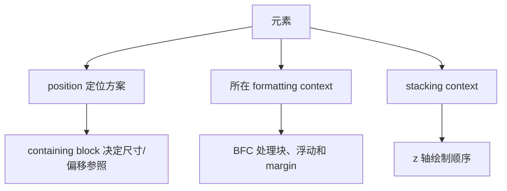

# Position、Containing Block、BFC 与 Stacking Context

定位问题必须同时回答三个问题：元素使用哪种定位方案，偏移和百分比相对哪个 containing block，元素属于哪个 stacking context。BFC 解决的是块布局隔离，不等于堆叠上下文。

## 1. 四个相邻概念



- Position 决定元素在 normal flow 中保留位置还是脱离流，以及 inset 是否参与定位。
- Containing block 是尺寸和定位计算的参照矩形，不一定是 DOM 父元素。
- Block formatting context 是块布局环境，影响浮动、margin 折叠和高度包含。
- Stacking context 是原子堆叠分组，后代无法用任意 z-index 跳出祖先分组。

## 2. `position` 值

| 值 | 是否保留正常流位置 | inset 参照与行为 |
| --- | --- | --- |
| `static` | 是 | inset 不用于普通定位 |
| `relative` | 是 | 相对自身正常位置偏移；原位置仍占空间 |
| `absolute` | 否 | 相对其绝对定位 containing block |
| `fixed` | 否 | 通常相对视口；特定祖先可建立 containing block |
| `sticky` | 是 | 达到阈值后相对最近滚动机制和 containing block 黏附 |

`inset-block-start`、`inset-inline-end` 等逻辑 inset 比 top/right 更能适配书写方向。若同一轴两侧 inset 与尺寸同时约束，规范按 direction 等规则解决过度约束。

### 2.1 Relative

```css
.icon { position: relative; inset-block-start: 0.1em; }
```

视觉移动不会让后续元素填补原位置，也不会改变 normal flow 为其他盒预留的空间。不要用大量 relative 偏移模拟布局。

### 2.2 Absolute

```css
.card { position: relative; }
.badge { position: absolute; inset-block-start: 0.5rem; inset-inline-end: 0.5rem; }
```

relative card 建立常用定位参照，badge 脱离流。若 badge 文案变长，它可能覆盖正文；父元素不会因 absolute 后代自动增高。

### 2.3 Fixed

fixed 通常相对 layout viewport。transform、perspective、filter、contain 等祖先在规定条件下可为 fixed/absolute 后代建立 containing block，使“固定”元素跟随祖先。移动浏览器的视觉视口、软键盘和安全区域还需实机验证。

### 2.4 Sticky

```css
.table-header { position: sticky; inset-block-start: 0; }
```

至少需要一个非 auto inset 才有对应轴的黏附阈值。sticky 在其 containing block 范围内受限，并参考最近拥有滚动机制的祖先；该祖先不一定实际发生滚动。祖先 overflow、尺寸不足和布局拉伸都可能使黏附看似失效。

## 3. Containing Block

普通 static/relative 元素的 containing block 通常由最近块容器或格式化上下文祖先的 content box 建立。absolute 元素寻找最近建立绝对定位 containing block 的祖先，常见是 position 非 static 的祖先；fixed 通常使用固定定位 containing block。

百分比 width、height、padding、margin 和 inset 的参照由各属性定义。父元素是 DOM 父节点不代表所有百分比都直接相对它。

```js
const badge = document.querySelector('.badge');
console.log(badge.offsetParent);
console.log(badge.getBoundingClientRect());
```

`offsetParent` 可提供调试线索，但不等于所有规范 containing block 情况的完整 API。结合 DevTools layout/geometry 检查。

## 4. Block Formatting Context

BFC 内部块在该环境中布局；浮动不会侵入另一个 BFC，BFC 会包含内部浮动，内部与外部 block margin 不折叠。

常见创建方式包括：

- 根元素。
- float 非 none。
- position 为 absolute/fixed。
- display:inline-block。
- overflow 非 visible/clip 的块。
- display:flow-root。
- flex/grid item（在特定条件下）。
- contain:layout/content/paint 等规定值。

如果目的只是建立 BFC，`display: flow-root` 最直接，不会像 `overflow:hidden` 一样顺带裁剪内容或制造滚动容器。

```css
.article { display: flow-root; }
.article img { float: inline-start; margin-inline-end: 1rem; }
```

article 会包含浮动图片的高度，外部后续内容不会环绕进入。

## 5. Stacking Context

Stacking context 内部元素先排序，整个结果再作为一个原子单元参与父 context。常见创建条件包括根元素、定位且 z-index 非 auto、fixed/sticky、opacity 小于 1、transform/filter 非 none、isolation:isolate、部分 contain/will-change 和 flex/grid item 带非 auto z-index。

`z-index` 只在所属堆叠体系中比较，不是页面全局数字。子元素 `z-index:999999` 仍无法越过祖先 context 在父 context 中的较低层级。

### 5.1 常见绘制分组

一个 stacking context 中会按背景/边框、负 z-index、普通流内容、定位 auto/0、正 z-index 等规则绘制。完整顺序存在多个类别，调试时应看浏览器 stacking context 工具，而不是用简化口诀处理所有盒。

### 5.2 `isolation:isolate`

```css
.component { isolation: isolate; }
.component__decoration { position: absolute; z-index: -1; }
```

isolation 明确建立组件内部堆叠边界，负 z-index 装饰不会跑到组件祖先背景之后。建立 context 也意味着后代不能跨出，需按组件需求使用。

## 6. 完整案例：Sticky 表头、角标与模态层级

HTML：

```html
<main class="page">
  <article class="card">
    <span class="card__badge">新</span>
    <h2>订单报告</h2>
    <p>查看最近 30 天数据。</p>
  </article>
  <section class="report">
    <h2 class="report__title">订单列表</h2>
    <div class="report__scroll"><table><!-- 表头和数据行 --></table></div>
  </section>
</main>
<dialog id="help"><h2>帮助</h2><button>关闭</button></dialog>
```

CSS：

```css
.card { position: relative; isolation: isolate; padding: 1.5rem; }
.card__badge { position: absolute; inset: 0.5rem 0.5rem auto auto; z-index: 1; }
.report__scroll { max-block-size: 20rem; overflow: auto; }
.report thead { position: sticky; inset-block-start: 0; z-index: 1; background: white; }
dialog { border: 0; border-radius: 1rem; }
dialog::backdrop { background: rgb(0 0 0 / 50%); }
```

### 6.1 角标参照

card 的 position:relative 使 absolute badge 以 card padding box 为常见参照。删除 relative 后，badge 可能寻找更远祖先甚至初始 containing block。用 getBoundingClientRect 比较位置。

### 6.2 Sticky 表头

report__scroll 是滚动容器，thead sticky 阈值为其 block-start。表头需要不透明背景，否则滚动内容在其下方可见。z-index 只需在当前表格局部上下文足够，不使用任意巨大数字。

### 6.3 Dialog top layer

通过 `showModal()` 打开的 dialog 进入 top layer，不应尝试用普通 z-index 与它竞争。Top layer 顺序由添加顺序等规则管理。自制 fixed 遮罩不自动获得模态、焦点和 inert 背景行为。

### 6.4 可观察验证

1. 滚动 report__scroll，表头保持在容器顶部并在容器底部停止。
2. 改变 card 位置，badge 始终相对卡片右上角。
3. 打开 dialog，覆盖普通卡片与 sticky 表头。
4. DevTools 检查 card isolation context、thead sticky 和滚动容器。
5. Console 比较 `scrollTop`、表头/容器 rect。

```js
const scroller = document.querySelector('.report__scroll');
const head = document.querySelector('.report thead');
console.table({ scrollTop: scroller.scrollTop, scrollerTop: scroller.getBoundingClientRect().top, headTop: head.getBoundingClientRect().top });
```

### 6.5 失败分支

- sticky 不动：检查 inset、滚动祖先、可滚动空间和祖先 overflow，不先加 z-index。
- 表头被内容盖住：检查 stacking context 与背景，再设置局部 z-index。
- fixed 工具栏跟着 transformed wrapper：祖先建立了 fixed containing block；将工具栏移到正确 DOM/架构层或调整 transform。
- dropdown 被祖先 overflow 裁剪：z-index 不能突破裁剪；使用 top layer/popover 或重构容器。
- 浮动溢出父高度：用 flow-root 建 BFC，不用 hidden 造成裁剪。

## 7. 调试顺序

1. 在 Elements 确认实际 DOM 祖先。
2. 读取 position、inset 和尺寸计算值。
3. 找 containing block 和 scroll container。
4. 列出创建 BFC/stacking context 的祖先属性。
5. 暂停 transform、opacity、overflow 等可疑声明验证假设。
6. 检查 top layer，而不是只改 z-index。
7. 在窄屏、缩放、长内容和键盘焦点下复测。

## 8. 练习与完成标准

实现一张带 absolute 状态角标的卡片、内部可滚动且 sticky 表头的表格、一个原生 popover。完成标准：能指出每个定位元素的 containing block；BFC 的创建理由明确；所有 stacking context 有必要；z-index 使用局部小尺度；sticky 在真实滚动容器工作；浮层不被 overflow 裁切；焦点顺序和可见性正确。

## 来源

- [W3C CSS Positioned Layout Level 3](https://www.w3.org/TR/css-position-3/) — 访问日期：2026-07-17
- [W3C CSS 2.2：Containing blocks](https://www.w3.org/TR/CSS22/visudet.html#containing-block-details) — 访问日期：2026-07-17
- [W3C CSS 2.2：Block formatting contexts](https://www.w3.org/TR/CSS22/visuren.html#block-formatting) — 访问日期：2026-07-17
- [W3C CSS 2.2：Stacking contexts](https://www.w3.org/TR/CSS22/zindex.html) — 访问日期：2026-07-17
- [WHATWG HTML：Top layer](https://html.spec.whatwg.org/multipage/interaction.html#top-layer) — 访问日期：2026-07-17
