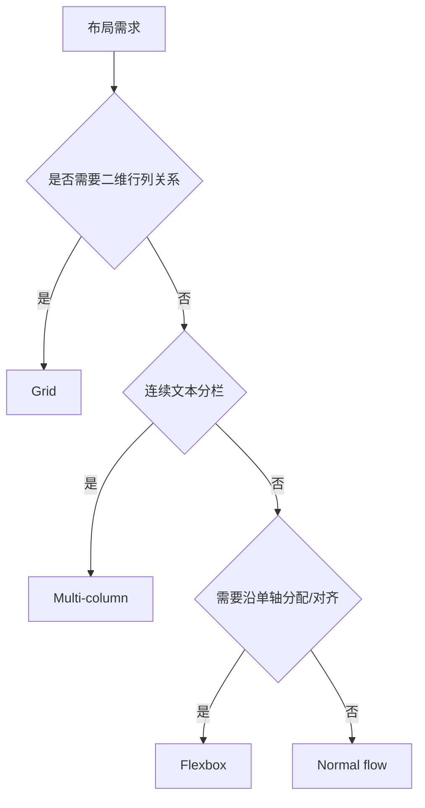

# Flexbox、Grid、多列布局与居中

Flexbox 按一个主轴分配空间并在交叉轴对齐；Grid 同时定义行列轨道；Multi-column 让连续内容在多个栏中分片流动。居中不是独立布局系统，必须先确定容器、轴和参与布局的盒。

## 1. 选择布局系统

| 问题 | 首选 | 原因 |
| --- | --- | --- |
| 工具栏、按钮组、单行/单列卡片 | Flexbox | 内容驱动的一维分配 |
| 页面区域、卡片矩阵、行列对齐 | Grid | 二维轨道和区域 |
| 报刊式连续长文本 | Multi-column | 内容自动从一栏流向下一栏 |
| 普通段落与块顺序 | Normal flow | 无需额外布局复杂度 |



## 2. Flexbox

`display:flex` 建立块级 flex formatting context，直接子盒成为 flex items。主轴由 `flex-direction` 决定，不固定等于水平方向。

### 2.1 容器属性

| 属性 | 作用 | 常用值 |
| --- | --- | --- |
| `flex-direction` | 主轴方向 | row、row-reverse、column、column-reverse |
| `flex-wrap` | 是否换行 | nowrap、wrap、wrap-reverse |
| `flex-flow` | direction 与 wrap 简写 | `row wrap` |
| `justify-content` | 主轴剩余空间分配 | start、center、space-between 等 |
| `align-items` | 每一行交叉轴默认对齐 | stretch、start、center、baseline |
| `align-content` | 多行整体在交叉轴分配 | 只有交叉轴有剩余空间且多行时有意义 |
| `gap` | 行/列之间的槽 | 不在外边缘增加间距 |

`justify-content` 不总是水平，`align-items` 不总是垂直。先画出主轴和交叉轴。

### 2.2 Item 尺寸分配

`flex` 简写组合 grow、shrink、basis：

```css
.sidebar { flex: 0 0 16rem; }
.content { flex: 1 1 30rem; min-inline-size: 0; }
```

- flex-basis 是主轴尺寸分配的起点；auto 会查看主尺寸属性或内容。
- flex-grow 按 grow factor 分配正自由空间，不表示元素最终宽度的直接比例。
- flex-shrink 在负自由空间中结合缩放基数分配收缩。
- 默认自动最小尺寸可能采用 min-content，使长文本/图片阻止收缩；常需在内容项设 `min-inline-size:0`。

`order` 只改变视觉/绘制布局顺序，不应造成与 DOM 阅读、焦点顺序冲突。把正确 DOM 顺序作为基础。

## 3. Grid

Grid 容器定义显式/隐式轨道；items 按 grid lines、areas 或自动放置算法进入网格。

```css
.dashboard {
  display: grid;
  grid-template-columns: 16rem minmax(0, 1fr);
  grid-template-areas: "sidebar main";
  gap: 1rem;
}
.sidebar { grid-area: sidebar; }
.main { grid-area: main; }
```

### 3.1 轨道尺寸

| 值/函数 | 含义 |
| --- | --- |
| `auto` | 按自动轨道算法，根据内容和可用空间决定 |
| 固定/相对长度 | 例如 16rem、25% |
| `fr` | 分配剩余空间的 flex factor |
| `minmax(min,max)` | 轨道下限和上限 |
| `min-content` | 内容不发生可选换行时的最小贡献 |
| `max-content` | 内容不换行时的理想贡献 |
| `fit-content()` | 按内容贡献并受参数上限约束 |

`1fr` 的轨道仍可能受 item 自动最小尺寸影响。`minmax(0,1fr)` 允许轨道缩到 0 下限，内容溢出再由 item 自身处理。

### 3.2 自动响应列

```css
.gallery {
  display: grid;
  grid-template-columns: repeat(auto-fit, minmax(min(100%, 14rem), 1fr));
  gap: 1rem;
}
```

auto-fit 会折叠空的重复轨道，现有 items 拉伸填充；auto-fill 保留可容纳的空轨道。`min(100%,14rem)` 防止容器窄于 14rem 时最小值推出横向溢出。

### 3.3 对齐

justify-items/justify-self 对齐 inline 轴，align-items/align-self 对齐 block 轴，place-items 是二者简写。justify-content/align-content 分配整个 grid 在容器中的额外空间。

## 4. Multi-column

```css
.article {
  column-width: 18rem;
  column-gap: 2rem;
  column-rule: 1px solid #d0d5dd;
}
.article h2 { break-after: avoid; }
```

浏览器根据可用宽度和 column-width 计算栏数，内容依次填充。`column-count` 可请求栏数；同时提供 width 与 count 时共同约束。

Multi-column 适合连续阅读文本，不适合要求各卡片严格同行对齐的网格。窄视口通常自然退为一栏。交互控件跨栏、长滚动和阅读顺序要实际测试。

`column-span:all` 可让元素横跨所有栏，但会打断分栏流。break-before/after/inside 提供分片提示，不保证所有内容在所有条件绝不分开。

## 5. 居中方法

### 5.1 块容器水平居中

```css
.page { inline-size: min(100% - 2rem, 72rem); margin-inline: auto; }
```

需要非 auto 的可用 inline-size；auto margin 分配剩余空间。

### 5.2 单项双轴居中

```css
.empty-state { display:grid; place-items:center; min-block-size:20rem; }
```

### 5.3 Flex 组对齐

```css
.dialog-actions { display:flex; justify-content:center; align-items:center; gap:.75rem; }
```

不要用 absolute + transform 居中普通内容，除非确实需要脱离 flow；长文本和动态尺寸更适合 flex/grid。

## 6. 完整案例：响应式产品页

HTML：

```html
<main class="product-layout">
  <aside class="filters"><h2>筛选</h2><!-- 表单 --></aside>
  <section class="results" aria-labelledby="results-title">
    <header class="results__header"><h1 id="results-title">键盘</h1><button>排序</button></header>
    <div class="product-grid">
      <article class="product-card"><h2>机械键盘 A</h2><p>¥699</p></article>
      <article class="product-card"><h2>机械键盘 B</h2><p>¥899</p></article>
      <article class="product-card"><h2>机械键盘 C</h2><p>¥1099</p></article>
    </div>
  </section>
</main>
```

CSS：

```css
.product-layout {
  display: grid;
  grid-template-columns: 16rem minmax(0, 1fr);
  gap: 1.5rem;
  inline-size: min(100% - 2rem, 80rem);
  margin-inline: auto;
}
.results { min-inline-size: 0; }
.results__header { display:flex; align-items:center; justify-content:space-between; gap:1rem; flex-wrap:wrap; }
.product-grid { display:grid; grid-template-columns:repeat(auto-fit,minmax(min(100%,15rem),1fr)); gap:1rem; }
.product-card { display:grid; grid-template-rows:subgrid; grid-row:span 2; gap:.5rem; padding:1rem; border:1px solid #ddd; }
@media (max-width: 48rem) { .product-layout { grid-template-columns:1fr; } }
```

### 6.1 处理过程

页面需要 filters/results 二维区域，外层用 Grid。标题和排序是一维工具栏，用 Flex。卡片数量不定且需要自适应列，用 repeat/auto-fit Grid。minmax(0,1fr) 与 results min-inline-size:0 允许长内容收缩。

subgrid 让卡片内部标题/价格轨道参考父 grid 的轨道，但使用前应按目标兼容策略验证；不支持时可用普通 grid/flex 回退，内容仍完整。

### 6.2 可观察输出

宽屏为侧栏+内容，卡片按可用宽度形成多列；小于 48rem 时单列，DOM 顺序保持筛选后结果。results header 文案长时换行，不溢出。

DevTools Grid overlay 检查轨道和 gap，Flex overlay 检查主轴。Console 测量各 card rect，确认同一行轨道对齐。

### 6.3 失败分支

- 使用 `grid-template-columns:repeat(3,1fr)` 在极窄屏仍强制三列；用断点或 auto-fit。
- card min-content 推宽轨道；使用可换行文本、minmax(0,1fr) 与 item min-inline-size:0。
- 用 order 把 results 视觉提前会与 DOM/焦点不一致；修改 DOM 和响应布局。
- 多列布局放卡片会产生难预测的竖向分片；卡片集合用 Grid。
- `height:100vh` 居中空状态可能在移动 UI/放大时裁切；使用 min-block-size 和适当视口单位。

## 7. 验证与练习

在 320、768、1280 CSS px 视口和 200% 缩放测试；加入超长无空格字符串、长按钮文案、1/2/20 张卡片；关闭 CSS 检查 DOM 顺序；键盘遍历确认视觉与焦点顺序一致。

练习构建文档库：外层 Grid 导航+正文，正文标题工具栏用 Flex，文章正文在宽屏可选双栏。完成标准：选择布局理由明确；无固定卡片数量假设；min-content 不制造页面溢出；gap 统一；分栏只用于连续文本；所有居中内容在长文案和放大时可见。

## 来源

- [W3C CSS Flexible Box Layout Level 1](https://www.w3.org/TR/css-flexbox-1/) — 访问日期：2026-07-17
- [W3C CSS Grid Layout Level 2](https://www.w3.org/TR/css-grid-2/) — 访问日期：2026-07-17
- [W3C CSS Multi-column Layout Level 1](https://www.w3.org/TR/css-multicol-1/) — 访问日期：2026-07-17
- [W3C CSS Box Alignment Level 3](https://www.w3.org/TR/css-align-3/) — 访问日期：2026-07-17
