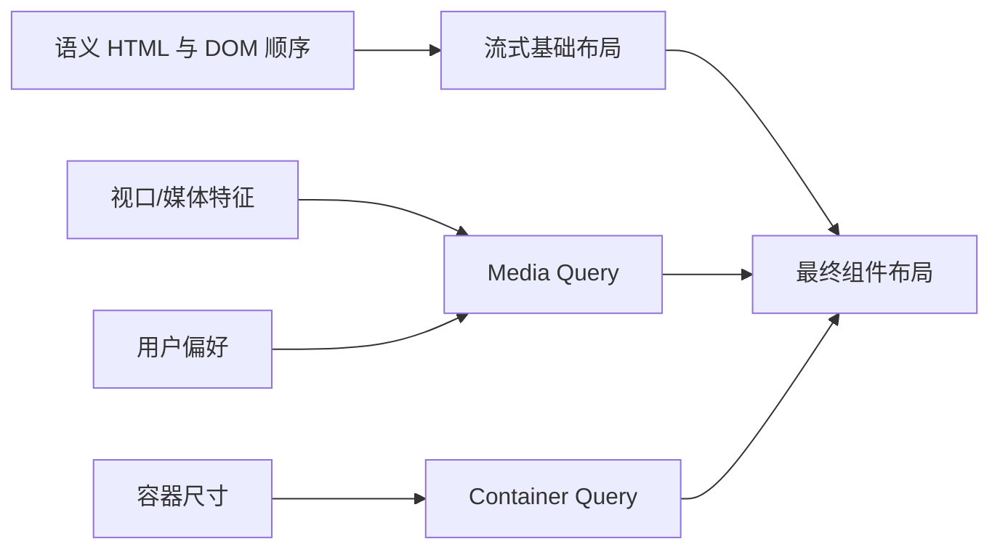

# 响应式设计、媒体查询、移动优先与断点

响应式设计让内容和交互适应可用空间、设备能力与用户偏好。它不是为每种机型写一套页面，而是让基础布局可流动，在内容真正失效的位置增加条件增强。

## 1. 响应式输入



响应式输入包括：布局视口宽高、输出媒体、指针/悬停能力、颜色方案、对比偏好、减少动效偏好、组件容器尺寸、语言和内容长度。User-Agent 字符串和具体设备型号不是可靠布局基础。

## 2. Viewport 前提

移动页面通常声明：

```html
<meta name="viewport" content="width=device-width, initial-scale=1">
```

它请求布局视口使用设备宽度并设置初始缩放。不要用 `user-scalable=no` 或不当 maximum-scale 阻止用户放大。Viewport meta 不能修复固定宽度和不可换行内容。

## 3. 流式基础

```css
*, *::before, *::after { box-sizing: border-box; }
img, video { max-inline-size: 100%; block-size: auto; }
.page { inline-size: min(100% - 2rem, 72rem); margin-inline: auto; }
.title { font-size: clamp(2rem, 1.5rem + 2vw, 3.5rem); }
```

max-inline-size 防止媒体推出容器；min 限制页面最大行宽并保留窄屏边距；clamp 提供字号上下界。流式不代表所有值都用 vw，过度视口缩放可能在小屏太小、大屏太大。

允许文本换行，使用 min/max-content-aware 布局，并在 flex/grid item 上处理自动最小尺寸，通常比增加大量断点更稳定。

## 4. Media Query 结构

```css
@media (width >= 48rem) {
  .layout { grid-template-columns: 16rem minmax(0, 1fr); }
}
```

媒体查询由可选 media type 与 media features 组成。常见 type 是 screen、print、all；现代功能范围语法可写 `width >= 48rem`，传统写法是 `min-width:48rem`。

| Feature | 用途 | 边界 |
| --- | --- | --- |
| `width`/`height` | 视口尺寸条件 | 不是物理设备尺寸 |
| `orientation` | width/height 关系 | 软键盘等会改变关系，不等于设备持握姿势 |
| `hover` | 主输入是否便利 hover | 不能据此移除焦点/点击能力 |
| `pointer` | 主指针精度 | coarse 不等于只有触屏 |
| `any-hover`/`any-pointer` | 任一输入设备能力 | 混合设备可能同时满足多种能力 |
| `prefers-color-scheme` | 用户亮/暗偏好 | 还需真实主题对比验证 |
| `prefers-reduced-motion` | 减少非必要动效偏好 | 应减少/替换，不是假装没有状态变化 |
| `prefers-contrast` | 对比偏好 | 支持和取值按目标环境验证 |
| `forced-colors` | 强制颜色模式 | 不应依赖作者颜色表达唯一信息 |

逗号表示 OR，`and` 表示 AND，`not` 否定查询。复杂条件应保持可读并在 DevTools 模拟与真实设备验证。

## 5. 移动优先

移动优先是代码组织策略：默认样式处理窄空间和基本能力，再用 min-width 增强。它不代表产品只考虑手机，也不要求所有属性只增加不覆盖。

```css
.layout { display:grid; gap:1rem; }
@media (width >= 48rem) { .layout { grid-template-columns: 15rem minmax(0,1fr); } }
@media (width >= 75rem) { .layout { grid-template-columns: 18rem minmax(0,1fr) 16rem; } }
```

默认单列，空间足够时加入侧栏，再足够时加入辅助栏。DOM 顺序先满足阅读和键盘，CSS 不用 order 把视觉布局与 DOM 分离。

## 6. 断点从内容得出

确定断点步骤：

1. 从最窄支持宽度开始，使用真实内容。
2. 缓慢扩大视口，观察行长、控件触达、拥挤和空白。
3. 在当前布局不再合理的位置记录 CSS 像素宽度。
4. 选择相对单位断点时说明与根字号的关系。
5. 在断点前后各测试一段范围，不只测试准确整数。
6. 加入长翻译、200% 缩放和系统字体变化重新检查。

断点 48rem 不是平板自然常数，只是某布局案例的内容转换点。设计系统可以建立共享断点，但组件仍可能需要容器查询。

## 7. 视口高度单位

传统 vh 可能受移动浏览器动态工具栏影响。小/大/动态视口单位分别是 svh、lvh、dvh：

```css
.hero { min-block-size: 100svh; }
.overlay { max-block-size: 100dvh; overflow:auto; }
```

svh 提供工具栏展开时的较小稳定尺寸，lvh 使用较大尺寸，dvh 随动态视口变化。全屏组件还需处理安全区域、键盘、内容增长和滚动，不能仅写 100dvh。

## 8. 输入能力与交互

```css
.button { min-inline-size: 2.75rem; min-block-size: 2.75rem; }
@media (hover:hover) and (pointer:fine) { .button:hover { background:#eef4ff; } }
.button:focus-visible { outline:3px solid #f79009; }
```

hover 只增加视觉反馈，不承载唯一功能。所有操作仍需点击/键盘路径。粗指针条件可调整目标间距，但不要按 pointer 条件隐藏信息。

## 9. 完整案例：文档页从单列到三栏

HTML 顺序：

```html
<div class="docs-layout">
  <nav class="docs-nav" aria-label="文档章节"><!-- links --></nav>
  <main class="docs-main"><h1>响应式设计</h1><p>正文…</p></main>
  <aside class="docs-toc" aria-label="本页目录"><!-- links --></aside>
</div>
```

CSS：

```css
.docs-layout {
  display:grid;
  grid-template-areas:"nav" "main" "toc";
  gap:1rem;
  inline-size:min(100% - 2rem, 90rem);
  margin-inline:auto;
}
.docs-nav { grid-area:nav; }
.docs-main { grid-area:main; min-inline-size:0; }
.docs-toc { grid-area:toc; }
@media (width >= 48rem) {
  .docs-layout { grid-template-columns:14rem minmax(0,1fr); grid-template-areas:"nav main" "toc main"; align-items:start; }
}
@media (width >= 75rem) {
  .docs-layout { grid-template-columns:16rem minmax(0,1fr) 14rem; grid-template-areas:"nav main toc"; }
  .docs-nav, .docs-toc { position:sticky; inset-block-start:1rem; }
}
@media print {
  .docs-nav, .docs-toc { display:none; }
  .docs-layout { display:block; inline-size:auto; }
}
```

### 9.1 处理与输出

窄屏按 DOM 顺序显示导航、正文、目录；48rem 两列，目录在导航下；75rem 三列。Grid areas 改变视觉区域，但 DOM 顺序仍用于非 CSS 阅读；需确认宽屏视觉与键盘路径仍合理。

print 隐藏导航只保留正文，但链接目标和必要引用应在打印样式中可理解。隐藏不是响应式默认手段，这里是输出媒体需求。

### 9.2 内容失效测试

把导航链接换成德语长词，正文插入代码块和 200 字 URL，根字号调大到 32px。若页面横向滚动，定位具体盒；代码块可以自身 overflow:auto，正文 Grid item 需要 min-inline-size:0，文本需要合适 overflow-wrap。

### 9.3 偏好查询

```css
@media (prefers-reduced-motion:reduce) { html:focus-within { scroll-behavior:auto; } }
@media (prefers-color-scheme:dark) { :root { color-scheme:dark; } }
```

只声明 color-scheme 允许 UA 控件适配，并不自动设计所有作者颜色。完整主题在后续专题处理。

### 9.4 失败分支

- 按 iPhone/Android 型号建立断点会快速失效；按内容转换。
- 用 `display:none` 删除关键功能以“适配手机”会造成能力不一致；重排或渐进披露。
- 固定 100vh 可能被工具栏/键盘遮挡；选择正确视口单位并允许滚动。
- 只在 hover 展示菜单会排除键盘/触屏；使用原生交互和 focus/click。
- CSS order 改变视觉但焦点仍按 DOM；调整源顺序或采用不冲突布局。

## 10. 测试矩阵

至少测试 320/390/768/1024/1440 CSS px 附近、每个断点前后、横竖视口、200%/400% zoom、长翻译、大系统字体、触控与键盘、暗色/减少动效/强制颜色、打印预览。

DevTools 模拟用于快速覆盖，不等于真实设备输入、软键盘、浏览器 UI 和性能。最终应在目标浏览器/设备组合抽样。

## 11. 练习与完成标准

实现一个带导航、内容、筛选和卡片网格的页面，从 320px 到 1440px 适应。完成标准：断点有内容失效证据；无设备型号条件；DOM/焦点顺序稳定；关键内容不因宽度隐藏；图片/表格/代码不推宽 body；200% zoom 可完成任务；偏好查询有明确回退；print 输出可读。

## 来源

- [W3C Media Queries Level 5](https://www.w3.org/TR/mediaqueries-5/) — 访问日期：2026-07-17
- [W3C CSS Values and Units Level 4：Viewport units](https://www.w3.org/TR/css-values-4/#viewport-relative-lengths) — 访问日期：2026-07-17
- [W3C CSS Conditional Rules Level 5](https://www.w3.org/TR/css-conditional-5/) — 访问日期：2026-07-17
- [MDN：Responsive design](https://developer.mozilla.org/en-US/docs/Learn_web_development/Core/CSS_layout/Responsive_Design) — 访问日期：2026-07-17
- [web.dev：Responsive web design basics](https://web.dev/articles/responsive-web-design-basics) — 访问日期：2026-07-17
