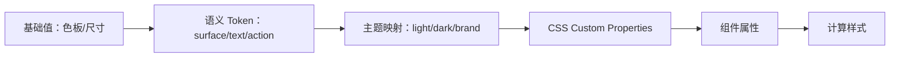

# Custom Properties、Design Token 与主题切换

CSS 自定义属性是参与层叠和继承的属性，其值可由 `var()` 引用。Design Token 是产品设计决策的命名数据模型；主题是在特定作用域为语义 token 提供另一组值。三者相关但不等价。

## 1. 数据从决策到组件



Token 名称表达用途可降低组件对具体颜色的耦合。`--blue-600` 是基础色板，`--color-action-primary` 是语义决策；按钮应优先引用后者。

## 2. 自定义属性语法与行为

```css
:root {
  --color-text: #172033;
  --space-card: 1rem;
}
.card { color: var(--color-text); padding: var(--space-card); }
```

自定义属性名以 `--` 开头，区分大小写。普通 `--name` 自定义属性默认继承。它保存声明值的 token 序列，通常不在声明处按最终目标属性类型检查。

`var()` 只能出现在属性值中，不能动态生成属性名、选择器或 at-rule 条件：

```css
/* 无效目标：var 不能替换属性名 */
.card { var(--property-name): red; }
```

### 2.1 回退值

```css
.card { color: var(--card-text, var(--color-text, #172033)); }
```

第二个参数是自定义属性缺失或 CSS-wide invalid 时的回退，不会在变量存在但其值对目标属性语法无效时按所有直觉场景“自动纠正”。逗号之后的完整 token 序列属于回退，可包含逗号。

浏览器支持自定义属性但变量未定义时，使用 fallback。旧浏览器不认识整个 var 声明时可先写静态声明：

```css
.card { color: #172033; color: var(--color-text, #172033); }
```

### 2.2 计算时无效

```css
:root { --gap: red; }
.grid { gap: var(--gap); }
```

`--gap:red` 对自定义属性本身可成立，但代入 gap 后类型不合法，gap 声明在 computed-value time 无效。DevTools 需要同时检查变量来源和使用属性。

### 2.3 循环引用

```css
.card { --a: var(--b); --b: var(--a); color: var(--a, black); }
```

同一元素上的变量依赖图形成循环，循环中的属性在计算值阶段无效，color 使用回退 black。继承到不同元素的引用需要按各元素计算，不能把源码字符串直接展开。

## 3. `@property` 类型化注册

```css
@property --progress {
  syntax: "<number>";
  inherits: false;
  initial-value: 0;
}
.meter { --progress: 0.6; }
```

| 描述符 | 作用 |
| --- | --- |
| `syntax` | 允许的 CSS 值语法；`"*"` 表示通用 token 流 |
| `inherits` | 是否从父元素继承 |
| `initial-value` | 注册属性的初始值；除通用语法特例外通常必需且要计算独立 |

注册后可提前拒绝不符合语法的值，并为插值动画提供类型。也可通过 CSS Properties and Values API 的 JavaScript 注册，重复/冲突注册会产生异常或无效规则，按 API 处理。

## 4. Design Token 分层

```css
:root {
  --palette-blue-600: #155eef;
  --palette-gray-900: #172033;
  --palette-white: #fff;

  --color-surface: var(--palette-white);
  --color-text: var(--palette-gray-900);
  --color-action: var(--palette-blue-600);

  --button-background: var(--color-action);
  --button-text: var(--palette-white);
}
```

- 基础 token 保存原始选项，如色板、字号尺度。
- 语义 token 表达用途，如 surface、text、danger。
- 组件 token 表达局部 API，如 button-background。

不是每个属性都要三层。只有需要跨主题、品牌或组件变体覆盖时才增加间接层，避免无法追踪的变量链。

Token 还可表示 spacing、radius、duration、easing、typography 等。不同平台共享 token 时必须明确类型、单位、颜色空间和转换规则，CSS 字符串不等于跨平台标准格式。

## 5. 主题作用域

```css
:root {
  color-scheme: light;
  --color-surface: #fff;
  --color-text: #172033;
  --color-action: #155eef;
}
[data-theme="dark"] {
  color-scheme: dark;
  --color-surface: #101828;
  --color-text: #f9fafb;
  --color-action: #84adff;
}
body { color:var(--color-text); background:var(--color-surface); }
```

根主题可覆盖整页，局部容器也可覆盖后代。组件只引用语义 token，不查询全局主题名，因而可嵌套在不同主题区域。

### 5.1 系统偏好与用户选择

```css
@media (prefers-color-scheme: dark) {
  :root:not([data-theme]) { /* dark token values */ }
}
```

一种策略是：没有显式 data-theme 时跟随系统，用户选择后属性覆盖系统。选择持久化需 JavaScript/服务端，并在首次绘制前应用以减少主题闪烁；存储不可用时使用系统/默认回退。

主题切换不只是颜色替换。要检查对比度、系统控件、图片/图表、阴影、语法高亮、焦点、错误和 forced colors。

## 6. 完整案例：可嵌套主题的状态卡

可运行的综合页面见 [布局、主题与动效演示](../../examples/css-layout-theme-motion-demo.html)。真实浏览器结果见 [桌面端深色 RTL 截图](../assets/css-layout-theme-motion-demo.jpg) 与 [窄屏浅色 LTR 截图](../assets/css-layout-theme-motion-demo-narrow.jpg)。桌面状态可用于核对主题 Token 覆盖，窄屏状态可用于核对默认主题和回退值。

HTML：

```html
<section class="theme-preview" data-theme="dark">
  <article class="status-card" data-status="warning">
    <h2>支付待确认</h2><p>请在 15 分钟内完成验证。</p><button>继续支付</button>
  </article>
</section>
```

CSS：

```css
:root {
  --color-surface: #fff; --color-text: #172033; --color-muted: #475467;
  --color-action: #155eef; --color-on-action: #fff;
  --color-warning-surface: #fffaeb; --color-warning-text: #93370d;
  --space-card: clamp(1rem, .75rem + 1vw, 1.5rem); --radius-card: .75rem;
}
[data-theme="dark"] {
  --color-surface: #101828; --color-text: #f9fafb; --color-muted: #d0d5dd;
  --color-action: #84adff; --color-on-action: #101828;
  --color-warning-surface: #4e1d09; --color-warning-text: #fec84b;
}
.theme-preview { color:var(--color-text); background:var(--color-surface); padding:2rem; }
.status-card { padding:var(--space-card); border-radius:var(--radius-card); background:var(--color-surface); }
.status-card[data-status="warning"] { color:var(--color-warning-text); background:var(--color-warning-surface); }
.status-card button { color:var(--color-on-action); background:var(--color-action); }
```

### 6.1 处理与输出

theme-preview 定义暗色语义 token，后代继承。warning 组件使用警告语义，而按钮仍使用主题 action token。把局部 data-theme 移除后组件切回根主题，无需改组件规则。

DevTools Computed 展开 background/color，沿变量链查来源。Console：

```js
const card = document.querySelector('.status-card');
console.log(getComputedStyle(card).getPropertyValue('--color-warning-text').trim());
console.log(getComputedStyle(card).color, getComputedStyle(card).backgroundColor);
```

### 6.2 失败分支

- `--Color-Text` 与 `--color-text` 是不同变量，命名大小写错误会触发回退/无效。
- 主题只覆盖 surface 不覆盖 text，可能产生低对比；token 集合按成对语义设计。
- 组件直接写 `#fff` 假设深背景，浅主题失效；使用 on-action token。
- 用户选择写入 localStorage，但首次脚本晚执行产生闪烁；在文档早期或服务端应用属性，同时遵守 CSP。
- 循环/非法 token 使使用属性无效；注册关键数值或用 DevTools 跟踪。
- 用主题属性隐藏内容或安全状态会把视觉配置变成业务边界；业务逻辑仍在代码和服务端。

## 7. Token 治理

每个 token 记录名称、类型、用途、允许覆盖层、默认值和废弃替代。删除前搜索静态与运行时消费者；动态字符串引用可能使自动分析不完整。

主题回归应基于组件状态矩阵：default、hover、focus、disabled、loading、error、selected，加上系统暗色、forced colors 和高对比。单张首页截图不能覆盖 token 系统。

## 8. 练习与完成标准

建立 light/dark 两主题和 success/warning/error 三状态卡。加入一个 `@property --progress` 进度值。完成标准：组件只依赖语义/组件 token；变量无循环；非法 progress 被拒绝/回退；主题嵌套正确；用户偏好有默认与持久化失败回退；所有状态对比和焦点可读；forced colors 不丢状态文字。

## 来源

- [W3C CSS Custom Properties Level 1](https://www.w3.org/TR/css-variables-1/) — 访问日期：2026-07-17
- [W3C CSS Properties and Values API Level 1](https://www.w3.org/TR/css-properties-values-api-1/) — 访问日期：2026-07-17
- [W3C Design Tokens Community Group](https://www.w3.org/community/design-tokens/) — 访问日期：2026-07-17
- [MDN：Using CSS custom properties](https://developer.mozilla.org/en-US/docs/Web/CSS/Guides/Cascading_variables/Using_custom_properties) — 访问日期：2026-07-17
