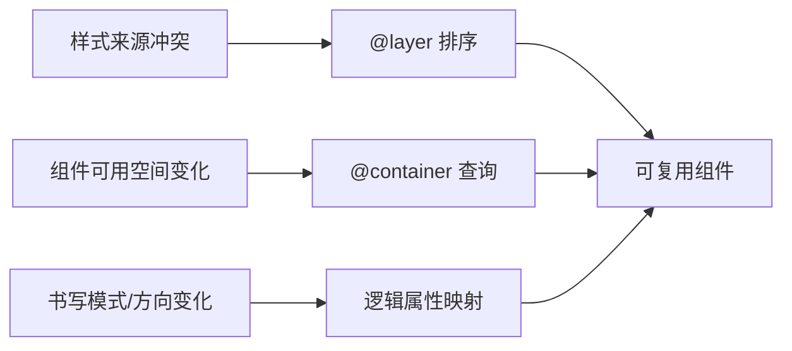
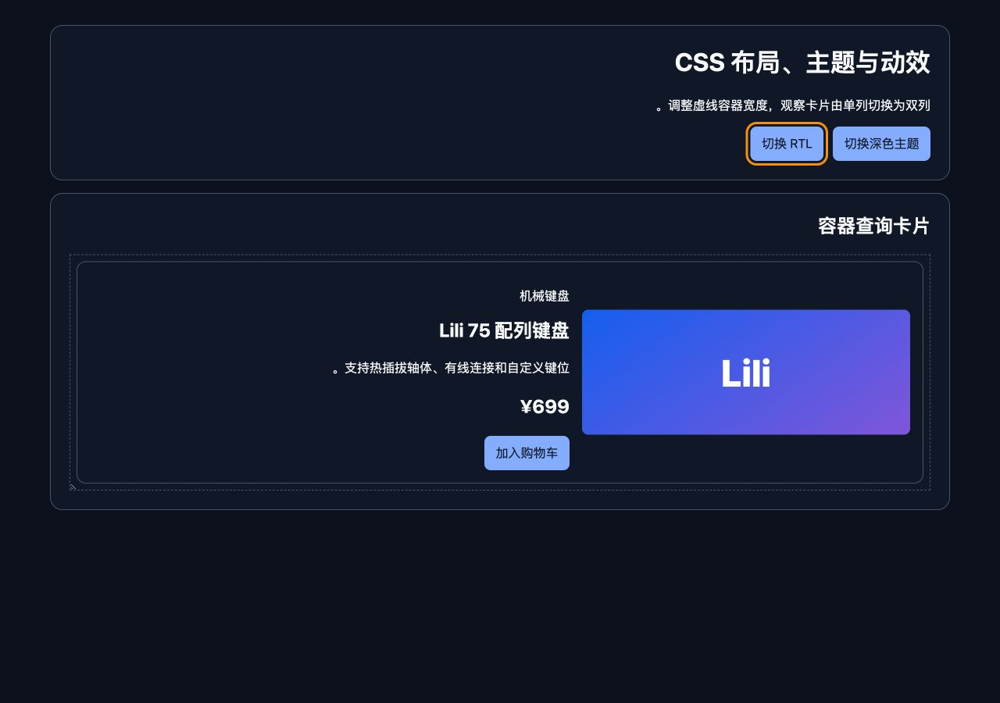

# Cascade Layers、Container Queries 与 Logical Properties

Cascade Layers 管理规则组的覆盖顺序，Container Queries 让组件按容器而不是视口响应，Logical Properties 让尺寸和边距按书写模式的 inline/block 轴表达。这三项能力分别解决层叠、组件适应和国际化方向问题。

## 1. 三项能力的责任边界



Layer 不隔离选择器作用域；Container Query 不取代所有媒体查询；逻辑属性不自动翻译内容或修正错误 DOM direction。

## 2. Cascade Layers

在入口集中声明顺序：

```css
@layer reset, base, components, utilities, overrides;
```

后续文件可向已命名层追加规则，首次顺序保持。作者普通声明中靠后的层优先，比较发生在 specificity 之前。作者 important 声明的层顺序反转。

```css
@layer reset { button { font:inherit; } }
@layer components { .button { color:white; background:#155eef; } }
@layer utilities { .text-danger { color:#b42318; } }
```

同一按钮有 button、.button、.text-danger 三条 color 时，utilities 普通层胜出，即使选择器 specificity 与 components 打平；reset 更早。

### 2.1 未分层规则与 import

未分层作者普通样式进入隐式外层，优先于命名层普通声明。因此使用 layers 的项目应明确哪些全局样式允许不分层，避免“临时规则”永久压过系统。

`@import` 可指定 layer，但 import 受必须出现在样式表前部等语法规则约束：

```css
@import url("vendor.css") layer(vendor);
@layer vendor, base, components;
```

实际应先声明完整层顺序再安排 imports，注意语法允许位置；构建工具是否保留层顺序也要检查产物。

### 2.2 嵌套层和匿名层

命名层可嵌套形成 `framework.base` 等路径；匿名层无法从外部追加，适合一次性隔离。层改变优先级架构，不应每个组件随意定义全局顺序。

`revert-layer` 回退当前层的声明，让前一层结果显现：

```css
.button--plain { all:revert-layer; }
```

all 的影响范围很大，真实组件更适合针对具体属性使用并验证交互状态。

## 3. Container Queries

元素需要成为 query container：

```css
.card-region { container-type:inline-size; container-name:card-region; }
@container card-region (width >= 30rem) { .card { grid-template-columns:10rem 1fr; } }
```

`container-type:inline-size` 对 inline axis 建立 size containment/query 能力；`size` 覆盖两轴并带来更强尺寸 containment，可能让容器自身尺寸无法由内容正常贡献，使用要谨慎；`normal` 不建立 size query container，但可用于 style queries 的相关行为。

`container` 简写可组合 name/type：

```css
.card-region { container: card-region / inline-size; }
```

查询选择最近满足名称和类型的祖先容器，不查询元素自身。若 card 同时是容器，@container 规则用于其后代；需要按 card 自己宽度改变 card 外层布局时，在 wrapper 建容器。

### 3.1 Query 单位

`cqw`、`cqh`、`cqi`、`cqb`、`cqmin`、`cqmax` 相对查询容器尺寸。没有合适容器时按规范回退到小视口单位参照。单位会让组件随容器连续变化，仍需上下界：

```css
.card__title { font-size:clamp(1.25rem, 1rem + 2cqi, 2rem); }
```

### 3.2 Style Queries

容器样式查询可按自定义属性等计算样式条件应用规则，语法和支持范围必须针对目标浏览器核对。不要把尚未广泛支持的普通属性 style query 当无回退基础。

## 4. Logical Properties

Inline axis 是文本行进方向，block axis 是行堆叠方向；writing-mode 和 direction 决定它们映射到物理边。

| 逻辑属性 | 水平 LTR 常见映射 |
| --- | --- |
| `inline-size` | width |
| `block-size` | height |
| `margin-inline-start` | margin-left |
| `padding-block` | padding-top + padding-bottom |
| `border-inline-end` | border-right |
| `inset-block-start` | top |
| `text-align:start` | left |

RTL 时 inline-start 通常映射右侧；竖排时 inline/block 轴会旋转。用 `dir="rtl"` 表达文档方向，不只用 CSS direction 反转视觉。

### 4.1 混用冲突

```css
.card { margin-left:1rem; margin-inline-start:2rem; }
```

两者可能映射同一物理属性，最终由层叠顺序决定。迁移时统一一组来源，避免 LTR 看似正常、RTL 被覆盖。

逻辑属性解决几何映射，不会自动镜像所有图标。返回箭头等方向图标根据语义决定是否镜像；媒体播放、商标和数字不应机械反转。

## 5. 完整案例：可嵌入侧栏或正文的商品卡

可运行的综合页面见 [布局、主题与动效演示](../../examples/css-layout-theme-motion-demo.html)。桌面端使用深色 RTL 状态，呈现两列 Grid 与逻辑方向：



390px 窄屏使用浅色 LTR 状态，Container Query 触发单列卡片：


HTML：

```html
<div class="product-slot">
  <article class="product-card">
    
    <div class="product-card__body"><h2>机械键盘</h2><p>¥699</p><button>加入购物车</button></div>
  </article>
</div>
```

CSS：

```css
@layer reset, base, components, utilities;
@layer reset { *,*::before,*::after { box-sizing:border-box; } }
@layer base { body { margin:0; font-family:system-ui,sans-serif; } }
@layer components {
  .product-slot { container:product / inline-size; }
  .product-card { display:grid; gap:1rem; padding:1rem; border:1px solid #d0d5dd; border-radius:.75rem; }
  .product-card img { inline-size:100%; block-size:auto; }
  .product-card__body { min-inline-size:0; }
  @container product (width >= 32rem) {
    .product-card { grid-template-columns:minmax(10rem, 40%) minmax(0,1fr); align-items:center; }
  }
}
@layer utilities { .flow > * + * { margin-block-start:1rem; } }
```

### 5.1 为什么不用 viewport breakpoint

同一页面中 card 可能位于 20rem 侧栏或 50rem 主内容。视口相同但容器不同。container query 让侧栏保持竖向，主内容变横向。

### 5.2 RTL 与竖排检查

card 使用 gap、inline-size、block-size，没有写 left/right。给祖先 `dir="rtl"` 时文本和按钮自然从右开始，图片/正文 grid 列仍按定义顺序；如果产品要求图片在视觉起始侧，需要用 grid areas 和方向规则明确，而不是任意 row-reverse。

测试 `writing-mode:vertical-rl` 时 32rem query 查询 inline-size，它此时对应竖向轴。如果需求实际上按物理水平宽度，应使用 width feature并说明物理含义；逻辑查询选择必须对应设计意图。

### 5.3 Layer 覆盖

utilities 层比 components 晚，因此工具声明在相同属性冲突时优先。若第三方 vendor 未分层，它会压过命名层普通规则；应导入 vendor layer 而不是提高所有组件 specificity。

### 5.4 可观察输出

Resize 容器而非视口，DevTools 应显示 container query 是否匹配。Console：

```js
const slot=document.querySelector('.product-slot'); const card=document.querySelector('.product-card');
console.table({slot:slot.getBoundingClientRect().width, columns:getComputedStyle(card).gridTemplateColumns, direction:getComputedStyle(card).direction});
```

小于 32rem columns 为单列结果，大于等于时为两轨道。RTL direction 反映祖先方向。

### 5.5 失败分支

- 把 container-type 设在 card 自身再查询 card 自身不会生效；用 wrapper。
- 使用 size containment 后容器塌到无内在尺寸；如果只需宽度查询用 inline-size。
- 未分层修复规则意外压过所有 layers；纳入明确层。
- 同时写 margin-left 和 margin-inline-start 导致 RTL 不一致；统一逻辑属性。
- 容器单位无限放大字号；用 clamp 设置可读上下界。

## 6. 调试与治理

Layer 顺序在单一入口声明并写测试样例；DevTools 检查规则所属 layer。Container Query 检查实际选中容器、名称、type、尺寸和 containment 副作用。逻辑属性至少测试 LTR、RTL、长内容和一种竖排实验（若产品支持）。

## 7. 练习与完成标准

实现一张可在 18rem 侧栏和 48rem 内容区复用的卡片，支持 RTL。完成标准：组件不用 viewport breakpoint；查询容器正确；layer 顺序稳定且无未分层意外覆盖；不混用冲突物理/逻辑边；窄容器无溢出；RTL DOM/焦点顺序正确；不支持新能力时基础单列仍可用。

## 来源

- [W3C CSS Cascading and Inheritance Level 5：Layers](https://www.w3.org/TR/css-cascade-5/#layering) — 访问日期：2026-07-17
- [W3C CSS Conditional Rules Level 5：Container queries](https://www.w3.org/TR/css-conditional-5/#container-queries) — 访问日期：2026-07-17
- [W3C CSS Containment Level 3](https://www.w3.org/TR/css-contain-3/) — 访问日期：2026-07-17
- [W3C CSS Logical Properties Level 1](https://www.w3.org/TR/css-logical-1/) — 访问日期：2026-07-17
