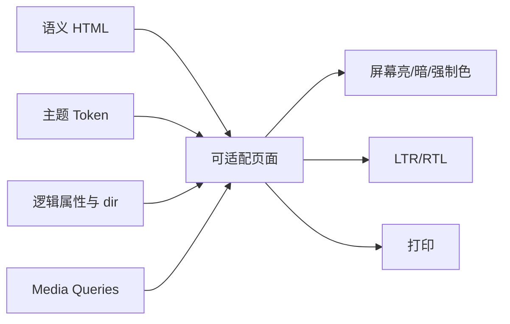

# 深色模式、RTL、高对比度与打印样式

深色主题、从右到左书写、强制颜色/对比偏好和打印是四种不同环境。它们分别影响颜色映射、文字方向与几何轴、用户代理颜色控制和分页输出，不能用一套“反色”处理。

## 1. 环境与责任

| 环境 | 主要信号 | 作者责任 |
| --- | --- | --- |
| 亮/暗偏好 | `prefers-color-scheme`、应用主题 | 提供成套颜色和控件方案 |
| RTL | HTML `dir`、Unicode 双向算法 | 正确标记方向并使用逻辑布局 |
| 高对比/强制色 | `prefers-contrast`、`forced-colors` | 保留语义和系统颜色可读性 |
| 打印 | `@media print`、paged media | 去除无意义交互、控制分页和链接信息 |



## 2. 深色模式

`prefers-color-scheme` 反映用户/系统对亮暗配色的偏好。`color-scheme` 告诉用户代理该元素支持哪些方案，使表单控件、滚动条和系统颜色等可相应适配。

```css
:root {
  color-scheme: light dark;
  --surface:#fff; --text:#172033; --muted:#475467; --link:#155eef;
}
@media (prefers-color-scheme:dark) {
  :root { --surface:#101828; --text:#f9fafb; --muted:#d0d5dd; --link:#84adff; }
}
body { color:var(--text); background:var(--surface); }
```

声明 color-scheme 不会自动转换作者指定颜色。所有语义色需要主题映射：surface、text、muted、link、focus、border、success、warning、danger、disabled、overlay。

### 2.1 用户覆盖系统

一种优先级是：用户显式选择 > 系统偏好 > 应用默认。HTML data-theme 提供显式覆盖，媒体查询只在没有属性时应用。首次绘制前应用持久选择可减少闪烁；存储失败时回退系统。

滤镜 invert 会同时反转图片、品牌色和状态色，不是完整主题。暗色也不是把所有值变黑：阴影、层级、图表、代码高亮和图片都需验证。

## 3. RTL 与双向文本

文档方向使用 HTML：

```html
<html lang="ar" dir="rtl">
```

局部未知用户文本可考虑 `dir="auto"`，由首个强方向字符决定。CSS `direction` 不应用来修正缺失的语义标记；方向影响 Unicode 双向算法、表格、布局和可访问性。

### 3.1 逻辑布局

```css
.notice {
  padding-inline-start:3rem;
  border-inline-start:.25rem solid currentColor;
  text-align:start;
}
.notice__icon { inset-inline-start:1rem; }
```

LTR 中 inline-start 通常为左，RTL 为右。不要同时写 left 和 inline-start 互相覆盖。

### 3.2 混合双向文本

订单号、邮箱、代码和数字可能与周围 RTL 文本方向不同。`bdi` 隔离未知方向片段：

```html
<p>المستخدم <bdi>alice@example.com</bdi></p>
```

`bdo dir` 强制覆盖方向，只用于确实需要的内容。CSS `unicode-bidi` 是底层控制，不应在普通组件随意使用。

方向图标按语义决定镜像：返回/前进箭头通常镜像，播放三角、时钟、品牌 logo 和代码符号通常不镜像。不要全局 transform 所有 SVG。

## 4. Forced Colors 与对比偏好

`forced-colors:active` 表示用户代理强制有限颜色调色板。作者颜色可能被替换为系统颜色，某些属性受影响，浏览器还可提供 backplate 等可读性处理。

```css
.button { border:2px solid transparent; }
@media (forced-colors:active) {
  .button { border-color:ButtonText; }
  .button:focus-visible { outline:3px solid Highlight; }
}
```

系统颜色如 Canvas、CanvasText、ButtonFace、ButtonText、LinkText、Highlight 表达用途。透明边框在普通模式不可见，在 forced colors 可被明确设置，帮助保留边界。

`forced-color-adjust:none` 阻止 UA 调整，应极少使用，例如必须保留自身颜色含义且同时确保可读的颜色样本。品牌诉求不能优先于用户可读性。

`prefers-contrast` 表达更高/更低/自定义对比偏好，支持与行为需按目标环境验证。基础设计首先满足对比和非颜色信息，不把媒体查询当补救。

## 5. 打印

```css
@media print {
  nav, .toolbar, button { display:none; }
  body { color:black; background:white; font:11pt/1.5 serif; }
  main { inline-size:auto; margin:0; }
  a[href^="http"]::after { content:" (" attr(href) ")"; overflow-wrap:anywhere; }
  h2 { break-after:avoid; }
  figure, table { break-inside:avoid; }
}
```

打印隐藏的是无纸面意义的交互，不应删除必要状态或内容。链接 URL 追加只适合外部有意义链接，mailto、fragment、长跟踪 URL 需过滤。

### 5.1 Paged media

`@page` 可设置页边距和部分分页属性，页眉页脚等高级能力支持依实现而异。break-before/after/inside 是分页提示，内容与页面尺寸可能使避免规则无法满足。

```css
@page { margin:15mm; }
@media print { .chapter { break-before:page; } }
```

不要用固定屏幕高度组织打印页。表格跨页需检查表头重复和行分割的浏览器实现。

## 6. 完整案例：订单详情在四种环境中可用

可运行的综合页面见 [布局、主题与动效演示](../../examples/css-layout-theme-motion-demo.html)。真实浏览器结果见 [桌面端深色 RTL 截图](../assets/css-layout-theme-motion-demo.jpg) 与 [窄屏浅色 LTR 截图](../assets/css-layout-theme-motion-demo-narrow.jpg)。两张图分别用于核对 `color-scheme: dark`、`dir="rtl"` 与浅色 LTR 基线；打印仍需在打印预览中单独验证。

HTML：

```html
<article class="order" dir="auto">
  <header><h1>订单 <bdi>#A-1024</bdi></h1><span class="status">已支付</span></header>
  <dl><dt>客户</dt><dd><bdi>ليلى@example.com</bdi></dd><dt>金额</dt><dd>¥699</dd></dl>
  <a href="https://example.com/orders/A-1024">在线查看</a>
  <button type="button">申请退款</button>
</article>
```

CSS：

```css
:root { color-scheme:light dark; --surface:#fff; --text:#172033; --border:#d0d5dd; --paid:#067647; }
@media (prefers-color-scheme:dark) { :root { --surface:#101828; --text:#f9fafb; --border:#475467; --paid:#75e0a7; } }
.order { color:var(--text); background:var(--surface); border:1px solid var(--border); padding:1rem; }
.order header { display:flex; justify-content:space-between; gap:1rem; }
.status { color:var(--paid); border:1px solid currentColor; padding-inline:.5rem; }
@media (forced-colors:active) { .status { color:CanvasText; border-color:CanvasText; } }
@media print { .order { border:0; padding:0; } .order button { display:none; } }
```

### 6.1 可观察结果

亮暗模式中 surface/text/border/paid 成套变化，状态同时有文字和边框，不只靠绿。RTL 祖先下 header 的 inline 方向反转，bdi 隔离订单号/邮箱。Forced colors 下使用系统颜色仍可见边界。打印隐藏退款按钮但保留“已支付”、客户、金额和 URL。

### 6.2 测试步骤

1. DevTools 模拟 light/dark，检查所有文本、焦点和控件。
2. 在祖先设置 dir=ltr/rtl，检查阅读和焦点顺序不依赖 CSS order。
3. 使用真实 Arabic/Hebrew 与 Latin、数字混排。
4. Windows 强制颜色或目标环境实测，不能只依赖模拟。
5. 打印预览 A4/Letter、不同缩放、两页长数据。
6. 关闭背景打印选项，核心信息仍存在。

### 6.3 失败分支

- 暗色只改 body 背景，卡片固定白字产生不可读组合；所有语义 token成套覆盖。
- CSS direction:rtl 但 HTML 没 dir，双向算法/语义不完整；修正 HTML。
- 用 transform:scaleX(-1) 镜像整个组件会反转文字；只处理需镜像图标。
- forced-color-adjust:none 保留低对比品牌色；移除并使用系统色。
- print display:none 隐藏错误/状态；只移除无意义操作，保留结果。
- 追加所有 href 导致 data/03-javascript/内部片段污染输出；限制选择器和协议。

## 7. 主题与国际化治理

主题矩阵至少覆盖页面背景、表面、文字、弱文字、链接、边框、焦点、五种状态和图表。RTL 审查覆盖源顺序、逻辑边、图标、表单、表格、混合字符串。打印覆盖分页、链接、表格、图片和隐私字段。

## 8. 练习与完成标准

为账单页实现 light/dark、LTR/RTL、forced colors 和 print。完成标准：用户主题覆盖系统并有回退；无 filter 反色；所有关键状态有文字；逻辑属性无冲突物理覆盖；混合邮箱/订单号顺序正确；forced colors 可读；打印无交互残影且关键链接/状态保留；分页不裁掉标题与首段。

## 来源

- [W3C CSS Color Adjustment Level 1](https://www.w3.org/TR/css-color-adjust-1/) — 访问日期：2026-07-17
- [W3C Media Queries Level 5](https://www.w3.org/TR/mediaqueries-5/) — 访问日期：2026-07-17
- [W3C CSS Logical Properties Level 1](https://www.w3.org/TR/css-logical-1/) — 访问日期：2026-07-17
- [W3C Internationalization：Structural markup and text direction](https://www.w3.org/International/questions/qa-html-dir) — 访问日期：2026-07-17
- [W3C CSS Paged Media Level 3](https://www.w3.org/TR/css-page-3/) — 访问日期：2026-07-17
