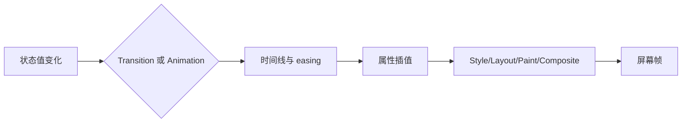

# Transition、Animation、Transform 与关键帧

Transition 在同一属性两个状态值之间生成插值；CSS Animation 用 `@keyframes` 描述多个时间点；Transform 改变元素的局部坐标空间。动效应表达状态与空间关系，不能成为唯一信息或阻断操作。

## 1. 动效流水线



属性是否可动画以及插值类型由其规范定义：数值/颜色可连续插值，列表需兼容结构，部分关键字使用离散动画。不能假定所有属性都平滑变化。

## 2. Transitions

```css
.button {
  transition-property: background-color, transform;
  transition-duration: 150ms;
  transition-timing-function: ease, ease-out;
  transition-delay: 0ms;
}
.button:active { transform:scale(.98); }
```

| 属性 | 含义 | 初学边界 |
| --- | --- | --- |
| property | 监听的 CSS 属性 | 列出明确属性，避免 all |
| duration | 从起点到终点时长 | 0s 时无可见过渡 |
| timing-function | 时间进度映射 | 不改变终值，只改节奏 |
| delay | 等待多久开始 | 负 delay 从时间线中途开始 |
| transition | 上述组合简写 | 多组以逗号分隔，列表按规则重复/截断 |

Transition 需要属性计算值发生变化，例如伪类、class 或属性切换。首次渲染通常没有“之前值”可过渡；应用入场需 animation、@starting-style 或脚本状态，按兼容性选择。

事件包括 `transitionrun`、`transitionstart`、`transitionend`、`transitioncancel`。属性被移除、display 改变或新状态打断时可能没有 end 而触发 cancel，业务逻辑不能只依赖 end 才恢复关键状态。

## 3. Timing Functions

常见关键字映射 cubic-bezier 曲线；`linear()` 可定义分段进度；`steps()` 产生离散步进。

```css
.menu { transition:opacity 180ms cubic-bezier(.2,0,0,1); }
.sprite { animation:walk 800ms steps(8,end) infinite; }
```

曲线 x 控制时间，需在 0–1；y 可超出产生回弹进度。过度回弹、缩放和快速移动可能引起不适，应提供减少动效方案。

## 4. CSS Animations 与 Keyframes

```css
@keyframes progress-pulse {
  0%,100% { opacity:.55; }
  50% { opacity:1; }
}
.loading { animation:progress-pulse 1.2s ease-in-out infinite; }
```

| animation 子属性 | 作用 |
| --- | --- |
| name | 对应 keyframes 名称或 none |
| duration | 单次迭代时长 |
| timing-function | 每段关键帧的节奏 |
| delay | 开始等待，可为负 |
| iteration-count | 次数或 infinite |
| direction | normal/reverse/alternate/alternate-reverse |
| fill-mode | 延迟前/结束后是否应用关键帧样式 |
| play-state | running/paused |
| composition | 多动画效果的组合方式，支持需按目标环境验证 |

缺失 0%/100% 时浏览器可使用元素底层值作为端点。多个 animation 以逗号列表对应；简写会重置未写子属性。

`animationend` 不会在动画被移除或元素不再渲染等所有取消情况保证触发。关键业务完成不能依赖视觉动画结束。

## 5. Transform

二维函数包括 translate、scale、rotate、skew、matrix；三维包括 translate3d、rotateX/Y/Z、perspective 等。

```css
.card { transform:translateX(2rem) rotate(5deg); transform-origin:center; }
```

函数按矩阵组合，顺序改变结果：先 translate 再 rotate 与先 rotate 再 translate 不等价。独立 `translate`、`rotate`、`scale` 属性可降低组合覆盖冲突，但层叠/动画支持按目标环境验证。

Transform 通常不让周围 normal-flow 盒重新布局，变换后的视觉边界可溢出并影响滚动区域。非 none transform 会创建 stacking context，并可为 absolute/fixed 后代建立 containing block。

`transform-origin` 决定变换原点；百分比相对参考盒。`transform-box` 可改变 SVG/HTML 的参考盒语义。

## 6. 动画属性与渲染成本

transform/opacity 经常可在合成阶段更新，避免每帧 layout/paint，但不是绝对“免费”：大图层、滤镜、透明叠加和栅格化仍消耗内存/GPU。width/height/top/left 等常触发布局并影响更多元素。

应使用 Performance 和 Layers 证据判断，不以属性名单代替测量。`will-change` 只在即将变化且测量证明有益时短期使用。

## 7. 完整案例：可取消的侧边筛选面板

可运行的综合页面见 [布局、主题与动效演示](../../examples/css-layout-theme-motion-demo.html)。真实浏览器结果见 [桌面端深色 RTL 截图](../assets/css-layout-theme-motion-demo.jpg) 与 [窄屏浅色 LTR 截图](../assets/css-layout-theme-motion-demo-narrow.jpg)。截图只能证明稳定状态；过渡时序、取消行为和事件仍应在页面中交互验证。

HTML：

```html
<button id="toggle" aria-expanded="false" aria-controls="filters">筛选</button>
<aside id="filters" data-state="closed" aria-labelledby="filter-title">
  <h2 id="filter-title">筛选条件</h2><button id="close">关闭</button>
</aside>
```

CSS：

```css
#filters {
  position:fixed; inset:0 0 0 auto; inline-size:min(24rem,90vw);
  transform:translateX(100%); opacity:0; visibility:hidden;
  transition:transform 220ms ease-out, opacity 180ms linear, visibility 0s linear 220ms;
}
#filters[data-state="open"] {
  transform:translateX(0); opacity:1; visibility:visible;
  transition-delay:0s;
}
@media (prefers-reduced-motion:reduce) {
  #filters { transition-duration:0s; transform:none; }
}
```

JavaScript 只同步状态：

```js
const panel=document.querySelector('#filters'); const toggle=document.querySelector('#toggle');
function setOpen(open){ panel.dataset.state=open?'open':'closed'; toggle.setAttribute('aria-expanded',String(open)); if(open) panel.querySelector('button').focus(); else toggle.focus(); }
toggle.addEventListener('click',()=>setOpen(true)); document.querySelector('#close').addEventListener('click',()=>setOpen(false));
```

### 7.1 输出与事件

打开时属性状态立即为 open、aria-expanded true，视觉在 220ms 内进入。关闭时焦点先回触发按钮，visibility 延迟到过渡结束，避免提前消失导致无动画。Reduced motion 下立即切换但信息/焦点状态相同。

监听 transitionend 时要过滤 `event.propertyName` 与 target；快速开关可能触发 cancel。这个案例不依赖事件完成业务，仅用于可选清理。

### 7.2 失败分支

- `transition:all` 会让未来新增尺寸属性意外动画。
- closed 只 opacity:0 会留下不可见可聚焦内容；同步 visibility/inert/focus。
- 用 display:none 作为终值时传统 transition 无法平滑；采用可验证的离散过渡能力或 visibility 模式。
- transform 祖先让 fixed panel 不再相对视口；检查 containing block 或把浮层放到合适架构层/top layer。
- 快速点击产生旧 timeout 关闭新面板；基于当前状态/事件取消清理。

## 8. Keyframe 完整验证

为加载图标创建旋转动画时，同时提供文本“正在加载”，停止后移除动画 class。无限动画在页面隐藏或组件卸载后不应继续无意义工作；Intersection/visibility 优化需谨慎，不可停止关键进度状态。

## 9. 调试与练习

DevTools Animations 检查时间线和曲线，Computed 查看属性列表，Performance 记录 layout/paint/composite，Layers 检查图层。测试快速反向、元素删除、页面后台、reduced motion 和低性能设备。

练习实现 toast 进入/退出和进度状态。完成标准：明确过渡属性；不依赖动画传达唯一信息；取消/反向不会卡状态；键盘焦点正确；reduced motion 有等价状态；Performance 无持续布局抖动；动画结束不是业务提交条件。

## 来源

- [W3C CSS Transitions Level 2](https://www.w3.org/TR/css-transitions-2/) — 访问日期：2026-07-17
- [W3C CSS Animations Level 2](https://www.w3.org/TR/css-animations-2/) — 访问日期：2026-07-17
- [W3C CSS Transforms Level 2](https://www.w3.org/TR/css-transforms-2/) — 访问日期：2026-07-17
- [W3C CSS Easing Functions Level 2](https://www.w3.org/TR/css-easing-2/) — 访问日期：2026-07-17
- [MDN：Web Animations API](https://developer.mozilla.org/en-US/docs/Web/API/Web_Animations_API) — 访问日期：2026-07-17
