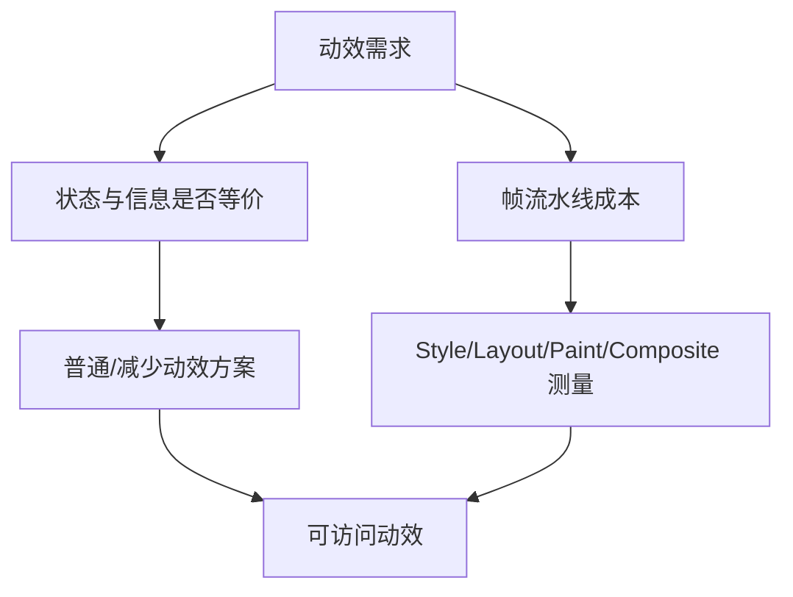

# prefers-reduced-motion 与动效性能

`prefers-reduced-motion` 表达用户希望减少非必要运动的系统偏好。动效性能取决于每帧主线程与合成工作、图层内存和设备条件。可访问性与性能都需要状态等价和实际测量，不能靠“时长更短”或“只用 transform”自动满足。

## 1. 两条独立验收线



减少动效解决不适风险；性能解决延迟、卡顿、能耗和资源。性能流畅的视差仍可能令人不适，静止替代也可能因同步脚本阻塞交互。

## 2. 偏好查询

```css
@media (prefers-reduced-motion:reduce) { /* reduce */ }
@media (prefers-reduced-motion:no-preference) { /* optional enhancement */ }
```

`reduce` 表示用户希望最小化非必要运动；`no-preference` 不等于用户明确要求大量动画。基础体验应可用，动效作为增强。

### 2.1 不推荐的全局“0.01ms”重置

```css
@media (prefers-reduced-motion:reduce) {
  *,*::before,*::after { animation-duration:.01ms !important; animation-iteration-count:1 !important; }
}
```

该模式可能破坏依赖事件的组件、覆盖必要状态、与第三方样式冲突。更稳健方式是按组件定义等价方案，并避免让业务逻辑依赖动画结束。

```css
.panel { transition:transform 220ms ease-out, opacity 180ms linear; }
@media (prefers-reduced-motion:reduce) { .panel { transition:none; transform:none; } }
```

## 3. 哪些运动需要减少

重点审查大范围平移/缩放、视差、背景持续移动、自动播放、快速闪动、旋转和滚动劫持。必要的状态变化可用淡入、颜色/边框变化、直接切换和文本说明替代。

加载状态不能因关闭 spinner 而失去“正在加载”信息；展开面板直接出现后仍需同步 expanded、focus 和布局；成功提示仍要可感知。

应用内可提供更严格偏好，但默认尊重操作系统。持久化失败时回退系统，不能用用户追踪标识实现简单偏好。

## 4. 浏览器渲染工作

一次帧可能包含 JavaScript、style calculation、layout、paint 和 composite。具体执行和线程由浏览器实现决定。

| 变化 | 常见影响 | 仍需注意 |
| --- | --- | --- |
| width/height/top/left | style + layout + paint | 可影响大量后代/相邻元素 |
| color/background | style + paint | 大面积重绘成本高 |
| transform/opacity | 常可合成 | 图层提升、栅格、透明合成仍有成本 |
| filter/box-shadow | paint/合成成本 | 大模糊半径和大区域昂贵 |

“compositor-only” 是常见优化目标，不是规范保证。浏览器可根据元素、设备和资源改变实现。

## 5. 帧预算与 Long Task

60Hz 显示一帧约 16.7ms，但浏览器还有输入、合成等工作，应用不能占满全部。120Hz 预算更短。平均 60fps 不能揭示偶发长帧，应看帧时间分布、长任务和交互延迟。

CSS 动画可在部分情况下脱离主线程推进，但主线程繁忙仍会影响事件、样式更新和非合成属性。动画流畅不代表按钮响应及时。

## 6. `will-change`

```css
.drawer.is-about-to-open { will-change:transform; }
```

will-change 是优化提示，浏览器可能提前建立资源。长期对大量元素设置会增加内存和图层管理成本。只在测量证明有益、变化即将发生时应用，完成后移除；不要写 `* { will-change:transform }`。

## 7. 完整案例：降低抽屉动效与性能成本

可运行的综合页面见 [布局、主题与动效演示](../../examples/css-layout-theme-motion-demo.html)，其中包含 reduced-motion 分支。真实浏览器稳定状态见 [桌面端深色 RTL 截图](../assets/css-layout-theme-motion-demo.jpg) 与 [窄屏浅色 LTR 截图](../assets/css-layout-theme-motion-demo-narrow.jpg)；是否减少运动必须再用开发者工具模拟 `prefers-reduced-motion: reduce` 并记录时间线。

输入是全屏抽屉：普通模式从右侧滑入并淡入 backdrop；reduce 模式直接出现，仅保留极短/无空间运动的透明变化；内容包含可聚焦表单。

```css
.drawer {
  position:fixed; inset:0 0 0 auto; inline-size:min(28rem,100%);
  transform:translateX(100%); opacity:0; visibility:hidden;
  transition:transform 220ms ease-out, opacity 160ms linear, visibility 0s linear 220ms;
}
.drawer[data-open="true"] { transform:translateX(0); opacity:1; visibility:visible; transition-delay:0s; }
@media (prefers-reduced-motion:reduce) {
  .drawer { transform:none; transition:opacity 80ms linear, visibility 0s; }
}
```

### 7.1 等价状态

两种偏好下，data-open、aria-expanded、焦点进入/恢复、背景不可交互和提交功能相同。只有空间运动和时长不同。测试 reduce 时不能只看 CSS rule 匹配，还要完成全键盘流程。

### 7.2 Performance 记录

1. 打开 Performance，启用 CPU throttling 作为实验条件并记录倍率。
2. 开始记录，打开/关闭抽屉 3 次，停止。
3. 查看 Main thread 的 style/layout/paint 与 Frames。
4. 检查 Layers/Memory 是否因 will-change 产生大量图层。
5. 对比 transform 方案与动画 inline-size 的实验分支。

预期 transform 方案每帧不持续触发全页 layout；若面板内容/阴影产生大 paint，仍需优化面积。不要编造毫秒值，记录真实机器、浏览器和 trace。

### 7.3 失败注入

在打开同时运行 100ms 同步循环，观察输入和状态更新延迟。即使 transform 合成保持部分流畅，主线程事件仍阻塞。修复是拆分/移出重任务，而不是增加图层。

快速连续开关测试 transitioncancel，最终 data-open 与 visibility 必须一致。页面切后台后回来不应把焦点留在隐藏抽屉。

## 8. 其他性能边界

大背景固定视差会增加绘制和不适风险；视频/GIF 不能通过 prefers-reduced-motion 自动停止，需控件和媒体策略；Canvas/WebGL 动画需在 JavaScript 读取 matchMedia 并实现等价方案。

```js
const reduceMotion=matchMedia('(prefers-reduced-motion: reduce)');
function applyMotionPreference(){ document.documentElement.dataset.motion=reduceMotion.matches?'reduced':'full'; }
reduceMotion.addEventListener('change',applyMotionPreference); applyMotionPreference();
```

监听允许系统偏好运行时变化。旧环境兼容按目标支持策略处理。

## 9. 指标与误读

- FPS 是显示帧率，不表示输入延迟或所有帧稳定。
- Long Task 通常指主线程任务超过特定阈值的 API/工具定义，需看归因。
- INP 等真实用户指标聚合交互延迟，不能由单次本地动画 trace替代。
- 合成层数量不是越多越好，需结合内存、栅格和更新成本。

## 10. 验证矩阵

普通/reduce 两偏好，低端 CPU、60/120Hz（可用设备）、页面前后台、快速反向、滚动中触发、200% zoom、键盘和屏幕阅读器。保存 trace 或明确文本数据，记录版本和设备。

测试报告至少包含操作步骤、录制范围、主要线程最长任务、发生布局/绘制的帧、图层变化、reduce 模式观察结果和修复前后对比。单次录制受后台进程和缓存影响，应重复采样并说明不确定性；不要把 DevTools 节流结果冒充真实用户分布。

## 11. 练习与完成标准

实现抽屉、toast 和加载状态的普通/减少动效方案。完成标准：状态信息等价；业务不依赖 animationend/transitionend；reduce 无大范围运动；Performance trace 无持续 layout thrashing；will-change 有证据且按时移除；快速取消最终状态正确；主线程失败注入有恢复策略；测试结果记录环境。

## 来源

- [W3C Media Queries Level 5：prefers-reduced-motion](https://www.w3.org/TR/mediaqueries-5/#prefers-reduced-motion) — 访问日期：2026-07-17
- [MDN：prefers-reduced-motion](https://developer.mozilla.org/en-US/docs/Web/CSS/@media/prefers-reduced-motion) — 访问日期：2026-07-17
- [web.dev：How to create high-performance CSS animations](https://web.dev/articles/animations-guide) — 访问日期：2026-07-17
- [MDN：CSS and JavaScript animation performance](https://developer.mozilla.org/en-US/docs/Web/Performance/Guides/CSS_JavaScript_animation_performance) — 访问日期：2026-07-17
- [W3C Long Tasks API](https://www.w3.org/TR/longtasks-1/) — 访问日期：2026-07-17
