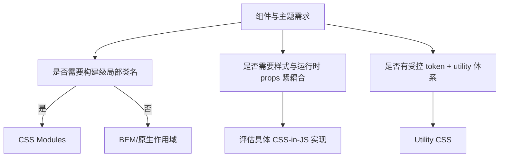

# BEM、CSS Modules、CSS-in-JS 与 Utility CSS

CSS 方法论决定类名作用域、组件变体、样式生成位置和团队治理。它们不会改变浏览器的 Cascade、Specificity 与继承规则。选择应基于项目约束、构建/SSR、动态值、缓存和团队维护证据。

## 1. 四种方案的能力模型

| 方案 | 作用域机制 | 主要依赖 | 主要成本 |
| --- | --- | --- | --- |
| BEM | 全局类名的命名约定 | 人与 lint 纪律 | 名称长、全局仍可冲突 |
| CSS Modules | 构建时类名映射 | bundler/module loader | 构建耦合、跨模块全局边界 |
| CSS-in-JS | JS/TS API，运行时注入或构建提取 | 具体库与框架 | 注入/序列化/SSR/缓存因实现不同 |
| Utility CSS | 预定义单职责类组合 | 生成器/配置或手写库 | 标记密度、约束与复用治理 |



可以混合，但必须写清责任：例如 Modules 管组件，Utilities 管布局小工具，tokens 管主题，global.css 只放 reset/base。

## 2. BEM

BEM 命名：block 是独立组件，element 是 block 的组成部分，modifier 是变体。

```html
<article class="card card--featured">
  <h2 class="card__title">机械键盘</h2>
  <p class="card__price">¥699</p>
</article>
```

```css
.card { padding:var(--space-4); }
.card__title { font-weight:700; }
.card--featured { border-color:var(--color-accent); }
```

BEM 不要求 DOM 每层都进入类名，也不把 element 再嵌套成 `block__element__child`。深层名称往往表明边界需重新评估。

Modifier 表达组件变体，不应用 CSS class 作为唯一业务状态源；disabled、selected、expanded 等优先使用原生/ARIA/数据状态并同步样式。

优点是无需构建、HTML 可读、跨技术栈；缺点是全局命名仍依赖约定，删除安全和组合需工具辅助。

## 3. CSS Modules

`Card.module.css`：

```css
.root { padding:var(--space-4); }
.title { font-weight:700; }
.featured { border-color:var(--color-accent); }
```

组件导入映射：

```js
import styles from './Card.module.css';
export function cardClassName({ featured }) {
  return [styles.root, featured ? styles.featured : null]
    .filter(Boolean)
    .join(' ');
}
```

具体生成名、`:global`、composition 和类型支持由工具实现决定，不是浏览器标准。模块局部类名仍会受元素规则、继承、自定义属性和加载顺序影响。

SSR 要确保服务端和客户端类名映射一致、CSS 在首屏加载且水合不闪烁。动态拼接 `styles[name]` 会削弱静态分析和类型安全，变体应有限枚举。

## 4. CSS-in-JS

CSS-in-JS 是一个类别：运行时库可能把 props 序列化并注入 style，编译型方案可能在构建时提取静态 CSS，零运行时方案也可能生成 class。不能对整个类别给出同一性能结论。

评估面：

- 样式是在服务器、构建还是客户端生成。
- 首屏 CSS 怎样提取、排序和缓存。
- 动态 props 是否产生无限规则/类名。
- 水合类名与插入顺序是否稳定。
- CSP 是否允许所需 style 注入/nonce。
- React/Vue 等并发/流式 SSR 如何收集样式。
- 调试类名、source map 和删除未使用样式能力。

高频动态数值更适合 CSS custom property：

```html
<div class="progress" style="--progress: 63%"></div>
```

结构化有限变体继续用 class/data attribute，避免每个像素值生成新规则。style 属性值仍需输入验证，不能拼接不可信 CSS。

## 5. Utility CSS

Utility 类通常一类一职责：

```html
<div class="grid gap-4 md:grid-cols-2"><!-- cards --></div>
```

具体命名、断点和生成规则属于框架配置。优点是受控值、就地组合和删除分析；成本是标记密度、重复组合、动态类名扫描失败和设计偏离。

稳定组合应抽成组件/模板变体，而不是用 CSS `@apply` 或字符串常量无边界复制。工具的 class 扫描通常需要静态可发现字符串；`bg-${color}` 可能不生成所需规则，按框架官方规则使用枚举映射。

## 6. 共同不变量

所有方案都应满足：

1. Design tokens 与组件实现解耦。
2. 原生语义、焦点和状态不由类名假装。
3. Cascade layer/入口加载顺序明确。
4. 动态值有类型、范围和安全边界。
5. SSR/CSR 样式一致，无未样式首屏和水合差异。
6. unused CSS、重复规则和产物大小可观察。
7. 测试不用易变生成类名作为唯一定位。

## 7. 完整案例：为 Card 选择方案

具体约束：React SSR 应用；30 个组件；light/dark token；Card 有 default/featured/disabled 三变体；服务端流式输出；团队已有 Vite 和 TypeScript；不需要任意运行时主题表达式。

### 7.1 证据与候选

- BEM：无需额外工具，但全局命名和删除依赖约定。
- CSS Modules：现有构建支持，局部类名、静态 CSS，适合有限变体。
- 运行时 CSS-in-JS：动态能力超出需求，引入 SSR 样式收集和运行时成本。
- Utility：可快速实现布局，但团队尚无受控 utility/token 配置，迁移范围大。

结论是本案例选 CSS Modules + 全局 token + 小型 layout utilities。它是当前约束下的决策，不是普遍最佳。

### 7.2 文件边界

```text
styles/tokens.css        # semantic custom properties
styles/base.css          # reset/base in layers
styles/utilities.css     # approved layout utilities
components/Card.tsx
components/Card.module.css
```

入口：

```css
@layer reset, base, components, utilities;
@import "./tokens.css" layer(base);
@import "./base.css" layer(base);
@import "./utilities.css" layer(utilities);
```

构建工具对 import/layer 的处理必须检查最终 CSS，不只看源码。

### 7.3 变体实现

模块 CSS：

```css
@layer components {
  .root { color:var(--color-text); background:var(--color-surface); border:1px solid var(--color-border); }
  .featured { border-color:var(--color-accent); }
  .disabled { opacity:.65; }
}
```

组件的 disabled 行为不能只靠 opacity/class；如果 Card 内按钮禁用，使用 disabled 属性并提供状态说明。featured 是视觉/产品变体，可用有限 union 类型。

### 7.4 输出验证

构建后检查：生成类名局部且服务端/客户端一致；CSS 在 HTML 首屏可用；tokens 未重复内联；同一模块只输出一次；utilities 层按预期覆盖组件允许的属性。

浏览器检查 default/featured/disabled、dark、RTL、窄屏、焦点。测试通过角色/可见名称定位，不使用生成 hash。

### 7.5 失败分支

- SSR 中 class hash 不一致：检查构建配置与服务端/客户端版本，不 suppress hydration。
- CSS 加载顺序变化：集中 layer 顺序并审计产物。
- 业务传任意 `variant` 拼接 styles undefined：TypeScript union + 显式映射 + runtime fallback。
- Utility 动态字符串未生成：改为静态枚举。
- 全局 token 改名破坏全部组件：提供迁移别名、搜索消费者和视觉回归。

## 8. 迁移决策

迁移前记录 CSS 字节、规则数、重复率、首屏加载、SSR 错误、开发/构建耗时和维护问题。选代表组件做试点，覆盖主题/状态/响应。迁移影响 HTML class、测试、快照、缓存和文档，必须分阶段且可回滚。

不要仅因流行度重写。原生 `@layer`、`@scope`、custom properties 和 nesting 可解决部分工具需求，但不自动提供组件 API、文件边界、静态提取和团队治理。

## 9. 练习与完成标准

用 BEM 与 CSS Modules 分别实现同一 Card，写比较记录。完成标准：状态矩阵完整；主题 token 共用；构建产物可解释；SSR/水合无差异；无任意动态类名；测试不耦合 hash；指出两方案的真实维护成本，并基于项目证据选择而非宣称普遍最优。

## 来源

- [BEM：Naming](https://getbem.com/naming/) — 访问日期：2026-07-17
- [CSS Modules repository](https://github.com/css-modules/css-modules) — 访问日期：2026-07-17
- [W3C CSS Scoping Level 1](https://www.w3.org/TR/css-scoping-1/) — 访问日期：2026-07-17
- [Tailwind CSS：Styling with utility classes](https://tailwindcss.com/docs/styling-with-utility-classes) — 访问日期：2026-07-17
- [W3C CSS Cascading Level 5：Layers](https://www.w3.org/TR/css-cascade-5/#layering) — 访问日期：2026-07-17
