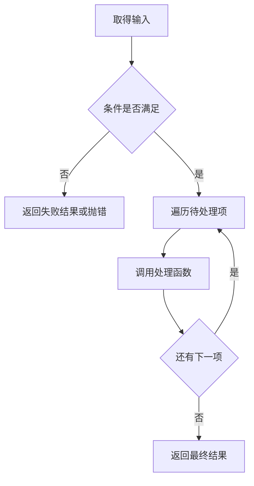
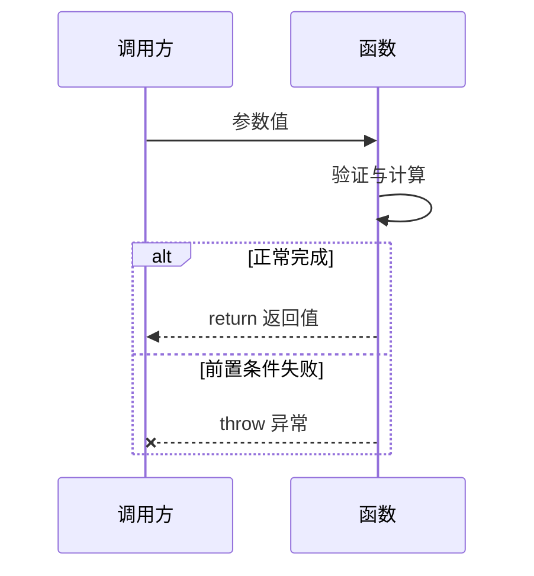

# JavaScript 条件、循环、函数与递归

控制流决定语句的执行顺序，函数为一段逻辑定义输入、输出和可复用边界，递归则让函数把问题缩小后再次调用自身。可靠代码必须能说明每条路径何时进入、何时退出、返回什么，以及输入不满足条件时如何失败。

## 1. 控制流的基本模型

JavaScript 默认从上到下执行语句。条件会选择分支，循环会跳回一段代码，函数调用会进入新的执行上下文，`return`、`break`、`continue` 和 `throw` 会改变默认方向。



设计控制流时先写清入口、正常出口、失败出口和循环终止条件，再选择具体语法。

## 2. 块与条件分支

块语句用花括号把多条语句组成一组。`let` 和 `const` 声明受块作用域限制。

```js
const score = 82;

if (score >= 60) {
  const result = 'passed';
  console.log(result);
}

// console.log(result); // ReferenceError：result 只在块内存在
```

即使分支只有一条语句，也保留花括号。这样增加语句时不会意外把它放到分支外。

### 2.1 `if`、`else if` 与 `else`

`if` 会将条件按真值规则判断。多个 `else if` 从上到下检查，只执行第一条成立的分支；`else` 处理剩余输入。

```js
function shippingFee(totalCents) {
  if (!Number.isSafeInteger(totalCents) || totalCents < 0) {
    throw new RangeError('订单金额必须是非负安全整数');
  }

  if (totalCents >= 10_000) {
    return 0;
  }
  if (totalCents >= 5_000) {
    return 500;
  }
  return 800;
}
```

分支顺序是行为的一部分。这里必须先检查 `>= 10_000`；若先检查 `>= 5_000`，高金额订单会提前匹配并错误收取 500 分。

条件应直接表达业务判断。不要把赋值误写成条件：

```js
let status = 'draft';

// if (status = 'published') { ... } // 赋值结果是真值，分支总会进入
if (status === 'published') {
  console.log('已发布');
}
```

### 2.2 提前返回与嵌套

验证失败时提前返回或抛错，可以减少嵌套，并让正常路径保持连续。

```js
function displayName(user) {
  if (user === null || typeof user !== 'object') {
    return '匿名用户';
  }
  if (typeof user.nickname !== 'string') {
    return '匿名用户';
  }

  const normalized = user.nickname.trim();
  return normalized === '' ? '匿名用户' : normalized;
}
```

提前返回不是要求所有函数都只有一层判断。若多个分支代表同等重要的业务状态，清晰的 `if/else` 或 `switch` 更合适。

### 2.3 条件表达式

三元条件运算符 `condition ? valueA : valueB` 是表达式，适合从两个简单值中选择一个。

```js
const badge = isActive ? '启用' : '停用';
```

不要把多个有副作用的操作或多层嵌套条件塞进三元表达式。需要多步处理时改用语句和具名函数。

## 3. `switch` 与贯穿执行

`switch` 对表达式求值，再用严格相等语义与各 `case` 标签匹配。找到匹配项后从该位置开始执行；如果没有 `break`、`return` 或 `throw`，会继续执行后续 case，这叫贯穿。

```js
function statusLabel(status) {
  switch (status) {
    case 'draft':
      return '草稿';
    case 'reviewing':
      return '审核中';
    case 'published':
      return '已发布';
    default:
      throw new RangeError(`未知状态：${status}`);
  }
}
```

多个标签共用处理时，可以有意使用空 case 贯穿，并加注释表达意图。

```js
function canEdit(role) {
  switch (role) {
    case 'owner':
    case 'editor':
      return true;
    case 'viewer':
      return false;
    default:
      throw new RangeError(`未知角色：${role}`);
  }
}
```

`default` 不一定必须写在末尾，但放在末尾更易读。有限状态若遗漏处理会形成静默错误，默认分支抛错通常比随意返回一个值更容易发现协议变化。

## 4. 循环结构与选择

循环必须有三个要素：初始状态、继续条件和使条件最终为假的进展。遍历集合时还要选择正确的协议。

| 结构 | 适合场景 | 关键点 |
| --- | --- | --- |
| `for` | 明确索引、步长或次数 | 初始化、条件、更新集中出现 |
| `while` | 次数未知，先判断再执行 | 可能执行零次 |
| `do...while` | 至少执行一次 | 先执行后判断 |
| `for...of` | 遍历可迭代值 | 直接取得元素值 |
| `for...in` | 枚举对象的可枚举字符串键 | 会包含继承的可枚举键，不应用于数组值遍历 |

### 4.1 计数循环与边界

```js
const pages = ['HTML', 'CSS', 'JavaScript'];

for (let index = 0; index < pages.length; index += 1) {
  console.log(index, pages[index]);
}
```

数组最后一个索引是 `length - 1`，所以继续条件通常是 `index < length`。写成 `<=` 会多访问一次并得到 `undefined`。

如果无需索引，`for...of` 更直接。

```js
for (const page of pages) {
  console.log(page);
}
```

若同时需要索引和值，可遍历 `entries()`。

```js
for (const [index, page] of pages.entries()) {
  console.log(`${index + 1}. ${page}`);
}
```

### 4.2 `while` 与 `do...while`

`while` 适合“只要条件成立就继续”的流程，但更新状态必须可观察。

```js
function findFirstPositive(values) {
  let index = 0;

  while (index < values.length) {
    if (values[index] > 0) {
      return values[index];
    }
    index += 1;
  }

  return undefined;
}
```

`do...while` 会先执行一次，适合确实要求首次执行的流程；不要仅为了少写一行初始化而选择它。

```js
let attempt = 0;
do {
  attempt += 1;
  console.log(`第 ${attempt} 次检查`);
} while (attempt < 3);
```

浏览器主线程中的长时间同步循环会阻止渲染和交互。批量处理不是只要“最终终止”就足够，还要控制单次工作量；事件循环与任务拆分会在后续专篇讨论。

### 4.3 `for...in` 的边界

`for...in` 枚举对象自身和原型链上的可枚举字符串属性名。若只需要对象自身键，通常先使用 `Object.keys()`、`Object.values()` 或 `Object.entries()`。

```js
const scores = { html: 90, css: 85 };

for (const [topic, score] of Object.entries(scores)) {
  console.log(topic, score);
}
```

数组索引只是属性键，`for...in` 不能保证表达“按数组元素值遍历”的意图，也可能遇到额外可枚举属性；数组使用 `for...of` 或数组迭代方法。

## 5. `break`、`continue` 与标签

`break` 终止当前循环或 `switch`；`continue` 跳过当前循环的剩余部分，进入下一次迭代。

```js
const values = [3, -1, 7, 0, 9];
let sum = 0;

for (const value of values) {
  if (value < 0) continue;
  if (value === 0) break;
  sum += value;
}

console.log(sum); // 10
```

这里 `-1` 被跳过，遇到 `0` 后整个循环结束，所以 `9` 未处理。调试时应分别确认“跳过一项”和“终止全部”是否符合需求。

标签可以让 `break` 或 `continue` 指向外层循环，但复杂标签经常暗示逻辑需要拆成函数。

```js
const rows = [];
rows.push([1, 2], [3, 4]);

outer: for (const row of rows) {
  for (const value of row) {
    if (value === 3) break outer;
    console.log(value);
  }
}
```

输出 `1`、`2`，遇到 `3` 后退出两层循环。

## 6. 函数是可调用的值

函数把一段行为封装成可调用值。调用时，实参与形参建立关联，函数体执行，最后得到返回值或异常。



### 6.1 函数声明、函数表达式与箭头函数

```js
function add(a, b) {
  return a + b;
}

const subtract = function (a, b) {
  return a - b;
};

const multiply = (a, b) => a * b;
```

函数声明在其作用域实例化时创建绑定，因此可以在源码中的声明之前调用。函数表达式和箭头函数要等右侧求值并完成绑定初始化后才能调用。

箭头函数没有自己的 `this`、`arguments` 和 `new.target`，也不能作为构造函数。需要对象方法动态 `this` 或构造能力时不要机械改成箭头函数；对象模型专篇会展开这些差异。

### 6.2 参数、实参与默认值

形参是函数定义中的名称，实参是调用时传入的值。少传的形参得到 `undefined`，多传的实参不会自动报错。

```js
function greet(name, punctuation = '！') {
  return `你好，${name}${punctuation}`;
}

console.log(greet('狸力'));      // 你好，狸力！
console.log(greet('狸力', '.')); // 你好，狸力.
```

默认参数只在实参是 `undefined` 或缺失时生效；传入 `null` 不会触发默认值。

```js
function pageSize(value = 20) {
  return value;
}

console.log(pageSize());          // 20
console.log(pageSize(undefined)); // 20
console.log(pageSize(null));      // null
```

默认参数从左到右初始化，后面的默认值可以引用前面的参数，反向引用会失败。

```js
function range(start, end = start + 10) {
  return [start, end];
}
```

### 6.3 剩余参数与展开语法

剩余参数把尚未匹配的实参收集为真正的数组，并且必须位于参数列表末尾。

```js
function sum(...numbers) {
  let total = 0;
  for (const number of numbers) {
    total += number;
  }
  return total;
}

console.log(sum(1, 2, 3)); // 6
```

调用位置的展开语法把可迭代值展开成多个实参。

```js
const input = [4, 8, 2];
console.log(Math.max(...input)); // 8
```

不要对可能极大的数组使用展开调用，因为引擎对实参数量有限制；大集合使用循环或归约。

### 6.4 参数传递的准确含义

JavaScript 总是按值传递。传入原始值时复制该值；传入对象时复制的是对象引用值，因此函数可通过引用修改同一个对象，但不能通过重新赋值形参替换调用方的绑定。

```js
function update(user) {
  user.name = 'new';       // 修改共享对象，可在外部观察
  user = { name: 'local' };// 只改变局部形参绑定
}

const user = { name: 'old' };
update(user);
console.log(user); // { name: 'new' }
```

为了降低副作用，可返回新对象，让调用方明确决定是否保存结果。

```js
function renameUser(user, name) {
  return { ...user, name };
}
```

浅复制不会递归复制嵌套对象；对象与集合专篇会说明这一边界。

## 7. 返回值、异常与函数契约

`return expression` 立即结束当前函数并返回表达式的值。裸 `return` 或运行到函数末尾都返回 `undefined`。

```js
function normalizeTitle(title) {
  if (typeof title !== 'string') return undefined;
  const value = title.trim();
  if (value === '') return undefined;
  return value;
}
```

所有正常路径最好返回同一类数据。若“未找到”是预期状态，可约定返回 `undefined`；若输入违反函数前置条件，通常抛出 `TypeError` 或 `RangeError` 更合适。关键是调用方能够区分预期缺失与程序错误。

自动分号插入会使换行后的 `return` 提前结束：

```js
function createResult() {
  return {
    ok: true,
  };
}
```

不要写成 `return` 后换行再写对象字面量，否则返回 `undefined`。

函数的完整契约至少包括：

- 接受哪些输入类型和范围；
- 是否修改参数或外部状态；
- 正常返回值的结构；
- 哪些情况返回缺失值；
- 哪些情况抛出哪类异常。

## 8. 纯函数与副作用

给定相同输入总得到相同输出，且不修改外部可观察状态的函数称为纯函数。网络请求、DOM 修改、日志、读取当前时间、随机数和修改外部对象都属于副作用或外部依赖。

```js
function lineTotal(unitPriceCents, quantity) {
  return unitPriceCents * quantity;
}

function reportTotal(totalCents) {
  console.log(`total=${totalCents}`); // 副作用集中在边界
}
```

纯函数更容易测试，但产品代码必然需要副作用。可维护的做法是把计算和副作用分层，而不是宣称所有函数都必须纯。

## 9. 递归的结构

递归函数直接或间接调用自身。一个正确的递归必须包含：

1. 基线条件：无需继续递归时直接返回。
2. 规模缩小：每次调用都更接近基线。
3. 组合规则：把子问题结果组成当前结果。

```js
function factorial(n) {
  if (!Number.isInteger(n) || n < 0) {
    throw new RangeError('n 必须是非负整数');
  }
  if (n <= 1) {
    return 1;
  }
  return n * factorial(n - 1);
}

console.log(factorial(5)); // 120
```

求值过程是 `5 * factorial(4)`，继续缩小到 `factorial(1)`，随后按相反方向组合。遗漏基线或没有缩小问题都会导致无限递归，最终出现调用栈溢出。

### 9.1 树遍历案例

递归适合与树形数据的嵌套结构对应。

```js
const roadmap = {
  title: '前端',
  children: [
    { title: 'HTML', children: [] },
    {
      title: 'JavaScript',
      children: [{ title: '异步', children: [] }],
    },
  ],
};

function collectTitles(node) {
  if (node === null || typeof node !== 'object') {
    throw new TypeError('节点必须是对象');
  }
  if (!Array.isArray(node.children)) {
    throw new TypeError('children 必须是数组');
  }

  const titles = [node.title];
  for (const child of node.children) {
    titles.push(...collectTitles(child));
  }
  return titles;
}

console.log(collectTitles(roadmap));
// ['前端', 'HTML', 'JavaScript', '异步']
```

这个版本假设输入是有限、无环的树。若输入可能是图，节点可能互相引用，必须用 `Set` 记录已访问节点以避免重复和无限循环。

### 9.2 调用栈与显式栈

每次普通函数调用都会占用调用栈空间。引擎允许的深度没有跨环境固定保证，因此用户生成的深层树不应依赖递归一定成功。可改用数组维护显式栈。

```js
function collectTitlesIterative(root) {
  const titles = [];
  const stack = [root];
  const visited = new Set();

  while (stack.length > 0) {
    const node = stack.pop();
    if (visited.has(node)) continue;
    visited.add(node);

    titles.push(node.title);
    for (let index = node.children.length - 1; index >= 0; index -= 1) {
      stack.push(node.children[index]);
    }
  }

  return titles;
}
```

逆序压栈可保持与前序递归相同的输出顺序。显式栈仍会使用内存，但不受 JavaScript 调用栈深度直接限制，也更方便暂停、记录进度和加访问集合。

## 10. 完整案例：计算课程完成摘要

输入是学习记录数组。目标是忽略标记为删除的记录，遇到非法记录立即失败，统计完成数量和总分钟数，并给出完成率。

```js
const records = [
  { id: 'html-01', status: 'done', minutes: 35 },
  { id: 'css-01', status: 'learning', minutes: 20 },
  { id: 'old-note', status: 'deleted', minutes: 10 },
  { id: 'js-01', status: 'done', minutes: 45 },
];
```

### 10.1 处理函数

```js
const ACTIVE_STATUSES = new Set(['learning', 'done']);

function assertRecord(record) {
  if (record === null || typeof record !== 'object') {
    throw new TypeError('记录必须是对象');
  }
  if (typeof record.id !== 'string' || record.id.trim() === '') {
    throw new TypeError('记录 id 必须是非空字符串');
  }
  if (!Number.isSafeInteger(record.minutes) || record.minutes < 0) {
    throw new RangeError(`${record.id} 的 minutes 必须是非负安全整数`);
  }
}

function summarize(records) {
  if (!Array.isArray(records)) {
    throw new TypeError('records 必须是数组');
  }

  let activeCount = 0;
  let completedCount = 0;
  let totalMinutes = 0;

  for (const record of records) {
    assertRecord(record);

    if (record.status === 'deleted') {
      continue;
    }
    if (!ACTIVE_STATUSES.has(record.status)) {
      throw new RangeError(`${record.id} 的状态无效`);
    }

    activeCount += 1;
    totalMinutes += record.minutes;
    if (record.status === 'done') {
      completedCount += 1;
    }
  }

  const completionRate = activeCount === 0
    ? 0
    : completedCount / activeCount;

  return { activeCount, completedCount, totalMinutes, completionRate };
}

console.log(summarize(records));
```

### 10.2 输出与证据

```js
const expectedSummary = {
  activeCount: 3,
  completedCount: 2,
  totalMinutes: 100,
  completionRate: 0.6666666666666666,
};

console.log(expectedSummary);
```

删除记录通过 `continue` 跳过；状态集合限制合法分支；完成数只在 `done` 分支增加；空集合单独处理，避免 `0 / 0` 得到 `NaN`。格式化百分比应留在展示层，统计层保留原始比例。

### 10.3 失败注入

```js
const invalidInputs = [
  null,
  [{ id: '', status: 'done', minutes: 1 }],
  [{ id: 'js', status: 'unknown', minutes: 1 }],
  [{ id: 'js', status: 'done', minutes: -1 }],
];

for (const input of invalidInputs) {
  try {
    summarize(input);
  } catch (error) {
    console.log(error.name, error.message);
  }
}
```

验证时还应覆盖空数组、全部删除、全部未完成、分钟数为零和安全整数上界。若总分钟数可能溢出安全整数，还需在每次累加后检查结果或采用明确的大整数协议。

## 11. 调试清单

控制流出现错误时，依次检查：

1. 条件表达式的实际值和类型，而不只看其真值。
2. 多分支顺序是否把更具体的条件放在更宽条件之前。
3. `switch` 是否遗漏 `return`/`break`，贯穿是否有意。
4. 循环初始值、边界和更新步骤是否共同保证终止。
5. `break` 和 `continue` 实际影响的是哪一层循环。
6. 函数是否存在未返回值的正常路径。
7. 参数对象是否被函数意外修改。
8. 递归输入是否有限、无环并持续缩小。
9. 深度是否由外部输入控制，是否需要显式栈。
10. 异常是否在能真正恢复的边界处理，而不是被空 `catch` 吞掉。

## 12. 练习与完成标准

实现一个目录树统计器，返回节点总数、叶子节点数和最大深度：

- 输入节点必须包含非空 `id` 和数组 `children`。
- 同一个对象再次出现时判定为环并抛错。
- 先实现递归版，再实现显式栈版。
- 为单节点、三层树、空 children、非法节点、共享节点和环写测试。
- 两个实现对合法输入必须输出相同结果。

完成标准是：能说明基线条件和规模如何缩小；深度定义统一；异常路径可验证；对外部不受控深度优先使用显式栈版本。

## 来源

- [MDN：Control flow and error handling](https://developer.mozilla.org/en-US/docs/Web/JavaScript/Guide/Control_flow_and_error_handling)（访问日期：2026-07-17）
- [MDN：Loops and iteration](https://developer.mozilla.org/en-US/docs/Web/JavaScript/Guide/Loops_and_iteration)（访问日期：2026-07-17）
- [MDN：Functions](https://developer.mozilla.org/en-US/docs/Web/JavaScript/Guide/Functions)（访问日期：2026-07-17）
- [ECMAScript® Language Specification：ECMAScript Language Functions and Classes](https://tc39.es/ecma262/multipage/ecmascript-language-functions-and-classes.html)（访问日期：2026-07-17）
