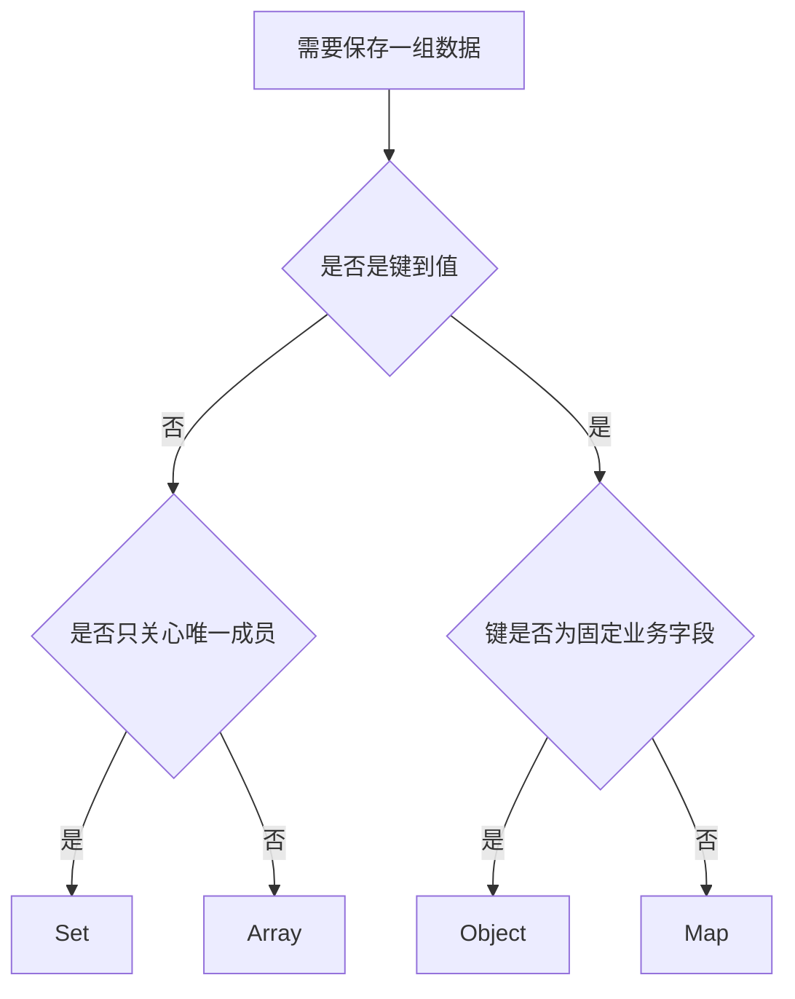

# JavaScript Array、Object、String、Map、Set 与 Date

这些内置对象承担日常数据建模：Array 表示有顺序的元素序列，Object 表示以属性名组织的记录，String 表示不可变文本，Map 和 Set 提供明确的键值与成员集合语义，Date 用一个数值表示时间轴上的毫秒级时间点。正确选择结构会直接影响查找方式、顺序、重复规则、可变性和序列化结果。

## 1. 先按数据语义选择结构

| 需求 | 首选结构 | 选择依据 |
| --- | --- | --- |
| 有顺序、允许重复、按位置访问 | Array | 整数索引和 `length` |
| 固定字段组成一条业务记录 | Object | 字符串或 Symbol 属性键 |
| 任意类型键到值的动态映射 | Map | 键不强制转字符串，保留插入顺序 |
| 唯一成员集合 | Set | SameValueZero 成员判定 |
| 文本内容 | String | 不可变 UTF-16 码元序列 |
| 时间轴上的一个时间点 | Date | 内部保存自 Unix epoch 起的毫秒数 |



数据结构不是互斥的。常见模型是“Array 保持展示顺序，Map 提供按 id 查找，Object 表示每一项，Set 记录选择状态”。

## 2. Array：有序、可变、零基索引

Array 是特殊对象。元素从索引 0 开始，`length` 通常比最高索引大 1，但它不是简单的“已有元素数量”。

```js
const topics = ['HTML', 'CSS', 'JavaScript'];

console.log(topics[0]);      // HTML
console.log(topics.at(-1));  // JavaScript
console.log(topics.length);  // 3
console.log(Array.isArray(topics)); // true
```

`at(index)` 接受负索引；越界返回 `undefined`。方括号访问中的 `topics[-1]` 不是倒数索引，而是名为 `'-1'` 的普通属性。

### 2.1 创建与单参数陷阱

数组字面量通常最清楚。

```js
const empty = [];
const oneNumber = [3];
const values = Array.of(3); // [3]
const holes = Array(3);     // 长度 3，但没有三个 undefined 元素
```

`Array(3)` 的单个整数参数表示长度；`Array.of(3)` 表示包含数值 3 的一个元素。`Array.from(iterableOrArrayLike, mapFn?)` 可从可迭代或类数组数据创建数组，并可同时映射。

```js
console.log(Array.from('狸力')); // ['狸', '力']
console.log(Array.from({ length: 3 }, (_, index) => index + 1));
// [1, 2, 3]
```

`Array(1.5)` 会因无效长度抛出 `RangeError`。

### 2.2 `length`、空槽与 `undefined`

直接给较远索引赋值会产生空槽；缩短 `length` 会删除超出新长度的元素。

```js
const sparse = ['first'];
sparse[3] = 'fourth';

console.log(sparse.length); // 4
console.log(1 in sparse);   // false，索引 1 是空槽
console.log(sparse[1]);     // undefined

sparse.length = 1;
console.log(sparse);        // ['first']
```

空槽和显式 `undefined` 读取时都可能得到 `undefined`，但属性是否存在不同，迭代方法对它们的行为也可能不同。业务数组应尽量保持稠密，不通过删除索引或跳跃赋值制造空槽。

```js
const withHole = [1, , 3];
const withUndefined = [1, undefined, 3];

console.log(withHole.map((value) => value * 2));
// [2, <空槽>, 6]，map 不调用空槽回调

console.log([...withHole]);
// [1, undefined, 3]，迭代会产生 undefined

console.log(1 in withHole);      // false
console.log(1 in withUndefined); // true
```

### 2.3 会修改原数组的方法

| 方法 | 作用 | 返回值 |
| --- | --- | --- |
| `push(...items)` | 尾部添加 | 新长度 |
| `pop()` | 删除尾部一项 | 被删元素或 `undefined` |
| `unshift(...items)` | 头部添加 | 新长度 |
| `shift()` | 删除头部一项 | 被删元素或 `undefined` |
| `splice(start, deleteCount, ...items)` | 删除、替换或插入 | 被删元素组成的新数组 |
| `sort(compareFn?)` | 原地排序 | 原数组引用 |
| `reverse()` | 原地反转 | 原数组引用 |
| `fill(value, start?, end?)` | 区间填充 | 原数组引用 |
| `copyWithin(target, start, end?)` | 原地复制区间 | 原数组引用 |

```js
const queue = ['HTML', 'CSS'];
const length = queue.push('JavaScript');
const first = queue.shift();

console.log(length); // 3
console.log(first);  // HTML
console.log(queue);  // ['CSS', 'JavaScript']
```

头部增删通常需要移动后续索引；大规模先进先出队列不应反复 `shift()`，可维护读取索引或使用适合的队列实现。

`sort()` 默认把元素转成字符串并按 UTF-16 码元顺序比较，所以数值排序必须提供比较函数。

```js
const scores = [2, 100, 20];
console.log([...scores].sort());           // [100, 2, 20]
console.log([...scores].sort((a, b) => a - b)); // [2, 20, 100]
```

比较函数负数表示 `a` 排在 `b` 前，正数表示后，零表示同序关系。比较函数应对相同输入给出一致结果，不要在其中修改数组或依赖随机值。

### 2.4 返回新数组或值的方法

| 方法 | 回调/参数 | 返回值和短路行为 |
| --- | --- | --- |
| `map(fn)` | `(value, index, array)` | 等长新数组 |
| `filter(fn)` | 同上 | 通过真值检查的元素组成新数组 |
| `find(fn)` / `findLast(fn)` | 同上 | 首个/末个匹配元素，找不到为 `undefined` |
| `findIndex(fn)` / `findLastIndex(fn)` | 同上 | 匹配索引，找不到为 `-1` |
| `some(fn)` | 同上 | 任一满足即返回 `true` 并短路 |
| `every(fn)` | 同上 | 任一不满足即返回 `false` 并短路 |
| `reduce(fn, initial)` | `(acc, value, index, array)` | 最终累加值 |
| `slice(start?, end?)` | 左闭右开索引 | 浅复制的新数组 |
| `concat(...values)` | 数组或值 | 连接后的新数组 |
| `flat(depth?)` | 展开深度，默认 1 | 扁平化新数组 |
| `flatMap(fn)` | 映射后展开一层 | 新数组 |
| `includes(value, fromIndex?)` | SameValueZero | Boolean |
| `indexOf(value, fromIndex?)` | 严格相等 | 首个索引或 `-1` |

```js
const lessons = [
  { id: 'html', minutes: 20, done: true },
  { id: 'css', minutes: 35, done: false },
  { id: 'js', minutes: 45, done: true },
];

const completedIds = lessons
  .filter((lesson) => lesson.done)
  .map((lesson) => lesson.id);

const totalMinutes = lessons.reduce(
  (total, lesson) => total + lesson.minutes,
  0,
);

console.log(completedIds); // ['html', 'js']
console.log(totalMinutes); // 100
```

`reduce()` 对空数组且没有初始值时抛出 `TypeError`。提供与结果类型相符的初始值，使空输入行为明确。

```js
console.log([].reduce((sum, value) => sum + value, 0)); // 0
// [].reduce((sum, value) => sum + value); // TypeError
```

现代数组还提供不修改原数组的对应方法：`toSorted()`、`toReversed()`、`toSpliced()` 和 `with(index, value)`。使用前按项目目标环境确认支持或构建转换策略。

```js
const original = [3, 1, 2];
const sorted = original.toSorted((a, b) => a - b);

console.log(original); // [3, 1, 2]
console.log(sorted);   // [1, 2, 3]
```

### 2.5 浅复制边界

`slice()`、展开语法、`concat()` 和 copy-by-change 方法只复制数组结构；嵌套对象仍是同一引用。

```js
const source = [{ progress: 0 }];
const copy = source.slice();
copy[0].progress = 1;

console.log(source[0].progress); // 1
```

需要更新嵌套数据时，复制沿途每一层或使用明确的数据更新工具。深复制将在结构化克隆专篇讨论。

## 3. Object：业务记录与属性

普通对象的属性键只能是 String 或 Symbol。方括号中的其他值会转换成属性键，因此数值键最终也是字符串键。

```js
const lesson = {
  id: 'js-03',
  title: '内置集合',
  done: false,
};

console.log(lesson.title);       // 内置集合
console.log(lesson['done']);     // false
console.log(lesson[1] === lesson['1']); // true
```

点语法适合合法且固定的标识符键；方括号适合动态键、含连字符的键和 Symbol 键。

### 3.1 存在、读取与删除

读取不存在的属性返回 `undefined`，但这不能区分“属性不存在”和“属性存在且值为 undefined”。

```js
const record = { note: undefined };

console.log(record.note);                    // undefined
console.log(record.missing);                 // undefined
console.log(Object.hasOwn(record, 'note'));  // true
console.log(Object.hasOwn(record, 'missing'));// false
console.log('toString' in record);            // true，来自原型链
```

`Object.hasOwn(object, key)` 只检查自有属性；`key in object` 同时检查原型链。删除可配置属性使用 `delete object[key]`，若模型需要固定字段，赋 `null` 或建立新对象通常比动态删除更容易维护。

### 3.2 枚举与顺序

```js
const user = { id: 7, name: 'Lili' };

console.log(Object.keys(user));    // ['id', 'name']
console.log(Object.values(user));  // [7, 'Lili']
console.log(Object.entries(user)); // 两个二元数组：['id', 7] 与 ['name', 'Lili']

const copy = Object.fromEntries(Object.entries(user));
```

这些方法处理对象自身的可枚举字符串键，不包含 Symbol 键。普通对象存在规范定义的属性顺序规则，但若业务核心就是动态插入顺序和频繁增删，Map 的语义更直接。

### 3.3 原型与字典对象

普通对象继承 `Object.prototype`。处理外部键时，不应调用可能被覆盖的 `obj.hasOwnProperty(key)`，应使用 `Object.hasOwn()`。

```js
const payload = { hasOwnProperty: 'not a function' };
console.log(Object.hasOwn(payload, 'hasOwnProperty')); // true
```

`Object.create(null)` 可创建没有原型的字典，但它缺少普通对象方法，序列化和工具展示也可能不同。动态映射通常优先考虑 Map。

### 3.4 合并不是深合并

对象展开和 `Object.assign(target, ...sources)` 复制源对象自身可枚举属性。后写入的同名键覆盖前面，嵌套对象仍共享引用。`Object.assign()` 会修改 target，对象展开创建新对象。

```js
const defaults = { theme: 'light', panel: { width: 300 } };
const preferences = { theme: 'dark' };
const settings = { ...defaults, ...preferences };

console.log(settings); // { theme: 'dark', panel: { width: 300 } }
console.log(settings.panel === defaults.panel); // true
```

属性访问器在复制过程中可能被读取；展开结果创建普通数据属性，不会保留原对象完整的属性描述符和原型。

## 4. String：不可变 UTF-16 文本

String 原始值不可变。`length` 和数字索引按 UTF-16 码元工作；字符串是可迭代的，迭代按 Unicode 码点前进。

```js
const text = 'A😀B';

console.log(text.length); // 4
console.log(text[1]);     // 高代理项，不是完整 emoji
console.log([...text]);   // ['A', '😀', 'B']
```

### 4.1 常用查询与转换

| 方法 | 参数 | 返回值 |
| --- | --- | --- |
| `includes(search, position?)` | 子串、起始位置 | Boolean |
| `startsWith(search, position?)` | 前缀、位置 | Boolean |
| `endsWith(search, endPosition?)` | 后缀、结束位置 | Boolean |
| `indexOf(search, position?)` | 子串、起始位置 | 索引或 `-1` |
| `slice(start, end?)` | 左闭右开，可负索引 | 新字符串 |
| `substring(start, end?)` | 非负语义，会交换反向参数 | 新字符串 |
| `split(separator, limit?)` | 字符串或正则、数量上限 | 数组 |
| `replace(pattern, replacement)` | 字符串只替换首个匹配 | 新字符串 |
| `replaceAll(pattern, replacement)` | 全部匹配；全局正则 | 新字符串 |
| `trim()` | 无 | 去除两端空白的新字符串 |
| `toUpperCase()` / `toLowerCase()` | 无 | 大小写转换后的新字符串 |

```js
const rawTags = ' html, css, javascript ';
const tags = rawTags
  .split(',')
  .map((tag) => tag.trim())
  .filter((tag) => tag !== '');

console.log(tags); // ['html', 'css', 'javascript']
```

大小写转换不是适用于所有语言的唯一比较策略；面向用户的排序、搜索与显示需要结合 locale，通常使用 `Intl.Collator` 等国际化能力，而不是简单 `toLowerCase()` 后比较全部语言。

### 4.2 字符串包装与属性访问

调用字符串方法时，引擎会提供包装对象式的属性访问体验，但原始字符串仍不可变。不要使用 `new String('x')` 创建 String 对象，因为对象真值、相等与序列化语义会与字符串原始值不同。

```js
console.log(Boolean(''));              // false
console.log(Boolean(new String('')));  // true，对象始终是真值
console.log(new String('x') === 'x');  // false
```

## 5. Map：动态键值映射

Map 的键可以是任意 ECMAScript 值，包含对象、函数、`NaN`。条目按首次插入顺序迭代，键使用 SameValueZero 比较。

```js
const byId = new Map();
byId.set('html', { title: 'HTML' });
byId.set('css', { title: 'CSS' });

console.log(byId.get('html')); // { title: 'HTML' }
console.log(byId.has('js'));   // false
console.log(byId.size);        // 2
```

| API | 作用 | 返回值 |
| --- | --- | --- |
| `set(key, value)` | 新增或更新 | Map 自身，可链式调用 |
| `get(key)` | 读取 | 值或 `undefined` |
| `has(key)` | 检查键存在 | Boolean |
| `delete(key)` | 删除键 | 是否成功删除 |
| `clear()` | 清空 | `undefined` |
| `keys()` / `values()` / `entries()` | 按插入顺序迭代 | 迭代器 |
| `forEach(fn)` | 依次调用 `fn(value, key, map)` | `undefined` |

`get()` 返回 `undefined` 不能独自判断键是否存在，值本身可以是 `undefined`；需要区分时调用 `has()`。

```js
const cacheEntries = [];
cacheEntries.push(['known', undefined]);
const cache = new Map(cacheEntries);
console.log(cache.get('known')); // undefined
console.log(cache.has('known')); // true
```

对象键按身份比较。

```js
const key = { id: 1 };
const entries = [];
entries.push([key, 'saved']);
const map = new Map(entries);

console.log(map.get(key));       // saved
console.log(map.get({ id: 1 })); // undefined，不是同一对象
```

Map 不能被 `JSON.stringify()` 默认表示为条目；必须根据协议转成数组或对象，并考虑非字符串键是否可恢复。

```js
const serialized = JSON.stringify([...byId]);
const restored = new Map(JSON.parse(serialized));
```

这只适合键和值本身可被 JSON 无损表示的情况。

## 6. Set：唯一成员集合

Set 只保存成员，不保存重复项，并按首次插入顺序迭代。成员使用 SameValueZero 比较，所以能识别 `NaN` 为同一成员，`+0` 与 `-0` 也视为相同。

```js
const tags = new Set(['html', 'css', 'html', NaN, NaN]);

console.log(tags.size);      // 3
console.log(tags.has('css'));// true
console.log([...tags]);      // ['html', 'css', NaN]
```

| API | 作用 | 返回值 |
| --- | --- | --- |
| `add(value)` | 添加成员 | Set 自身 |
| `has(value)` | 检查成员 | Boolean |
| `delete(value)` | 删除成员 | 是否成功删除 |
| `clear()` | 清空 | `undefined` |
| `values()` / `keys()` | 按插入顺序迭代；两者在 Set 等价 | 迭代器 |
| `entries()` | 产生 `[value, value]` | 迭代器 |

使用 Set 对原始值数组去重简单直接。

```js
const uniqueTags = [...new Set(['html', 'css', 'html'])];
```

对象仍按身份判重，不能按字段自动合并。

```js
const users = new Set([{ id: 1 }, { id: 1 }]);
console.log(users.size); // 2
```

按业务 id 去重可用 Map：后出现的同 id 值覆盖先出现的值。

```js
const uniqueUsers = [
  ...new Map(usersArray.map((user) => [user.id, user])).values(),
];
```

Set 的集合组合方法在现代规范中包括交集、并集、差集和关系判断；采用时仍按项目支持矩阵检查运行环境。基础逻辑也可显式实现：

```js
function intersection(left, right) {
  return new Set([...left].filter((value) => right.has(value)));
}
```

## 7. Date：时间点，不是业务时区模型

Date 内部保存一个 Number：自 1970-01-01T00:00:00Z 起经过的毫秒数。Date 对象不存储“Asia/Shanghai”这样的 IANA 时区；本地 getter/setter 根据运行环境的当前本地时区解释同一时间点，UTC 方法按协调世界时解释。

```js
const instant = new Date('2026-07-17T09:00:00+08:00');

console.log(instant.getTime());
console.log(instant.toISOString()); // 2026-07-17T01:00:00.000Z
```

两个字符串指向同一时间点时，`getTime()` 相同，即使写出的偏移不同。

### 7.1 创建与解析

```js
const now = new Date();
const fromMilliseconds = new Date(0);
const fromIso = new Date('2026-07-17T09:00:00+08:00');
const localFields = new Date(2026, 6, 17, 9, 0, 0); // 月份从 0 开始
```

字段构造器中的月份 0 表示一月、6 表示七月，并按本地时区解释。字符串解析只应依赖规范保证的 date time string format；非标准日期字符串的兼容解析可能因环境不同而变化。

ISO 形式还要区分：仅日期的 `'2026-07-17'` 按 UTC 日期解释；不带偏移的日期时间 `'2026-07-17T09:00:00'` 按本地时间解释。跨系统协议应带 `Z` 或显式偏移，避免部署环境改变含义。

```js
const timestamp = Date.parse('2026-07-17T01:00:00Z');
console.log(Number.isNaN(timestamp)); // false

const invalid = new Date('not-a-date');
console.log(Number.isNaN(invalid.getTime())); // true
```

无效 Date 对象仍是 Date 实例；大多数读取返回 `NaN`，`toISOString()` 会抛出 `RangeError`。解析后立即检查 `getTime()`。

### 7.2 本地方法与 UTC 方法

| 本地解释 | UTC 解释 | 内容 |
| --- | --- | --- |
| `getFullYear()` | `getUTCFullYear()` | 年 |
| `getMonth()` | `getUTCMonth()` | 月，0–11 |
| `getDate()` | `getUTCDate()` | 月内日期 |
| `getDay()` | `getUTCDay()` | 星期，0 为星期日 |
| `getHours()` | `getUTCHours()` | 小时 |
| `setHours(...)` | `setUTCHours(...)` | 修改对应字段 |

所有 setter 都修改 Date 对象本身。复制 Date 应用毫秒值创建新实例。

```js
const start = new Date('2026-07-17T01:00:00Z');
const copy = new Date(start.getTime());
copy.setUTCDate(copy.getUTCDate() + 1);

console.log(start.toISOString()); // 原对象不变
console.log(copy.toISOString());
```

按本地字段增加一天与增加固定 86,400,000 毫秒不是所有时区都等价，因为夏令时转换日可能不是 24 小时。业务要先定义是在时间轴上增加固定时长，还是在某个时区的日历上移到下一天。

### 7.3 比较、排序与格式化

Date 对象之间用 `===` 比较的是对象身份，不是时间点。比较时间点使用 `getTime()` 或数值转换。

```js
const a = new Date('2026-07-17T01:00:00Z');
const b = new Date('2026-07-17T09:00:00+08:00');

console.log(a === b);                 // false
console.log(a.getTime() === b.getTime()); // true
```

协议输出使用 `toISOString()` 获得 UTC ISO 字符串。面向用户显示应通过 `Intl.DateTimeFormat` 指定 locale、字段和需要的 `timeZone`，不要依赖 `Date.prototype.toString()` 的环境默认格式。

```js
const formatter = new Intl.DateTimeFormat('zh-CN', {
  dateStyle: 'medium',
  timeStyle: 'short',
  timeZone: 'Asia/Shanghai',
});

console.log(formatter.format(a));
```

Date 的可表示范围受 TimeClip 限制；超出范围会产生无效日期。它也不直接解决纯日期、重复日程、时区规则变更等领域模型问题。

## 8. 完整案例：汇总学习记录

输入是跨设备同步的学习事件。时间字段必须是带 `Z` 或显式偏移的 ISO 日期时间，标签需要去重，按模块统计总时长，并按时间升序输出。

```js
const rawEntries = [
  {
    id: 'e2',
    topic: 'JavaScript',
    minutes: 45,
    tags: ['js', 'collection'],
    startedAt: '2026-07-17T10:00:00+08:00',
  },
  {
    id: 'e1',
    topic: 'CSS',
    minutes: 30,
    tags: ['css', 'layout', 'css'],
    startedAt: '2026-07-17T00:30:00Z',
  },
];
```

### 8.1 验证和规范化

```js
const OFFSET_DATE_TIME = /T.*(?:Z|[+-]\d{2}:\d{2})$/;

function normalizeEntry(raw) {
  if (raw === null || typeof raw !== 'object') {
    throw new TypeError('学习记录必须是对象');
  }
  if (typeof raw.id !== 'string' || raw.id.trim() === '') {
    throw new TypeError('id 必须是非空字符串');
  }
  if (typeof raw.topic !== 'string' || raw.topic.trim() === '') {
    throw new TypeError(`${raw.id} 的 topic 无效`);
  }
  if (!Number.isSafeInteger(raw.minutes) || raw.minutes <= 0) {
    throw new RangeError(`${raw.id} 的 minutes 必须是正安全整数`);
  }
  if (!Array.isArray(raw.tags) || !raw.tags.every(
    (tag) => typeof tag === 'string' && tag.trim() !== '',
  )) {
    throw new TypeError(`${raw.id} 的 tags 无效`);
  }
  if (typeof raw.startedAt !== 'string' || !OFFSET_DATE_TIME.test(raw.startedAt)) {
    throw new TypeError(`${raw.id} 的 startedAt 必须包含时区偏移`);
  }

  const startedAt = new Date(raw.startedAt);
  if (Number.isNaN(startedAt.getTime())) {
    throw new RangeError(`${raw.id} 的 startedAt 不是有效时间点`);
  }

  return {
    id: raw.id.trim(),
    topic: raw.topic.trim(),
    minutes: raw.minutes,
    tags: [...new Set(raw.tags.map((tag) => tag.trim()))],
    startedAt,
  };
}
```

正则只负责检查协议中是否明确写出偏移，不负责证明日期有效；Date 解析后仍要检查时间值。真实跨系统协议应在 schema 层给出更严格格式约束。

### 8.2 索引、统计与排序

```js
function buildLearningSummary(rawEntries) {
  if (!Array.isArray(rawEntries)) {
    throw new TypeError('entries 必须是数组');
  }

  const byId = new Map();
  const minutesByTopic = new Map();
  const allTags = new Set();

  for (const raw of rawEntries) {
    const entry = normalizeEntry(raw);
    if (byId.has(entry.id)) {
      throw new RangeError(`重复 id：${entry.id}`);
    }
    byId.set(entry.id, entry);

    const currentMinutes = minutesByTopic.get(entry.topic) ?? 0;
    minutesByTopic.set(entry.topic, currentMinutes + entry.minutes);
    for (const tag of entry.tags) allTags.add(tag);
  }

  const timeline = [...byId.values()].toSorted(
    (left, right) => left.startedAt.getTime() - right.startedAt.getTime(),
  );

  return {
    timeline: timeline.map((entry) => ({
      ...entry,
      startedAt: entry.startedAt.toISOString(),
    })),
    minutesByTopic: Object.fromEntries(minutesByTopic),
    tags: [...allTags],
  };
}

console.log(buildLearningSummary(rawEntries));
```

### 8.3 可观察结果

```js
const expectedLearningSummary = {
  timeline: [
    {
      id: 'e1',
      topic: 'CSS',
      minutes: 30,
      tags: ['css', 'layout'],
      startedAt: '2026-07-17T00:30:00.000Z'
    },
    {
      id: 'e2',
      topic: 'JavaScript',
      minutes: 45,
      tags: ['js', 'collection'],
      startedAt: '2026-07-17T02:00:00.000Z'
    }
  ],
  minutesByTopic: { CSS: 30, JavaScript: 45 },
  tags: ['css', 'layout', 'js', 'collection'],
};

console.log(expectedLearningSummary);
```

Map 保证按首次遇到的 topic 输出统计，Set 保证标签唯一并保留首次出现顺序，排序副本不改变 Map 中的原始插入顺序，输出前把 Date 转回明确的 UTC 字符串。

### 8.4 失败注入

```js
const failures = [
  [{ ...rawEntries[0], id: '' }],
  [{ ...rawEntries[0], minutes: 1.5 }],
  [{ ...rawEntries[0], tags: ['js', ''] }],
  [{ ...rawEntries[0], startedAt: '2026-07-17T10:00:00' }],
  [{ ...rawEntries[0], startedAt: 'invalid+08:00' }],
  [rawEntries[0], { ...rawEntries[1], id: rawEntries[0].id }],
];

for (const input of failures) {
  try {
    buildLearningSummary(input);
  } catch (error) {
    console.log(error.name, error.message);
  }
}
```

失败集合分别验证空键、非整数时长、空标签、缺失偏移、无效日期和重复 Map 键。测试还应覆盖空数组、相同时间点、同 topic 多条记录、`toSorted()` 支持策略和极端总时长。

## 9. 调试清单

1. 数组结果错误时确认方法是否修改原数组，以及回调是否漏写 `return`。
2. 检查数据是否含空槽；用 `index in array` 区分空槽和显式 `undefined`。
3. 排序前确认比较函数和原数组可变性；数值排序不能省略比较函数。
4. `reduce()` 检查初始值、累加器类型和空数组行为。
5. 对象字段存在性使用 `Object.hasOwn()`，不要仅以读取结果是否为 `undefined` 判断。
6. Map/Set 的对象键和成员按身份判断；业务字段相同不代表同一个键。
7. Map/Set 进入 JSON 边界前定义可恢复的序列化结构。
8. 字符串长度限制先确认是码元、码点、字节还是用户感知字符。
9. Date 解析后检查 `Number.isNaN(date.getTime())`，再调用 `toISOString()`。
10. 时间协议明确偏移或时区，比较使用毫秒值，展示显式指定 locale 与 timeZone。

## 10. 练习与完成标准

实现一个日程索引器：

- 输入为 Array，每项是包含 `id`、`title`、`startsAt`、`attendeeIds` 的 Object。
- `id` 不能重复，使用 Map 建立索引。
- `attendeeIds` 使用 Set 去重，但对象输出转换回 Array。
- `startsAt` 必须包含 `Z` 或偏移，解析失败立即抛错。
- 输出按时间排序，不修改输入数组和输入对象。
- 统计每位参与者的日程数量。
- 测试空输入、重复 id、重复参与者、相同时间、无效日期和缺失偏移。

完成标准是：能解释每种集合的选择；能指出所有浅复制边界；时间输出不依赖运行机器本地时区；所有失败输入有稳定异常；原始数据在处理后保持不变。

## 来源

- [MDN：Indexed collections](https://developer.mozilla.org/en-US/docs/Web/JavaScript/Guide/Indexed_collections)（访问日期：2026-07-17）
- [MDN：Keyed collections](https://developer.mozilla.org/en-US/docs/Web/JavaScript/Guide/Keyed_collections)（访问日期：2026-07-17）
- [MDN：Date](https://developer.mozilla.org/en-US/docs/Web/JavaScript/Reference/Global_Objects/Date)（访问日期：2026-07-17）
- [ECMAScript® Language Specification：Indexed Collections](https://tc39.es/ecma262/multipage/indexed-collections.html)（访问日期：2026-07-17）
