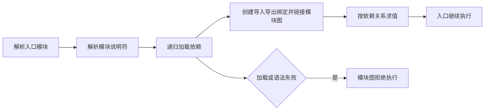
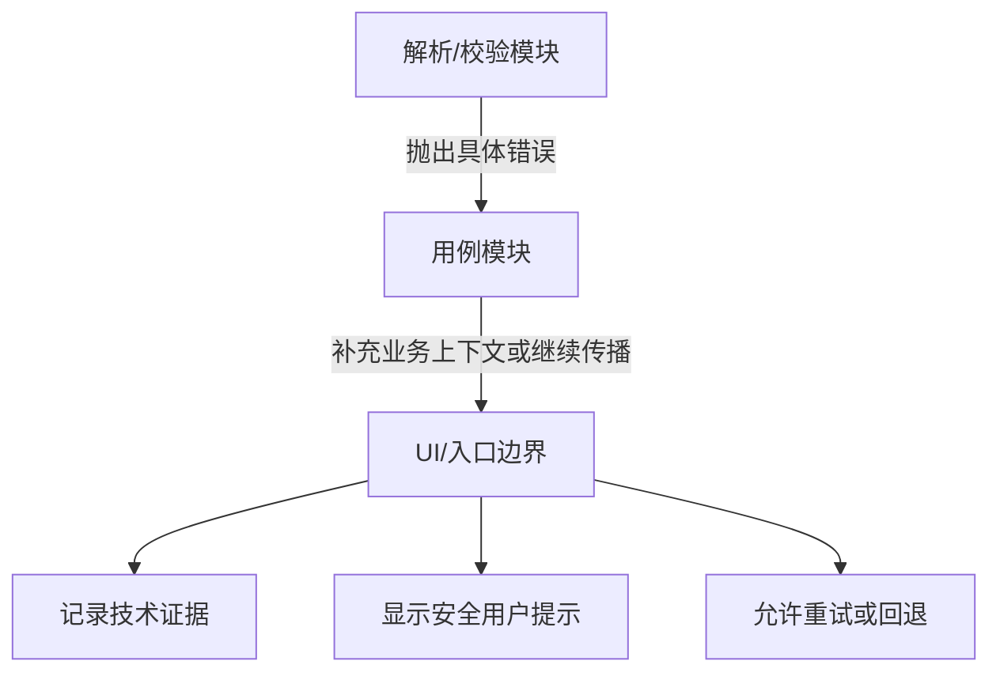

# JavaScript 模块、导入导出与错误处理

ECMAScript Module（ESM）把程序拆成有显式依赖和公开接口的文件。异常机制把正常返回路径与无法正常完成的路径分开。两者共同决定代码边界：模块公开哪些能力，调用方能依赖什么结果，失败如何携带上下文并传播到真正能处理它的位置。

## 1. 模块图如何执行

静态 `import` 使宿主在执行模块体前知道依赖关系。一次入口加载通常经历解析、链接和求值：



静态导入声明只能出现在模块顶层。导入绑定是导出绑定的只读实时视图，不是执行 import 时复制的一份值。

## 2. 命名导出与导入

命名导出适合一个模块公开多个有稳定名称的能力。

```js
// progress.js
export const MAX_PROGRESS = 100;

export function clampProgress(value) {
  if (!Number.isFinite(value)) {
    throw new TypeError('progress 必须是有限数');
  }
  return Math.min(MAX_PROGRESS, Math.max(0, value));
}
```

导入名称必须与导出名称匹配，可以在本地重命名。

```js
// main.js
import {
  MAX_PROGRESS,
  clampProgress as normalizeProgress,
} from './progress.js';

console.log(normalizeProgress(MAX_PROGRESS + 20)); // 100
```

也可以先声明、最后统一导出，或在导出时重命名。

```js
const version = '1.0.0';
function parse(input) {
  return input.trim();
}

export { version, parse as parseTitle };
```

命名导出让编辑器、重构工具和阅读者直接看到具体依赖。模块接口较多时优先命名导出通常比默认导出更清楚。

## 3. 默认导出

每个模块最多有一个默认导出。导入方可以自行决定本地名称。

```js
// create-id.js
export default function createId(prefix, number) {
  return `${prefix}-${number}`;
}
```

```js
import makeId from './create-id.js';
console.log(makeId('lesson', 3)); // lesson-3
```

默认导出不是“更主要所以一定更好”。团队应根据 API 稳定性和工具约定选择。一个模块若表示单一组件或工厂，默认导出可以简洁；公共工具集合使用命名导出更利于发现、自动导入和一致重命名。

默认导出与命名导出可共存：

```js
export const DEFAULT_PREFIX = 'lesson';
export default function createId(prefix, number) {
  return `${prefix}-${number}`;
}
```

对应导入不带花括号的是默认导入，花括号中的是命名导入。

## 4. 命名空间导入和再导出

命名空间导入把模块公开的导出作为模块命名空间对象的属性访问。

```js
import * as progress from './progress.js';

console.log(progress.MAX_PROGRESS);
console.log(progress.clampProgress(120));
```

命名空间对象不是普通可随意修改的配置对象；导入方不能给导出重新赋值。只有在确实需要成组访问、反射或避免名称冲突时使用，日常依赖仍应尽量明确列出。

聚合模块可以再导出其他模块接口：

```js
// index.js
export { clampProgress, MAX_PROGRESS } from './progress.js';
export { default as createId } from './create-id.js';
```

`export * from './module.js'` 会再导出命名导出，但不会自动再导出 default；多个来源发生名称冲突时，相应名称也不会形成可用的明确导出。公共入口显式列出接口更便于审查版本变化。

## 5. 导入绑定是实时绑定

导出模块改变自己的可变绑定时，导入方观察到新值；导入方不能直接重新赋值导入名称。

```js
// counter.js
export let count = 0;

export function increment() {
  count += 1;
}
```

```js
// main.js
import { count, increment } from './counter.js';

console.log(count); // 0
increment();
console.log(count); // 1

// count = 10; // TypeError：不能给导入绑定赋值
```

如果导出的是对象，导入方仍可能修改对象属性，因为只读限制针对绑定，不会冻结对象。共享可变对象会造成模块间隐式耦合，优先导出读取函数和受控更新函数。

## 6. 模块说明符与浏览器加载

浏览器原生 ESM 常用相对 URL、绝对路径或完整 URL：

```js
import { start } from './app/start.js';
import { config } from '/shared/config.js';
```

原生浏览器相对导入通常需要写文件扩展名。`react` 这类裸说明符需要 import map、打包器或宿主自己的解析规则；JavaScript 语法本身不规定它映射到 `node_modules`。

```html
<script type="module" src="./main.js"></script>
```

浏览器模块脚本的重要特性：

- 默认使用严格模式。
- 默认延迟执行，文档解析不会按经典阻塞脚本方式等待其求值。
- 同一模块 URL 在同一模块图环境中通常只求值一次，多个导入方共享模块实例。
- 跨源模块请求受 CORS 约束。
- 服务器必须返回可接受的 JavaScript MIME 类型。
- 顶层 `this` 是 `undefined`，不是 Window。
- 本地直接用 `file://` 打开模块示例可能遇到安全限制，应通过 HTTP 开发服务器运行。

`async` 可用于模块脚本，但会改变相对执行时序；没有明确需求不要给所有模块入口添加它。

### 6.1 import map

import map 在文档中把裸说明符或前缀映射为 URL，并必须在依赖它的模块加载前声明。

```html
<script type="importmap">
{
  "imports": {
    "app/": "./src/",
    "settings": "./src/settings.js"
  }
}
</script>

<script type="module">
  import { start } from 'app/main.js';
  import settings from 'settings';
  start(settings);
</script>
```

import map 是宿主解析配置，不是 Node 包管理器替代品；部署缓存、版本锁定与完整性策略仍需单独设计。

## 7. 动态导入 `import()`

动态导入是表达式，返回 Promise，适合按条件或交互延迟加载模块。模块说明符可在运行时产生，但构建工具能否静态分析取决于其规则。

```js
async function loadFormatter(locale) {
  if (locale === 'zh-CN') {
    return import('./formatters/zh-CN.js');
  }
  if (locale === 'en-US') {
    return import('./formatters/en-US.js');
  }
  throw new RangeError(`不支持的 locale：${locale}`);
}

const module = await loadFormatter('zh-CN');
console.log(module.formatTitle('JavaScript'));
```

Promise 会在模块加载、链接或求值失败时拒绝。动态导入成功结果是模块命名空间对象，默认导出位于 `.default`。

```js
const { default: createWidget } = await import('./widget.js');
```

不要把用户输入直接拼进模块 URL；这既使可加载范围失控，也让构建产物和安全策略难以分析。使用明确白名单映射。

## 8. 模块求值、副作用与循环依赖

模块顶层代码会在模块首次求值时执行。顶层注册全局监听器、修改 DOM 或发起请求都会形成导入副作用。

```js
// 不透明：任何导入都会立即启动
startAnalytics();

// 更明确：导入方决定何时执行
export function startAnalytics() {
  // 注册与发送逻辑
}
```

纯粹为了执行顶层副作用可以写：

```js
import './register-custom-elements.js';
```

这种依赖应有清晰文件名和文档，否则读者看不到导入的值也难判断作用。

ESM 支持循环依赖，但实时绑定不代表任意时刻都可读取。若模块 A 和 B 在顶层互相读取尚未初始化的 lexical 绑定，会出现 `ReferenceError`。解决方法包括：

- 把共同依赖提取到第三个无环模块；
- 避免顶层立即读取对方值，改在函数调用时读取；
- 调整模块责任，而不是依赖脆弱求值顺序。

循环依赖通常是架构信号，应通过依赖图和测试发现，而不是只在出现运行时错误后处理。

## 9. 错误对象与 `throw`

JavaScript 允许抛出任意值，但生产代码应抛出 Error 或其子类，保留名称、消息、堆栈和因果链。

```js
throw new TypeError('pageSize 必须是整数');
```

常见内置错误：

| 类型 | 典型含义 |
| --- | --- |
| `Error` | 通用错误基类 |
| `TypeError` | 值的类型或可调用/可访问能力不符合要求 |
| `RangeError` | 数值或参数超出允许范围 |
| `ReferenceError` | 读取不可解析或未初始化绑定 |
| `SyntaxError` | 源码或被解析文本不符合语法 |
| `URIError` | URI 编解码输入不合法 |
| `AggregateError` | 一个错误对象汇集多个错误 |

错误消息应说明哪个字段违反了什么约束，不能包含口令、令牌或完整敏感输入。

### 9.1 自定义错误与 `cause`

自定义错误适合调用方需要按稳定类别恢复的领域失败。

```js
class ConfigError extends Error {
  constructor(message, options = {}) {
    super(message, options);
    this.name = 'ConfigError';
    this.code = options.code ?? 'CONFIG_INVALID';
    this.field = options.field;
  }
}

throw new ConfigError('pageSize 不受支持', {
  code: 'PAGE_SIZE_UNSUPPORTED',
  field: 'pageSize',
});
```

`Error` 的 `cause` 选项可在增加上下文时保留原始错误。

```js
try {
  JSON.parse(rawText);
} catch (error) {
  throw new ConfigError('配置文件不是有效 JSON', {
    code: 'CONFIG_JSON_INVALID',
    cause: error,
  });
}
```

不要把底层异常消息直接当作面向用户文案；记录层可保留技术信息，UI 层映射为稳定、安全的提示。

## 10. `try`、`catch` 与重新抛出

`try` 中同步执行的语句一旦抛错，就立即停止剩余语句并跳到 `catch`。`catch` 参数只在 catch 块中存在。

```js
function parseSettings(text) {
  try {
    return JSON.parse(text);
  } catch (error) {
    if (error instanceof SyntaxError) {
      throw new ConfigError('设置文本格式错误', { cause: error });
    }
    throw error;
  }
}
```

只处理能够识别和恢复的错误；未知错误重新抛出。空 catch 会丢失故障证据。

catch 也可省略绑定：

```js
try {
  readOptionalCache();
} catch {
  // 仅当任何读取失败都确实可以安全忽略时使用
}
```

这种写法仍需记录为什么可以忽略，以及是否需要指标，否则会把真实缺陷伪装成缓存未命中。

### 10.1 catch 的同步边界

普通 try/catch 只能捕获其动态调用栈中同步抛出的错误，不能捕获之后任务中抛出的异常，也不能仅包住 Promise 创建就捕获未来拒绝。

```js
try {
  Promise.reject(new Error('later'));
} catch (error) {
  // 不会执行
}
```

Promise 使用 `.catch()` 或在 async 函数中 `await` 后用 try/catch：

```js
try {
  await loadSettings();
} catch (error) {
  console.error(error);
}
```

异步错误的完整组合在 Promise 专篇展开。

## 11. `finally` 与清理

`finally` 在 try/catch 完成后执行，无论正常返回还是抛错，适合恢复状态或释放资源。

```js
let loading = false;

async function refresh() {
  loading = true;
  try {
    return await loadData();
  } finally {
    loading = false;
  }
}
```

不要在 finally 中 `return`、`throw` 或用控制语句覆盖原结果；finally 的突变完成会替代 try/catch 中原有的返回或异常。

```js
function unsafe() {
  try {
    throw new Error('original');
  } finally {
    return 'hidden'; // 吞掉 original 错误
  }
}
```

清理本身也可能失败。资源领域应决定保留主错误、组合多个错误还是记录清理失败，不能无意让次要清理错误掩盖根因。

## 12. 在正确层级处理错误



底层函数通常不知道如何向用户展示；它应抛出可识别错误。业务层可增加操作上下文。应用入口、事件处理器或路由边界才拥有展示、重试和遥测决策。

“捕获后打印并继续”只有在状态仍一致、调用方不需要知道失败时才正确。否则应返回明确结果或重新抛出。

## 13. 完整案例：分层加载学习计划

案例由三个模块组成：领域错误、解析器和应用入口。输入为 JSON 文本，目标是返回经过验证的计划，并把解析错误与字段错误映射为稳定错误代码。

### 13.1 `errors.js`

```js
export class RoadmapError extends Error {
  constructor(message, { code, cause, details } = {}) {
    super(message, { cause });
    this.name = 'RoadmapError';
    this.code = code ?? 'ROADMAP_ERROR';
    this.details = details;
  }
}
```

### 13.2 `parse-roadmap.js`

```js
import { RoadmapError } from './errors.js';

export function parseRoadmap(text) {
  let raw;
  try {
    raw = JSON.parse(text);
  } catch (error) {
    throw new RoadmapError('路线文件不是有效 JSON', {
      code: 'INVALID_JSON',
      cause: error,
    });
  }

  if (raw === null || typeof raw !== 'object' || Array.isArray(raw)) {
    throw new RoadmapError('路线根节点必须是对象', {
      code: 'INVALID_ROOT',
    });
  }
  if (!Array.isArray(raw.modules)) {
    throw new RoadmapError('modules 必须是数组', {
      code: 'INVALID_MODULES',
    });
  }

  const ids = new Set();
  const modules = raw.modules.map((module, index) => {
    if (module === null || typeof module !== 'object') {
      throw new RoadmapError(`modules[${index}] 必须是对象`, {
        code: 'INVALID_MODULE',
        details: { index },
      });
    }
    if (typeof module.id !== 'string' || module.id.trim() === '') {
      throw new RoadmapError(`modules[${index}].id 无效`, {
        code: 'INVALID_MODULE_ID',
        details: { index },
      });
    }

    const id = module.id.trim();
    if (ids.has(id)) {
      throw new RoadmapError(`模块 id 重复：${id}`, {
        code: 'DUPLICATE_MODULE_ID',
        details: { id },
      });
    }
    ids.add(id);

    return { id, title: String(module.title ?? id) };
  });

  return { modules };
}
```

### 13.3 `main.js`

```js
import { RoadmapError } from './errors.js';
import { parseRoadmap } from './parse-roadmap.js';

export function loadRoadmap(text, logger = console) {
  try {
    return { ok: true, value: parseRoadmap(text) };
  } catch (error) {
    if (error instanceof RoadmapError) {
      logger.error('roadmap_load_failed', {
        code: error.code,
        details: error.details,
        causeName: error.cause?.name,
      });
      return { ok: false, error: { code: error.code } };
    }
    throw error;
  }
}
```

入口只把已知领域错误转为结果对象，未知编程错误继续传播，避免把 `ReferenceError` 等缺陷伪装成用户输入错误。

### 13.4 可观察结果

```js
const valid = '{"modules":[{"id":"html","title":"HTML"}]}';
console.log(loadRoadmap(valid));
// { ok: true, value: { modules: [{ id: 'html', title: 'HTML' }] } }

console.log(loadRoadmap('{'));
// logger 收到 code=INVALID_JSON，调用结果为 { ok: false, error: ... }
```

代码文件需要由 HTTP 服务提供，并从模块入口导入运行。浏览器网络面板应显示每个模块 200 响应、正确 JavaScript MIME；控制台不应出现 CORS 或说明符解析错误。

### 13.5 失败注入

```js
const failures = [
  '{',
  'null',
  '{}',
  '{"modules":[null]}',
  '{"modules":[{"id":""}]}',
  '{"modules":[{"id":"html"},{"id":"html"}]}',
];

for (const text of failures) {
  const result = loadRoadmap(text, { error() {} });
  console.log(result.error.code);
}
```

还应测试模块 URL 404、错误 MIME、导出名称拼写错误、顶层求值抛错和动态导入拒绝。这些是模块加载阶段故障，不能通过解析函数内部 catch 恢复。

## 14. 调试与审查清单

1. 导入名称、默认/命名形态和文件扩展名是否与导出一致。
2. 浏览器网络面板是否显示正确 URL、状态、MIME 与 CORS 响应。
3. 裸说明符是否确实由 import map 或构建工具解析。
4. 顶层副作用是否必要，模块是否因为循环依赖提前读取未初始化绑定。
5. 动态 import 是否 await/catch，用户输入是否经过模块白名单。
6. 抛出的是否是 Error，消息和 details 是否泄露敏感数据。
7. catch 是否只处理可识别错误，未知错误是否重新抛出。
8. 异步拒绝是否在 await 或 Promise 边界捕获。
9. finally 是否只做清理，是否无意覆盖返回或异常。
10. UI 是否把技术错误映射成稳定提示，同时保留可诊断的错误代码和 cause。

## 15. 练习与完成标准

把一个单文件设置解析器拆成 `errors.js`、`validate.js`、`storage.js` 和 `main.js`：

- 只通过命名导出公开公共 API。
- 存储模块的读取失败用 `cause` 包装，字段错误使用稳定 code。
- 入口只处理已知领域错误，未知错误重新抛出。
- 使用 `finally` 恢复 loading 状态，不在 finally 返回。
- 另建可选统计模块，通过白名单动态导入。
- 在 HTTP 服务下测试成功、404、错误 MIME、无效 JSON、无效字段和动态导入拒绝。

完成标准是：能画出模块依赖图且没有不必要循环；解释静态与动态导入的求值时序；每个失败都在正确边界处理；日志包含错误代码但不包含敏感原文。

## 来源

- [MDN：JavaScript modules](https://developer.mozilla.org/en-US/docs/Web/JavaScript/Guide/Modules)（访问日期：2026-07-17）
- [MDN：import](https://developer.mozilla.org/en-US/docs/Web/JavaScript/Reference/Statements/import)（访问日期：2026-07-17）
- [MDN：try...catch](https://developer.mozilla.org/en-US/docs/Web/JavaScript/Reference/Statements/try...catch)（访问日期：2026-07-17）
- [ECMAScript® Language Specification：Scripts and Modules](https://tc39.es/ecma262/multipage/ecmascript-language-scripts-and-modules.html)（访问日期：2026-07-17）
