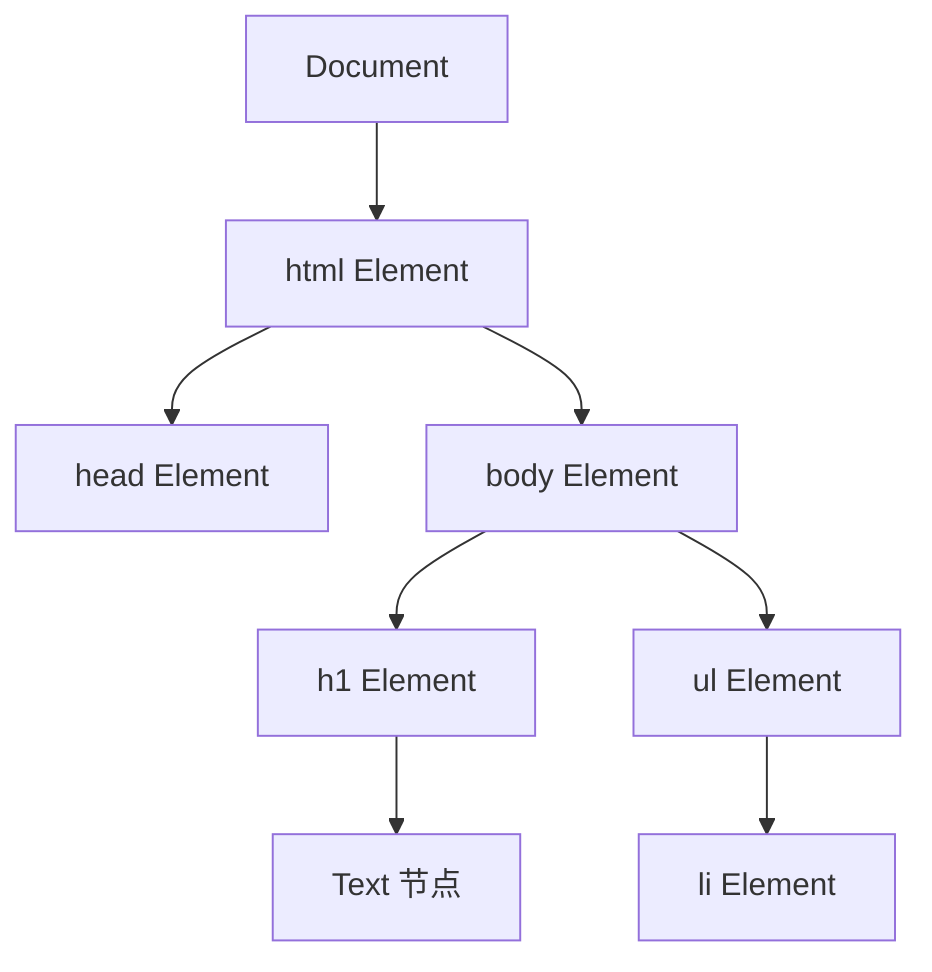
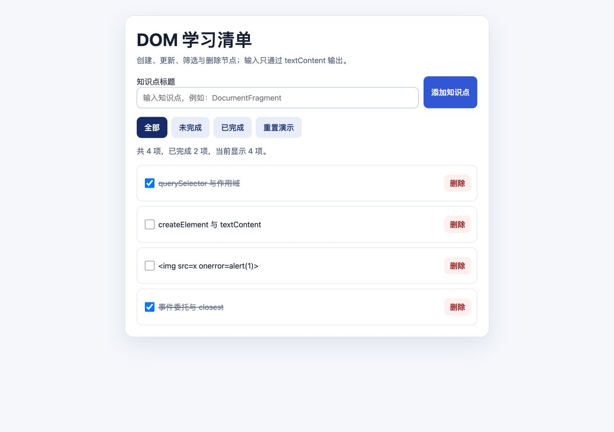
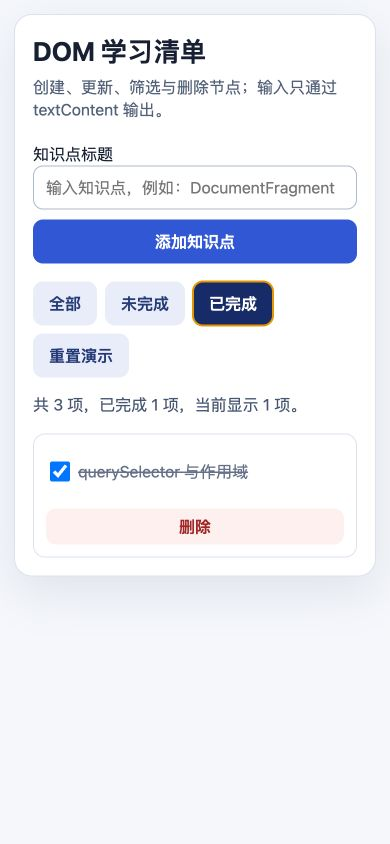

# JavaScript DOM 树、查询、创建与更新

Document Object Model（DOM）是浏览器为 HTML、SVG 和 XML 文档提供的树形编程接口。JavaScript 语言本身不包含 DOM；浏览器把 `document`、`Element`、`Node` 等 Web API 暴露给脚本。DOM 修改会改变文档结构和页面呈现，也可能影响焦点、可访问性、布局和事件监听器。

## 1. DOM 是节点树

浏览器解析 HTML 后创建 Document，元素、文本和注释成为不同类型的 Node。



不是每个节点都是 Element。换行和缩进也可能形成文本节点，因此 `childNodes` 与 `children` 的结果不同。

```js
const list = document.querySelector('#lesson-list');

console.log(list.childNodes); // 所有子 Node，可能含 Text
console.log(list.children);   // 只含 Element
console.log(list.firstChild); // 第一个 Node
console.log(list.firstElementChild); // 第一个 Element 或 null
```

常见接口关系：

- `Document` 表示文档入口，提供全局查询和创建节点的方法。
- `Node` 提供树关系、文本内容和基础增删能力。
- `Element` 继承 Node，增加属性、选择器、类和元素遍历能力。
- `HTMLElement` 扩展 HTML 元素通用能力。
- `HTMLInputElement`、`HTMLFormElement` 等再提供具体元素属性和方法。

从 `querySelector()` 取得 input 后，同一个对象同时可使用 Node、Element、HTMLElement 和 HTMLInputElement 的对应能力。

## 2. 脚本何时可以查询 DOM

脚本只能查询已经被解析或创建的节点。推荐使用模块脚本或 `defer`，使执行不阻塞解析并在文档解析后按顺序运行。

```html
<script type="module" src="./main.js"></script>
```

模块脚本默认具有 defer 式行为。经典脚本可写：

```html
<script defer src="./main.js"></script>
```

若脚本必须在不确定时机加载，可检查 `document.readyState` 或监听 `DOMContentLoaded`。不要同时让初始化立即执行又在事件中执行，避免重复绑定。

```js
function initialize() {
  // 查询并建立初始界面
}

if (document.readyState === 'loading') {
  document.addEventListener('DOMContentLoaded', initialize, { once: true });
} else {
  initialize();
}
```

`DOMContentLoaded` 表示 DOM 已解析，不代表图片、字体等全部资源加载完毕。

## 3. 查询单个元素

### 3.1 `querySelector()`

`document.querySelector(selectors)` 返回文档中第一个匹配 Element；没有匹配返回 `null`；选择器语法无效会抛出 `SyntaxError` DOMException。

```js
const form = document.querySelector('#add-form');
const firstItem = document.querySelector('.lesson-item');
const submit = document.querySelector('form button[type="submit"]');
```

Element 也有 `querySelector()`，用于把查询限制在某个子树。

```js
const panel = document.querySelector('[data-panel="roadmap"]');
const title = panel?.querySelector('h2');
```

如果 panel 是必需结构，不要可选链后静默继续，应在初始化时断言。

```js
function requiredElement(selector, root = document) {
  const element = root.querySelector(selector);
  if (!element) {
    throw new Error(`缺少必需元素：${selector}`);
  }
  return element;
}
```

### 3.2 动态选择器与转义

属性值可能含 `?`、空格等选择器特殊字符。不能直接把外部字符串拼入选择器；作为标识符片段时可用 `CSS.escape()`。

```js
const rawId = 'lesson?1';
const element = document.querySelector(`#${CSS.escape(rawId)}`);
```

更安全的方案经常是保存节点引用，或遍历已有元素读取 `dataset` 后比较值，而不是持续生成复杂选择器。

### 3.3 `getElementById()`

```js
const status = document.getElementById('status');
```

它只在 Document 上按 id 查询，找不到返回 null，不需要 CSS 转义语法。id 应在文档中唯一；重复 id 会造成标签关联、锚点和查询行为不可靠。

## 4. 查询多个元素与集合类型

`querySelectorAll()` 返回静态 NodeList：查询后新增的匹配元素不会自动进入原列表。

```js
const buttons = document.querySelectorAll('[data-filter]');

for (const button of buttons) {
  button.setAttribute('aria-pressed', 'false');
}
```

NodeList 支持 `forEach()` 和迭代，但不是 Array。需要 `map()` 等数组方法时转换：

```js
const labels = [...buttons].map((button) => button.textContent.trim());
```

`getElementsByClassName()` 和 `getElementsByTagName()` 返回实时 HTMLCollection，DOM 改变后集合会更新。在遍历同时修改匹配结构容易跳项或重复处理。

```js
const liveItems = document.getElementsByClassName('lesson-item');
const snapshot = [...liveItems];

for (const item of snapshot) {
  item.remove();
}
```

需要稳定处理集合时使用 `querySelectorAll()` 或先创建数组快照。

## 5. 树导航与关系判断

常用关系属性和方法：

| API | 返回 |
| --- | --- |
| `parentNode` | 父 Node 或 null |
| `parentElement` | 父 Element 或 null |
| `children` | 实时子 Element 集合 |
| `nextElementSibling` | 下一个兄弟 Element 或 null |
| `previousElementSibling` | 上一个兄弟 Element 或 null |
| `closest(selector)` | 自身或最近匹配祖先，没有则 null |
| `matches(selector)` | 自身是否匹配选择器 |
| `contains(node)` | 是否包含给定 Node，也对自身返回 true |

```js
function findOwnedRemoveRow(event, list) {
  if (!(event.target instanceof Element)) return null;
  const button = event.target.closest('button[data-action="remove"]');
  if (!button || !list.contains(button)) return null;

  const row = button.closest('[data-id]');
  return row && list.contains(row) ? row : null;
}
```

事件目标可能是 button 内的图标或 span，`closest()` 比检查 `event.target.tagName` 更稳健。若监听器覆盖范围可能包含嵌套组件，还应确认匹配节点属于当前容器。

## 6. 创建节点

`document.createElement(localName)` 创建尚未插入文档的 Element。在 HTML 文档中元素名称按 HTML 规则处理。

```js
const item = document.createElement('li');
const title = document.createElement('span');
const text = document.createTextNode('JavaScript');

title.append(text);
item.append(title);
```

创建 SVG 等命名空间元素使用 `createElementNS()`，不能只用 `createElement('svg')` 假设获得正确 SVG DOM 行为。

```js
const SVG_NS = 'http://www.w3.org/2000/svg';
const svg = document.createElementNS(SVG_NS, 'svg');
const circle = document.createElementNS(SVG_NS, 'circle');
circle.setAttribute('r', '8');
svg.append(circle);
```

创建节点不会自动显示，只有插入已连接到 Document 的树后才参与页面呈现。

## 7. 文本与 HTML

### 7.1 `textContent`

读取 Node 的 `textContent` 会组合其后代文本；设置时会用一个 Text 节点替换全部子节点。对不可信文本，`textContent` 是默认输出接口。

```js
const title = document.createElement('span');
title.textContent = '';
```

页面会显示尖括号文本，不会创建 img。将 `textContent` 设置为 `null` 会被转换为空字符串语义，业务代码仍应明确传入 String。

### 7.2 `innerText`

`innerText` 更接近渲染后的可见文本，会考虑 CSS 与换行；读取它可能要求浏览器计算布局。处理数据文本通常使用 `textContent`，确需复制用户可见文本时才考虑 `innerText` 并验证结果。

### 7.3 `innerHTML`

`innerHTML` 把字符串解析为标记并替换后代。它适合受控静态模板或经过严格安全设计的 HTML 管道，不得直接接收用户/API 文本。

```js
// 危险：name 可包含标记或事件属性
container.innerHTML = `<p>${name}</p>`;

// 安全的纯文本结构
const paragraph = document.createElement('p');
paragraph.textContent = name;
container.replaceChildren(paragraph);
```

模板字符串没有自动转义。清理库也必须按版本、配置和威胁模型维护；优先使用创建节点和文本 API。

## 8. 属性、DOM 属性与数据集

HTML attribute 是标记中的字符串信息，DOM property 是对象当前状态。两者可能反射，也可能存在不同语义。

```js
const input = document.createElement('input');
input.setAttribute('value', 'initial');
input.value = 'current';

console.log(input.getAttribute('value')); // initial
console.log(input.value);                 // current
```

表单当前值和 checked 状态通常读写 property；ARIA、通用字符串属性可以使用 `setAttribute()`。Boolean attribute 的存在表示真，字符串 `'false'` 仍表示属性存在。

```js
button.disabled = true;
button.toggleAttribute('hidden', shouldHide);
```

自定义数据属性通过 `dataset` 暴露，值始终是字符串，camelCase 名称映射到连字符属性。

```js
item.dataset.lessonId = 'js-07';
console.log(item.getAttribute('data-lesson-id')); // js-07

const id = Number(item.dataset.numericId);
if (!Number.isSafeInteger(id)) throw new TypeError('data-numeric-id 无效');
```

dataset 是 DOM 元数据，不应存放秘密、大型状态或唯一业务真相。

## 9. 类、内联样式与状态

`classList` 是 DOMTokenList，提供 `add()`、`remove()`、`toggle()`、`replace()` 和 `contains()`。

```js
item.classList.add('lesson-item');
item.classList.toggle('is-completed', completed);
item.classList.remove('is-loading');
```

`toggle(token, force)` 的 force 转为 Boolean；传入明确状态可避免每次调用无条件反转。

内联样式通过 `style` 操作，适合由计算产生的单个动态值；主题和状态优先切换 class 或 data attribute，让 CSS 集中管理。

```js
progress.style.setProperty('--progress', `${percent}%`);
progress.style.removeProperty('--progress');
```

计算后的最终样式使用 `getComputedStyle(element)` 读取。它可能触发布局/样式计算，不要在大循环中与写入交错。

## 10. 插入、移动、替换与删除

现代 DOM 插入方法：

| API | 位置与行为 |
| --- | --- |
| `parent.append(...nodesOrStrings)` | 父节点末尾 |
| `parent.prepend(...)` | 父节点开头 |
| `node.before(...)` / `after(...)` | 节点相邻位置 |
| `parent.replaceChildren(...)` | 清空并插入新子节点 |
| `node.replaceWith(...)` | 替换当前节点 |
| `node.remove()` | 从父节点移除自身 |
| `parent.appendChild(node)` | 末尾插入单个 Node，返回该 Node |
| `parent.insertBefore(newNode, reference)` | reference 前插入 |

同一个 Node 只能处在树中的一个位置。插入已连接节点会移动它，不会复制。

```js
const firstList = document.querySelector('#first');
const secondList = document.querySelector('#second');
const item = firstList.firstElementChild;

secondList.append(item); // 从 firstList 移到 secondList
```

复制使用 `cloneNode(deep)`；deep 为 true 会复制后代和属性，但通过 `addEventListener()` 注册的监听器不会被复制，id 也会原样复制，可能产生重复 id。

```js
const copy = item.cloneNode(true);
copy.id = 'new-unique-id';
secondList.append(copy);
```

`remove()` 后如果 JavaScript 仍持有节点引用，节点对象仍存在，仍可重新插入。释放大型组件还需清理定时器、观察器、外部订阅和不再需要的引用。

## 11. DocumentFragment 与 template

DocumentFragment 是轻量节点容器。将它插入文档时，插入的是其子节点，fragment 本身随后变空。

```js
const fragment = document.createDocumentFragment();

for (const lesson of lessons) {
  const item = document.createElement('li');
  item.textContent = lesson.title;
  fragment.append(item);
}

list.append(fragment);
```

Fragment 适合在文档外组织一批节点和一次提交结构，但不能简单宣称它在所有场景都必然更快；浏览器会优化多种 DOM 操作，性能需要实际测量。它的主要价值是清晰的批量构建边界。

`template` 元素的内容保存在 `template.content` DocumentFragment 中，不会作为普通页面内容渲染。每次使用需克隆。

```html
<template id="lesson-template">
  <li class="lesson-item"><span class="title"></span></li>
</template>
```

```js
const template = requiredElement('#lesson-template');
const fragment = template.content.cloneNode(true);
fragment.querySelector('.title').textContent = lesson.title;
list.append(fragment);
```

模板中若含 id，每次克隆都必须重新生成唯一值。

## 12. 渲染函数与状态所有权

简单界面可把业务状态保存在 JavaScript 数据中，由 `render(state)` 生成 DOM。这样不会同时把数组和 DOM 当作两个互相猜测的真相源。

```js
let lessons = [
  { id: 1, title: 'DOM', completed: false },
];

function render() {
  const fragment = document.createDocumentFragment();
  for (const lesson of lessons) {
    fragment.append(createLessonElement(lesson));
  }
  list.replaceChildren(fragment);
}
```

全量重建简单可靠，但会替换节点、丢失节点上的临时状态、焦点、选择区和直接绑定的监听器。大型列表或复杂交互需要 keyed 增量更新、事件委托或框架协调。先测量再优化，并把焦点恢复纳入验收。

## 13. DOM 读写与布局

修改 class、style 或树会使样式和布局失效；读取 `getBoundingClientRect()`、`offsetWidth`、计算样式等几何信息可能要求浏览器立即刷新。循环中“写一次、读一次”会产生反复同步布局。

```js
// 较清晰：先集中读取
const widths = cards.map((card) => card.getBoundingClientRect().width);

// 再集中写入
cards.forEach((card, index) => {
  card.style.setProperty('--measured-width', `${widths[index]}px`);
});
```

这不是保证无布局成本的公式；动画、字体、容器和其他脚本仍会影响结果。使用 Performance 面板确认瓶颈，不以 DOM API 调用次数单独判断性能。

## 14. 完整可运行案例：学习清单

完整页面见 [DOM 学习清单演示](../../examples/javascript-dom-learning-list-demo.html)。它实现：

真实浏览器结果见 [桌面端添加并完成新项](../assets/javascript-dom-learning-list-demo.jpg) 与 [390px 已完成筛选](../assets/javascript-dom-learning-list-demo-narrow.jpg)。两张图同时证明恶意 img 字符串保持纯文本、筛选稳定呈现且窄屏无横向溢出；焦点恢复、`aria-pressed` 与 Console 0 由交互检查确认。

- `querySelector()` 获取稳定根节点。
- `createElement()` 和 `textContent` 创建每一项。
- `dataset` 保存可解析 id 和完成状态。
- DocumentFragment 批量构建，`replaceChildren()` 提交。
- 添加、完成、删除、筛选和重置。
- 把形似 HTML 的测试输入作为纯文本显示。
- 空列表建立明确提示节点。

### 14.1 创建条目

```js
function createItemElement(item) {
  const row = document.createElement('li');
  row.dataset.id = String(item.id);
  row.dataset.completed = String(item.completed);

  const checkbox = document.createElement('input');
  checkbox.type = 'checkbox';
  checkbox.checked = item.completed;

  const title = document.createElement('span');
  title.className = 'title';
  title.textContent = item.title;

  const remove = document.createElement('button');
  remove.type = 'button';
  remove.dataset.action = 'remove';
  remove.textContent = '删除';

  row.append(checkbox, title, remove);
  return row;
}
```

输入 `` 只创建 Text 内容，没有创建 img，也不会执行事件属性。

### 14.2 渲染和空状态

```js
function renderList(list, visibleItems) {
  const fragment = document.createDocumentFragment();
  for (const item of visibleItems) {
    fragment.append(createItemElement(item));
  }
  list.replaceChildren(fragment);

  if (visibleItems.length === 0) {
    const empty = document.createElement('li');
    empty.className = 'empty';
    empty.textContent = '当前筛选条件下没有知识点';
    list.append(empty);
  }
}
```

输出由 `visibleItems` 唯一决定，空集合不是保持旧 DOM，而是展示明确状态。

### 14.3 浏览器验证步骤

在真实浏览器中按以下步骤验证：

1. 用 HTTP 服务打开 demo，初始状态应为 3 项、完成 1 项。
2. 确认第三项显示完整 `` 文本，Elements 中不存在该 img，控制台没有 alert 或错误。
3. 输入 `DocumentFragment` 并提交，应变为 4 项，输入清空且焦点回到输入框。
4. 勾选新项，应显示完成样式，状态变为完成 2 项。
5. 点击“已完成”，只显示两个完成项，按钮 `aria-pressed="true"`。
6. 删除其中一项，数组、列表和状态数字同步减少。
7. 点击“重置演示”，恢复 3 项与“全部”筛选。
8. 在 390px 宽度检查无横向溢出，删除按钮换到下一行。
9. Console warning/error 为 0。

桌面状态：添加并完成新项后，共 4 项、完成 2 项。



390px 窄屏状态：切换到“已完成”筛选，删除按钮换到下一行。



截图只能证明稳定呈现，节点安全、焦点和状态更新仍需要上述交互证据。

### 14.4 失败注入

- 把 title 的 `textContent` 临时改成 `innerHTML`，观察 Elements 中测试文本被解析为 img；随后恢复安全实现。
- 将 `data-id` 改为非数字，确认更新函数拒绝 NaN，而不是误改其他项。
- 删除必需的 `#lesson-list` 后加载，初始化应明确失败，而非后续出现含糊 null 属性错误。
- 连续快速添加和删除，确认状态数字与 DOM 项数一致。
- 筛选到无结果，确认只出现一个空状态且再次切换能恢复列表。
- 在输入聚焦时触发全量 render，确认输入节点未被替换；列表内部焦点被重建的问题应作为当前实现边界记录。

## 15. 调试清单

1. 查询返回 null 时检查执行时机、选择器作用域和实际 DOM，而不是立即添加可选链。
2. 动态选择器使用 `CSS.escape()`，无效选择器会抛出异常。
3. 确认集合是静态 NodeList 还是实时 HTMLCollection。
4. 检查读取的是 attribute 初始值还是 property 当前状态。
5. 外部文本使用 `textContent`，搜索所有 `innerHTML` 的数据来源和安全边界。
6. 插入已有节点会移动；需要复制时检查 clone 的监听器和重复 id。
7. 全量替换后检查焦点、选择、滚动和直接监听器是否丢失。
8. dataset 读取后显式转换并验证，不能假设已经是 Number/Boolean。
9. 大量读写使用 Performance 面板确认布局和脚本成本。
10. 删除组件时清理观察器、定时器、订阅、对象 URL 和长期引用。

## 16. 练习与完成标准

实现一个不依赖框架的书签列表：

- 表单添加 title 和 URL，字段先验证。
- 用 `createElement()` 构建结构，用户文本只写入 `textContent`。
- URL 用 URL API 校验后设置到 `anchor.href`，只接受约定协议。
- 使用 Map 或 Array 保存状态，不从 DOM 反推全部业务数据。
- 支持收藏、删除、按收藏状态筛选和空状态。
- 使用事件委托，但保证嵌套组件事件不被误处理。
- 在桌面和 390px 窄屏中检查渲染结果与 Console。
- 记录全量渲染对焦点的影响，并实现至少一个焦点恢复策略。

完成标准是：恶意标记文本不被解析；非法 URL 有稳定错误；DOM 数量、状态数量和可访问状态一致；所有交互可键盘完成；切换和删除后没有横向溢出或控制台错误。

## 来源

- [MDN：Document Object Model](https://developer.mozilla.org/en-US/docs/Web/API/Document_Object_Model)（访问日期：2026-07-17）
- [MDN：Document.querySelector()](https://developer.mozilla.org/en-US/docs/Web/API/Document/querySelector)（访问日期：2026-07-17）
- [MDN：Document.createElement()](https://developer.mozilla.org/en-US/docs/Web/API/Document/createElement)（访问日期：2026-07-17）
- [MDN：Node.textContent](https://developer.mozilla.org/en-US/docs/Web/API/Node/textContent)（访问日期：2026-07-17）
