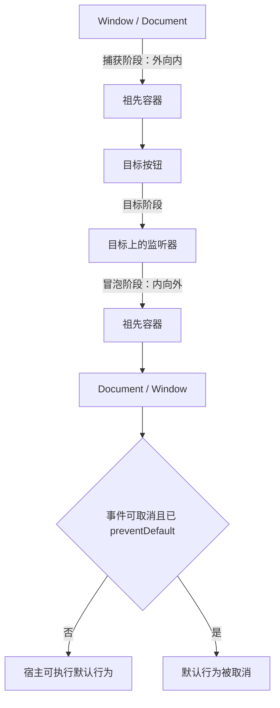

# JavaScript 事件、传播、委托与自定义事件

事件系统把浏览器输入、文档状态变化和应用通知传递给监听器。EventTarget 负责注册和派发，Event 对象描述一次派发，DOM 树决定捕获、目标与冒泡路径。事件处理代码需要区分传播、默认行为和业务状态更新；三者不是同一件事。

## 1. 宿主边界

`Event`、`EventTarget`、`addEventListener()`、DOM 事件传播和 `CustomEvent` 是 Web API，不是 ECMAScript 语言规范的一部分。浏览器中的 Element、Document、Window，以及部分其他 Web API 对象实现 EventTarget。其他 JavaScript 宿主可能提供同名或相似接口，但支持的事件类型和行为由宿主定义。

Node.js 的事件体系、框架合成事件和浏览器 DOM Event 不能直接混为一套契约。本篇只讨论浏览器 Web API。

## 2. 从事件发生到监听器执行

以嵌套按钮点击为例，浏览器确定事件目标和传播路径，再按阶段调用匹配监听器。



并非所有事件都冒泡，也不是所有事件都有默认行为或允许取消。应查看具体事件的 `bubbles`、`cancelable` 和 `composed` 属性，而不是只凭事件名猜测。

## 3. EventTarget 与监听器注册

基本签名：

```js
target.addEventListener(type, listener);
target.addEventListener(type, listener, options);
target.addEventListener(type, listener, useCapture);
```

- `type`：区分大小写的事件类型字符串，不含 `on` 前缀。
- `listener`：函数、实现 `handleEvent(event)` 的对象或 null。
- `options`：控制 capture、once、passive 和 signal。
- 返回值：`undefined`。

```js
const button = document.querySelector('#save-button');

function handleSave(event) {
  console.log(event.type);
}

button.addEventListener('click', handleSave);
```

同一 target、type、listener 和 capture 组合重复注册同一函数引用不会形成两个相同监听器。源码相同的两个匿名函数仍是不同对象，会分别注册。

```js
button.addEventListener('click', () => console.log('save'));
button.addEventListener('click', () => console.log('save'));
// 点击时输出两次
```

### 3.1 `on...` 属性与内联处理器

```js
button.onclick = handleSave;
```

事件处理器属性通常同一时间只保存一个处理器，后赋值覆盖前值。`addEventListener()` 可为同一类型注册多个监听器并控制选项，组件和模块代码优先使用它。

HTML 中的 `onclick="..."` 把行为混入标记，存在作用域、内容安全策略和维护问题，不作为新代码的默认方案。

监听器的返回值会被忽略。不能靠 `return false` 在 `addEventListener()` 中取消默认行为；应显式调用 `event.preventDefault()`。

## 4. Event 对象的核心属性

| 属性 | 含义 |
| --- | --- |
| `type` | 事件类型 |
| `target` | 原始派发目标；传播过程中通常保持不变，Shadow DOM 可能重定向 |
| `currentTarget` | 当前正在执行监听器所注册的 target |
| `eventPhase` | 当前阶段：none、capture、at target 或 bubble |
| `bubbles` | 是否沿祖先冒泡 |
| `cancelable` | 是否可通过 preventDefault 取消默认行为 |
| `defaultPrevented` | 是否已经成功请求取消默认行为 |
| `isTrusted` | 是否由用户代理产生；脚本派发通常为 false |
| `timeStamp` | 事件创建的时间值，具体基准按规范/宿主解释 |
| `composed` | 是否可以跨 Shadow DOM 边界传播 |

```js
list.addEventListener('click', (event) => {
  console.log({
    target: event.target,
    currentTarget: event.currentTarget,
    phase: event.eventPhase,
  });
});
```

异步回调执行时 `event.currentTarget` 已不再处于当前监听器调用上下文，可能为 null。需要使用时，在同步监听器中先保存所需引用或值。

```js
button.addEventListener('click', (event) => {
  const registeredTarget = event.currentTarget;
  queueMicrotask(() => {
    console.log(registeredTarget); // 保存的 button
    console.log(event.currentTarget); // 通常为 null
  });
});
```

事件子类增加专用信息，例如 MouseEvent 的坐标与按键、KeyboardEvent 的 key/code、InputEvent 的 inputType、SubmitEvent 的 submitter。应使用与事件类型对应的接口并检查支持。

## 5. 捕获、目标与冒泡

默认 `capture: false`，祖先监听器在冒泡阶段接收会冒泡的后代事件。设置 `capture: true` 后，监听器在事件向目标传递的捕获阶段运行。

```js
const panel = document.querySelector('.panel');
const button = panel.querySelector('button');

panel.addEventListener('click', () => console.log('panel capture'), {
  capture: true,
});
button.addEventListener('click', () => console.log('button target'));
panel.addEventListener('click', () => console.log('panel bubble'));
```

点击 button 的预期顺序：panel capture、button target、panel bubble。目标上的捕获监听器先于目标上的非捕获监听器处理该目标阶段。

`focus` 和 `blur` 不冒泡；需要委托式焦点观察时可使用会冒泡的 `focusin`/`focusout`，或在祖先使用捕获监听。`mouseenter`/`mouseleave` 也不按普通鼠标事件那样冒泡；选择事件类型前确认传播特性。

### 5.1 `composedPath()` 与 Shadow DOM

`event.composedPath()` 返回本次派发经过的目标路径。Shadow DOM 会对外部观察者重定向 target，只有 composed 的事件能按规则跨越 shadow 边界。普通 light DOM 委托代码不应假设在所有 Web Component 内部都能看到真实内部节点。

```js
document.addEventListener('click', (event) => {
  console.log(event.composedPath());
});
```

开放/关闭 shadow root 和事件 composed 属性会影响路径可见性；组件应通过公开事件和属性形成边界，而不是让页面依赖内部标记。

## 6. 停止传播不是取消默认行为

### 6.1 `stopPropagation()`

阻止事件继续沿捕获/冒泡路径传递，但不会阻止当前 target 上其他监听器，也不会自动取消链接跳转、表单提交等默认行为。

### 6.2 `stopImmediatePropagation()`

除停止后续传播外，也阻止当前 target 上后注册的同类型监听器继续执行。它会强烈耦合模块执行，应只在确有隔离契约时使用。

### 6.3 不要把停止传播当常规控制流

组件中随意停止传播会使页面级快捷键、分析、关闭浮层或其他祖先逻辑失效。更稳健的做法是让祖先监听器根据 `target`、`closest()`、事件类型和业务状态判断是否处理。

```js
document.addEventListener('click', (event) => {
  const actionable = event.target.closest('[data-action]');
  if (!actionable) return;
  // 只处理明确声明的 action
});
```

## 7. 默认行为与 `preventDefault()`

浏览器事件可能关联默认行为，例如：

- 点击链接导航。
- 提交表单。
- 复选框切换 checked。
- 特定键在控件中输入字符。
- wheel/touch 触发滚动。

`event.preventDefault()` 请求取消可取消事件的默认行为，不停止传播。

```js
form.addEventListener('submit', (event) => {
  event.preventDefault();
  // 自定义提交流程
});
```

先检查 `event.cancelable` 可帮助理解为何取消没有效果；调用后 `defaultPrevented` 反映是否已取消。

```js
if (event.cancelable) {
  event.preventDefault();
}
console.log(event.defaultPrevented);
```

不要在普通点击监听器中无条件 preventDefault。取消链接或表单的原生行为后，代码必须提供等价、可访问且可靠的替代流程。

## 8. 监听器选项

### 8.1 `capture`

```js
document.addEventListener('click', handleClick, { capture: true });
```

用于捕获阶段观察。移除监听器时，capture 值必须与注册时一致。

### 8.2 `once`

监听器最多执行一次，调用后自动移除。

```js
button.addEventListener('click', initializeOnce, { once: true });
```

若事件永远不发生，监听器仍存在；组件销毁仍可配合 AbortSignal 清理。

### 8.3 `passive`

`passive: true` 声明监听器不会调用 `preventDefault()`，浏览器可不等待取消决定就处理滚动等默认行为。在 passive 监听器中调用 preventDefault 不生效，并可能产生控制台警告。

```js
window.addEventListener('touchmove', observeTouch, { passive: true });
```

部分浏览器对 Window、Document、body 上的 wheel/touchstart/touchmove 等事件采用 passive 默认优化。若确实需要取消，显式写 `{ passive: false }`，同时确认取消手势是必要且不会破坏滚动可用性。

`scroll` 事件本身不可取消，不需要通过 preventDefault 阻止滚动。

### 8.4 `signal`

AbortSignal 可成组移除监听器，减少保存多个函数引用的清理代码。

```js
function mountPanel(panel) {
  const controller = new AbortController();
  const options = { signal: controller.signal };

  panel.addEventListener('click', handleClick, options);
  panel.addEventListener('change', handleChange, options);
  window.addEventListener('resize', handleResize, options);

  return () => controller.abort();
}
```

调用 abort 后相关监听器移除。若 signal 注册前已经 aborted，监听器不会形成正常活动注册。

## 9. 移除监听器与函数身份

```js
function handleClick(event) {
  console.log(event.target);
}

button.addEventListener('click', handleClick);
button.removeEventListener('click', handleClick);
```

以下移除失败，因为两个箭头函数是不同对象：

```js
button.addEventListener('click', () => handleSave());
button.removeEventListener('click', () => handleSave());
```

`removeEventListener()` 匹配 type、listener 与 capture；once/passive 等其他选项不参与相同方式的捕获匹配。为了避免细节错误，组件生命周期优先使用具名引用或 AbortController。

`bind()` 每次调用也创建新函数，必须保存绑定结果：

```js
const boundHandle = controller.handleClick.bind(controller);
button.addEventListener('click', boundHandle);
button.removeEventListener('click', boundHandle);
```

## 10. 监听器中的 `this`

普通函数作为 addEventListener 监听器调用时，`this` 等于 `event.currentTarget`。箭头函数没有自己的 this，会捕获外层 this。

```js
button.addEventListener('click', function (event) {
  console.log(this === event.currentTarget); // true
});

button.addEventListener('click', (event) => {
  console.log(event.currentTarget); // 明确使用事件属性
});
```

推荐显式使用 currentTarget，减少函数形态变化时的 this 依赖。类实例可注册实现 `handleEvent()` 的对象：

```js
class PanelController {
  constructor(panel) {
    this.panel = panel;
    panel.addEventListener('click', this);
  }

  handleEvent(event) {
    console.log(this.panel, event.target);
  }

  destroy() {
    this.panel.removeEventListener('click', this);
  }
}
```

## 11. 事件委托

事件委托在稳定祖先注册少量监听器，根据实际 target 找到动态后代。它依赖所选事件能传播到祖先。

```js
list.addEventListener('click', (event) => {
  const button = event.target.closest('button[data-action="remove"]');
  if (!button || !list.contains(button)) return;

  const row = button.closest('[data-id]');
  if (!row || !list.contains(row)) return;

  const id = Number(row.dataset.id);
  if (!Number.isSafeInteger(id)) {
    throw new TypeError('data-id 必须是整数');
  }
  removeItem(id);
});
```

关键检查：

1. `event.target` 可能不是 Element，例如某些场景中的 Text/其他 EventTarget；使用 `instanceof Element` 或确认有 closest 能力。
2. `closest()` 可能匹配到容器外层的祖先，因此再用 `list.contains()` 限制归属。
3. 嵌套列表会产生多个潜在容器，必要时确认 `row.closest('.list') === list`。
4. dataset 是字符串，解析后验证。
5. 委托不等于阻止传播，其他祖先仍可处理同一事件。

```js
list.addEventListener('click', (event) => {
  if (!(event.target instanceof Element)) return;
  const button = event.target.closest('[data-action]');
  // ...
});
```

委托减少动态节点上的监听器管理，但不是始终更快。高频事件、Shadow DOM 边界、非冒泡事件或复杂嵌套组件可能更适合直接监听。

## 12. 键盘、指针与语义控件

不要给 div 模拟按钮然后只监听 click。原生 button 自动提供键盘激活、焦点和语义，click 也可由键盘触发。

```html
<button type="button" data-action="remove">删除</button>
```

需要键盘快捷键时检查：

- `event.key` 表达用户意图字符/键名，受布局和修饰键影响。
- `event.code` 表达物理键位置。
- 是否正在 input、textarea、select 或 contenteditable 中输入。
- `event.repeat` 是否代表按住重复。
- 组合输入时 `event.isComposing` 或相关 composition 时序。

```js
document.addEventListener('keydown', (event) => {
  const editing = event.target.matches?.(
    'input, textarea, select, [contenteditable="true"]',
  );
  if (editing || event.isComposing) return;
  if (event.key === '/' && !event.metaKey && !event.ctrlKey) {
    event.preventDefault();
    searchInput.focus();
  }
});
```

Pointer Events 可统一鼠标、触控笔和触摸指针语义，但手势、捕获和默认触摸行为需要单独设计。不要仅根据 pointerType 排除键盘用户。

## 13. 自定义事件

`new CustomEvent(type, options)` 创建应用自定义事件。`detail` 携带应用数据；`bubbles`、`cancelable` 和 `composed` 默认都是 false。

```js
const event = new CustomEvent('lesson:completed', {
  detail: { id: 'js-08' },
  bubbles: true,
  cancelable: true,
});

const accepted = lessonElement.dispatchEvent(event);
console.log(accepted); // 若可取消事件被 preventDefault，则 false
```

`dispatchEvent()` 同步调用传播路径上的监听器；监听器返回后才返回 Boolean。由脚本派发的事件 `isTrusted` 为 false，不能伪装成可信用户手势，部分受保护浏览器能力仍要求真实用户激活。

监听器可取消一个“请求式”自定义事件：

```js
panel.addEventListener('lesson:before-remove', (event) => {
  if (event.detail.locked) event.preventDefault();
});

const allowed = item.dispatchEvent(new CustomEvent('lesson:before-remove', {
  detail: { id: item.dataset.id, locked: true },
  bubbles: true,
  cancelable: true,
}));

if (allowed) item.remove();
```

detail 对象按引用传递，不会自动克隆或冻结。监听器修改它会被其他监听器观察到。事件接口应文档化字段、可变性和取消语义。

跨 Worker、Window 或网络边界通常使用 `postMessage()` 等消息 API，不依赖一个 DOM CustomEvent 自动跨上下文传播。

## 14. 完整可运行案例：DOM 学习清单事件流

完整页面见 [DOM 学习清单演示](../../examples/javascript-dom-learning-list-demo.html)。同一个 demo 同时展示 DOM 创建和事件处理：

稳定状态见 [桌面端添加并完成新项](../assets/javascript-dom-learning-list-demo.jpg) 与 [390px 已完成筛选](../assets/javascript-dom-learning-list-demo-narrow.jpg)。事件传播、默认取消和焦点恢复不能只靠截图判断，需继续执行本节断点与交互步骤。

- form 的 submit 监听器取消导航默认行为，更新数据并恢复输入焦点。
- list 的 change 委托处理动态 checkbox。
- list 的 click 委托处理动态删除按钮。
- toolbar 的 click 委托处理筛选按钮。
- 所有动态列表项重新渲染后无需逐项重新设计业务监听逻辑。

### 14.1 提交事件

```js
form.addEventListener('submit', (event) => {
  event.preventDefault();
  const title = input.value.trim();
  if (title === '') return;

  items = [...items, { id: nextId, title, completed: false }];
  nextId += 1;
  input.value = '';
  render();
  input.focus();
});
```

监听 submit 而不是只监听按钮 click，键盘 Enter 和其他合法提交方式才能进入同一处理路径。真实表单校验和 submitter 将在下一篇展开。

### 14.2 change 委托

```js
list.addEventListener('change', (event) => {
  if (!(event.target instanceof HTMLInputElement)) return;
  const row = event.target.closest('[data-id]');
  if (!row) return;

  const id = Number(row.dataset.id);
  items = items.map((item) => item.id === id
    ? { ...item, completed: event.target.checked }
    : item);
  render();
});
```

类型检查确保 checked 属性来自 input。改进版还应验证 input.type 是 checkbox、row 属于 list、id 是安全整数。

### 14.3 浏览器交互验证

1. 初始 3 项时打开 Sources → Event Listener Breakpoints → Mouse → click。
2. 点击删除按钮内部文字，暂停后核对 target、currentTarget、composedPath 与 Call Stack。
3. 恢复执行，确认只删一项且没有停止其他祖先事件。
4. 输入知识点后按 Enter，确认触发 submit、defaultPrevented 为 true、页面未导航、输入恢复焦点。
5. 勾选 checkbox，确认 change 后状态数字和 data-completed 同步。
6. 切换筛选，确认动态重建的按钮/checkbox 后委托仍工作。
7. Console warning/error 为 0。
8. 检查第三项的形似 HTML 文本不被解析，事件属性不执行。

JS07 的桌面与窄屏渲染图展示了事件委托案例的稳定 UI。传播顺序、默认取消、焦点和委托仍需通过断点与实际交互验证。

### 14.4 失败注入

- 把 submit 中 preventDefault 删除，提交后页面出现导航/刷新，证明默认行为与传播是不同层。
- 把 list 监听器改为绑定初始每个按钮，再添加新项，验证新按钮没有监听器。
- 使用两个内容相同的匿名函数 add/remove，验证移除失败。
- 给 passive wheel 监听器调用 preventDefault，确认取消无效并观察控制台提示。
- 在嵌套假列表中放相同 data-action，验证缺少容器归属检查会误处理。
- 派发 bubbles 默认为 false 的 CustomEvent，验证祖先收不到；显式设 true 后再验证。

## 15. 调试清单

1. 监听器未执行：检查 target、事件 type 拼写、注册时机、signal 是否已 abort、事件是否到达该传播阶段。
2. 执行多次：检查重复 mount、匿名函数重复注册和销毁阶段是否清理。
3. 委托失效：检查事件是否冒泡、target 是否 Element、closest 是否越过容器边界。
4. preventDefault 无效：检查 cancelable、passive 和调用时机。
5. 祖先逻辑失效：搜索 stopPropagation/stopImmediatePropagation。
6. `this` 错误：确认普通函数、箭头函数、bind 与 currentTarget 的差异。
7. 键盘操作缺失：使用原生控件并测试 Enter、Space、Tab 和组合输入。
8. Shadow DOM 组件：检查 composed、composedPath 与重定向目标。
9. 内存/幽灵响应：组件销毁时 abort 监听器并释放闭包引用。
10. 自定义事件：检查 detail 契约、同步时序、cancelable 和 dispatchEvent 返回值。

## 16. 练习与完成标准

实现一个可销毁的筛选面板控制器：

- 使用一个 AbortController 管理 click、change、keydown 和 window resize。
- 使用 form submit，不只处理按钮 click。
- 动态列表使用事件委托，并验证 closest 节点属于当前面板。
- 发出 `filter:changed` CustomEvent，明确 detail、bubbles 与 cancelable 契约。
- 销毁后所有监听器不再执行，重复 mount 不产生双重响应。
- 键盘用户可完成打开、选择、提交和关闭。
- 用断点记录一次捕获、目标和冒泡顺序。
- 测试 passive 取消失败、匿名函数移除失败和自定义事件默认不冒泡三个失败分支。

完成标准是：事件日志能证明顺序；默认行为只在有替代流程时取消；销毁后交互计数不变化；动态节点无需逐个重新绑定；Console 无 warning/error。

## 来源

- [MDN：EventTarget.addEventListener()](https://developer.mozilla.org/en-US/docs/Web/API/EventTarget/addEventListener)（访问日期：2026-07-17）
- [MDN：Event](https://developer.mozilla.org/en-US/docs/Web/API/Event)（访问日期：2026-07-17）
- [MDN：Event bubbling](https://developer.mozilla.org/en-US/docs/Learn_web_development/Core/Scripting/Event_bubbling)（访问日期：2026-07-17）
- [MDN：CustomEvent](https://developer.mozilla.org/en-US/docs/Web/API/CustomEvent)（访问日期：2026-07-17）
