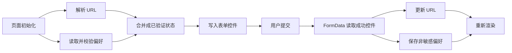
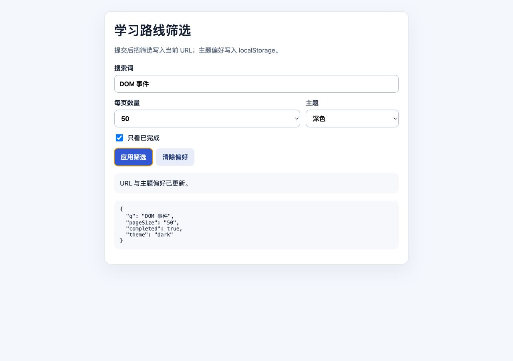
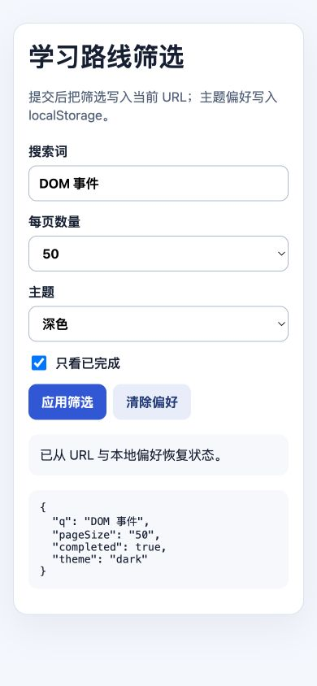

# JavaScript 表单状态、URL 与 Web Storage

表单控件收集用户输入，FormData 按表单提交规则构造键值序列，URL 保存可分享和可返回的页面状态，Web Storage 保存同源浏览上下文中的少量字符串数据。三者都是浏览器 Web API/HTML 平台能力，不属于 ECMAScript 语言规范；服务端和其他宿主的同名工具可能有不同契约。

## 1. 状态应该放在哪里

| 状态 | 合适位置 | 原因 |
| --- | --- | --- |
| 搜索词、排序、分页、非敏感筛选 | URL 查询参数 | 可复制、刷新、前进后退 |
| 控件正在输入但未提交的值 | DOM 控件/应用内存 | 高频、暂态 |
| 主题、密度等小型非敏感偏好 | localStorage 或服务端账户偏好 | 可跨会话恢复 |
| 单标签页临时步骤 | sessionStorage | 页面会话范围 |
| 认证秘密、敏感业务数据 | 安全服务端会话等专用方案 | 同源脚本可读 Storage，不是秘密保险箱 |
| 大型结构、事务数据、离线数据库 | IndexedDB 等异步存储 | Web Storage 同步且容量有限 |



URL 和 Storage 都是不可信输入：用户、扩展、旧版本代码和同源脚本都可以修改。读取后必须解析、验证和迁移。

## 2. 控件属性表示当前状态

表单控件的当前值通常读取 DOM property：

```js
const input = document.querySelector('[name="q"]');
const checkbox = document.querySelector('[name="completed"]');

console.log(input.value);       // String
console.log(checkbox.checked);  // Boolean
```

HTML attribute 往往表示初始/default 状态，property 表示当前交互状态。例如 `value` attribute 与 `input.value`、`checked` attribute 与 `checkbox.checked` 不能在交互后继续当作同一值。

表单的 `elements` 集合可按 name 或 id 访问相关控件，但同名控件可能返回 RadioNodeList，不能一概断言为单个 input。

```js
const form = document.querySelector('#filter-form');
const queryControl = form.elements.namedItem('q');
if (!(queryControl instanceof HTMLInputElement)) {
  throw new TypeError('缺少 q input');
}
```

## 3. 原生约束校验与提交

`form.checkValidity()` 检查候选控件并返回 Boolean；`reportValidity()` 还会请求浏览器展示问题。两者可能触发 invalid 事件。原生校验是客户端体验，不替代服务端验证。

```js
form.addEventListener('submit', (event) => {
  event.preventDefault();
  if (!form.reportValidity()) return;
  // 读取和业务验证
});
```

正常用户提交在约束校验通过后派发 submit；无效时通常不会进入 submit 监听器。因此复杂自定义错误可监听 input/change 或 invalid，但不要重复制造与浏览器冲突的提示。

`form.submit()` 直接触发传统提交，不运行约束校验，也不派发 submit 事件。`form.requestSubmit(submitter?)` 模拟提交按钮路径，会校验并让 submit 事件包含 submitter，通常更符合应用需求。

```js
saveButton.addEventListener('click', () => {
  form.requestSubmit(saveButton);
});
```

## 4. FormData 构造提交数据集

```js
const data = new FormData(form);
```

现代构造器还可接收提交按钮：

```js
form.addEventListener('submit', (event) => {
  event.preventDefault();
  const data = new FormData(form, event.submitter);
});
```

FormData 只包含成功控件：必须有 name，不能被 disabled；未选中的 checkbox/radio 不包含；文件控件产生 File；选中的提交按钮只有在作为 submitter 纳入时才贡献 name/value。readonly 控件通常仍可成功提交，这与 disabled 不同。

FormData 的值是 String 或 File，不会因 `input type="number"` 自动成为 Number。

```js
const pageSizeRaw = data.get('pageSize');
if (typeof pageSizeRaw !== 'string') {
  throw new TypeError('pageSize 必须是文本字段');
}
const pageSize = Number(pageSizeRaw);
```

### 4.1 重复键

checkbox 组、多选和重复 name 会形成多个同名条目。

| API | 行为 |
| --- | --- |
| `get(name)` | 第一个值，缺失为 null |
| `getAll(name)` | 所有值组成数组 |
| `has(name)` | 是否至少存在一个条目 |
| `append(name, value)` | 在末尾追加，不删除已有值 |
| `set(name, value)` | 替换该名称现有条目为一个值 |
| `delete(name)` | 删除该名称条目 |
| `entries()` / 默认迭代 | 按条目迭代二元值 |

```js
const topics = data.getAll('topic').map((value) => String(value));
const completed = data.has('completed');
```

把 FormData 直接 `Object.fromEntries()` 会丢掉重复键，只保留后一个值；仅在 schema 明确每个键唯一时使用。

### 4.2 发送 FormData

```js
await fetch('/api/profile', {
  method: 'POST',
  body: data,
});
```

浏览器会为 FormData 生成带 boundary 的 multipart Content-Type。不要手工设置不含正确 boundary 的 `Content-Type: multipart/form-data`。请求成功、HTTP 错误和响应验证在 Fetch 专篇展开。

## 5. URL 解析与构造

`new URL(input, base?)` 解析并规范化 URL；无效输入抛出 TypeError。相对 URL 必须提供 base。

```js
const url = new URL('/lessons?q=DOM', 'https://example.com/app/');

console.log(url.href);     // https://example.com/lessons?q=DOM
console.log(url.origin);   // https://example.com
console.log(url.pathname); // /lessons
console.log(url.search);   // ?q=DOM
```

`URL.canParse(input, base?)` 可先检查环境支持下能否解析；若后续仍要使用对象，直接 try/catch `new URL()` 避免重复解析通常更简单。

URL 属性包括 protocol、username、password、host、hostname、port、pathname、search、hash。输出日志时不能打印含凭据、token 或敏感查询参数的完整 href。

### 5.1 安全协议白名单

URL 语法有效不代表适合导航。

```js
function parseHttpUrl(raw, base = location.href) {
  const url = new URL(raw, base);
  if (url.protocol !== 'https:' && url.protocol !== 'http:') {
    throw new TypeError('只允许 http/https URL');
  }
  return url;
}
```

是否允许跨 origin、端口、用户名密码和重定向还要按业务约束检查。

## 6. URLSearchParams

`url.searchParams` 是与 URL search 关联的 URLSearchParams 对象，支持重复键并可迭代。

```js
const url = new URL(location.href);
url.searchParams.set('q', 'DOM & Event');
url.searchParams.append('topic', 'html');
url.searchParams.append('topic', 'css');

console.log(url.searchParams.get('q'));
console.log(url.searchParams.getAll('topic'));
```

| API | 作用 |
| --- | --- |
| `get()` / `getAll()` | 读取首个/全部值 |
| `has()` | 检查名称或名称+值 |
| `set()` | 删除同名旧值并设置一个值 |
| `append()` | 追加重复值 |
| `delete()` | 删除名称或按支持的名称+值形式删除 |
| `sort()` | 按键稳定排序并原地修改 |
| `toString()` | 返回不带开头 `?` 的查询字符串 |

值按 application/x-www-form-urlencoded 规则编码，空格通常序列化为 `+`。不要自己用字符串连接或对完整查询重复调用 `encodeURIComponent()`。

```js
const params = new URLSearchParams();
params.set('q', 'DOM & Event');
console.log(params.toString()); // q=DOM+%26+Event
```

从纯对象构造时，数组不会自动成为多个条目：

```js
const params = new URLSearchParams();
for (const topic of ['html', 'css']) params.append('topic', topic);
```

## 7. History 与 URL 状态

`history.pushState(state, '', url)` 创建同文档历史项；`replaceState()` 替换当前项。URL 必须符合当前文档允许的同源约束，否则抛出异常。

```js
const nextUrl = new URL(location.href);
nextUrl.searchParams.set('q', 'DOM');
history.replaceState(null, '', nextUrl);
```

- 输入过程中每个字符都 push 会污染后退历史；通常提交或离散导航用 push，规范化/默认值清理用 replace。
- pushState/replaceState 本身不会触发 `popstate`。
- 用户前进/后退激活历史项时监听 popstate，重新从 location 解析状态。

```js
window.addEventListener('popstate', () => {
  render(parseUrl(new URL(location.href)));
});
```

不要只更新 URL 而忘记更新当前 UI，也不要只更新 UI 而让 URL 与状态不一致。把 parse、serialize 和 render 拆成可测试函数。

## 8. localStorage 与 sessionStorage

Storage 提供同步字符串键值接口：

```js
localStorage.setItem('theme', 'dark');
console.log(localStorage.getItem('theme')); // dark 或 null
localStorage.removeItem('theme');
```

| API | 返回/行为 |
| --- | --- |
| `length` | 键数量 |
| `key(index)` | 对应位置键或 null，顺序不用于业务协议 |
| `getItem(key)` | String 或 null |
| `setItem(key, value)` | 转为字符串保存，可能抛 DOMException |
| `removeItem(key)` | 删除，无返回数据 |
| `clear()` | 删除该 Storage 全部键，谨慎使用 |

localStorage 按 origin 分区并跨浏览器会话保留；sessionStorage 还按顶级浏览上下文/标签页会话隔离。隐私模式、策略、配额、无效 origin 或用户设置都可能使访问/写入失败。

Web Storage 是同步 API。大对象的 JSON 编解码和频繁写入会阻塞主线程；高频输入不应每个键都同步持久化。

### 8.1 JSON、版本与验证

```js
const STORAGE_KEY = 'lili:preferences:v1';

function savePreferences(value) {
  localStorage.setItem(STORAGE_KEY, JSON.stringify({
    version: 1,
    theme: value.theme,
  }));
}
```

读取必须处理缺失、JSON 损坏、旧版本和字段错误：

```js
function loadPreferences() {
  try {
    const text = localStorage.getItem(STORAGE_KEY);
    if (text === null) return { theme: 'system' };

    const raw = JSON.parse(text);
    if (raw?.version !== 1) throw new TypeError('unsupported version');
    if (!['system', 'light', 'dark'].includes(raw.theme)) {
      throw new TypeError('invalid theme');
    }
    return { theme: raw.theme };
  } catch (error) {
    console.warn('preferences_read_failed', { name: error.name });
    return { theme: 'system' };
  }
}
```

失败回退后可选择移除损坏键或保留以便诊断，取决于隐私与恢复策略。日志不记录原始敏感内容。

### 8.2 `storage` 事件

当一个文档修改 Storage，同源的其他相关文档可能收到 storage 事件；执行修改的当前文档不会因自己的该修改收到同样事件。

```js
window.addEventListener('storage', (event) => {
  if (event.storageArea !== localStorage) return;
  if (event.key !== STORAGE_KEY) return;
  renderPreferences(loadPreferences());
});
```

事件包含 key、oldValue、newValue、url、storageArea。`clear()` 时 key 可能为 null。它不是可靠跨设备同步或事务系统；并发写入需要更明确的数据方案。

## 9. 安全与隐私边界

- 任意在同 origin 执行的脚本通常可读取 localStorage；XSS 会使其中的值暴露。
- 不保存访问令牌、会话秘密、密码或无需持久化的个人数据。
- URL 会进入历史、日志、Referer 相关路径、截图和分享，不放秘密。
- 客户端校验和存储值都可被用户修改，服务端必须重新授权与验证。
- 用命名空间键和逐键删除，不用 `clear()` 破坏同源其他模块数据。
- 定义保留周期和清除入口，避免永久保存已经无用的偏好。

## 10. 完整可运行案例

完整页面见 [表单、URL 与存储演示](../../examples/javascript-form-url-storage-demo.html)。它把 q、pageSize、completed 写入 URL，把 theme 写入版本化 localStorage，并在初始化时合并恢复。

### 10.1 提交处理顺序

```js
form.addEventListener('submit', (event) => {
  event.preventDefault();
  if (!form.reportValidity()) return;

  const data = new FormData(form, event.submitter);
  const q = String(data.get('q') ?? '').trim();
  const pageSize = String(data.get('pageSize'));
  const completed = data.has('completed');

  const url = new URL(location.href);
  q === '' ? url.searchParams.delete('q') : url.searchParams.set('q', q);
  completed
    ? url.searchParams.set('completed', '1')
    : url.searchParams.delete('completed');
  history.replaceState(null, '', url);
});
```

控件值先经 FormData 读取，再按业务 schema 转换；默认值从 URL 删除以保持简洁；replaceState 不触发 popstate，所以同一处理器还要直接 render。

### 10.2 可观察输出

输入 `DOM & Event`、pageSize 50、勾选 completed、theme dark 后：

- 地址查询包含编码后的 q、pageSize=50、completed=1。
- output 显示 URL 与偏好已更新。
- pre 以纯文本显示解析状态。
- localStorage 的 `lili:filter-preferences:v1` 值为 JSON theme 数据。
- 刷新后表单恢复同一状态。

### 10.3 浏览器验证步骤

1. 用 HTTP 服务打开 demo，清除该 origin 的目标键和查询参数。
2. 填写上述输入并提交，核对地址、控件和 pre 一致。
3. 刷新，确认 URL 筛选与主题偏好恢复。
4. 把 Storage 值改成非法 JSON 后刷新，应回退 system 并只有一条脱敏 warning。
5. 把 pageSize 查询改成 999 后刷新，应回退 20。
6. 点击清除偏好，确认只移除项目键，不影响其他 Storage。
7. 新开同源标签页修改目标键，验证原标签收到 storage 事件的设计边界。
8. 390px 检查单列布局无横向溢出，Console 除故意损坏测试外为 0。

桌面状态：提交后，URL 查询参数、控件值和解析结果保持一致。



390px 窄屏状态：刷新后从 URL 和 localStorage 恢复筛选与主题偏好。



### 10.4 失败注入

- 删除 checkbox 的 name，验证 FormData 不再包含 completed。
- 给 pageSize 设置 disabled，验证它不进入成功控件集合。
- 用 `Object.fromEntries()` 处理重复 topic，验证重复值丢失。
- 把 URL 设置为非法/不允许协议，验证构造或协议白名单失败。
- 模拟 Storage 被禁用或配额失败，确认 URL 仍更新且 UI 显示偏好无法保存。
- 使用 `form.submit()`，验证绕过 submit 监听和约束校验；恢复 `requestSubmit()`。

## 11. 调试清单

1. FormData 缺字段：检查 name、disabled、checked、submitter 和成功控件规则。
2. 类型错误：FormData、dataset、Storage、URL 参数默认都是字符串边界。
3. URL 重复/乱码：只使用 URLSearchParams 编码，不手工拼接或重复编码。
4. 后退不同步：监听 popstate 并从 location 重新解析。
5. Storage 恢复失败：检查 origin、隐私设置、JSON、schema version 与配额异常。
6. 当前页没收到 storage：这是事件设计；当前写入路径直接更新自身 UI。
7. 刷新后丢状态：确认 push/replace 使用正确 URL，Storage 写入没有被 catch 静默。
8. 安全审查：URL 和 Storage 是否包含秘密、个人数据或不必要原文。

## 12. 练习与完成标准

实现一个课程搜索页面：

- URL 保存 q、重复 topic、sort 和 page；默认值不写入 URL。
- 表单使用 requestSubmit 和 FormData，正确处理重复 topic。
- URL parser 对所有枚举、整数范围和重复数量设限。
- localStorage 只保存版本化 theme 与 density 偏好，读取失败安全回退。
- popstate 恢复页面，storage 事件同步其他同源标签页偏好。
- Storage 不可用时核心搜索仍工作。
- 测试无 name、disabled、未选 checkbox、重复键、非法 JSON、旧版本和配额错误。

完成标准是：刷新、分享、前进后退结果一致；不存在手工 URL 拼接；任何客户端值都重新验证；目标存储中没有认证或私人内容；真实浏览器窄屏和 Console 验证通过。

## 来源

- [MDN：FormData](https://developer.mozilla.org/en-US/docs/Web/API/FormData)（访问日期：2026-07-17）
- [MDN：URL](https://developer.mozilla.org/en-US/docs/Web/API/URL)（访问日期：2026-07-17）
- [MDN：URLSearchParams](https://developer.mozilla.org/en-US/docs/Web/API/URLSearchParams)（访问日期：2026-07-17）
- [MDN：Web Storage API](https://developer.mozilla.org/en-US/docs/Web/API/Web_Storage_API)（访问日期：2026-07-17）
