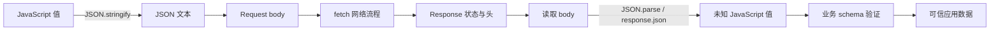
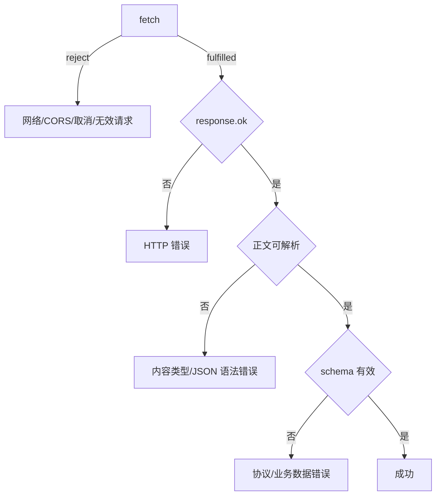

# JavaScript JSON、Fetch、HTTP 语义与错误分层

JSON 是语言无关的数据交换格式，JavaScript 通过 `JSON.parse()` 与 `JSON.stringify()` 在文本和值之间转换。Fetch 是浏览器提供的网络 Web API，HTTP 定义请求方法、状态和缓存等协议语义。一个可靠客户端必须分别处理序列化失败、请求失败、HTTP 非成功响应、正文解析失败和业务数据不符合契约。

## 1. 分清三层规范

- ECMAScript 定义 `JSON` 对象、Promise、异常和语言求值。
- Fetch Standard 定义 Request、Response、Headers、CORS 交互和 fetch 算法。
- HTTP 规范定义方法、状态码、字段和语义。

浏览器把这些能力组合给 JavaScript。不能从 ECMAScript 规范推导 CORS，也不能把“fetch Promise fulfilled”解释为 HTTP 成功。



每个箭头都可能失败，且需要不同恢复策略。

## 2. JSON 能表示什么

JSON 值只有 object、array、string、number、`true`、`false` 和 `null`。对象键必须是字符串。JSON 没有 `undefined`、BigInt、Symbol、函数、Map、Set、Date、NaN、Infinity 或对象引用身份。

```json
{
  "id": "js-10",
  "minutes": 45,
  "tags": ["json", "fetch"],
  "completed": false,
  "note": null
}
```

JSON 文本要求双引号，不允许注释、尾随逗号或 JavaScript 表达式。它不是 JavaScript 对象字面量的别名。

## 3. `JSON.parse()`

```js
const value = JSON.parse('{"page":2,"done":false}');
console.log(value.page); // 2
```

输入先转为字符串，再按 JSON 语法解析。无效 JSON 抛出 SyntaxError；成功结果仍是未知、不可信值。

```js
function parseObject(text) {
  let value;
  try {
    value = JSON.parse(text);
  } catch (error) {
    throw new SyntaxError('响应不是有效 JSON', { cause: error });
  }

  if (value === null || typeof value !== 'object' || Array.isArray(value)) {
    throw new TypeError('响应根节点必须是对象');
  }
  return value;
}
```

`JSON.parse('null')`、`JSON.parse('1')` 都合法，所以“解析成功”不保证根节点是对象，更不保证字段正确。

### 3.1 reviver 的自底向上处理

第二参数 reviver 在解析后自底向上访问属性，返回 `undefined` 会删除该属性，其他返回值替换它。

```js
const parsed = JSON.parse(
  '{"startedAt":"2026-07-17T01:00:00.000Z"}',
  (key, value) => key === 'startedAt' ? new Date(value) : value,
);
```

自动把所有同名字段转 Date 容易误判；通常先验证 schema，再在明确字段上转换。reviver 也不能恢复 JSON 未编码的原型、Map 或对象身份，除非协议显式携带类型信息。

### 3.2 大整数与数字互操作

JSON number 没有规定 JavaScript 安全整数限制，但解析到 Number 后超大整数可能已丢精度。

```js
const result = JSON.parse('{"id":9007199254740993}');
console.log(result.id); // 可能已变为无法精确表示的 Number
```

跨系统大整数标识符应由协议定义为字符串，并在各端按字符串或 BigInt 需求处理。

## 4. `JSON.stringify()`

```js
const text = JSON.stringify({ id: 'js-10', done: false });
console.log(text); // {"id":"js-10","done":false}
```

第二参数可为 replacer 函数或属性白名单数组，第三参数控制缩进（用于可读输出，不改变数据语义）。

```js
const publicText = JSON.stringify(
  { id: 1, name: 'Lili', passwordHash: 'secret' },
  ['id', 'name'],
  2,
);
```

### 4.1 不支持值的行为不同

```js
console.log(JSON.stringify({ value: undefined })); // '{}'
console.log(JSON.stringify([undefined]));           // '[null]'
console.log(JSON.stringify(NaN));                   // 'null'
```

- object 属性值为 undefined、函数或 Symbol 时通常省略。
- array 中相应位置序列化为 null，以保留索引。
- NaN、Infinity 和 -Infinity 序列化为 null。
- 顶层 undefined/函数/Symbol 返回 undefined，不是 JSON 字符串。
- BigInt 默认抛出 TypeError。
- 循环引用默认抛出 TypeError。

```js
const circular = {};
circular.self = circular;
// JSON.stringify(circular); // TypeError
// JSON.stringify(1n);       // TypeError
```

### 4.2 `toJSON()` 与 Date

对象定义 `toJSON(key)` 时，stringify 先使用其返回值。Date 的 toJSON 通常产生 ISO 字符串。

```js
console.log(JSON.stringify({ at: new Date('2026-07-17T01:00:00Z') }));
// {"at":"2026-07-17T01:00:00.000Z"}
```

解析不会自动恢复 Date。协议应明确时间字符串格式与时区。

### 4.3 replacer 不等于完整安全边界

```js
function redact(key, value) {
  if (key === 'token' || key === 'password') return undefined;
  return value;
}
```

字段黑名单可能漏掉未来新增的秘密字段。对外协议使用显式 DTO 白名单，日志再做独立脱敏。

## 5. HTTP 方法语义

| 方法 | 典型语义 | 安全 | 幂等 |
| --- | --- | --- | --- |
| GET | 获取资源表示 | 是 | 是 |
| HEAD | 获取与 GET 类似的响应头而无响应内容 | 是 | 是 |
| POST | 按资源定义处理内容，常用于创建/动作 | 否 | 不保证 |
| PUT | 用请求内容创建或整体替换目标资源 | 否 | 是 |
| PATCH | 对资源应用部分修改 | 否 | 不保证 |
| DELETE | 删除目标资源关联 | 否 | 是 |
| OPTIONS | 查询通信选项 | 是 | 是 |

“安全”表示客户端不请求改变服务器状态，不代表无日志或计费等副作用。“幂等”表示重复同一请求的预期效果与一次相同，不代表每次响应相同，也不保证服务实现正确。

重试 POST 可能重复创建或扣款。写操作重试要结合请求幂等键、服务端去重、方法语义和响应是否已到达，不能仅按状态码自动重试。

## 6. HTTP 状态码

- 1xx：信息响应。
- 2xx：请求成功处理；例如 200、201、204。
- 3xx：重定向或缓存相关。
- 4xx：客户端请求无法按当前形式完成；例如 400、401、403、404、409、422、429。
- 5xx：服务器未能完成有效请求；例如 500、502、503、504。

客户端逻辑应依据具体 API 契约，而不是把所有 4xx 展示为“网络错误”。401 常表示需要认证，403 表示服务器理解但拒绝，404 可能是资源不存在或隐藏，409 可表示状态冲突，429 可结合 Retry-After 策略。

Response 的 `ok` 在 status 200–299 时为 true。204 没有内容，不能无条件调用 `response.json()`。

## 7. 发起 Fetch 请求

```js
const response = await fetch('/api/lessons?limit=20', {
  method: 'GET',
  headers: { Accept: 'application/json' },
  signal,
});
```

fetch 接受 URL/String/Request 和 RequestInit，返回 `Promise<Response>`。浏览器收到状态与响应头后 Promise 就可能 fulfilled，正文仍需异步读取。

### 7.1 JSON 请求体

```js
const response = await fetch('/api/lessons', {
  method: 'POST',
  headers: {
    Accept: 'application/json',
    'Content-Type': 'application/json',
  },
  body: JSON.stringify({ title: 'Fetch' }),
});
```

GET/HEAD 不能带请求 body。发送 FormData 时不要手工设置 multipart boundary。浏览器禁止脚本设置部分请求头。

### 7.2 CORS 与 `no-cors`

跨源读取由 CORS 决定。服务端必须允许 origin、方法和头；某些请求先进行 preflight。CORS 不是在客户端添加一个任意头就能绕过的错误。

`mode: 'no-cors'` 通常产生 opaque Response，JavaScript 无法读取 status、headers 或 body，不是“关闭 CORS 并正常读响应”。应用 API 通常不应使用它掩盖服务端配置。

### 7.3 credentials

浏览器 fetch 默认 credentials 是 `same-origin`。跨源携带凭据需 `include`，同时受 Cookie SameSite、服务端 CORS 明确 origin 和 Access-Control-Allow-Credentials 等约束。携带凭据的写请求还需防 CSRF；CORS 与认证不是同一安全层。

## 8. Response 与一次性正文

常用属性：status、statusText、ok、headers、url、redirected、type、body、bodyUsed。

正文读取方法都返回 Promise：

- `json()`：读取并解析 JSON，语法错误会拒绝。
- `text()`：解码为文本。
- `blob()`：得到 Blob。
- `arrayBuffer()`：得到 ArrayBuffer。
- `formData()`：按相应格式解析。

正文流只能消费一次。

```js
const text = await response.text();
console.log(response.bodyUsed); // true
// await response.json(); // TypeError：正文已消费
```

需要两种读取方式可在消费前 `response.clone()`，但克隆会带来流分流和缓存内存边界，不能用于无限大响应的随意重复读取。

## 9. 内容类型与 JSON 响应

Content-Type 可能包含参数，应解析媒体类型而不是要求字符串完全等于。

```js
function isJsonContentType(value) {
  if (value === null) return false;
  const mediaType = value.split(';', 1)[0].trim().toLowerCase();
  return mediaType === 'application/json' || mediaType.endsWith('+json');
}
```

API 是否接受 `application/problem+json` 等后缀类型由契约决定。服务端错误页可能是 HTML；盲目 `response.json()` 会得到解析错误并丢失真正 HTTP 状态上下文。

204、HEAD 响应或 Content-Length 0 应按契约返回无正文结果。

## 10. 错误分层



Fetch 对 404/500 通常 fulfilled，不自动 reject。网络失败常只给 TypeError，浏览器可能有意不向脚本暴露更详细安全原因，应结合 Network 面板诊断。

### 10.1 可识别错误类型

```js
class HttpError extends Error {
  constructor(message, { status, url, body, cause } = {}) {
    super(message, { cause });
    this.name = 'HttpError';
    this.status = status;
    this.url = url;
    this.body = body;
  }
}

class ProtocolError extends Error {
  constructor(message, options) {
    super(message, options);
    this.name = 'ProtocolError';
  }
}
```

错误 body 必须限制大小并脱敏；不能把完整服务端错误、token 或个人数据写日志。

## 11. 取消与超时

Fetch 使用 AbortSignal 取消。超时不是 HTTP 状态，而是客户端策略。

```js
async function fetchWithTimeout(url, options = {}, timeoutMs = 5000) {
  const timeoutSignal = AbortSignal.timeout(timeoutMs);
  const signals = options.signal
    ? AbortSignal.any([options.signal, timeoutSignal])
    : timeoutSignal;

  return fetch(url, { ...options, signal: signals });
}
```

`AbortSignal.timeout()`/`any()` 采用前检查目标环境。兼容实现可用 AbortController + timer，并在 finally 清理 timer。

```js
async function withTimeout(fetchImpl, input, init, timeoutMs) {
  const controller = new AbortController();
  const timer = setTimeout(() => controller.abort('timeout'), timeoutMs);
  try {
    return await fetchImpl(input, { ...init, signal: controller.signal });
  } finally {
    clearTimeout(timer);
  }
}
```

取消 fetch 不保证服务器没收到或没执行写请求。UI 取消与业务撤销需要服务端协议支持。

## 12. 重试边界

可考虑重试临时网络失败、429、502、503、504，但必须同时满足：

- 操作安全/幂等，或有可靠幂等键。
- 次数上限、指数退避和抖动。
- 遵守 Retry-After 等服务端提示。
- 响应和异常明确分类。
- 总时限和用户取消 signal 可终止等待。

不要重试认证失败、验证失败或确定的 404；不要让多个客户端同步固定间隔重试形成流量尖峰。

## 13. 完整可运行案例：JSON API 客户端

以下案例把 fetch 作为依赖注入，可用浏览器 Fetch，也可在 Node 24 中使用内置 Response 和 mockFetch 实跑，无需真实网络。

```js
function assertLessonPayload(value) {
  if (value === null || typeof value !== 'object' || Array.isArray(value)) {
    throw new ProtocolError('响应根节点必须是对象');
  }
  if (!Array.isArray(value.lessons)) {
    throw new ProtocolError('lessons 必须是数组');
  }
  for (const [index, lesson] of value.lessons.entries()) {
    if (lesson === null || typeof lesson !== 'object') {
      throw new ProtocolError(`lessons[${index}] 必须是对象`);
    }
    if (typeof lesson.id !== 'string' || typeof lesson.title !== 'string') {
      throw new ProtocolError(`lessons[${index}] 字段无效`);
    }
  }
  return value;
}

async function readJsonBody(response) {
  const contentType = response.headers.get('content-type');
  if (!isJsonContentType(contentType)) {
    throw new ProtocolError(`预期 JSON，实际为 ${contentType ?? 'unknown'}`);
  }
  try {
    return await response.json();
  } catch (error) {
    throw new ProtocolError('响应 JSON 无法解析', { cause: error });
  }
}

async function getLessons(fetchImpl, { signal } = {}) {
  let response;
  try {
    response = await fetchImpl('/api/lessons', {
      headers: { Accept: 'application/json' },
      signal,
    });
  } catch (error) {
    if (signal?.aborted) throw error;
    throw new TypeError('请求无法完成', { cause: error });
  }

  if (!response.ok) {
    const body = await response.text();
    throw new HttpError(`HTTP ${response.status}`, {
      status: response.status,
      url: response.url,
      body: body.slice(0, 1000),
    });
  }

  return assertLessonPayload(await readJsonBody(response));
}
```

### 13.1 成功 mock

```js
async function successFetch() {
  return new Response(JSON.stringify({
    lessons: [{ id: 'js-10', title: 'Fetch' }],
  }), {
    status: 200,
    headers: { 'Content-Type': 'application/json; charset=utf-8' },
  });
}

const data = await getLessons(successFetch);
console.log(data.lessons[0].title); // Fetch
```

### 13.2 失败注入

```js
const scenarios = [
  async () => { throw new TypeError('network down'); },
  async () => new Response('missing', { status: 404 }),
  async () => new Response('<html>error</html>', {
    status: 200,
    headers: { 'Content-Type': 'text/html' },
  }),
  async () => new Response('{', {
    status: 200,
    headers: { 'Content-Type': 'application/json' },
  }),
  async () => new Response('{"lessons":null}', {
    status: 200,
    headers: { 'Content-Type': 'application/json' },
  }),
];

for (const mockFetch of scenarios) {
  try {
    await getLessons(mockFetch);
    throw new Error('预期失败但成功');
  } catch (error) {
    console.log(error.name, error.message);
  }
}
```

正式测试使用 `assert.rejects()` 区分被测失败与测试自身错误，并断言 cause、status 和错误分类。

### 13.3 验证证据

成功应输出 `Fetch`。五个失败依次落在网络、HTTP、Content-Type、JSON 语法和 schema 层。Response body 每条路径只消费一次。Node 24 可直接运行该 mock 案例；真实浏览器还要用 Network 面板验证 CORS、credentials、重定向和缓存。

## 14. 调试清单

1. Network 面板确认请求 URL、方法、状态、重定向、CORS 和响应类型。
2. fetch reject 与 HTTP 非 ok 分开处理。
3. 读取 body 前检查 204/HEAD 和 Content-Type 契约。
4. 检查 bodyUsed，避免同一响应重复消费。
5. JSON parse 后继续做根节点、字段、枚举和范围验证。
6. AbortError/TimeoutError 与用户主动取消、超时策略分别记录。
7. 重试前确认方法幂等、服务端幂等键和总次数。
8. 日志只保留 request id、status、错误分类与脱敏上下文。
9. `no-cors` opaque 响应不能用于读取 API 数据。
10. 大响应使用流式策略并限制错误正文缓存。

## 15. 练习与完成标准

实现一个 `createLesson()` 客户端：

- 输入先验证，再 JSON.stringify；序列化失败要保留 cause。
- POST 携带 Content-Type/Accept 与幂等键。
- 分别处理 201 JSON、204、409、422、429 和 5xx。
- 解析 problem+json 错误，但限制正文大小和可记录字段。
- 支持外部取消与总超时，不把取消显示成服务器故障。
- 用 mock Response 覆盖网络拒绝、HTML 错误页、非法 JSON、schema 错误和重复消费。

完成标准是：每个失败落入单一明确层；不会自动重试无幂等保护的 POST；JSON/HTTP/Fetch 规范责任没有混写；Node 24 mock 与浏览器 Network 验证均通过。

## 来源

- [MDN：Using the Fetch API](https://developer.mozilla.org/en-US/docs/Web/API/Fetch_API/Using_Fetch)（访问日期：2026-07-17）
- [WHATWG：Fetch Standard](https://fetch.spec.whatwg.org/)（访问日期：2026-07-17）
- [RFC 9110：HTTP Semantics](https://www.rfc-editor.org/rfc/rfc9110)（访问日期：2026-07-17）
- [RFC 8259：The JavaScript Object Notation Data Interchange Format](https://www.rfc-editor.org/rfc/rfc8259)（访问日期：2026-07-17）
