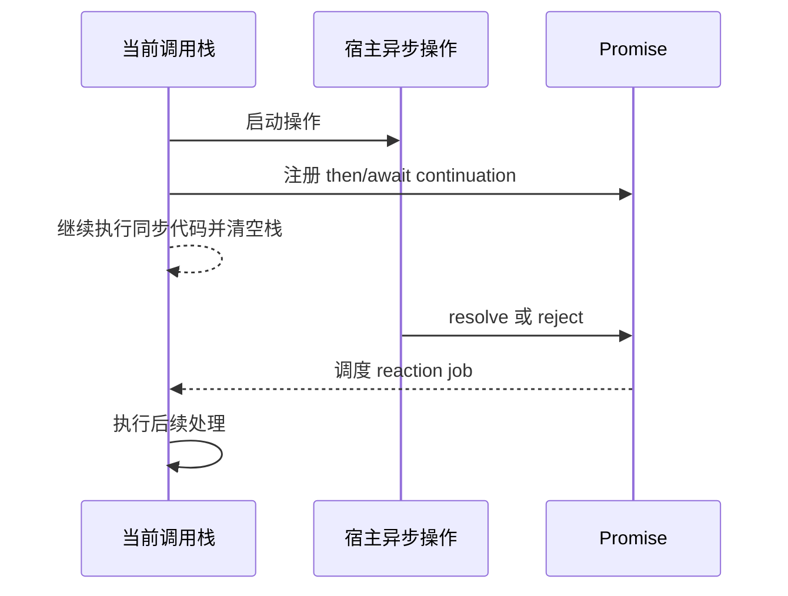

# JavaScript 同步、回调、Promise 与 async/await

同步函数在当前调用栈上完成并直接返回或抛错。异步操作允许当前代码继续，稍后通过回调、Promise 或宿主事件报告结果。Promise 是 ECMAScript 对“最终完成或失败”的一次性结果建模；它不是线程、任务本身或自动取消机制。`async`/`await` 在 Promise 之上提供顺序式语法。

## 1. 三个问题必须分开

1. 工作在哪里执行：主线程、浏览器网络进程、Worker 或其他宿主设施。
2. 结果如何表示：回调、Promise、事件或流。
3. 后续代码何时运行：当前栈、Promise job/microtask 或宿主任務。

ECMAScript 定义 Promise job 与语言语义；计时器、Fetch 和浏览器事件由 Web 平台定义。不能说“Promise 创建了后台线程”。



事件循环的任务、microtask 检查点和渲染时序将在 JS15 专篇展开；本篇聚焦如何正确组合异步结果。

## 2. Callback 是函数参数

回调是传给另一个函数、由后者在适当时机调用的函数。回调既可同步，也可异步，API 必须明确。

```js
const values = [1, 2, 3];
const doubled = values.map((value) => value * 2); // 同步回调
```

```js
setTimeout(() => {
  console.log('later'); // 由宿主稍后调用
}, 0);
```

“接受 callback”并不自动代表异步。混合同步/异步调用同一回调会产生难以预测的重入，API 应保持一致时序。

传统 Node 风格回调常以 `(error, value)` 表达一次结果：

```js
readConfig((error, value) => {
  if (error) {
    handleError(error);
    return;
  }
  useConfig(value);
});
```

多层依赖回调会重复错误处理并增加嵌套。Promise 让结果成为可返回和组合的对象。

## 3. Promise 的状态与结果

Promise 初始 pending，随后只能第一次 settle：

- fulfilled：有 fulfillment value。
- rejected：有 rejection reason。

settled 后不能再次改变。Promise “resolved” 不总等于 fulfilled：它可能已绑定到另一个仍 pending 的 Promise/thenable，最终跟随其状态。

```js
const inner = new Promise((resolve) => {
  setTimeout(() => resolve('done'), 10);
});

const outer = new Promise((resolve) => {
  resolve(inner); // outer 跟随 inner，不立即得到字符串
});

console.log(await outer); // done
```

Promise 状态不能通过标准同步属性直接读取；消费者通过 then/catch/finally 观察结果。

## 4. 创建 Promise

构造器接收 executor，它在构造 Promise 时同步执行，并得到 resolve、reject 两个函数。

```js
const promise = new Promise((resolve, reject) => {
  const valid = true;
  if (valid) resolve({ ok: true });
  else reject(new Error('invalid'));
});
```

executor 抛错会使 Promise rejected；在已经 resolve/reject 后再次调用或抛错不会改变首次结算结果。

```js
const value = await new Promise((resolve) => {
  resolve('first');
  resolve('second');
});
console.log(value); // first
```

不要为已经返回 Promise 的 API 再包一层无必要 Promise：

```js
// 多余并容易漏掉错误
function loadBad() {
  return new Promise((resolve, reject) => {
    fetch('/api').then(resolve, reject);
  });
}

function load() {
  return fetch('/api');
}
```

Promise 构造器主要用于把一次性旧回调 API 适配成 Promise，并且必须保证只完成一次和正确清理。

### 4.1 包装一次性回调

```js
function wait(ms, { signal } = {}) {
  return new Promise((resolve, reject) => {
    if (!Number.isFinite(ms) || ms < 0) {
      reject(new RangeError('ms 必须是非负有限数'));
      return;
    }
    if (signal?.aborted) {
      reject(signal.reason ?? new DOMException('Aborted', 'AbortError'));
      return;
    }

    const timer = setTimeout(resolve, ms);
    signal?.addEventListener('abort', () => {
      clearTimeout(timer);
      reject(signal.reason ?? new DOMException('Aborted', 'AbortError'));
    }, { once: true });
  });
}
```

这段依赖浏览器/现代宿主的 timer、AbortSignal 和 DOMException，不是纯 ECMAScript。生产封装还应在成功后移除 abort listener，避免长寿命 signal 保留闭包；可使用 `{ signal: cleanupSignal }` 或保存函数清理。

## 5. `then()` 返回新 Promise

```js
const next = promise.then(onFulfilled, onRejected);
```

then 不修改原 Promise，返回新的 Promise。处理器不会在注册时同步执行，即使原 Promise 已 settled，也会通过 Promise job 稍后执行。

处理器结果决定新 Promise：

- 返回普通值 → 新 Promise fulfilled 为该值。
- 不 return → fulfilled 为 undefined。
- throw → 新 Promise rejected 为异常。
- 返回 Promise/thenable → 新 Promise 跟随它。

```js
Promise.resolve(2)
  .then((value) => value * 3)
  .then((value) => {
    if (value !== 6) throw new Error('unexpected');
    return Promise.resolve(value + 1);
  })
  .then((value) => console.log(value)); // 7
```

### 5.1 必须返回异步工作

```js
// 错误：fetch 成为 floating Promise，下一步提前执行
loadUrl().then((url) => {
  fetch(url);
}).then(() => console.log('并不代表 fetch 完成'));
```

```js
// 正确：链跟踪 fetch 的结果
loadUrl()
  .then((url) => fetch(url))
  .then((response) => response.json())
  .then((data) => console.log(data));
```

lint 的 no-floating-promises/consistent-return 等规则可帮助发现遗漏，但仍需理解每个分支是否返回同一异步契约。

## 6. `catch()` 与错误传播

`promise.catch(onRejected)` 等价于 `promise.then(undefined, onRejected)`。同步 throw 和前序 Promise rejection 都沿链寻找下一个拒绝处理器。

```js
loadConfig()
  .then(validateConfig)
  .then(startApp)
  .catch((error) => {
    console.error('startup_failed', { name: error.name });
  });
```

catch 正常 return 会把链恢复为 fulfilled：

```js
const value = await Promise.reject(new Error('missing'))
  .catch(() => 'fallback');
console.log(value); // fallback
```

只在确实能恢复时返回回退值；否则增加上下文后重新 throw。

```js
async function loadApplicationConfig() {
  try {
    return await loadConfig();
  } catch (error) {
    throw new Error('无法加载应用配置', { cause: error });
  }
}
```

不要同时在 `then(success, failure)` 的 failure 中期待捕获 success 自己抛出的异常，因为二者处理同一个上游 Promise；链尾 catch 更符合顺序传播。

## 7. `finally()`

finally 在 settlement 后运行，不接收结果参数，适合清理。正常完成时会透传原 fulfillment/rejection；如果 finally 抛错或返回 rejected Promise，会用新错误替代原结果。

```js
function loadWithIndicator() {
  setLoading(true);
  return loadData()
    .finally(() => setLoading(false));
}
```

finally 不适合返回业务回退值。要恢复错误使用 catch。

## 8. async 函数

async 函数调用总是返回 Promise：

```js
async function answer() {
  return 42;
}

const promise = answer();
console.log(promise instanceof Promise); // true
console.log(await promise); // 42
```

return 普通值会成为 fulfilled value；throw 会成为 rejection；return Promise 会被采用。

```js
async function fail() {
  throw new Error('failed');
}
```

调用 async 函数而不 await/return/catch 会产生 floating Promise。事件监听器调用 async 函数时也要建立顶层错误边界。

```js
button.addEventListener('click', () => {
  save().catch((error) => reportError(error));
});
```

DOM EventTarget 不会使用 async listener 返回的 Promise 来处理 rejection。

## 9. `await` 的准确行为

await 将表达式转为 Promise 语义；当前 async 函数的后续部分暂停，调用方和其他工作继续。fulfill 后 await 表达式得到值；reject 时在该位置 throw。

```js
async function run() {
  console.log('A');
  const value = await Promise.resolve('B');
  console.log(value);
}

console.log('start');
run();
console.log('end');
// start, A, end, B
```

即使 await 一个非 Promise 值，函数后续也不会当作普通同步直落代码在同一段调用中继续；它经过 await continuation 的调度语义。

await 主要用于 async 函数；模块顶层也可使用 top-level await，但它会影响依赖模块求值，应只用于明确的模块初始化依赖。

## 10. async/await 错误与清理

```js
async function refresh() {
  setLoading(true);
  try {
    const response = await fetch('/api/lessons');
    if (!response.ok) throw new Error(`HTTP ${response.status}`);
    return await response.json();
  } catch (error) {
    throw new Error('刷新失败', { cause: error });
  } finally {
    setLoading(false);
  }
}
```

try 范围不应过宽。如果可选步骤失败可回退、关键步骤不能回退，使用嵌套小范围 try/catch 或拆函数，不能用一个 catch 把编程错误也伪装成网络错误。

`return await promise` 在多数普通返回场景可以简写为 return promise，但在 try/catch 中若需要当前函数捕获 rejection，就必须 await；它也可改善当前 async 边界的错误堆栈表现。根据错误边界而不是机械规则选择。

## 11. 串行、并发与并行

依赖前一步结果时必须串行：

```js
const user = await loadUser();
const permissions = await loadPermissions(user.id);
```

互不依赖的操作可先启动，再共同等待：

```js
const userPromise = loadUser();
const settingsPromise = loadSettings();
const [user, settings] = await Promise.all([userPromise, settingsPromise]);
```

这表示并发等待，不保证 CPU 工作在多个线程并行。具体底层执行由操作和宿主决定。

循环中的 await 会串行：

```js
for (const id of ids) {
  results.push(await loadLesson(id));
}
```

如果操作独立且服务允许并发：

```js
const results = await Promise.all(ids.map((id) => loadLesson(id)));
```

无界并发可能耗尽连接、内存或触发限流；大集合需要并发上限。组合器、部分失败、异步迭代和取消在 JS16 深入。

## 12. 基础 Promise 组合器

| API | fulfillment | rejection |
| --- | --- | --- |
| `Promise.all(iterable)` | 全部 fulfilled，按输入顺序给数组 | 首个观察到的 rejection |
| `Promise.allSettled(iterable)` | 全部 settled 后给状态数组 | 通常自身不因成员 rejection 而 rejected |
| `Promise.race(iterable)` | 首个 settled 成员若 fulfilled | 首个 settled 成员若 rejected |
| `Promise.any(iterable)` | 首个 fulfilled | 全部 rejected 后 AggregateError |

组合器不会自动取消其他操作。`Promise.all()` 早拒绝后，其他 fetch/计时器仍可能继续，需显式 AbortSignal 设计。

空 iterable 也有定义：all/allSettled fulfilled，any rejected AggregateError，race 保持 pending。代码不能假设至少有一个成员。

## 13. Promise 与取消

Promise 没有通用 cancel 方法。取消属于底层操作协议。Fetch、部分 DOM API 和自定义函数可接受 AbortSignal。

```js
const controller = new AbortController();
const promise = fetch('/api/lessons', { signal: controller.signal });

controller.abort('navigation');
await promise;
```

取消等待不等于撤销服务端已经执行的写操作。竞态 UI 还需用请求序号、signal 或状态版本防止旧响应覆盖新状态。

## 14. 未处理 rejection

浏览器可能在 Promise rejection 没有及时处理器时派发 `unhandledrejection`，之后补加处理器可能触发 `rejectionhandled`。这些全局事件适合最后诊断与遥测，不是正常错误处理替代品。

```js
window.addEventListener('unhandledrejection', (event) => {
  console.error('unhandled_rejection', { reasonName: event.reason?.name });
});
```

是否终止进程、打印或上报取决于宿主。库代码不应通过全局 catch 吞掉调用方错误。

## 15. 完整可运行案例：加载学习面板

案例模拟两个独立请求、一个依赖计算和可选统计步骤，可在 Node 24 直接运行。

```js
function delay(ms, value, { reject = false } = {}) {
  return new Promise((resolve, rejectPromise) => {
    setTimeout(() => {
      if (reject) rejectPromise(value);
      else resolve(value);
    }, ms);
  });
}

async function loadUser() {
  return delay(20, { id: 'u1', name: 'Lili' });
}

async function loadLessons() {
  return delay(10, [
    { id: 'js-10', minutes: 45 },
    { id: 'js-11', minutes: 50 },
  ]);
}

async function loadOptionalStats(shouldFail) {
  if (shouldFail) {
    return delay(5, new Error('stats unavailable'), { reject: true });
  }
  return delay(5, { streak: 7 });
}

async function buildDashboard({ statsMayFail = false } = {}) {
  const startedAt = Date.now();
  const userPromise = loadUser();
  const lessonsPromise = loadLessons();

  const [user, lessons] = await Promise.all([userPromise, lessonsPromise]);
  const totalMinutes = lessons.reduce(
    (total, lesson) => total + lesson.minutes,
    0,
  );

  let stats = null;
  try {
    stats = await loadOptionalStats(statsMayFail);
  } catch (error) {
    console.warn('optional_stats_failed', { name: error.name });
  }

  return {
    user,
    lessonCount: lessons.length,
    totalMinutes,
    stats,
    elapsedMs: Date.now() - startedAt,
  };
}
```

### 15.1 成功与可选失败

```js
const success = await buildDashboard();
console.log(success.user.name);       // Lili
console.log(success.lessonCount);     // 2
console.log(success.totalMinutes);    // 95
console.log(success.stats.streak);    // 7

const fallback = await buildDashboard({ statsMayFail: true });
console.log(fallback.stats);          // null
```

user 与 lessons 在同一同步片段启动，因此约 20ms 后都完成，不是先等待 20ms 再等待 10ms。统计依赖主数据完成后再运行；它是可选能力，局部 catch 回退 null。elapsedMs 只用于粗略证据，不做严格定时断言。

### 15.2 关键失败必须传播

```js
async function loadLessonsFailure() {
  throw new Error('lessons failed');
}

async function criticalFailureCase() {
  const [user, lessons] = await Promise.all([
    loadUser(),
    loadLessonsFailure(),
  ]);
  return { user, lessons };
}

try {
  await criticalFailureCase();
  throw new Error('预期失败但成功');
} catch (error) {
  console.log(error.message); // lessons failed
}
```

正式测试用 `assert.rejects()`，避免 catch 捕获测试自身断言。关键 lessons 失败不能被可选 stats 的回退逻辑吞掉。

### 15.3 时序验证

```js
const order = [];

order.push('sync:start');
Promise.resolve().then(() => order.push('promise:then'));
order.push('sync:end');

await Promise.resolve();
console.log(order);
// ['sync:start', 'sync:end', 'promise:then']
```

Node 24 可实跑全部案例。精确任务/microtask/计时器顺序将在 JS15 通过更严格宿主模型验证。

## 16. 调试清单

1. 值是 Promise 而非结果：检查是否漏 await/return。
2. 链提前继续：检查 then 回调是否返回内部 Promise。
3. 错误没被 catch：确认 Promise 是否 floating、catch 是否挂在正确链上。
4. catch 后静默成功：检查 catch 是否无意 return undefined。
5. 操作过慢：确认独立任务是否被顺序 await，是否需要并发上限。
6. 旧响应覆盖新状态：加入 AbortSignal 或请求版本判断。
7. finally 覆盖错误：不要在 finally return/throw，除非有明确替代语义。
8. async event listener：在事件边界显式 catch Promise。
9. `Promise.all` 拒绝后：其他操作仍在运行，检查副作用和取消。
10. 测试不稳定：不要断言精确毫秒，记录逻辑顺序和可控 deferred Promise。

## 17. 练习与完成标准

实现一个带取消的搜索协调器：

- 每次新搜索 abort 上一次 Fetch。
- 用户信息和结果列表独立时并发加载。
- 推荐内容失败时回退空数组，主结果失败必须传播。
- 每个 then/async 调用都被 return、await 或 catch 观察。
- loading 在 finally 恢复，但旧请求不能清除新请求的 loading。
- 测试快速连续查询、主请求失败、可选请求失败、取消和空输入。

完成标准是：能解释每个 Promise 谁创建、谁观察、何时 settle；没有 floating Promise；关键/可选错误边界明确；Node 24 的可控 mock 测试不依赖真实等待时间。

## 来源

- [ECMAScript® 2026：Control Abstraction Objects](https://tc39.es/ecma262/2026/multipage/control-abstraction-objects.html)（访问日期：2026-07-17）
- [MDN：Using promises](https://developer.mozilla.org/en-US/docs/Web/JavaScript/Guide/Using_promises)（访问日期：2026-07-17）
- [MDN：Promise](https://developer.mozilla.org/en-US/docs/Web/JavaScript/Reference/Global_Objects/Promise)（访问日期：2026-07-17）
- [MDN：async function](https://developer.mozilla.org/en-US/docs/Web/JavaScript/Reference/Statements/async_function)（访问日期：2026-07-17）
