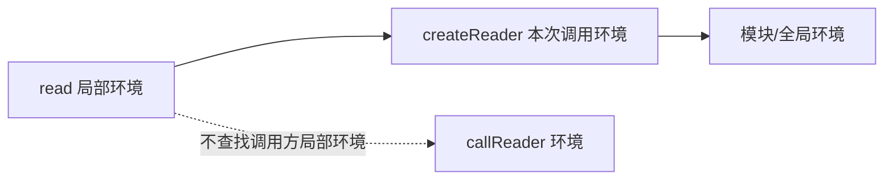

# JavaScript 作用域、闭包、执行上下文与声明实例化

作用域决定源码中一个标识符能解析到哪个绑定；执行上下文记录当前代码求值所需的状态；闭包让函数保留对声明位置外层绑定的访问；“提升”是对不同声明在正式执行语句前已经完成部分实例化这一现象的非规范统称。准确理解这些机制可以解释遮蔽、暂时性死区、循环回调和状态封装。

## 1. 标识符解析是沿词法环境查找

JavaScript 使用词法作用域：函数能访问哪些外层绑定，由函数写在源码的什么位置决定，不由之后在哪里调用决定。

```js
const label = 'global';

function createReader() {
  const label = 'factory';
  return function read() {
    return label;
  };
}

const reader = createReader();

function callReader() {
  const label = 'caller';
  return reader();
}

console.log(callReader()); // factory
```

read 在 createReader 内声明，因此 label 解析到 factory 调用形成的绑定；callReader 的 label 不在 read 的词法外层链上。



## 2. 常见作用域

### 2.1 全局与模块作用域

经典脚本顶层声明处于脚本/全局环境；ES Module 顶层声明属于模块作用域，不自动成为 globalThis 属性。模块默认严格模式。

```js
// module.js
const internal = 'only in module';
export function readInternal() {
  return internal;
}
```

避免把应用状态挂到 globalThis。模块导出能明确依赖、控制可写入口并支持测试。

### 2.2 函数作用域

函数参数、函数体中的 var 和函数内声明的绑定在相应函数环境中解析。每次调用创建独立的一组参数和局部绑定。

```js
function makeValue(input) {
  var normalized = input.trim();
  return normalized;
}

console.log(makeValue(' A ')); // A
console.log(makeValue(' B ')); // B
```

两次调用的 input/normalized 不是共享变量。

### 2.3 块作用域

`let`、`const`、class 和块级函数声明的相关行为受块/严格模式与规范规则控制。新代码用 let/const 明确块边界。

```js
if (true) {
  const token = 'inside';
  let count = 1;
  console.log(token, count);
}

// console.log(token); // ReferenceError
```

var 不受普通块限制：

```js
function example() {
  if (true) {
    var value = 1;
  }
  return value; // 1
}
```

### 2.4 catch 绑定作用域

```js
try {
  JSON.parse('{');
} catch (error) {
  console.log(error.name);
}

// console.log(error); // ReferenceError
```

catch 参数只在 catch 块可见，可省略不需要的绑定。

## 3. 遮蔽与名称解析

内层声明同名绑定会遮蔽外层绑定。查找在第一个匹配处停止。

```js
const timeout = 5000;

function request(options) {
  const timeout = options.timeout ?? 1000;
  return timeout;
}
```

遮蔽本身合法，但同名变量语义不同会误读。lint 的 no-shadow 可按团队规则限制。

参数默认值有自己的初始化环境与从左到右依赖规则，函数体声明不能被早期默认参数直接使用。

```js
function range(start, end = start + 10) {
  return [start, end];
}
```

## 4. 执行上下文与调用栈

规范用执行上下文表示实现 ECMAScript 代码执行所需的跟踪信息，包括当前代码、词法环境、变量环境、函数/模块关联和 Realm 等。函数调用会建立新执行上下文并成为运行执行上下文，返回或抛错后恢复前一个上下文。

```js
function third(value) {
  return value * 2;
}

function second(value) {
  return third(value + 1);
}

function first() {
  return second(3);
}

console.log(first()); // 8
```

third 执行时调用栈路径可观察为 first → second → third。递归持续增加调用上下文，过深会栈溢出。

执行上下文不是可直接读取的普通 JavaScript 对象；开发者工具的 Scope 和 Call Stack 是对相关运行状态的调试视图，不应假设完全暴露规范内部结构。

## 5. 声明实例化与“提升”

在执行一段脚本、模块、函数或块的普通语句前，规范会创建相应绑定并按声明种类初始化。教材常把声明前就有可观察影响称为 hoisting，但不同声明行为不同，不能简化为“声明被移动到顶部”。源码没有真的被重排。

| 声明 | 作用域开始时的可观察状态 | 声明前读取/调用 |
| --- | --- | --- |
| 函数声明 | 函数绑定通常已初始化为函数对象 | 可调用（具体块级兼容边界需谨慎） |
| `var` | 绑定已初始化为 undefined | 读取 undefined |
| `let` | 绑定已创建但未初始化 | ReferenceError |
| `const` | 绑定已创建但未初始化 | ReferenceError |
| `class` | 绑定已创建但未初始化 | ReferenceError |
| `import` | 链接时建立只读实时绑定 | 受模块链接、初始化与循环依赖约束 |

### 5.1 函数声明

```js
console.log(add(2, 3)); // 5

function add(left, right) {
  return left + right;
}
```

函数表达式遵循承载它的绑定规则：

```js
// console.log(subtract(3, 1)); // ReferenceError（TDZ）
const subtract = function (left, right) {
  return left - right;
};
```

块内函数声明在历史 Web 兼容模式中存在复杂规则；新模块/严格代码不要依赖跨块可见性。

### 5.2 `var`

```js
function readBeforeAssignment() {
  console.log(status); // undefined
  var status = 'ready';
  console.log(status); // ready
}
```

这不是等价源码改写，但可用“绑定先初始化为 undefined，赋值在原位置执行”理解观察结果。var 重复声明允许，容易隐藏错误。

### 5.3 暂时性死区

let/const/class 绑定从作用域开始已经存在，因此会遮蔽外层同名绑定，但在声明初始化前不可访问，这一区域称暂时性死区。

```js
const theme = 'outer';

function render() {
  // console.log(theme); // ReferenceError，不会读 outer
  const theme = 'inner';
  return theme;
}
```

`typeof` 也不能绕过 TDZ：

```js
{
  // console.log(typeof value); // ReferenceError
  let value = 1;
}
```

对完全未声明的标识符，`typeof neverDeclared` 才返回 `'undefined'`。

`const` 必须在声明处初始化；let 未写初始化器时，执行声明会初始化为 undefined。

### 5.4 class

```js
// new Lesson(); // ReferenceError

class Lesson {
  constructor(title) {
    this.title = title;
  }
}
```

class declaration 具有块作用域并在初始化前处于 TDZ。类内部默认严格模式；对象模型在 JS13 展开。

## 6. 闭包捕获绑定

闭包是函数与其声明位置可访问的词法环境引用的组合。JavaScript 每次创建函数都会形成闭包能力，即使函数未逃离当前作用域。

```js
function makeCounter(initial = 0) {
  let count = initial;

  return {
    increment() {
      count += 1;
      return count;
    },
    value() {
      return count;
    },
  };
}

const first = makeCounter();
const second = makeCounter(10);

console.log(first.increment()); // 1
console.log(first.value());     // 1
console.log(second.value());    // 10
```

first 的两个方法共享同一次 makeCounter 调用中的 count；second 对应另一环境。

### 6.1 捕获的是绑定，不是创建时快照

```js
let status = 'draft';
const readStatus = () => status;

status = 'published';
console.log(readStatus()); // published
```

需要快照时显式复制当时值到新绑定：

```js
const snapshot = status;
const readSnapshot = () => snapshot;
```

对象值仍可能在之后被修改；浅复制和冻结边界需单独设计。

## 7. 循环闭包

var 在整个函数中共享一个绑定，异步回调最终可能都读取循环结束值。

```js
const callbacks = [];

for (var index = 0; index < 3; index += 1) {
  callbacks.push(() => index);
}

console.log(callbacks.map((callback) => callback())); // [3, 3, 3]
```

for 循环中的 let 对每次迭代创建相应绑定：

```js
const readers = [];

for (let index = 0; index < 3; index += 1) {
  readers.push(() => index);
}

console.log(readers.map((reader) => reader())); // [0, 1, 2]
```

旧代码也可通过函数调用创建独立参数绑定，但新代码直接使用 let。

```js
for (var legacyIndex = 0; legacyIndex < 3; legacyIndex += 1) {
  ((capturedIndex) => {
    callbacks.push(() => capturedIndex);
  })(legacyIndex);
}
```

## 8. 闭包的应用

### 8.1 状态封装

闭包可以只公开受控操作，不暴露绑定本身。

```js
function createSelection() {
  const ids = new Set();

  return Object.freeze({
    add(id) {
      ids.add(id);
    },
    has(id) {
      return ids.has(id);
    },
    snapshot() {
      return [...ids];
    },
  });
}
```

Object.freeze 只冻结返回 API 对象的表层；真正封装来自外部无法直接引用 ids。

### 8.2 函数工厂

```js
function minimumLength(length) {
  if (!Number.isSafeInteger(length) || length < 0) {
    throw new RangeError('length 必须是非负安全整数');
  }
  return (value) => typeof value === 'string' && value.length >= length;
}

const atLeastThree = minimumLength(3);
console.log(atLeastThree('CSS')); // true
```

### 8.3 依赖注入

```js
function createLogger(write, context) {
  return (event, details = {}) => {
    write({ event, ...context, ...details });
  };
}
```

返回函数捕获 write 和 context，使业务代码不依赖全局 logger。

### 8.4 memoization 边界

闭包可持有 Map 缓存，但必须设计键、容量、过期和错误结果。无界 memoization 会长期保留参数和结果，不是自动优化。

```js
function memoizeOne(fn) {
  let hasValue = false;
  let lastArgument;
  let lastResult;

  return (argument) => {
    if (hasValue && Object.is(argument, lastArgument)) return lastResult;
    lastArgument = argument;
    lastResult = fn(argument);
    hasValue = true;
    return lastResult;
  };
}
```

## 9. 闭包与生命周期

只要可达函数仍需要外层绑定，相应数据可能保持可达。引擎可以优化未实际使用的绑定，但开发者不能依赖具体优化释放资源。

```js
function mount(element, largeModel) {
  const controller = new AbortController();

  element.addEventListener('click', () => {
    render(largeModel);
  }, { signal: controller.signal });

  return () => controller.abort();
}
```

如果 element 或监听器长期存在，largeModel 可能被闭包保留。销毁组件时移除监听器、停止 timer/observer、清除集合项和外部订阅。闭包不是“内存泄漏”，缺少生命周期清理才是风险。

## 10. 闭包与异步状态

异步回调读取的是执行时绑定值，可能不是启动操作时的业务版本。

```js
let currentQuery = 'html';

async function search() {
  const requestedQuery = currentQuery;
  const result = await loadResults(requestedQuery);
  if (requestedQuery !== currentQuery) return; // 丢弃旧结果
  render(result);
}
```

requestedQuery 是每次调用独立环境的快照绑定；currentQuery 是共享外层绑定。竞态控制还可结合 AbortSignal。

## 11. 完整可运行案例：可销毁的学习进度 Store

目标：封装进度 Map，允许订阅；每次更新返回快照；重复值不通知；destroy 后释放订阅并拒绝更新。

```js
function createProgressStore(initialEntries = []) {
  const progressById = new Map(initialEntries);
  const listeners = new Set();
  let destroyed = false;

  function assertActive() {
    if (destroyed) throw new Error('store 已销毁');
  }

  function snapshot() {
    return Object.freeze(Object.fromEntries(progressById));
  }

  function notify() {
    const current = snapshot();
    for (const listener of [...listeners]) listener(current);
  }

  return Object.freeze({
    get(id) {
      assertActive();
      return progressById.get(id);
    },

    set(id, value) {
      assertActive();
      if (typeof id !== 'string' || id === '') {
        throw new TypeError('id 必须是非空字符串');
      }
      if (!Number.isFinite(value) || value < 0 || value > 1) {
        throw new RangeError('value 必须在 0 到 1 之间');
      }
      if (Object.is(progressById.get(id), value)) return snapshot();

      progressById.set(id, value);
      notify();
      return snapshot();
    },

    subscribe(listener) {
      assertActive();
      if (typeof listener !== 'function') {
        throw new TypeError('listener 必须是函数');
      }
      listeners.add(listener);
      let subscribed = true;

      return function unsubscribe() {
        if (!subscribed) return false;
        subscribed = false;
        return listeners.delete(listener);
      };
    },

    snapshot() {
      assertActive();
      return snapshot();
    },

    destroy() {
      if (destroyed) return;
      destroyed = true;
      listeners.clear();
      progressById.clear();
    },
  });
}
```

### 11.1 状态与独立实例

```js
const initialProgress = [];
initialProgress.push(['html', 0.5]);
const firstStore = createProgressStore(initialProgress);
const secondStore = createProgressStore();
const events = [];

const unsubscribe = firstStore.subscribe((state) => events.push(state));
firstStore.set('html', 1);
firstStore.set('html', 1); // 同值，不通知
secondStore.set('html', 0.25);

console.log(events.length);             // 1
console.log(firstStore.get('html'));    // 1
console.log(secondStore.get('html'));   // 0.25
console.log(unsubscribe());             // true
console.log(unsubscribe());             // false
```

两个 Store 对应两次工厂调用，捕获不同 Map/Set/destroyed 绑定。返回的多个方法共享同一调用环境。

### 11.2 失败注入

```js
const failures = [
  () => firstStore.set('', 0.5),
  () => firstStore.set('css', -1),
  () => firstStore.set('css', 2),
  () => firstStore.subscribe(null),
];

for (const run of failures) {
  try {
    run();
    throw new Error('预期失败但成功');
  } catch (error) {
    console.log(error.name, error.message);
  }
}

firstStore.destroy();
try {
  firstStore.set('js', 1);
} catch (error) {
  console.log(error.message); // store 已销毁
}
```

正式测试使用 assert.throws，避免 catch 混入测试断言错误。

### 11.3 不变量与验证

- progressById/listeners/destroyed 不能从外部直接访问。
- progress 始终在 0–1。
- 同值不通知。
- unsubscribe 幂等，首次成功 true，之后 false。
- destroy 幂等；之后读取/更新/订阅失败。
- Node 24 可直接运行案例；无 DOM 宿主依赖。

`Object.freeze(Object.fromEntries(...))` 只冻结快照表层；当前值都是 Number，因此足够。若值改为嵌套对象，需要新的不可变策略。

## 12. 调试清单

1. ReferenceError：区分完全未声明、超出作用域与 TDZ。
2. 读到 undefined：检查 var 声明实例化与赋值实际位置。
3. 循环回调相同值：检查是否用 var 共享绑定。
4. 闭包读到新值：确认需要绑定实时值还是显式快照。
5. 方法状态串扰：检查多个实例是否意外共享模块/全局绑定。
6. 回调长期存活：检查监听器、timer、observer 和订阅的销毁路径。
7. 循环依赖 TDZ：检查模块顶层是否读取尚未初始化 import。
8. 调用栈异常：在 DevTools 检查 Call Stack 和每一帧 Scope。
9. 变量遮蔽：启用 lint 并重命名不同语义的同名绑定。
10. 不要用“提升”一句话结束分析，要指出绑定创建、初始化和赋值阶段。

## 13. 练习与完成标准

实现一个 `createRequestCoordinator()`：

- 工厂每次调用拥有独立 currentVersion 和 AbortController。
- start() 捕获本次版本，旧响应不能覆盖新响应。
- cancel() 取消当前请求，destroy() 后所有操作拒绝。
- subscribe() 返回幂等 unsubscribe，并释放监听器。
- 用 var 写一个故意失败的循环闭包测试，再改 let。
- 分别演示函数声明、var、let、class 的声明前行为。

完成标准是：能画出每个返回函数引用的外层绑定；没有共享实例状态；所有监听器有清理路径；Node 24 测试覆盖独立实例、竞态、销毁和 TDZ 示例。

## 来源

- [ECMAScript® 2026：Executable Code and Execution Contexts](https://tc39.es/ecma262/2026/multipage/executable-code-and-execution-contexts.html)（访问日期：2026-07-17）
- [MDN：Closures](https://developer.mozilla.org/en-US/docs/Web/JavaScript/Guide/Closures)（访问日期：2026-07-17）
- [MDN：Hoisting](https://developer.mozilla.org/en-US/docs/Glossary/Hoisting)（访问日期：2026-07-17）
- [MDN：Scope](https://developer.mozilla.org/en-US/docs/Glossary/Scope)（访问日期：2026-07-17）
