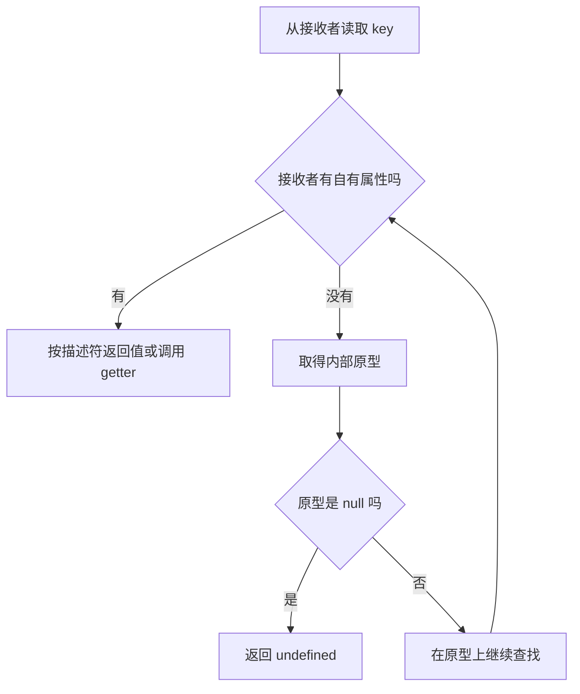

# JavaScript 对象模型：属性、原型、Class 与 this

JavaScript 对象不是类字段的静态集合。对象保存自己的属性，并通过内部原型链接到另一个对象；读取属性时，运行时会沿这条链接继续查找。`class` 在这一对象模型之上提供构造器、继承、私有元素和静态元素等声明能力。

掌握本章后，应当能够：

- 区分自有属性、继承属性、数据属性和访问器属性；
- 解释属性查找、赋值、`new`、`instanceof` 的实际过程；
- 正确使用类字段、私有字段、静态成员、`extends` 和 `super`；
- 根据调用表达式判断普通函数的 `this`；
- 在继承、组合、工厂函数之间作出有依据的选择。

## 1. 对象由属性和原型链接组成

对象的每个属性都由属性键和属性描述符定义。属性键只能是字符串或 `Symbol`；数字形式的键会被转换为字符串。

```js
const lesson = {};

lesson.title = "对象模型";
lesson[1] = "第一节";

const internalId = Symbol("internalId");
lesson[internalId] = "js-13";

console.log(Object.keys(lesson)); // ["1", "title"]
console.log(lesson["1"]); // 第一节
console.log(lesson[internalId]); // js-13
```

`Object.keys()` 只返回对象自身可枚举的字符串键，不返回 `Symbol` 键。完整检查键时可用 `Reflect.ownKeys()`。

```js
const record = { visible: true };
const token = Symbol("token");
record[token] = "local";

Object.defineProperty(record, "version", {
  value: 1,
  enumerable: false,
});

console.log(Object.keys(record));
console.log(Reflect.ownKeys(record));
// ["visible"]
// ["visible", "version", Symbol(token)]
```

### 1.1 属性描述符

数据属性保存值，描述符包含：

- `value`：属性值；
- `writable`：能否通过赋值改变值；
- `enumerable`：能否被 `Object.keys()`、对象展开和常见枚举操作看到；
- `configurable`：能否删除属性或重新定义其描述符。

访问器属性不直接保存值，而是通过 `get`、`set` 执行读取和写入逻辑。访问器描述符不能同时含有 `value` 或 `writable`。

```js
const progress = {};

Object.defineProperty(progress, "percent", {
  value: 0,
  writable: true,
  enumerable: true,
  configurable: false,
});

progress.percent = 25;
console.log(progress.percent); // 25
console.log(Object.getOwnPropertyDescriptor(progress, "percent"));
```

使用赋值或对象字面量创建的数据属性，三个布尔特性通常都是 `true`。使用 `Object.defineProperty()` 时，省略的布尔特性默认为 `false`。

```js
const settings = {};

Object.defineProperty(settings, "mode", {
  value: "study",
});

console.log(Object.getOwnPropertyDescriptor(settings, "mode"));
// value: "study", writable/enumerable/configurable: false
```

不可配置不等于绝对不可变：若不可配置的数据属性仍然可写，可以继续改值，也可以把 `writable` 从 `true` 改为 `false`；之后不能再恢复为 `true`。

### 1.2 访问器属性

访问器适合在属性式 API 背后进行校验或派生计算。

```js
const state = {
  _completed: 0,
  _total: 4,

  get percent() {
    return Math.round((this._completed / this._total) * 100);
  },

  set completed(value) {
    if (!Number.isInteger(value) || value < 0 || value > this._total) {
      throw new RangeError("completed 超出允许范围");
    }
    this._completed = value;
  },
};

state.completed = 3;
console.log(state.percent); // 75
```

访问器的 `this` 是发生属性访问的接收者，而不一定是定义访问器的对象。这使继承来的访问器能够操作实例自己的状态。

### 1.3 判断属性是否存在

```js
const base = { category: "frontend" };
const note = Object.create(base);
note.title = "对象模型";

console.log(Object.hasOwn(note, "title")); // true
console.log(Object.hasOwn(note, "category")); // false
console.log("category" in note); // true
console.log(note.category); // frontend
```

- `Object.hasOwn(object, key)` 只检查自有属性，适合处理外部输入和字典对象；
- `key in object` 检查整条原型链；
- 读取后与 `undefined` 比较不能可靠判断存在性，因为属性本身可能保存 `undefined`。

## 2. 原型链与属性查找

每个普通对象都拥有内部原型链接。`Object.getPrototypeOf(object)` 读取该链接。查找 `receiver.key` 时，运行时依次执行：



原型对象的内部原型还可以指向下一个对象，最终以 `null` 结束。

```js
const capabilities = {
  describe() {
    return `${this.title} / ${this.level}`;
  },
};

const note = Object.create(capabilities);
note.title = "原型链";
note.level = "入门";

console.log(note.describe()); // 原型链 / 入门
console.log(Object.getPrototypeOf(note) === capabilities); // true
```

方法虽然定义在 `capabilities` 上，但由 `note.describe()` 调用时，方法内的 `this` 是点号左侧的 `note`。因此共享方法可以读取不同实例的自有数据。

### 2.1 遮蔽与赋值

实例创建与原型同名的自有属性，会遮蔽原型属性，不会直接覆盖原型上的数据。

```js
const defaults = { theme: "light" };
const userSettings = Object.create(defaults);

console.log(userSettings.theme); // light
userSettings.theme = "dark";

console.log(userSettings.theme); // dark
console.log(defaults.theme); // light
console.log(Object.hasOwn(userSettings, "theme")); // true
```

边界情况需要注意：若原型上存在同名 setter，赋值会调用 setter；若原型上存在不可写的数据属性，严格模式赋值会抛出 `TypeError`，不会创建自有属性。

### 2.2 创建无原型字典

`Object.create(null)` 创建不继承 `Object.prototype` 的对象，适合存放不受继承键干扰的字符串映射。

```js
const counts = Object.create(null);
counts.constructor = 1;
counts.toString = 2;

console.log(Object.hasOwn(counts, "constructor")); // true
console.log(Object.getPrototypeOf(counts)); // null
```

这种对象没有 `toString()`、`hasOwnProperty()` 等继承方法。若需要任意类型键、稳定的迭代和明确的大小，优先考虑 `Map`。

### 2.3 不要动态改动既有对象的原型

`Object.setPrototypeOf()` 能改变对象的内部原型，但这会让对象形状和属性查找假设失效，并提高调试成本。应在创建时用对象字面量、`Object.create()`、构造函数或 `class` 确定关系。

不要修改 `Array.prototype`、`Object.prototype` 等内建原型。修改会影响同一 JavaScript 环境中的所有相关对象，可能与标准新增 API、依赖库或其他代码冲突。

## 3. 构造函数与 new

普通函数拥有可供实例连接的 `prototype` 属性。调用 `new Constructor(args)` 时，可按以下规则理解：

1. 创建一个新对象；
2. 把新对象的内部原型设为 `Constructor.prototype`；
3. 以新对象为 `this` 调用构造函数；
4. 若构造函数显式返回对象，则使用该对象；否则返回第 1 步创建的对象。

```js
function Lesson(id, title) {
  this.id = id;
  this.title = title;
}

Lesson.prototype.describe = function describe() {
  return `${this.id}: ${this.title}`;
};

const lesson = new Lesson("js-13", "对象模型");

console.log(lesson.describe());
console.log(Object.getPrototypeOf(lesson) === Lesson.prototype); // true
console.log(Object.hasOwn(lesson, "title")); // true
console.log(Object.hasOwn(lesson, "describe")); // false
```

`Lesson.prototype` 是实例将要连接的对象；函数 `Lesson` 自己的内部原型通常连接到 `Function.prototype`。这两条关系不能混为一谈。

### 3.1 构造函数返回值

```js
function ReturnsPrimitive() {
  this.value = 1;
  return 99;
}

function ReturnsObject() {
  this.value = 1;
  return { value: 2 };
}

console.log(new ReturnsPrimitive().value); // 1
console.log(new ReturnsObject().value); // 2
```

构造函数返回另一个对象会替换新实例，容易破坏预期的原型和私有字段初始化，通常不要这样设计。

### 3.2 instanceof 的含义

`value instanceof Constructor` 默认检查 `Constructor.prototype` 是否出现在 `value` 的原型链上。它不是结构类型检查。

```js
function Note() {}
const a = new Note();
const b = { title: "普通对象" };

console.log(a instanceof Note); // true
console.log(b instanceof Note); // false
```

对象来自另一个浏览器 realm（例如 iframe）时，其内建构造函数与当前 realm 不同，`instanceof Array` 可能失败；判断数组应使用 `Array.isArray()`。业务输入通常应校验所需字段和约束，而不是只依赖 `instanceof`。

## 4. class 的对象模型

`class` 方法仍然存放在构造器的 `prototype` 对象上，由实例共享。字段则在每次创建实例时初始化为实例自有属性。

```js
class Lesson {
  status = "planned";

  constructor(id, title) {
    this.id = id;
    this.title = title;
  }

  start() {
    this.status = "learning";
  }
}

const first = new Lesson("js-13", "对象模型");
const second = new Lesson("js-14", "迭代器");

console.log(Object.hasOwn(first, "status")); // true
console.log(Object.hasOwn(first, "start")); // false
console.log(first.start === second.start); // true
```

类声明还有这些重要语义：

- 类声明受暂时性死区约束，声明前不能访问；
- 类体始终按严格模式执行；
- 类构造器必须通过 `new` 调用；
- 原型方法默认不可枚举；
- 类本身是函数对象，可拥有静态字段和静态方法。

### 4.1 getter、setter 与静态成员

```js
class Course {
  static supportedLevels = new Set(["beginner", "junior"]);

  static isSupported(level) {
    return Course.supportedLevels.has(level);
  }

  constructor(total) {
    this.total = total;
    this._completed = 0;
  }

  get percent() {
    return Math.round((this._completed / this.total) * 100);
  }

  set completed(value) {
    if (!Number.isInteger(value) || value < 0 || value > this.total) {
      throw new RangeError("完成数无效");
    }
    this._completed = value;
  }
}

const course = new Course(8);
course.completed = 2;
console.log(course.percent); // 25
console.log(Course.isSupported("junior")); // true
```

静态成员属于类构造器，不属于实例。`course.isSupported` 是 `undefined`，应调用 `Course.isSupported()`。

### 4.2 私有元素

以 `#` 声明的字段、方法或访问器由语言强制限制访问。私有名称必须在类体内声明，也只能在声明它的类体内使用。

```js
class Counter {
  #value = 0;

  increment() {
    this.#value += 1;
    return this.#value;
  }

  get value() {
    return this.#value;
  }
}

const counter = new Counter();
console.log(counter.increment()); // 1
console.log(counter.value); // 1
```

私有字段不是字符串属性：`counter["#value"]` 不会读取它，`Object.keys()` 和 `Reflect.ownKeys()` 也不会列出它。对不属于该类的对象执行含私有访问的方法会抛出 `TypeError`，这称为私有品牌检查。

如果状态需要被序列化、调试工具读取或子类访问，应通过明确的公共方法暴露所需数据，而不是假设私有字段可被反射。

### 4.3 继承、extends 与 super

```js
class Content {
  constructor(id) {
    this.id = id;
  }

  describe() {
    return `内容 ${this.id}`;
  }
}

class VideoContent extends Content {
  constructor(id, durationSeconds) {
    super(id);
    this.durationSeconds = durationSeconds;
  }

  describe() {
    return `${super.describe()}，时长 ${this.durationSeconds} 秒`;
  }
}

const video = new VideoContent("video-1", 90);
console.log(video.describe());
console.log(video instanceof Content); // true
```

派生类构造器在访问 `this` 前必须调用 `super()`。`super.method()` 从父类原型取得方法，但调用时仍以当前实例为 `this`。

继承适合稳定的“是一个”关系和可替换的公共契约。不要为复用少量代码建立多层继承；层级越深，状态初始化、覆盖方法和隐式约束越难追踪。

## 5. this 由调用方式决定

普通函数的 `this` 不是在定义时固定，而是主要由调用表达式决定。

| 调用形式 | `this` |
| --- | --- |
| `object.method()` | 点号左侧的 `object` |
| `fn()` | 严格模式下为 `undefined` |
| `fn.call(value, ...args)` | 第一个参数 `value` |
| `fn.apply(value, args)` | 第一个参数 `value` |
| `fn.bind(value)` 返回的函数 | 固定为 `value` |
| `new Fn()` | 新创建的实例 |
| 箭头函数 | 定义位置外层作用域的 `this` |

```js
"use strict";

function showTitle(prefix) {
  return `${prefix}${this.title}`;
}

const note = { title: "对象模型", showTitle };

console.log(note.showTitle("主题："));
console.log(showTitle.call(note, "主题："));
console.log(showTitle.apply(note, ["主题："]));

const bound = showTitle.bind(note, "主题：");
console.log(bound());
```

`call` 逐个接收参数，`apply` 接收类数组参数；`bind` 不立即执行，而是创建一个绑定函数。绑定函数再次被 `call` 或 `apply` 调用时，绑定的 `this` 不会被普通调用覆盖。

### 5.1 方法提取导致 this 丢失

```js
"use strict";

const tracker = {
  count: 2,
  report() {
    return this.count;
  },
};

console.log(tracker.report()); // 2

const report = tracker.report;
try {
  report();
} catch (error) {
  console.log(error.name); // TypeError
}

const safeReport = tracker.report.bind(tracker);
console.log(safeReport()); // 2
```

向事件系统、计时器或数组方法传递 `object.method` 时，传递的是函数值，不会保留原先的点号调用。可选择：

- 在注册时用箭头函数调用：`() => object.method()`；
- 创建一次绑定函数并保存，以便之后移除监听；
- 把方法设计为显式接收所需数据，避免依赖 `this`。

### 5.2 箭头函数的 this

箭头函数没有自己的 `this`、`arguments` 和 `new.target`，其 `this` 来自定义位置的外层词法环境。`call`、`apply`、`bind` 不能改变箭头函数捕获的 `this`。

```js
class Timer {
  constructor(label) {
    this.label = label;
  }

  createReporter() {
    return () => this.label;
  }
}

const timer = new Timer("学习计时");
const report = timer.createReporter();

console.log(report()); // 学习计时
console.log(report.call({ label: "其他" })); // 学习计时
```

箭头函数不能用作构造器，也没有供实例连接的普通 `prototype` 属性。不要用箭头函数定义需要动态接收者的共享原型方法。

类字段中的箭头函数会为每个实例创建一个新函数，能固定实例 `this`，但增加每实例内存和函数身份差异。只在确实需要把回调直接传出时使用。

## 6. 组合与继承

组合通过持有并调用其他对象，把日志、持久化、计时、校验等能力注入业务对象。依赖关系显式，也容易替换测试实现。

```js
function createProgressTracker({ save, now }) {
  let completed = 0;

  return {
    completeOne() {
      completed += 1;
      const snapshot = { completed, updatedAt: now() };
      save(snapshot);
      return snapshot;
    },
  };
}

const saved = [];
const tracker = createProgressTracker({
  save(snapshot) {
    saved.push(snapshot);
  },
  now() {
    return "2026-07-17T08:00:00.000Z";
  },
});

console.log(tracker.completeOne());
console.log(saved.length); // 1
```

选择原则：

- 需要多个实例共享行为：原型方法或类方法；
- 需要封装少量状态且不要求运行时类型身份：闭包工厂；
- 存在稳定父子契约并需要多态：浅层继承；
- 能力可以独立替换或组合：依赖注入与组合；
- 只是数据记录：普通对象，避免无必要的类。

## 7. 完整案例：可校验的学习进度实体

下面的类集中展示私有字段、访问器、静态工厂、原型共享、序列化和接收者校验。代码可直接在现代 Node.js 中运行。

```js
"use strict";

class LessonProgress {
  static allowedStatuses = new Set(["planned", "learning", "completed"]);

  #id;
  #completedUnits;
  #totalUnits;
  #status;

  constructor({ id, completedUnits = 0, totalUnits, status = "planned" }) {
    if (typeof id !== "string" || id.trim() === "") {
      throw new TypeError("id 必须是非空字符串");
    }
    if (!Number.isInteger(totalUnits) || totalUnits <= 0) {
      throw new RangeError("totalUnits 必须是正整数");
    }

    this.#id = id;
    this.#totalUnits = totalUnits;
    this.completedUnits = completedUnits;
    this.status = status;
  }

  static fromJSON(value) {
    if (value === null || typeof value !== "object" || Array.isArray(value)) {
      throw new TypeError("进度数据必须是对象");
    }
    return new LessonProgress(value);
  }

  get id() {
    return this.#id;
  }

  get completedUnits() {
    return this.#completedUnits;
  }

  set completedUnits(value) {
    if (!Number.isInteger(value) || value < 0 || value > this.#totalUnits) {
      throw new RangeError("completedUnits 超出范围");
    }
    this.#completedUnits = value;
  }

  get status() {
    return this.#status;
  }

  set status(value) {
    if (!LessonProgress.allowedStatuses.has(value)) {
      throw new RangeError(`不支持的状态：${value}`);
    }
    this.#status = value;
  }

  get percent() {
    return Math.round((this.#completedUnits / this.#totalUnits) * 100);
  }

  advance(units = 1) {
    if (!Number.isInteger(units) || units <= 0) {
      throw new RangeError("units 必须是正整数");
    }

    this.completedUnits = Math.min(
      this.#completedUnits + units,
      this.#totalUnits,
    );
    this.#status =
      this.#completedUnits === this.#totalUnits ? "completed" : "learning";
    return this.percent;
  }

  toJSON() {
    return {
      id: this.#id,
      completedUnits: this.#completedUnits,
      totalUnits: this.#totalUnits,
      status: this.#status,
    };
  }
}

const progress = LessonProgress.fromJSON({
  id: "javascript-13",
  completedUnits: 2,
  totalUnits: 5,
  status: "learning",
});

console.log(progress.advance(2)); // 80
console.log(JSON.stringify(progress));
console.log(Object.hasOwn(progress, "advance")); // false
console.log(
  Object.getPrototypeOf(progress).advance === LessonProgress.prototype.advance,
); // true

const detachedAdvance = progress.advance;
try {
  detachedAdvance(1);
} catch (error) {
  console.log(error.name); // TypeError：接收者未通过私有品牌检查
}

const boundAdvance = progress.advance.bind(progress);
console.log(boundAdvance(1)); // 100

for (const invalidInput of [
  { id: "", totalUnits: 2 },
  { id: "js-13", totalUnits: 0 },
  { id: "js-13", totalUnits: 2, completedUnits: 3 },
  { id: "js-13", totalUnits: 2, status: "unknown" },
]) {
  try {
    LessonProgress.fromJSON(invalidInput);
  } catch (error) {
    console.log(error.name, error.message);
  }
}
```

运行证据应包括：正常进度从 `80` 变为 `100`；序列化结果只含公共数据；提取方法直接调用得到 `TypeError`；四组无效输入分别被构造器或 setter 拒绝。

## 8. 常见错误与调试清单

### 8.1 常见错误

1. 把 `Constructor.prototype` 当成构造函数自身的原型关系。
2. 用 `value.key !== undefined` 判断属性存在，漏掉值为 `undefined` 的属性。
3. 从对象提取方法后直接调用，导致 `this` 丢失。
4. 把箭头函数用作需要动态 `this` 的对象方法。
5. 把所有方法写成类字段箭头函数，造成每个实例重复创建函数。
6. 在基类构造器中调用可被子类覆盖的方法，使子类字段尚未初始化就被访问。
7. 修改内建原型或频繁调用 `Object.setPrototypeOf()`。
8. 依赖 `instanceof` 校验跨 realm 数据或普通 JSON 数据。
9. 以深继承共享工具代码，使子类依赖父类内部细节。
10. 认为 TypeScript 的 `private` 一定等同运行时 `#` 私有元素；两者是否提供运行时封装取决于实际语法和编译结果。

### 8.2 调试清单

- 用 `Reflect.ownKeys(value)` 检查全部自有键；
- 用 `Object.getOwnPropertyDescriptor(value, key)` 检查写入、枚举和配置权限；
- 用 `Object.hasOwn(value, key)` 区分自有与继承属性；
- 用 `Object.getPrototypeOf(value)` 逐层确认实际原型；
- 在方法入口打印或断点检查 `this`，再回到调用表达式判断接收者；
- 检查回调注册处是否传递了未绑定的方法；
- 检查派生构造器是否先调用 `super()`；
- 检查 getter、setter 是否递归读写同名属性；
- 检查序列化是否显式暴露了所需私有状态；
- 用无效输入执行失败路径，而不只验证正常路径。

## 9. 练习

### 练习一：属性描述符

创建 `config` 对象：`version` 可读但不可写、不可删除、不可枚举；`environment` 可写且可枚举。分别用严格模式赋值、`delete`、`Object.keys()` 和描述符检查验证结果。

### 练习二：原型共享

使用构造函数创建三个 `Note` 实例，把 `render()` 放在原型上。证明三个实例共享同一个函数，同时每个实例保存自己的 `title`。

### 练习三：this 修复

把类实例方法交给 `setTimeout`，先复现 `this` 丢失，再分别用包装箭头函数和缓存后的绑定函数修复。说明移除事件监听时为什么必须保留同一个绑定函数引用。

### 练习四：组合重构

把一个同时负责进度计算、写文件和日志输出的类拆成进度实体、存储对象、日志对象。通过构造参数注入后，用内存实现完成测试。

### 练习五：输入边界

扩展完整案例，增加 `updatedAt` 字段。要求构造时验证有效 ISO 日期字符串，序列化时稳定输出；为空、无效日期和未来日期设计失败测试。

## 10. 延伸知识

- `Object.freeze()` 只冻结对象自身一层属性，不递归冻结嵌套对象；私有字段也不由普通属性描述符控制。
- 对象展开只复制自有可枚举属性，不复制原型、不可枚举属性和完整描述符；getter 会在复制时被读取为普通值。
- `Object.assign()` 通过普通读取和写入工作，可能触发来源 getter 和目标 setter。
- `super` 的解析依赖方法定义时关联的对象，不等同于根据 `this` 动态搜索任意父对象。
- Proxy 能拦截对象的若干内部操作，但必须遵守不可配置属性等不变量；将在元编程章节展开。

## 来源

- [ECMAScript 2026：Ordinary and Exotic Objects Behaviours](https://tc39.es/ecma262/2026/multipage/ordinary-and-exotic-objects-behaviours.html)（访问日期：2026-07-17）
- [MDN：Inheritance and the prototype chain](https://developer.mozilla.org/en-US/docs/Web/JavaScript/Guide/Inheritance_and_the_prototype_chain)（访问日期：2026-07-17）
- [MDN：Classes](https://developer.mozilla.org/en-US/docs/Web/JavaScript/Reference/Classes)（访问日期：2026-07-17）
- [MDN：this](https://developer.mozilla.org/en-US/docs/Web/JavaScript/Reference/Operators/this)（访问日期：2026-07-17）
