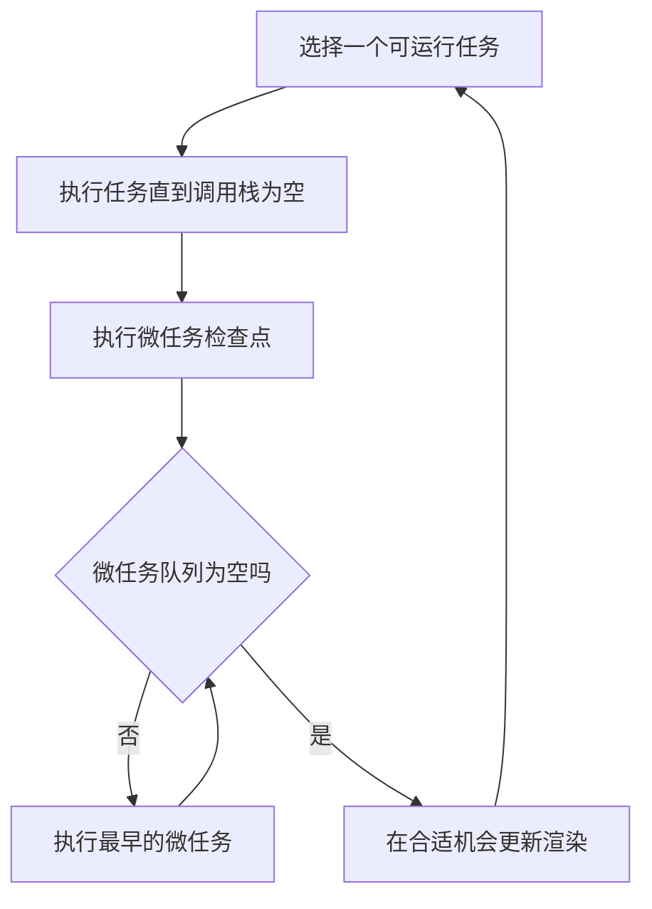

# JavaScript 事件循环：调用栈、任务、微任务与渲染

JavaScript 语言定义执行上下文、调用栈和 Job；浏览器作为宿主定义事件循环、任务、微任务、计时器、事件分派和渲染。理解两层职责，才能准确解释异步代码的先后顺序与页面卡顿。

## 1. 同步执行与调用栈

函数被调用时会创建执行上下文并压入调用栈。函数返回或抛错离开时，对应上下文出栈。当前栈没有完成前，事件循环不会在中间插入另一个普通任务。

```js
function readTitle(note) {
  return normalize(note.title);
}

function normalize(value) {
  return value.trim().toLowerCase();
}

console.log(readTitle({ title: " Event Loop " }));
```

执行顺序是顶层脚本、`readTitle`、`normalize`，随后反向返回。若递归没有终止条件，栈帧持续增加并最终抛出 `RangeError`。

```js
function countdown(value) {
  if (value === 0) return;
  countdown(value - 1);
}

countdown(3);
console.log("完成");
```

“JavaScript 单线程”通常是指同一 agent 的 JavaScript 执行一次只推进一个调用栈。浏览器仍可并行处理网络、计时、图像解码等工作；完成后通过宿主调度机制把后续步骤交回相应事件循环。

## 2. 浏览器事件循环

浏览器用事件循环协调脚本、事件、网络结果、解析和渲染。HTML 标准为一个事件循环定义一个或多个任务队列，以及一个独立的微任务队列。

一次简化的循环可表示为：



这是理解顺序的模型，不表示每轮一定渲染。渲染机会受刷新率、页面可见性、性能和浏览器策略影响。

### 2.1 任务

任务常见来源包括：

- 初始脚本执行；
- 用户交互事件分派；
- 计时器回调；
- 消息事件；
- 已完成网络工作的部分回调；
- HTML 解析工作的部分步骤。

标准按“任务源”维护同源任务的顺序，但浏览器可以在多个任务队列之间选择。因此不能假设不同任务源之间存在未由标准保证的全局先进先出顺序。

### 2.2 微任务

常见微任务来源包括：

- Promise reaction，即 `then`、`catch`、`finally` 的回调；
- `await` 之后的恢复步骤；
- `queueMicrotask(callback)`；
- `MutationObserver` 通知。

当前任务结束后，浏览器执行微任务检查点，持续取出微任务，直到队列为空。微任务执行期间新加入的微任务也会在同一次检查点继续执行。

```js
console.log("A");

setTimeout(() => console.log("task"), 0);

Promise.resolve().then(() => {
  console.log("promise-1");
  queueMicrotask(() => console.log("nested-microtask"));
});

queueMicrotask(() => console.log("microtask-1"));

console.log("B");
// A, B, promise-1, microtask-1, nested-microtask, task
```

Promise reaction 与 `queueMicrotask` 进入同类微任务队列，按入队顺序执行。嵌套微任务追加到队尾。

## 3. ECMAScript Job 与宿主队列

ECMAScript 把 Promise reaction 等工作描述为 Job，并通过宿主钩子请求调度。浏览器把 Promise Job 集成进微任务机制。事件循环、DOM 事件和渲染不是 ECMAScript 语言本身定义的。

因此要区分：

- “Promise 回调异步执行”由 ECMAScript Promise 规则和宿主调度共同保证；
- “任务后执行微任务检查点”来自 HTML 宿主模型；
- Node.js 有自己的事件循环阶段和额外队列，浏览器顺序不能无条件套用到 Node.js；
- `setTimeout` 是宿主 API，不是 ECMAScript 内建函数。

## 4. Promise 与 async/await 的顺序

已兑现 Promise 的 `then` 回调仍不会同步执行。

```js
const promise = Promise.resolve("ready");

promise.then((value) => console.log(value));
console.log("sync");
// sync, ready
```

`await expression` 会暂停当前 async 函数；函数其余部分通过 Promise 相关 Job 恢复。即使等待的是普通值，后续部分也不会和当前同步栈连续执行。

```js
async function run() {
  console.log("inside-1");
  await 42;
  console.log("inside-2");
}

console.log("outside-1");
run();
console.log("outside-2");
// outside-1, inside-1, outside-2, inside-2
```

同一轮中多个 Promise reaction 的精确顺序取决于它们何时入队，而不是源码中 Promise 创建位置。

```js
const resolved = Promise.resolve();

resolved.then(() => console.log("first"));
queueMicrotask(() => console.log("second"));
resolved.then(() => console.log("third"));
// first, second, third
```

## 5. queueMicrotask 的用途

`queueMicrotask(callback)` 适合让同步分支和异步分支以一致时机通知消费者，或在当前任务结束后批量处理状态。

```js
function createBatcher(flush) {
  let values = [];
  let scheduled = false;

  return function add(value) {
    values.push(value);
    if (scheduled) return;

    scheduled = true;
    queueMicrotask(() => {
      const batch = values;
      values = [];
      scheduled = false;
      flush(batch);
    });
  };
}

const add = createBatcher((batch) => console.log(batch));
add("html");
add("css");
add("javascript");
// 当前任务结束后只输出一次
```

不要用微任务切分长计算。微任务队列清空前，浏览器通常不能处理下一个普通任务；递归排入微任务会推迟输入、计时器和渲染。

## 6. 计时器不是精确闹钟

`setTimeout(callback, delay)` 表示延迟至少达到条件后，回调可以被排入计时器任务源；它不保证在该毫秒数精确执行。

```js
const start = performance.now();

setTimeout(() => {
  console.log(`实际延迟：${performance.now() - start}ms`);
}, 10);

const end = performance.now() + 40;
while (performance.now() < end) {
  // 同步工作占据当前任务
}
```

回调只能等当前任务与随后的微任务结束。浏览器还会对嵌套计时器、后台页面等情况实施最小延迟或节流。

`setInterval` 也不能保证稳定间隔。若操作不能重叠且间隔应从上一次完成后计算，递归 `setTimeout` 更容易控制。

```js
function startPolling(work, interval) {
  let stopped = false;
  let timerId;

  async function tick() {
    try {
      await work();
    } finally {
      if (!stopped) {
        timerId = setTimeout(tick, interval);
      }
    }
  }

  timerId = setTimeout(tick, interval);

  return () => {
    stopped = true;
    clearTimeout(timerId);
  };
}
```

## 7. 渲染、requestAnimationFrame 与布局

浏览器在合适的渲染机会执行动画帧回调并更新样式、布局与绘制。`requestAnimationFrame(callback)` 把视觉更新安排到下一次可用渲染周期附近，回调接收高精度时间戳。

```js
const box = document.querySelector(".box");

requestAnimationFrame((timestamp) => {
  box.style.transform = "translateX(120px)";
  console.log(timestamp);
});
```

回调频率不保证为 60Hz；显示器刷新率、页面可见性和浏览器节流都会影响它。动画应使用回调时间戳计算进度，不要假设固定帧间隔。

微任务不是“渲染后回调”。当前任务完成后微任务先被清空，持续微任务链可能阻止渲染。

### 7.1 避免布局抖动

读取布局属性可能迫使浏览器先完成待处理样式与布局。循环中交替写样式、读布局会造成重复同步计算。

```js
function moveItems(items) {
  const widths = items.map((item) => item.getBoundingClientRect().width);

  requestAnimationFrame(() => {
    items.forEach((item, index) => {
      item.style.transform = `translateX(${widths[index]}px)`;
    });
  });
}
```

先集中读取，再集中写入。是否发生强制布局应通过浏览器 Performance 面板验证。

## 8. 长任务与任务拆分

同步 JavaScript 长时间占据主线程，会推迟输入事件、渲染和计时器。优化目标不是只减少总耗时，还要给更高优先级工作留下调度机会。

```js
function processInChunks(items, handle, chunkSize = 100) {
  let index = 0;

  return new Promise((resolve, reject) => {
    function runChunk() {
      try {
        const end = Math.min(index + chunkSize, items.length);
        while (index < end) {
          handle(items[index]);
          index += 1;
        }

        if (index < items.length) {
          setTimeout(runChunk, 0);
        } else {
          resolve();
        }
      } catch (error) {
        reject(error);
      }
    }

    runChunk();
  });
}
```

用普通任务让步，浏览器才有机会处理其他任务和渲染。把 `setTimeout` 换成递归 `queueMicrotask` 不会达到同样效果。

对 CPU 密集且可独立的数据计算，可考虑 Web Worker。Worker 有独立事件循环，通过消息和结构化克隆通信，不能直接操作页面 DOM。

## 9. 完整案例：可取消的分块筛选与进度渲染

案例把大量数据分块处理，每个分块后通过计时器任务让步；进度更新用动画帧合并；错误和取消都有明确结果。

```js
function filterInChunks({
  items,
  predicate,
  chunkSize = 500,
  signal,
  onProgress = () => {},
}) {
  if (!Array.isArray(items)) {
    return Promise.reject(new TypeError("items 必须是数组"));
  }
  if (typeof predicate !== "function") {
    return Promise.reject(new TypeError("predicate 必须是函数"));
  }
  if (!Number.isInteger(chunkSize) || chunkSize <= 0) {
    return Promise.reject(new RangeError("chunkSize 必须是正整数"));
  }

  return new Promise((resolve, reject) => {
    const result = [];
    let index = 0;

    function abortError() {
      return signal?.reason ?? new DOMException("操作已取消", "AbortError");
    }

    function runChunk() {
      if (signal?.aborted) {
        reject(abortError());
        return;
      }

      try {
        const end = Math.min(index + chunkSize, items.length);
        while (index < end) {
          if (predicate(items[index], index)) result.push(items[index]);
          index += 1;
        }

        onProgress({ processed: index, total: items.length });

        if (index === items.length) {
          resolve(result);
        } else {
          setTimeout(runChunk, 0);
        }
      } catch (error) {
        reject(error);
      }
    }

    runChunk();
  });
}

function createFrameProgressRenderer(element) {
  let latest = null;
  let frameId = null;

  return function render(progress) {
    latest = progress;
    if (frameId !== null) return;

    frameId = requestAnimationFrame(() => {
      const percent = latest.total === 0
        ? 100
        : Math.round((latest.processed / latest.total) * 100);
      element.textContent = `${percent}%`;
      frameId = null;
    });
  };
}

const output = document.querySelector("#progress");
const controller = new AbortController();
const values = Array.from({ length: 10000 }, (_, index) => index);

filterInChunks({
  items: values,
  predicate: (value) => value % 2 === 0,
  chunkSize: 400,
  signal: controller.signal,
  onProgress: createFrameProgressRenderer(output),
})
  .then((result) => {
    console.log(`偶数数量：${result.length}`);
  })
  .catch((error) => {
    if (error.name === "AbortError") {
      console.log("用户取消处理");
      return;
    }
    console.error(error);
  });
```

验证方法：

1. 正常运行时结果数量为 `5000`，进度最终为 `100%`；
2. 处理中调用 `controller.abort()`，Promise 以取消原因拒绝；
3. 让 `predicate` 抛错，错误应传播给调用者；
4. 在 Performance 面板观察多个短任务和渲染机会；
5. 把让步改成递归微任务进行对比，观察输入和渲染延迟。

这个实现仍有边界：已经开始的分块不能在循环中立刻响应取消；若单个分块本身很重，应在循环内部定期检查信号，或减小分块。

## 10. 常见错误与调试清单

### 10.1 常见错误

1. 认为 `setTimeout(fn, 0)` 会立即或精确执行。
2. 认为 Promise 回调会在当前同步代码中间插入。
3. 用递归微任务拆分长计算，造成任务和渲染饥饿。
4. 把浏览器事件循环模型原样套用到 Node.js。
5. 假设每个任务之后一定会绘制一帧。
6. 用固定 16.67ms 假设动画帧率。
7. 在循环中交替读取布局和修改样式。
8. 使用 `setInterval` 发起可能重叠的异步请求。
9. 忘记清理计时器、事件监听和动画帧请求。
10. 只看日志顺序，不使用性能时间线定位真实长任务。

### 10.2 调试清单

- 先标记同步日志，再标记微任务与普通任务；
- 写出每个回调的实际入队时刻，不只看声明位置；
- 检查微任务是否继续排入微任务；
- 用 `performance.now()` 测量实际延迟；
- 用 Performance 面板记录 Main、Task、Layout、Paint；
- 检查页面隐藏时计时器和动画帧是否被节流；
- 检查分块是否真的通过普通任务让出主线程；
- 检查异步轮询是否可能重叠；
- 检查组件销毁时是否取消未完成调度；
- 在目标浏览器和 Node.js 版本分别验证宿主相关行为。

## 11. 练习

### 练习一：预测顺序

组合顶层日志、两个计时器、三个 Promise reaction、嵌套 `queueMicrotask`，先写预测顺序，再运行验证每一步的入队原因。

### 练习二：批处理器

扩展 `createBatcher`：同一任务内按键去重；`flush` 抛错时不丢失下一批；提供显式同步 `flushNow()`。

### 练习三：动画

用 `requestAnimationFrame` 和时间戳实现 300ms 位移动画，支持取消，并在页面恢复可见时避免位置跳变。

### 练习四：分块搜索

把完整案例改成每个分块按时间预算运行，而不是固定条数。记录每块耗时，并验证取消、错误与空数组。

### 练习五：Worker 决策

对 JSON 解析、图像像素计算、DOM 批量更新和网络等待分别说明应使用分块、Worker、普通异步 API 还是动画帧，并写出限制。

## 12. 补充知识

- 微任务检查点还涉及未处理 Promise 拒绝通知和部分宿主清理步骤。
- 不同同源窗口可能共享一个 window event loop；长任务可能影响不止当前文档。
- 任务队列在 HTML 标准模型中按任务源组织，浏览器可在保证同源顺序的前提下调度不同队列。
- `MessageChannel`、`scheduler` 相关 API 可用于更专门的调度，但应按目标浏览器支持情况选择并查阅当前标准。
- 长任务优化必须结合实际交互延迟、总执行时间和能耗，不能只追求切得更碎。

## 来源

- [HTML Standard：Event loops](https://html.spec.whatwg.org/multipage/webappapis.html#event-loops)（访问日期：2026-07-17）
- [ECMAScript 2026：Jobs and Host Operations to Enqueue Jobs](https://tc39.es/ecma262/2026/multipage/executable-code-and-execution-contexts.html#sec-jobs-and-host-operations-to-enqueue-jobs)（访问日期：2026-07-17）
- [MDN：In depth: Microtasks and the JavaScript runtime environment](https://developer.mozilla.org/en-US/docs/Web/API/HTML_DOM_API/Microtask_guide/In_depth)（访问日期：2026-07-17）
- [MDN：Using microtasks in JavaScript with queueMicrotask](https://developer.mozilla.org/en-US/docs/Web/API/HTML_DOM_API/Microtask_guide)（访问日期：2026-07-17）
