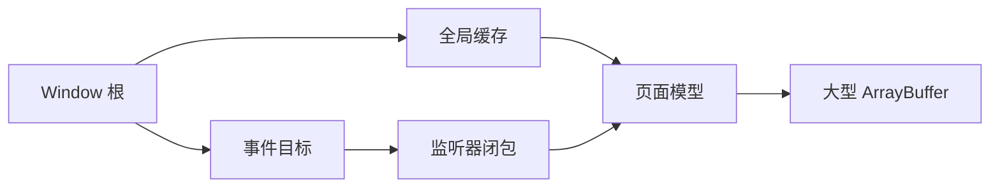

# JavaScript 内存管理：GC、弱引用与泄漏定位

JavaScript 自动回收不可达对象的内存，但“自动”不表示程序不会泄漏。只要某条强引用路径仍从根对象到达目标，垃圾回收器就必须保留它，即使业务已经不再需要。

## 1. 内存生命周期

程序使用内存通常经历：

1. 为对象、字符串、闭包、缓冲区等分配内存；
2. 读取、修改并传递这些值；
3. 值变得不可达后，由引擎在合适时间回收。

开发者不能依赖某个对象在确定时刻被回收。引擎会根据堆压力、代际、增量或并发策略决定何时执行 GC。

```js
function buildIndex(records) {
  const index = new Map();
  for (const record of records) index.set(record.id, record);
  return index;
}

let currentIndex = buildIndex([{ id: "js-18", title: "GC" }]);
currentIndex = null;
```

设为 `null` 只移除这一条引用。对象是否可回收取决于是否还有其他强引用路径。

## 2. 可达性与根

垃圾回收常用“标记并清除”作为概念模型：

1. 从一组根开始；
2. 标记根直接引用的值；
3. 沿引用图递归标记；
4. 未标记对象可被回收。

常见根或根附近来源包括当前执行栈、全局对象、活动闭包、宿主保存的事件监听器与计时器回调。



只要任一路径存在，页面模型及其缓冲区就可达。循环引用本身不是问题；整组循环若从根不可达，现代 GC 可以回收。

### 2.1 强引用

普通变量、对象属性、数组元素、Map 键值、Set 元素和闭包捕获通常都是强引用。

```js
const cache = new Map();
let note = { id: "js-18" };

cache.set(note.id, note);
note = null;

console.log(cache.get("js-18")); // 对象仍由 Map 强引用
cache.delete("js-18");
```

Map 不会根据业务生命周期自动淘汰。缓存必须有上限、过期、显式删除或弱引用策略。

## 3. 内存泄漏的含义

泄漏是程序已经不需要某数据，但引用路径仍使它长期可达，导致内存随着重复操作持续增长。一次较大的稳定内存占用不一定是泄漏；引擎缓存、延迟 GC 和正常工作集都可能使曲线波动。

判断泄漏应重复同一业务周期，例如打开并关闭页面 20 次，然后观察回到稳定状态后保留对象是否持续增加。

## 4. 常见泄漏来源

### 4.1 无界缓存与集合

```js
const responseCache = new Map();

async function load(url) {
  if (responseCache.has(url)) return responseCache.get(url);
  const value = await fetch(url).then((response) => response.blob());
  responseCache.set(url, value);
  return value;
}
```

URL 持续变化时，缓存永久增长。可使用容量受限的 LRU、TTL、按页面销毁或显式失效。

```js
class LimitedCache {
  #entries = new Map();

  constructor(limit) {
    if (!Number.isInteger(limit) || limit <= 0) {
      throw new RangeError("limit 必须是正整数");
    }
    this.limit = limit;
  }

  get(key) {
    if (!this.#entries.has(key)) return undefined;
    const value = this.#entries.get(key);
    this.#entries.delete(key);
    this.#entries.set(key, value);
    return value;
  }

  set(key, value) {
    this.#entries.delete(key);
    this.#entries.set(key, value);
    if (this.#entries.size > this.limit) {
      const oldestKey = this.#entries.keys().next().value;
      this.#entries.delete(oldestKey);
    }
  }
}
```

### 4.2 事件监听器

事件目标会保留监听函数，监听闭包又可能保留组件状态和 DOM。

```js
function mountSearch(input, model) {
  function onInput(event) {
    model.query = event.target.value;
  }

  input.addEventListener("input", onInput);

  return function unmount() {
    input.removeEventListener("input", onInput);
  };
}
```

移除监听必须传入相同函数引用和匹配的捕获选项。每次调用 `bind()` 或创建箭头函数都会得到新函数，无法用另一个新函数移除。

也可用 signal 统一释放：

```js
function mountPanel(panel) {
  const controller = new AbortController();

  panel.addEventListener("click", handleClick, {
    signal: controller.signal,
  });
  window.addEventListener("resize", handleResize, {
    signal: controller.signal,
  });

  return () => controller.abort();
}
```

### 4.3 计时器、动画与订阅

活动计时器保留回调，回调保留其闭包数据。

```js
function startClock(render) {
  const timerId = setInterval(() => render(Date.now()), 1000);
  return () => clearInterval(timerId);
}
```

同样检查 `requestAnimationFrame`、WebSocket、观察器、状态库订阅和第三方 SDK 回调。组件销毁时需要对称的 cleanup。

### 4.4 闭包捕获大对象

```js
function createLookup(records) {
  const byId = new Map(records.map((record) => [record.id, record]));
  return (id) => byId.get(id);
}
```

只要返回函数存在，整个 Map 就可能存在。闭包是正常语言能力；问题在于生命周期过长或捕获范围超过需要。可只提取必要字段，或提供 `clear()`。

### 4.5 分离的 DOM 子树

DOM 节点从文档移除后，如果 JavaScript 变量、监听器或其他节点仍引用它，就不会回收。对子节点的引用也可能通过 `parentNode` 保留整棵已分离子树。

```js
let selectedItem = document.querySelector(".item");
const list = document.querySelector(".list");

list.remove();
selectedItem = null;
```

仅移除父节点不够，需要清理持有其后代的长期引用。Chrome Heap Snapshot 可筛选 detached nodes 并查看 retaining path。

### 4.6 未结束异步工作

pending Promise 本身不是必然泄漏，但长期未完成的请求、队列或回调注册可能保留闭包状态。

```js
function loadForView(url) {
  const controller = new AbortController();
  const promise = fetch(url, { signal: controller.signal });

  return {
    promise,
    dispose() {
      controller.abort();
    },
  };
}
```

页面销毁时取消不再需要的工作，并确保底层 API 实际响应取消。

## 5. WeakMap 与 WeakSet

WeakMap 的键和 WeakSet 的成员不会作为阻止其回收的强引用。它们适合让附加数据的生命周期跟随对象。

```js
const metadata = new WeakMap();

function getMetadata(element) {
  let value = metadata.get(element);
  if (!value) {
    value = { measuredAt: performance.now() };
    metadata.set(element, value);
  }
  return value;
}
```

当 element 在其他地方不可达时，WeakMap 条目不会单独保住它，关联 value 随后也可被回收。

### 5.1 API 特征

WeakMap 提供 `set`、`get`、`has`、`delete`；WeakSet 提供 `add`、`has`、`delete`。它们不可枚举、没有 `size` 和 `clear()`，因为暴露键集合会让 GC 时机可被稳定观察。

键可为对象或可弱持有的 Symbol；普通字符串、数字等不能作为 WeakMap 键。实际兼容性要求下，最常见且最稳妥的键仍是对象。

### 5.2 WeakMap 不是字符串缓存

如果缓存按 URL、ID 等字符串查找，WeakMap 不适用。应采用有界 Map。WeakMap 也不能保证 value 很小：只要 key 仍可达，value 就会保留。

```js
const stateByComponent = new WeakMap();

function attachState(component, state) {
  stateByComponent.set(component, state);
}
```

这适合对象身份元数据、访问控制、memoization 和 DOM 元数据，不适合需要枚举或统计的集合。

## 6. WeakRef

`new WeakRef(target)` 创建对对象的弱引用；`deref()` 返回对象或 `undefined`。结果不可预测，不能把它用于正确性所依赖的数据。

```js
const object = { payload: "large" };
const reference = new WeakRef(object);

const value = reference.deref();
if (value !== undefined) {
  console.log(value.payload);
} else {
  console.log("对象已不可用，需要重新加载");
}
```

一次 `deref()` 得到对象后，应把结果保存在局部变量中完成当前同步工作。规范会在一段同步执行期间暂时保持成功解引用的目标，但不要跨异步边界假设它仍存在。

WeakRef 缓存仍需要管理保存 WeakRef 的 Map 键，否则对象虽然回收，键和空 WeakRef 条目仍会无限增长。通常有界强缓存更简单、更可预测。

## 7. FinalizationRegistry

`FinalizationRegistry` 请求在目标被回收后，未来某个时刻以 held value 调用清理回调。

```js
const registry = new FinalizationRegistry((id) => {
  console.log("对象可能已回收", id);
});

let resourceView = { id: "view-1" };
registry.register(resourceView, "view-1");
resourceView = null;
```

关键限制：

- 规范不保证目标一定被回收；
- 即使回收，也不保证回调何时运行或一定运行；
- 页面或进程结束前可能没有回调机会；
- held value 被 registry 强引用，不能包含 target 或可返回 target 的路径；
- 不能用于保存数据、解锁、提交事务等关键逻辑。

### 7.1 注销

注册时可传 unregister token，之后显式取消注册。

```js
const registry = new FinalizationRegistry((id) => {
  console.log("非关键清理", id);
});

const target = {};
const token = {};

registry.register(target, "target-1", token);
console.log(registry.unregister(token)); // true
```

确定性资源清理应使用 `try/finally`、显式 `dispose()` 或平台资源管理协议。finalizer 只适合非关键优化或辅助清理。

## 8. 资源管理不等于内存管理

GC 回收 JavaScript 对象内存，不保证及时关闭文件、流、锁、数据库连接或订阅。这些资源应按控制流确定性释放。

```js
async function consumeConnection(open) {
  const connection = await open();
  try {
    return await connection.readAll();
  } finally {
    await connection.close();
  }
}
```

把外部资源关闭寄托于 FinalizationRegistry 会造成资源耗尽和不可预测行为。

## 9. 使用 DevTools 定位泄漏

### 9.1 可重复测试流程

1. 建立稳定复现场景，例如打开、关闭同一面板；
2. 预热应用，避免把首次编译和缓存当泄漏；
3. 执行一次 GC 可用的分析操作并记录基线快照；
4. 重复业务周期多次；
5. 再取快照并使用 Comparison；
6. 找到数量和 retained size 持续增长的对象；
7. 查看 retaining path，定位从根到对象的强引用；
8. 修复后用相同步骤复测。

Shallow size 是对象自身占用；retained size 是该对象若变得不可达，连带可释放的近似大小。定位大泄漏时 retained size 更有解释力。

### 9.2 常用工具

- Heap snapshot：查看某时刻可达对象图；
- Comparison：比较两个快照的数量和大小变化；
- Allocation instrumentation on timeline：查看持续分配及未释放对象；
- detached node 筛选：查找已脱离文档但仍保留的 DOM；
- retaining path：找出实际引用链。

DevTools 控制台本身可能保留最近求值结果和打印对象。分析时清理控制台、避免选中目标对象，并用最小复现场景排除工具干扰。

## 10. 完整案例：具有确定清理与容量上限的页面会话

```js
class PageSession {
  #controller = new AbortController();
  #cache;
  #disposed = false;

  constructor({ cacheLimit = 20 } = {}) {
    this.#cache = new LimitedCache(cacheLimit);
  }

  mount(button) {
    this.#assertActive();
    button.addEventListener("click", this.#handleClick, {
      signal: this.#controller.signal,
    });
    window.addEventListener("resize", this.#handleResize, {
      signal: this.#controller.signal,
    });
  }

  async load(url) {
    this.#assertActive();

    const cached = this.#cache.get(url);
    if (cached !== undefined) return cached;

    const response = await fetch(url, {
      signal: this.#controller.signal,
    });
    if (!response.ok) throw new Error(`HTTP ${response.status}`);

    const value = await response.json();
    this.#cache.set(url, value);
    return value;
  }

  dispose() {
    if (this.#disposed) return;
    this.#disposed = true;
    this.#controller.abort(
      new DOMException("页面会话已销毁", "AbortError"),
    );
  }

  #assertActive() {
    if (this.#disposed) throw new Error("PageSession 已销毁");
  }

  #handleClick = () => {
    console.log("处理会话内点击");
  };

  #handleResize = () => {
    console.log("处理会话内尺寸变化");
  };
}

const session = new PageSession({ cacheLimit: 10 });
const button = document.querySelector("#reload");
session.mount(button);

session.load("/api/notes").catch((error) => {
  if (error.name !== "AbortError") console.error(error);
});

// 页面卸载时调用：监听器与请求共用 signal，dispose 可重复调用。
session.dispose();
```

验证方法：

1. 重复创建、挂载、加载、销毁 20 次；
2. 销毁中的请求应以 AbortError 结束；
3. 销毁后点击和 resize 不再触发对应会话回调；
4. 缓存条目不超过配置上限；
5. 销毁后再次 `load()` 得到明确错误；
6. 快照比较中 PageSession、DOM 和响应对象不应按周期持续增长。

确定性 cleanup 是主要保证；WeakMap、WeakRef 或 finalizer 不能代替 `dispose()`。

## 11. 常见错误与调试清单

### 11.1 常见错误

1. 认为循环引用一定泄漏。
2. 设一个变量为 null 后就断定对象已回收。
3. 使用无界 Map、Set、数组或日志缓存。
4. 组件卸载时不清理全局监听、计时器和订阅。
5. 从 DOM 移除节点但保留子节点引用。
6. 闭包长期捕获完整页面模型或大 buffer。
7. 用 WeakMap 保存字符串键缓存。
8. 认为 WeakMap value 总会回收，而 key 其实长期可达。
9. 用 WeakRef 保存正确性必需的数据。
10. 依赖 FinalizationRegistry 及时执行关键清理。
11. 只看单次堆大小，不重复稳定业务周期。
12. 忽略 DevTools 控制台自身保留对象的影响。

### 11.2 调试清单

- 定义预期生命周期：谁创建、谁持有、谁销毁；
- 搜索全局 Map、Set、数组、订阅表与回调注册表；
- 检查 add/remove、set/clear、subscribe/unsubscribe 是否成对；
- 检查 AbortSignal 是否贯穿异步调用层；
- 检查闭包捕获的变量是否超出需要；
- 重复业务周期后比较快照；
- 按 retained size 和实例增量排序；
- 查看 retaining path，不凭对象名字猜测；
- 筛选 detached DOM；
- 修复后使用完全相同的场景复测；
- 同时观察 JS heap、DOM 节点数和外部缓冲区，避免只看一个指标。

## 12. 练习

### 练习一：泄漏监听器

创建反复挂载的面板，每次向 window 注册监听但不清理。用快照确认实例增长，加入 AbortController cleanup 后复测。

### 练习二：有界缓存

扩展 `LimitedCache`，加入 TTL、显式 `delete`、`clear` 和命中统计。使用假时钟测试过期，不依赖真实等待。

### 练习三：WeakMap 元数据

为 DOM 元素保存测量结果，对比 Map 与 WeakMap API 和生命周期。说明为什么不能展示 WeakMap 的全部键。

### 练习四：WeakRef 缓存审计

实现字符串键到 WeakRef 的缓存，并证明仅使用 WeakRef 仍可能让字符串键无限增长。增加容量上限或 finalizer 辅助清理，但不依赖 finalizer 保证正确性。

### 练习五：完整生命周期

为包含 fetch、WebSocket、计时器、resize 监听和状态订阅的页面控制器设计幂等 `dispose()`，逐项验证清理与失败路径。

## 13. 补充知识

- GC 的暂停、代际和并发策略属于引擎实现细节，业务代码应依赖可达性语义而非某个引擎的当前算法。
- TypedArray 的视图对象与底层 ArrayBuffer 内存可能在工具中以不同类别显示，应同时检查外部或 backing store 占用。
- WeakMap 使用类似 ephemeron 的语义：value 到 key 的反向引用不会简单地让 WeakMap 自己永久保住 key。
- 成功 `WeakRef.deref()` 的目标在当前同步工作期间会被暂时保持；经过异步边界后必须重新解引用。
- 内存峰值、长期稳态、分配速率和 GC 停顿是不同指标，应分别测量。

## 来源

- [ECMAScript 2026：Processing Model of WeakRef and FinalizationRegistry Targets](https://tc39.es/ecma262/2026/multipage/executable-code-and-execution-contexts.html#sec-processing-model-of-weakref-and-finalizationregistry-targets)（访问日期：2026-07-17）
- [ECMAScript 2026：Managing Memory](https://tc39.es/ecma262/2026/multipage/managing-memory.html)（访问日期：2026-07-17）
- [MDN：Memory management](https://developer.mozilla.org/en-US/docs/Web/JavaScript/Guide/Memory_management)（访问日期：2026-07-17）
- [MDN：FinalizationRegistry](https://developer.mozilla.org/en-US/docs/Web/JavaScript/Reference/Global_Objects/FinalizationRegistry)（访问日期：2026-07-17）
- [Chrome for Developers：Record heap snapshots](https://developer.chrome.com/docs/devtools/memory-problems/heap-snapshots)（访问日期：2026-07-17）
