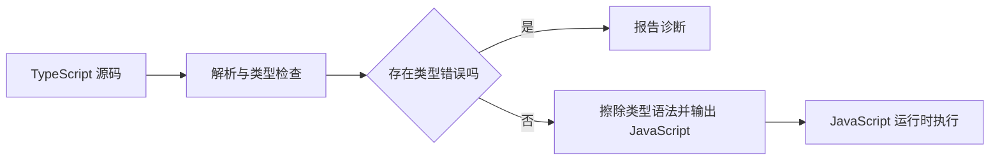

# TypeScript 基础：类型、函数、对象、接口与枚举取舍

TypeScript 在 JavaScript 语法之上建立静态类型检查。编译器分析值在程序中的可能形状，发现不安全的调用和属性访问，再输出 JavaScript。类型系统改善开发阶段的正确性和工具能力，但不会自动验证运行时数据。

本章以 TypeScript 7.0.2、`strict: true` 为基线。TypeScript 7 的编译器和语言服务器使用 Go 实现；命令行编译可用于生产项目，但 7.0 暂不提供程序化 Compiler API。依赖 Compiler API、语言服务插件或嵌入语言的工具链仍可能需要同时保留 TypeScript 6。

## 1. TypeScript 的工作边界

典型流程是：



类型注解通常在输出中被擦除。

```ts
function add(left: number, right: number): number {
  return left + right;
}

const total: number = add(2, 3);
console.log(total);
```

对应运行时代码只保留函数和变量逻辑，不会生成“参数必须是 number”的检查。来自 HTTP、表单、文件或 `JSON.parse()` 的数据必须单独做运行时校验。

### 1.1 类型检查与代码生成是不同阶段

TypeScript 可以报告错误后仍输出文件，具体取决于 `noEmitOnError`。持续集成通常使用：

```json
{
  "compilerOptions": {
    "strict": true,
    "noEmit": true,
    "target": "ES2025",
    "module": "ESNext",
    "moduleResolution": "Bundler",
    "types": []
  }
}
```

`noEmit: true` 只做类型检查；打包器负责转换和构建。TypeScript 7.0 默认启用 `strict`，但项目仍应显式写出关键配置，使本地、编辑器和 CI 的检查意图一致。

## 2. 类型推断与类型注解

编译器会根据初始化值、返回语句和调用上下文推断类型。

```ts
const title = "TypeScript"; // string
const completed = 3; // number
const visible = true; // boolean

function double(value: number) {
  return value * 2; // 返回类型推断为 number
}

const result = double(completed);
```

局部变量优先使用可靠推断。公共函数参数、模块导出、复杂返回结构和重要业务模型应显式表达契约。

```ts
export interface LessonSummary {
  id: string;
  completed: boolean;
}

export function summarize(id: string, progress: number): LessonSummary {
  return { id, completed: progress >= 100 };
}
```

重复注解不会让类型更安全：

```ts
const language = "zh-CN"; // 已准确推断，无需写成 const language: string
```

## 3. 基础类型

### 3.1 string、number、boolean

TypeScript 使用小写类型名：`string`、`number`、`boolean`。大写 `String`、`Number`、`Boolean` 表示包装对象类型，业务代码通常不使用。

```ts
const courseName: string = "前端基础";
const lessonCount: number = 18;
const published: boolean = false;

const description = `${courseName}：${lessonCount} 篇`;
console.log(description, published);
```

`number` 包含整数、浮点数、`NaN` 和 Infinity。类型系统不会表达“有限数”或“正整数”这类运行时约束，需要校验函数或品牌类型配合。

### 3.2 bigint 与 symbol

```ts
const bytes: bigint = 9_007_199_254_740_993n;
const internalKey: unique symbol = Symbol("internalKey");

interface InternalRecord {
  [internalKey]: string;
}

const record: InternalRecord = { [internalKey]: "private-id" };
console.log(bytes, record[internalKey]);
```

`bigint` 不能直接与 `number` 运算。`unique symbol` 表示特定 Symbol 身份，适合计算属性键和类型级标记。

### 3.3 null 与 undefined

`strictNullChecks` 属于 strict 模式。开启后，`null` 和 `undefined` 不会自动赋给任意类型。

```ts
function findTitle(id: string): string | undefined {
  const titles: Record<string, string> = { "ts-01": "基础类型" };
  return titles[id];
}

const title = findTitle("missing");
if (title !== undefined) {
  console.log(title.toUpperCase());
}
```

是否使用 `null` 或 `undefined` 应由数据契约统一：常见做法是可选属性使用 `undefined`，明确的“空值”使用 `null`。

## 4. 数组、元组与只读集合

```ts
const ids: string[] = ["ts-01", "ts-02"];
const scores: Array<number> = [80, 90];

ids.push("ts-03");
console.log(scores[0]);
```

在 `noUncheckedIndexedAccess` 开启时，`scores[0]` 的类型是 `number | undefined`，因为任意索引可能越界。这对动态索引更安全。

元组表达固定位置及各位置类型：

```ts
type Entry = readonly [id: string, completed: boolean];

const entry: Entry = ["ts-01", true];
const [id, completed] = entry;
console.log(id, completed);
```

`readonly` 阻止通过该引用修改元组或数组，是编译期约束，不会调用 `Object.freeze()`。

## 5. any、unknown、void 与 never

### 5.1 any 会传播不安全

`any` 允许几乎所有操作，并把结果继续变成 `any`。

```ts
declare const legacyValue: any;

// 编译器不会检查属性是否存在，也无法保证返回类型。
const unsafeResult = legacyValue.notExisting().value;
console.log(unsafeResult);
```

`any` 适合渐进迁移中的受控缺口，不应作为外部输入的默认类型。应隔离、记录并尽快缩小它。

### 5.2 unknown 要求先收窄

`unknown` 能接收任意值，但使用前必须证明类型。

```ts
function formatError(error: unknown): string {
  if (error instanceof Error) return error.message;
  if (typeof error === "string") return error;
  return "未知错误";
}

try {
  throw new Error("加载失败");
} catch (error: unknown) {
  console.error(formatError(error));
}
```

在严格项目中，catch 变量按 unknown 处理能避免假定所有抛出值都是 Error。

### 5.3 void 表示不使用返回值

```ts
type Logger = (message: string) => void;

const log: Logger = (message) => {
  console.log(message);
  return true;
};
```

函数类型返回 `void` 表示调用方不能使用返回值；实现函数仍可返回某值。这使 `Array.prototype.forEach()` 等 API 能接受有返回值但忽略它的回调。声明 `function work(): void` 的函数体不能随意返回具体值，两种上下文要区分。

### 5.4 never 表示不可能出现的值

```ts
function fail(message: string): never {
  throw new Error(message);
}

type Status = "planned" | "completed";

function label(status: Status): string {
  switch (status) {
    case "planned":
      return "未开始";
    case "completed":
      return "已完成";
    default: {
      const exhaustive: never = status;
      return exhaustive;
    }
  }
}
```

`never` 用于必然抛错、永不结束以及联合类型穷尽后不可达的分支。`void` 表示函数正常返回但调用方不使用结果，不能与 `never` 混同。

## 6. 字面量类型与 const 断言

`let` 变量未来可改变，字符串初值通常扩大为 `string`；`const` 原始值可推断为具体字面量。

```ts
let mutableStatus = "planned"; // string
const fixedStatus = "planned"; // "planned"

const Status = {
  Planned: "planned",
  Learning: "learning",
  Completed: "completed",
} as const;

type Status = (typeof Status)[keyof typeof Status];

const current: Status = Status.Learning;
console.log(current, mutableStatus, fixedStatus);
```

`as const` 使对象属性推断为 readonly 和字面量值，但不会在运行时深度冻结对象。

`satisfies` 检查表达式符合目标类型，同时尽量保留表达式自身更具体的推断。

```ts
type Route = {
  path: `/${string}`;
  secure: boolean;
};

const routes = {
  home: { path: "/", secure: false },
  account: { path: "/account", secure: true },
} satisfies Record<string, Route>;

console.log(routes.account.path);
```

## 7. 函数类型

### 7.1 参数与返回值

```ts
type Formatter = (title: string, index?: number) => string;

const format: Formatter = (title, index = 0) => {
  return `${index + 1}. ${title}`;
};

console.log(format("基础类型"));
```

可选参数类型隐含 `undefined`。必需参数不能放在可选参数之后，除非后续参数也可选或使用其他设计。

### 7.2 rest 参数

```ts
function average(...values: number[]): number {
  if (values.length === 0) throw new RangeError("至少提供一个值");
  return values.reduce((sum, value) => sum + value, 0) / values.length;
}

console.log(average(80, 90, 100));
```

### 7.3 调用签名与属性

```ts
interface Validator {
  (value: unknown): boolean;
  readonly description: string;
}

const isString: Validator = Object.assign(
  (value: unknown): boolean => typeof value === "string",
  { description: "检查字符串" },
);
```

### 7.4 overload

重载为调用方提供多个公开签名，实现签名必须兼容所有重载，但调用方看不到实现签名。

```ts
function normalize(value: string): string;
function normalize(value: string[]): string[];
function normalize(value: string | string[]): string | string[] {
  return Array.isArray(value)
    ? value.map((item) => item.trim())
    : value.trim();
}

const title = normalize(" TypeScript ");
const tags = normalize([" types ", " functions "]);
console.log(title, tags);
```

若联合参数和联合返回能准确表达关系，优先使用联合；重载适合参数形状不同且返回与调用签名相关的 API。

## 8. 对象类型

```ts
type Lesson = {
  readonly id: string;
  title: string;
  description?: string;
};

const lesson: Lesson = {
  id: "ts-01",
  title: "TypeScript 基础",
};

lesson.title = "基础类型与对象";
```

`readonly` 是通过该类型引用写入的编译期限制，不提供运行时冻结，也不保证其他可变别名不能修改对象。

### 8.1 可选属性与 exactOptionalPropertyTypes

开启 `exactOptionalPropertyTypes` 后，`description?: string` 表示属性可以不存在；若存在必须是 string，不自动允许显式写 `undefined`。如果业务需要显式 undefined，应写 `description?: string | undefined`。

```ts
type Patch = {
  title?: string;
};

function applyPatch(current: string, patch: Patch): string {
  return "title" in patch ? patch.title : current;
}

console.log(applyPatch("旧标题", { title: "新标题" }));
```

### 8.2 索引签名与 Record

```ts
interface ScoreTable {
  [lessonId: string]: number;
}

const scores: ScoreTable = {
  "ts-01": 90,
  "ts-02": 85,
};

const labels: Record<"planned" | "completed", string> = {
  planned: "未开始",
  completed: "已完成",
};
```

索引签名表示任意对应键都遵守同一值类型。有限键集合优先用 `Record<Union, Value>`，这样缺键和多余键能被检查。

## 9. 结构类型与额外属性检查

TypeScript 主要按结构兼容：值拥有目标要求的成员即可赋值。

```ts
interface Named {
  name: string;
}

const detailed = { name: "Lili", version: 1 };
const named: Named = detailed;
console.log(named.name);
```

新鲜对象字面量直接赋给目标类型时，会进行额外属性检查以捕获常见拼写错误。

```ts
interface Options {
  cache: boolean;
}

const source = { cache: true, debug: false };
const options: Options = source; // 结构兼容
console.log(options.cache);
```

不要用类型断言绕过多余属性错误。若 API 确实允许附加键，应通过索引签名、泛型或明确扩展类型表达。

## 10. interface 与 type

两者都能描述对象和函数，并支持扩展或交叉组合。

```ts
interface Entity {
  id: string;
}

interface Lesson extends Entity {
  title: string;
}

type Timestamped = {
  createdAt: Date;
};

type StoredLesson = Lesson & Timestamped;

const item: StoredLesson = {
  id: "ts-01",
  title: "基础类型",
  createdAt: new Date(),
};
```

选择依据：

- 需要声明合并或面向使用者扩展的对象契约：`interface`；
- 联合、元组、原始类型别名、条件类型和映射类型：`type`；
- 普通对象模型两者都可，团队保持一致即可。

接口可声明合并：

```ts
interface PluginContext {
  locale: string;
}

interface PluginContext {
  version: string;
}

const context: PluginContext = {
  locale: "zh-CN",
  version: "1.0.0",
};
```

声明合并适合平台扩展，但业务模型意外重名也可能悄悄合并。模块化代码应避免无意全局声明。

## 11. enum 与替代方案

普通 enum 不只是类型：它会生成运行时 JavaScript 对象。

```ts
enum Direction {
  Up = "UP",
  Down = "DOWN",
}

function move(direction: Direction): string {
  return direction === Direction.Up ? "向上" : "向下";
}

console.log(move(Direction.Up));
```

数字 enum 还会产生反向映射，并可能允许不直观的数字交互。公共 JSON、API 状态和需要直接与字符串互操作的数据，通常优先字符串字面量联合与 `as const` 对象。

```ts
const Direction = {
  Up: "UP",
  Down: "DOWN",
} as const;

type Direction = (typeof Direction)[keyof typeof Direction];

function move(direction: Direction): string {
  return direction === Direction.Up ? "向上" : "向下";
}
```

这种方案运行时是普通对象，类型来自对象值，序列化直观且便于 tree-shaking。enum 仍适用于确实需要封闭命名运行时集合、现有 API 契约或位标志的场景。

`const enum` 可能把成员内联到调用处，对跨包、独立编译和版本错配有额外风险。库作者不应在未评估构建链时公开 ambient const enum。

## 12. 类型断言与非空断言

`value as Type` 告诉编译器采用某类型，不会运行校验。

```ts
const element = document.querySelector("#title");

if (element instanceof HTMLHeadingElement) {
  element.textContent = "TypeScript";
}
```

检查通常优于 `as HTMLHeadingElement`。非空断言 `value!` 只是移除 null/undefined，也不会检查 DOM 是否存在。

双重断言 `value as unknown as Target` 几乎可以绕过结构约束，只应出现在经过证明的底层适配边界，并附带测试。

## 13. 完整案例：类型安全的课程模型

```ts
const LessonStatus = {
  Planned: "planned",
  Learning: "learning",
  Completed: "completed",
} as const;

type LessonStatus = (typeof LessonStatus)[keyof typeof LessonStatus];

interface LessonInput {
  id: string;
  title: string;
  totalUnits: number;
  completedUnits?: number;
  status?: LessonStatus;
}

interface LessonView {
  readonly id: string;
  readonly title: string;
  readonly status: LessonStatus;
  readonly percent: number;
}

function assertPositiveInteger(value: number, name: string): void {
  if (!Number.isInteger(value) || value <= 0) {
    throw new RangeError(`${name} 必须是正整数`);
  }
}

function createLesson(input: LessonInput): LessonView {
  if (input.id.trim() === "") throw new TypeError("id 不能为空");
  if (input.title.trim() === "") throw new TypeError("title 不能为空");
  assertPositiveInteger(input.totalUnits, "totalUnits");

  const completedUnits = input.completedUnits ?? 0;
  if (
    !Number.isInteger(completedUnits) ||
    completedUnits < 0 ||
    completedUnits > input.totalUnits
  ) {
    throw new RangeError("completedUnits 超出范围");
  }

  const inferredStatus: LessonStatus =
    completedUnits === input.totalUnits
      ? LessonStatus.Completed
      : completedUnits > 0
        ? LessonStatus.Learning
        : LessonStatus.Planned;

  const status = input.status ?? inferredStatus;
  const percent = Math.round((completedUnits / input.totalUnits) * 100);

  return {
    id: input.id,
    title: input.title,
    status,
    percent,
  };
}

const lesson = createLesson({
  id: "ts-01",
  title: "TypeScript 基础",
  totalUnits: 5,
  completedUnits: 2,
});

console.log(lesson);

for (const invalid of [
  { id: "", title: "基础", totalUnits: 1 },
  { id: "ts-01", title: "基础", totalUnits: 0 },
  { id: "ts-01", title: "基础", totalUnits: 2, completedUnits: 3 },
] satisfies LessonInput[]) {
  try {
    createLesson(invalid);
  } catch (error: unknown) {
    console.log(error instanceof Error ? error.message : "未知错误");
  }
}
```

输入到输出的过程：

1. 编译期检查字段名、字段类型和状态字面量；
2. 运行时检查空字符串、正整数和进度范围；
3. 根据完成数推导默认状态；
4. 返回只读视图，调用方不能通过该类型直接修改；
5. 三组失败输入分别验证空 ID、无效总数和越界进度。

这里仍未校验“来自 JSON 的未知值”，因为参数已经声明为 `LessonInput`。外部边界的运行时 Schema 将在第 6 篇实现。

## 14. 常见错误与调试清单

### 14.1 常见错误

1. 认为类型注解会生成运行时校验。
2. 大量使用 any，使不安全值跨模块传播。
3. 用断言消除错误，而没有证明运行时条件。
4. 关闭 strictNullChecks 后假定空值安全。
5. 把 `void` 与永不返回的 `never` 混同。
6. 把 readonly 当作运行时深冻结。
7. 用宽泛索引签名掩盖拼写错误。
8. 对所有常量集合使用 enum，不考虑运行时代码和序列化。
9. 用 `String` 等包装对象类型代替 `string`。
10. 在公共边界完全依赖推断，导致契约随实现意外变化。

### 14.2 调试清单

- 查看变量悬停类型，确认是否意外扩大为 string 或 any；
- 使用 `tsc --noEmit` 获得完整项目诊断；
- 检查 tsconfig 是否真正被加载；
- 开启 strict，并评估 noUncheckedIndexedAccess 与 exactOptionalPropertyTypes；
- 搜索 `any`、非空断言和双重断言；
- 对外部输入定位实际运行时校验位置；
- 检查 enum 是否与 JSON 契约一致；
- 对 readonly 数据检查是否仍有可变别名；
- 用失败输入执行运行时分支；
- 检查编译产物，确认哪些 TypeScript 语法产生运行时代码。

## 15. 练习

### 练习一：严格空值

实现 `findLesson(id): Lesson | undefined`，调用方必须收窄。分别用 if、可选链和空值合并处理，说明三者输出差异。

### 练习二：对象契约

设计 `UserPreferences`，包含只读用户 ID、可选主题和有限语言键。开启 exactOptionalPropertyTypes 后验证缺失与显式 undefined 的区别。

### 练习三：enum 重构

把数字 enum 改成 `as const` 对象与值联合。比较编译输出、JSON 值、遍历方式和调用约束。

### 练习四：unknown 边界

写一个只接受 unknown 的错误格式化器，处理 Error、字符串和带 message 字段的普通对象，不使用 any 与不安全断言。

### 练习五：类型擦除

为 `Money` 类型实现编译期结构和运行时构造函数，验证负金额、非有限数和不同币种相加的失败路径。

## 16. TypeScript 7.0 配置与工具边界

- `strict` 默认变为 true，项目仍建议显式配置；
- `target` 当前默认 ES2025，生产项目应按实际运行环境固定目标；
- `module` 默认 ESNext；
- `types` 默认空数组，需要的 Node 或测试全局类型应显式列出；
- `moduleResolution: node`、`node10` 与 `classic` 在 7.0 中是硬错误；浏览器打包项目通常选择 `bundler`，现代 Node 项目选择 `nodenext`；
- `target: es5`、`downlevelIteration`、`baseUrl`，以及 `amd`、`umd`、`systemjs` 等旧模块输出已不再支持；`paths` 可直接写相对项目根目录的目标；
- `stableTypeOrdering` 固定为 `true`；`rootDir` 默认项目根目录；需要 Node、测试框架等全局声明时必须显式配置 `types`；
- 7.0 没有 Compiler API。只使用 `tsc`、LSP 和普通 `.ts`/`.tsx` 文件的项目可直接采用 7.0；typescript-eslint、Vue、MDX、Astro、Svelte、Angular 模板检查等依赖 API 或嵌入语言的工作流需按各工具的官方兼容范围选择 TypeScript 6 或双版本安装；
- 类型配置影响检查和声明，不代替目标运行环境的 API 支持验证。

## 来源

- [TypeScript Handbook：Everyday Types](https://www.typescriptlang.org/docs/handbook/2/everyday-types.html)（访问日期：2026-07-17）
- [TypeScript Handbook：More on Functions](https://www.typescriptlang.org/docs/handbook/2/functions.html)（访问日期：2026-07-17）
- [TypeScript Handbook：Object Types](https://www.typescriptlang.org/docs/handbook/2/objects.html)（访问日期：2026-07-17）
- [TypeScript Handbook：Enums](https://www.typescriptlang.org/docs/handbook/enums.html)（访问日期：2026-07-17）
- [TypeScript Team：Announcing TypeScript 7.0](https://devblogs.microsoft.com/typescript/announcing-typescript-7-0/)（访问日期：2026-07-17）
