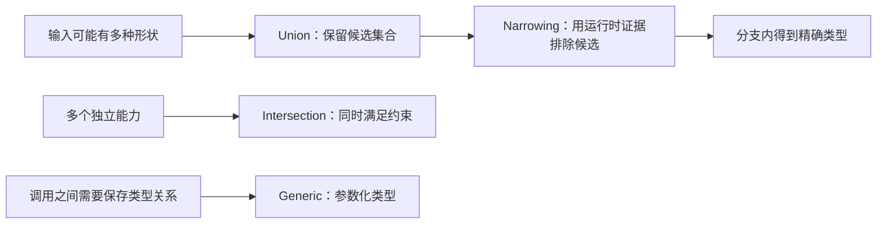

# Union、Intersection、Narrowing 与 Generic

联合类型描述“值属于若干候选之一”，交叉类型描述“值同时满足多个约束”，类型收窄根据运行时检查缩小候选范围，泛型用类型参数保存输入、输出与成员之间的关系。四者共同解决 JavaScript 值形状随分支变化时的静态建模问题。

## 1. 四个概念的责任



联合与交叉是类型组合，收窄是控制流分析，泛型是抽象机制。它们只参与检查，不会自动生成运行时分支、对象合并或输入校验。

## 2. 联合类型：候选的并集

```ts
type Identifier = string | number;

function formatId(id: Identifier): string {
  if (typeof id === "string") {
    return id.trim().toLowerCase();
  }
  return `id-${id.toString(10)}`;
}
```

`Identifier` 的值可以是字符串或数字。未收窄前，只能使用所有成员都安全支持的操作，例如 `toString()`；不能直接调用只属于字符串的 `trim()`。

### 2.1 字面量联合

字面量联合适合有限协议值：

```ts
type HttpMethod = "GET" | "POST" | "PATCH" | "DELETE";
type RetryCount = 0 | 1 | 2 | 3;

function request(method: HttpMethod, retries: RetryCount): void {
  console.log(method, retries);
}
```

它限制调用方，但运行时仍是普通字符串和数字。来自 JSON 的任意字符串不能因写了联合类型就变合法。

### 2.2 可选属性不等于状态联合

下面的类型允许无意义组合：

```ts
interface WeakResult<T> {
  loading: boolean;
  data?: T;
  error?: string;
}
```

`loading: true`、`data` 和 `error` 可以同时存在。若状态互斥，应使用可辨识联合：

```ts
type Result<T> =
  | { status: "idle" }
  | { status: "loading" }
  | { status: "success"; data: T }
  | { status: "failure"; error: string };
```

## 3. 交叉类型：同时满足约束

```ts
type Timestamped = { createdAt: Date; updatedAt: Date };
type Identified = { id: string };
type LessonRecord = Identified & Timestamped & { title: string };

const lesson: LessonRecord = {
  id: "ts-02",
  title: "联合与泛型",
  createdAt: new Date("2026-07-17T00:00:00Z"),
  updatedAt: new Date("2026-07-17T00:00:00Z"),
};
```

交叉不会在运行时合并对象。它只要求赋入的值同时具有全部成员。需要真正合并对象时仍要执行扩展、`Object.assign()` 或显式构造。

### 3.1 冲突成员可能得到 never

```ts
type TextId = { id: string };
type NumericId = { id: number };
type Impossible = TextId & NumericId;
// Impossible["id"] 为 string & number，即 never
```

没有普通 JavaScript 值能同时是 `string` 和 `number`。交叉类型不是“后者覆盖前者”，也不能模拟对象扩展的覆盖语义。

### 3.2 函数交叉接近重载

```ts
type Formatter =
  & ((value: string) => string)
  & ((value: number) => string);

const formatter: Formatter = ((value: string | number) => String(value)) as Formatter;
```

函数交叉表达多个调用签名，但实现验证和断言容易复杂。公共 API 通常用函数重载更清晰。

## 4. 收窄：把运行时证据交给控制流分析

### 4.1 typeof

`typeof` 可区分 `string`、`number`、`bigint`、`boolean`、`symbol`、`undefined`、`function` 和 `object`。

```ts
function normalize(value: string | number | undefined): string {
  if (typeof value === "string") return value.trim();
  if (typeof value === "number") return value.toFixed(2);
  return "未提供";
}
```

`typeof null` 的运行时结果是 `"object"`，检查对象时必须排除 `null`。

### 4.2 真值检查

```ts
function printTitle(title: string | null): string {
  if (title) return title;
  return "无标题";
}
```

真值检查同时排除空字符串。若空字符串是合法值，应写 `title !== null`，不要把“存在”与“非空”混为一谈。

### 4.3 相等性检查

```ts
function compare(left: string | number, right: string | boolean): string {
  if (left === right) {
    return left.toUpperCase(); // 两者共同候选只有 string
  }
  return "不同";
}
```

严格相等能让编译器计算候选交集。`value == null` 会同时匹配 `null` 与 `undefined`，但团队应明确是否允许宽松相等。

### 4.4 in 与 instanceof

```ts
type FileSource = { path: string; read(): string };
type MemorySource = { content: string };

function load(source: FileSource | MemorySource): string {
  if ("path" in source) return source.read();
  return source.content;
}

function formatDate(value: Date | string): string {
  return value instanceof Date ? value.toISOString() : value;
}
```

`in` 检查属性是否在对象或原型链中，包括值为 `undefined` 的属性。`instanceof` 依赖构造器和原型链，跨 iframe 或反序列化后的普通对象不一定成立。

### 4.5 赋值与控制流

```ts
let output: string | number = Math.random() > 0.5 ? "ok" : 0;
if (typeof output === "number") {
  output = output + 1;
} else {
  output = output.toUpperCase();
}
```

TypeScript 会跟踪返回、抛错、提前继续和重新赋值。闭包、可变别名和异步边界可能使旧证据失效，应在最接近使用处收窄。

## 5. 泛型：保存类型之间的关系

没有泛型时，`unknown` 只能表达“值未知”，不能表达返回值与输入元素一致：

```ts
function first<T>(items: readonly T[]): T | undefined {
  return items[0];
}

const firstNumber = first([10, 20]); // number | undefined
const firstName = first(["A", "B"]); // string | undefined
```

`T` 由调用实参推导。它不是运行时变量，也不能用 `typeof T` 做运行时判断。

### 5.1 泛型约束

```ts
interface HasId {
  id: string;
}

function indexById<T extends HasId>(items: readonly T[]): Map<string, T> {
  return new Map(items.map((item) => [item.id, item]));
}
```

`extends HasId` 表示 `T` 至少具有 `id`，返回值仍保留调用方的完整成员。把参数直接写成 `HasId[]` 会丢失额外字段。

### 5.2 多类型参数与 keyof

```ts
function getProperty<T extends object, K extends keyof T>(object: T, key: K): T[K] {
  return object[key];
}

const course = { id: "c1", lessons: 12, published: true };
const count = getProperty(course, "lessons"); // number
```

`K` 必须是 `T` 的键，返回类型 `T[K]` 随键变化。这里泛型保存了“对象—键—属性值”的三方关系。

### 5.3 默认类型参数

```ts
interface ApiResponse<TData, TMeta = undefined> {
  data: TData;
  meta: TMeta;
}

type LessonResponse = ApiResponse<{ id: string }>;
type PageResponse = ApiResponse<{ id: string }[], { page: number; total: number }>;
```

默认值只在调用方省略参数时生效。必填类型参数不能放在已有默认值的参数之后。

### 5.4 const 类型参数

```ts
function defineRoutes<const T extends readonly string[]>(routes: T): T {
  return routes;
}

const routes = defineRoutes(["/", "/settings"]);
// readonly ["/", "/settings"]
```

`const` 类型参数倾向保留字面量与只读元组推断，减少调用处 `as const`。它不会冻结运行时对象。

## 6. 方差与可变容器边界

函数参数和容器是否可赋值取决于值流向。只读数组只输出元素，通常更容易安全复用：

```ts
interface Animal { name: string }
interface Dog extends Animal { bark(): void }

function names(items: readonly Animal[]): string[] {
  return items.map((item) => item.name);
}

const dogs: readonly Dog[] = [];
names(dogs);
```

若函数接收可变 `Animal[]`，它可以插入不是 Dog 的 Animal，因此把 `Dog[]` 交给它可能破坏调用方假设。输入不需要修改时优先声明 `readonly`。

## 7. 完整案例：类型安全的批量请求协调器

输入是若干带唯一键的任务；输出必须保留每个任务的结果类型，并区分成功与失败。

```ts
type Task<T> = {
  key: string;
  run: () => Promise<T>;
};

type Settled<T> =
  | { status: "fulfilled"; value: T }
  | { status: "rejected"; reason: Error };

async function execute<T extends readonly Task<unknown>[]>(
  tasks: T,
): Promise<{ [K in keyof T]: T[K] extends Task<infer R> ? Settled<R> : never }> {
  const results = await Promise.all(
    tasks.map(async (task): Promise<Settled<unknown>> => {
      try {
        return { status: "fulfilled", value: await task.run() };
      } catch (cause: unknown) {
        const reason = cause instanceof Error ? cause : new Error(String(cause));
        return { status: "rejected", reason };
      }
    }),
  );
  return results as { [K in keyof T]: T[K] extends Task<infer R> ? Settled<R> : never };
}

const tasks = [
  { key: "count", run: async () => 42 },
  { key: "title", run: async () => "TypeScript" },
] as const;

const [countResult, titleResult] = await execute(tasks);
if (countResult.status === "fulfilled") {
  console.log(countResult.value.toFixed(0));
}
if (titleResult.status === "fulfilled") {
  console.log(titleResult.value.toUpperCase());
}
```

处理过程：

1. `Task<T>` 用泛型保存每个任务的返回值。
2. `Settled<T>` 用联合绑定状态与合法字段。
3. `try/catch` 把运行时异常转换成失败分支。
4. 映射类型按元组位置恢复各任务的结果类型。
5. 调用方通过 `status` 收窄后才能使用 `value` 或 `reason`。

可观察输出为 `42` 和 `TYPESCRIPT`。将第二个任务改为 `throw new Error("offline")` 后，它进入 `rejected`，不会让整个批次丢失第一个结果。

返回处的断言用于弥合 `Array.prototype.map()` 丢失元组位置的问题。它应被测试覆盖；若不需要异构元组精度，可返回 `Settled<T[number]>[]` 并删除断言。

## 8. 常见错误与修正

| 错误 | 后果 | 修正 |
|---|---|---|
| 对联合直接访问某成员专有字段 | 无法证明运行时安全 | 先使用判别字段、`typeof` 或 `in` 收窄 |
| 把交叉当作对象覆盖 | 冲突键可能变成 `never` | 显式构造目标对象并定义覆盖规则 |
| 泛型只出现一次 | 没有保存关系，API 更难读 | 使用具体类型或 `unknown` |
| `T extends any` | 约束没有意义且传播 `any` | 使用 `unknown` 或具体最小约束 |
| 为通过检查强制 `as T` | 调用方得到未经证明的承诺 | 由输入推导，或在运行时验证后构造 |
| 真值检查字符串 | 意外排除空字符串 | 对 `null`/`undefined` 做精确比较 |
| 可变数组接受更窄元素 | 写入可破坏原类型 | 输入声明为 `readonly T[]` |

## 9. 验证与调试

使用 TypeScript 7 执行：

```bash
pnpm dlx typescript@7.0.2 --noEmit --strict --target es2025 --module esnext example.ts
```

验证时检查：

- 悬停联合变量，确认分支前后候选是否变化；
- 在 `switch` 的默认分支赋给 `never`，检验状态是否穷尽；
- 删除泛型返回关系，观察调用方是否退化为 `unknown` 或宽联合；
- 加入预期失败调用并使用 `// @ts-expect-error`，确保错误确实存在；
- 检查断言数量，逐个记录其运行时依据。

## 10. 练习

实现 `groupBy<T, K extends PropertyKey>`：接收只读数组和返回键的函数，返回 `Map<K, T[]>`。验收标准：

1. 对字符串、数字与 symbol 键均可编译；
2. 不使用 `any`；
3. 输入数组不可被修改；
4. 空数组返回空 Map；
5. 写一条 `@ts-expect-error` 证明回调不能返回对象；
6. 加入完整运行时断言，验证分组数量和元素顺序。

## 来源

- [TypeScript Handbook：Narrowing](https://www.typescriptlang.org/docs/handbook/2/narrowing.html)（访问日期：2026-07-17）
- [TypeScript Handbook：Generics](https://www.typescriptlang.org/docs/handbook/2/generics.html)（访问日期：2026-07-17）
- [TypeScript Handbook：Everyday Types](https://www.typescriptlang.org/docs/handbook/2/everyday-types.html#union-types)（访问日期：2026-07-17）
- [TypeScript Handbook：Type Compatibility](https://www.typescriptlang.org/docs/handbook/type-compatibility.html)（访问日期：2026-07-17）
