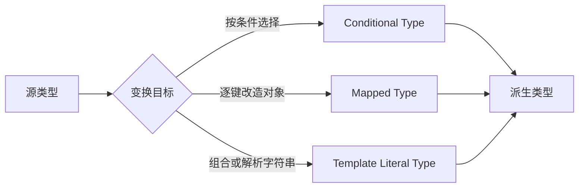

# Conditional、Mapped 与 Template Literal Types

条件类型根据可赋值关系选择类型分支，映射类型逐个转换属性键，模板字面量类型组合或解析字符串字面量。它们用于从一个已知契约派生另一个契约，避免手工复制后产生字段漂移。

## 1. 类型变换的输入与输出



类型变换只产生编译期类型。它不会把运行时对象重命名、过滤或复制；若数据形状也要变化，必须实现对应函数并测试二者一致。

## 2. 条件类型

基本语法是 `T extends U ? X : Y`。这里的 `extends` 判断 `T` 是否可赋给 `U`。

```ts
type ElementOf<T> = T extends readonly (infer Item)[] ? Item : T;

type A = ElementOf<string[]>; // string
type B = ElementOf<number>;   // number
```

### 2.1 泛型约束与条件类型不同

```ts
type IdOf<T extends { id: unknown }> = T["id"];
type MaybeId<T> = T extends { id: infer Id } ? Id : never;
```

`IdOf` 拒绝没有 `id` 的输入；`MaybeId` 接受任意输入，再返回提取结果或 `never`。前者约束调用，后者计算结果。

### 2.2 分布式条件类型

当条件左侧是裸类型参数时，联合成员会分别计算：

```ts
type ToArray<T> = T extends unknown ? T[] : never;
type Distributed = ToArray<string | number>;
// string[] | number[]
```

这不是 `(string | number)[]`。关闭分布需要把两侧包入元组：

```ts
type ToArrayTogether<T> = [T] extends [unknown] ? T[] : never;
type Together = ToArrayTogether<string | number>;
// (string | number)[]
```

### 2.3 never 的分布行为

`never` 是空联合。分布式条件类型没有成员可处理，因此结果仍是 `never`：

```ts
type IsNeverWrong<T> = T extends never ? true : false;
type Wrong = IsNeverWrong<never>; // never

type IsNever<T> = [T] extends [never] ? true : false;
type Correct = IsNever<never>; // true
```

### 2.4 常用内置条件类型

| 类型 | 作用 | 关键边界 |
|---|---|---|
| `Exclude<U, E>` | 从联合 U 移除可赋给 E 的成员 | 使用分布式条件类型 |
| `Extract<U, E>` | 保留可赋给 E 的成员 | 不是运行时过滤 |
| `NonNullable<T>` | 移除 null 与 undefined | 要配合 strictNullChecks |
| `ReturnType<F>` | 提取函数返回类型 | 重载函数通常取最后签名 |
| `Parameters<F>` | 提取参数元组 | 不保留参数运行时验证 |
| `Awaited<T>` | 递归展开 PromiseLike | 模拟 await 的类型行为 |

## 3. infer：在匹配位置声明待提取类型

`infer` 只能出现在条件类型的 `extends` 模式内。

```ts
type PromiseValue<T> = T extends PromiseLike<infer Value> ? Value : T;
type FunctionArgs<T> = T extends (...args: infer Args) => unknown ? Args : never;
type FunctionResult<T> = T extends (...args: never[]) => infer R ? R : never;
```

同一模式可提取多个位置：

```ts
type Entry<T> = T extends ReadonlyMap<infer Key, infer Value>
  ? [Key, Value]
  : never;
```

当多个候选签名或联合参与推断时，结果受方差和重载规则影响。公共类型工具应为预期和反例都写类型测试，不要依赖猜测。

## 4. 映射类型

映射类型遍历 `PropertyKey` 的联合，最常见输入是 `keyof T`：

```ts
type Optional<T> = {
  [K in keyof T]?: T[K];
};

type Immutable<T> = {
  readonly [K in keyof T]: T[K];
};
```

同态映射 `K in keyof T` 会保留源属性修饰符，除非显式增加或移除。

### 4.1 修饰符控制

```ts
type MutableRequired<T> = {
  -readonly [K in keyof T]-?: T[K];
};

type ReadonlyOptional<T> = {
  +readonly [K in keyof T]+?: T[K];
};
```

`+` 是默认，可省略；`-` 移除修饰符。`?` 在 `exactOptionalPropertyTypes` 下表示属性可缺失，不自动等同于值可以显式为 `undefined`。

### 4.2 通过 as 重映射键

```ts
type Getters<T> = {
  [K in keyof T as K extends string ? `get${Capitalize<K>}` : never]: () => T[K];
};

interface Course {
  title: string;
  lessons: number;
}

type CourseGetters = Getters<Course>;
// { getTitle(): string; getLessons(): number }
```

映射到 `never` 可删除键：

```ts
type WithoutFunctions<T> = {
  [K in keyof T as T[K] extends (...args: never[]) => unknown ? never : K]: T[K];
};
```

### 4.3 内置映射类型

| 类型 | 结果 | 常见误区 |
|---|---|---|
| `Partial<T>` | 所有属性可选 | 不是深层 Partial |
| `Required<T>` | 移除可选标记 | 不会补运行时默认值 |
| `Readonly<T>` | 顶层属性只读 | 不会冻结对象 |
| `Pick<T, K>` | 只保留 K | 运行时对象仍有额外键 |
| `Omit<T, K>` | 排除 K | 只是静态视图 |
| `Record<K, V>` | 为每个 K 建立 V | 宽 `string` 键不保证任意查询存在 |

## 5. 模板字面量类型

```ts
type Resource = "course" | "lesson";
type Action = "created" | "updated" | "deleted";
type EventName = `${Resource}.${Action}`;
```

结果是 2 × 3 共 6 个字符串成员。多个大联合做笛卡尔积会迅速膨胀，影响编辑器响应和错误可读性。

### 5.1 内置字符串变换

`Uppercase`、`Lowercase`、`Capitalize`、`Uncapitalize` 在类型层转换字面量。它们使用 JavaScript 内置字符串操作的行为，不是区域敏感的自然语言转换。

```ts
type HeaderName<K extends string> = `X-${Capitalize<K>}`;
type RequestIdHeader = HeaderName<"request-id">;
```

### 5.2 从字符串中解析

```ts
type RouteParameter<Path extends string> =
  Path extends `${string}:${infer Param}/${infer Rest}`
    ? Param | RouteParameter<`/${Rest}`>
    : Path extends `${string}:${infer Param}`
      ? Param
      : never;

type Params = RouteParameter<"/courses/:courseId/lessons/:lessonId">;
// "courseId" | "lessonId"
```

TypeScript 7 的模板字面量推断按 Unicode 码点处理开头字符。例如从 `"😀abc"` 提取首字符得到 `"😀"`，不再拆成孤立 UTF-16 代理项。若类型工具刻意计算 UTF-16 code unit，需要重新设计并加入兼容测试。

## 6. 递归类型的边界

```ts
type DeepReadonly<T> =
  T extends (...args: never[]) => unknown ? T
  : T extends readonly (infer Item)[] ? readonly DeepReadonly<Item>[]
  : T extends object ? { readonly [K in keyof T]: DeepReadonly<T[K]> }
  : T;
```

该实现仍有边界：

- 元组会被概括成只读数组，位置精度丢失；
- Date、Map、Set 等内建对象需要专门规则；
- getter、副作用和私有字段不因类型映射改变；
- 循环或过深类型会增加实例化成本；
- 运行时对象完全没有被冻结。

类型工具应解决真实公共契约，不要为了“通用”无限递归。

## 7. 完整案例：事件总线契约

源模型只写一次，各事件名和载荷从模型派生：

```ts
interface Models {
  course: { id: string; title: string };
  lesson: { id: string; courseId: string; duration: number };
}

type Change = "created" | "updated" | "deleted";
type DomainEvent = `${Extract<keyof Models, string>}.${Change}`;

type EventPayload<E extends DomainEvent> =
  E extends `${infer Model}.${infer Action}`
    ? Model extends keyof Models
      ? Action extends "deleted"
        ? { id: Models[Model]["id"] }
        : { entity: Models[Model] }
      : never
    : never;

class TypedBus {
  private listeners = new Map<string, Set<(payload: unknown) => void>>();

  on<E extends DomainEvent>(event: E, listener: (payload: EventPayload<E>) => void): () => void {
    const wrapped = listener as (payload: unknown) => void;
    const bucket = this.listeners.get(event) ?? new Set();
    bucket.add(wrapped);
    this.listeners.set(event, bucket);
    return () => bucket.delete(wrapped);
  }

  emit<E extends DomainEvent>(event: E, payload: EventPayload<E>): void {
    this.listeners.get(event)?.forEach((listener) => listener(payload));
  }
}

const bus = new TypedBus();
const unsubscribe = bus.on("lesson.created", ({ entity }) => {
  console.log(entity.duration.toFixed(0));
});

bus.emit("lesson.created", {
  entity: { id: "l1", courseId: "c1", duration: 45 },
});
unsubscribe();
```

验证结果：监听器中 `entity` 自动是 lesson；删除事件只接受 `{ id }`；拼错事件名或漏字段会编译失败。

失败边界：运行时仍可从不受信任 JavaScript 调用 `emit()`，并传入错误对象。若事件来自网络或消息队列，必须先做 schema 校验。内部 `unknown` 到监听器类型的断言依赖 `on` 与 `emit` 共享同一键约束，需通过类型测试与运行时测试守住。

## 8. 类型测试

```ts
type Equal<A, B> =
  (<T>() => T extends A ? 1 : 2) extends
  (<T>() => T extends B ? 1 : 2) ? true : false;
type Expect<T extends true> = T;

type _eventNames = Expect<Equal<
  DomainEvent,
  | "course.created" | "course.updated" | "course.deleted"
  | "lesson.created" | "lesson.updated" | "lesson.deleted"
>>;

// @ts-expect-error 删除事件不能传完整实体字段代替 id 契约
bus.emit("lesson.deleted", { entity: { id: "l1" } });
```

`@ts-expect-error` 后必须有真实错误；错误消失时编译器会反向报错，适合固定负向契约。

## 9. 常见错误

1. 用 `Partial<T>` 直接作为更新命令，允许修改本应不可变的 ID；应 `Pick` 可更新字段再 `Partial`。
2. 认为 `Readonly<T>` 会冻结对象；需要运行时不可变时使用构造策略或冻结库。
3. 忘记条件类型分布，得到联合数组而不是元素联合数组。
4. 在大联合上生成模板笛卡尔积；大量固定字符串适合代码生成或运行时表。
5. 用复杂递归类型隐藏业务规则；错误信息和构建性能会恶化。
6. 只测试成功推导，不测试应拒绝的输入。
7. 派生了类型却手写另一套运行时转换，二者逐渐漂移。

## 10. 调试步骤

- 为中间结果命名，逐层悬停，不在一行嵌套全部变换；
- 用 `type Debug = ...` 查看条件分支结果；
- 用 `[T] extends [U]` 验证问题是否来自分布；
- 对 `never` 检查是过滤后的预期，还是冲突交叉；
- 运行 `tsc --extendedDiagnostics` 观察类型实例化和检查时间；
- 缩小递归输入与联合规模，定位性能热点；
- 对公开工具写正向 `Expect<Equal<...>>` 和负向 `@ts-expect-error`。

## 11. 练习

从接口 `Settings` 派生 `settings.theme.changed` 一类事件，事件载荷包含 `previous` 与 `current`，两者类型必须随键变化。验收：

1. symbol 键不进入字符串事件名；
2. 可选字段的值正确包含 `undefined`；
3. 不使用 `any`；
4. 至少三条正向类型测试和三条负向类型测试；
5. 完成一个运行时订阅与取消订阅案例；
6. 说明并验证外部 JSON 为什么仍需 schema。

## 来源

- [TypeScript Handbook：Conditional Types](https://www.typescriptlang.org/docs/handbook/2/conditional-types.html)（访问日期：2026-07-17）
- [TypeScript Handbook：Mapped Types](https://www.typescriptlang.org/docs/handbook/2/mapped-types.html)（访问日期：2026-07-17）
- [TypeScript Handbook：Template Literal Types](https://www.typescriptlang.org/docs/handbook/2/template-literal-types.html)（访问日期：2026-07-17）
- [TypeScript Team：Announcing TypeScript 7.0](https://devblogs.microsoft.com/typescript/announcing-typescript-7-0/)（访问日期：2026-07-17）
