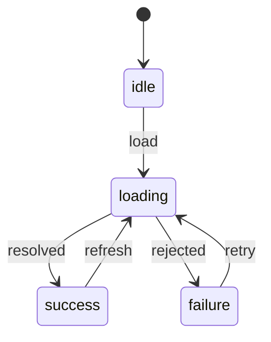

# Discriminated Union、Type Predicate 与 infer

可辨识联合用共同的字面量字段表达互斥状态，自定义类型谓词把运行时检查包装成可复用收窄函数，`infer` 从类型模式中提取组成部分。三者分别处理状态建模、运行时证据复用和类型结构解析。

## 1. 可辨识联合：让非法状态无法构造

下面的请求状态把每个阶段允许的数据直接写入对应成员：

```ts
type RequestState<T> =
  | { status: "idle" }
  | { status: "loading"; startedAt: number }
  | { status: "success"; data: T; receivedAt: number }
  | { status: "failure"; error: Error; retryable: boolean };
```

所有成员都有 `status`，且值是互斥字面量。它是判别字段。



状态图还包含类型之外的转移规则。联合能限制每个状态的数据形状，但不会阻止业务代码从 `idle` 直接构造 `success`；需要 reducer 或状态机函数控制转移。

### 1.1 判别字段要求

- 每个成员都应具有同名字段；
- 字段值应是互斥的 string、number、boolean、null 等单例类型；
- 字段不要可选，否则“缺失”可能同时匹配多个成员；
- 不要在收窄后修改判别字段；优先构造新对象；
- 判别值是程序协议，重命名要同步序列化、日志和持久化数据。

### 1.2 分支收窄

```ts
function renderState<T>(state: RequestState<T>, renderData: (data: T) => string): string {
  switch (state.status) {
    case "idle":
      return "尚未加载";
    case "loading":
      return `加载中：${state.startedAt}`;
    case "success":
      return renderData(state.data);
    case "failure":
      return state.retryable ? `可重试：${state.error.message}` : state.error.message;
  }
}
```

`case "success"` 中才存在 `data`。这一约束同时防止在 loading 状态误读旧数据。

### 1.3 穷尽检查

```ts
function assertNever(value: never): never {
  throw new Error(`未处理状态：${JSON.stringify(value)}`);
}

function icon(state: RequestState<unknown>): string {
  switch (state.status) {
    case "idle": return "○";
    case "loading": return "…";
    case "success": return "✓";
    case "failure": return "!";
    default: return assertNever(state);
  }
}
```

以后新增 `cancelled` 成员而未更新 `switch` 时，`state` 不再是 `never`，编译失败。运行时抛错还能捕获 JavaScript 调用方或旧持久化数据中的未知状态。

## 2. 从布尔组合重构为状态联合

```ts
interface WeakUpload {
  isUploading: boolean;
  isDone: boolean;
  progress?: number;
  url?: string;
  error?: string;
}
```

该模型允许 `isUploading` 与 `isDone` 同时为 true、失败却带成功 URL。重构后：

```ts
type Upload =
  | { kind: "queued"; fileName: string }
  | { kind: "uploading"; fileName: string; sent: number; total: number }
  | { kind: "completed"; fileName: string; url: string }
  | { kind: "failed"; fileName: string; reason: string };
```

`progress` 可从 `sent / total` 计算，不必与源值重复存储。`total === 0` 的边界需运行时定义，例如显示 0% 而不是除零。

## 3. 类型谓词：把检查结果声明为证据

返回类型 `value is T` 是类型谓词：

```ts
function isNonEmptyString(value: unknown): value is string {
  return typeof value === "string" && value.trim().length > 0;
}

const values: unknown[] = ["TypeScript", "", 7];
const names = values.filter(isNonEmptyString); // string[]
```

谓词函数会在 true 分支把参数收窄为 T。编译器检查函数体语法和一般返回类型，但不会证明判断逻辑足以推出 T；声明比实现更宽时会制造错误证据。

### 3.1 安全地检查对象

```ts
interface CourseSummary {
  id: string;
  title: string;
  lessons: number;
}

function isRecord(value: unknown): value is Record<PropertyKey, unknown> {
  return typeof value === "object" && value !== null;
}

function isCourseSummary(value: unknown): value is CourseSummary {
  return isRecord(value)
    && typeof value.id === "string"
    && typeof value.title === "string"
    && typeof value.lessons === "number"
    && Number.isInteger(value.lessons)
    && value.lessons >= 0;
}
```

检查顺序先证明是非 null 对象，再读字段。这里只接受字段存在且类型、整数范围正确；它未拒绝额外属性，也未验证字符串长度。

### 3.2 谓词与断言函数

断言函数返回 `asserts value is T`，失败时必须抛出：

```ts
function assertCourseSummary(value: unknown): asserts value is CourseSummary {
  if (!isCourseSummary(value)) {
    throw new TypeError("课程摘要结构无效");
  }
}

const raw: unknown = JSON.parse('{"id":"c1","title":"TS","lessons":6}');
assertCourseSummary(raw);
console.log(raw.title.toUpperCase());
```

谓词适合分支和过滤；断言函数适合不满足即中止的程序不变量。对用户输入通常应返回结构化错误，而不是只抛一个总错误。

### 3.3 this 类型谓词

```ts
class Selection<T> {
  constructor(readonly value: T | undefined) {}

  hasValue(): this is this & { value: T } {
    return this.value !== undefined;
  }
}
```

`this is ...` 可收窄实例属性，适用于对象自身验证。仍要避免可变别名在检查后修改值。

## 4. 谓词的失败方式

```ts
function isNumberWrong(value: unknown): value is number {
  return typeof value === "string"; // 声明与事实相反
}
```

调用方在 true 分支会获得 number，随后执行 `toFixed()` 并在运行时失败。重要边界应使用成熟 schema validator，或为手写谓词建立有效/无效样本表和属性测试。

还有一种风险是“iff”语义：谓词的 false 分支会排除 T。如果函数实际只判断“短字符串”，声明 `value is string` 会让 else 分支错误地排除长字符串。此时函数应返回 boolean，或类型应准确表达子集。

## 5. infer：从模式中提取类型

```ts
type ArrayItem<T> = T extends readonly (infer Item)[] ? Item : never;
type PromiseResult<T> = T extends PromiseLike<infer Value> ? Value : T;
type ConstructorInstance<T> = T extends abstract new (...args: never[]) => infer Instance
  ? Instance
  : never;
```

`infer Name` 在匹配位置创建一个只在 true 分支可用的类型变量。它用于读取结构，不产生运行时代码。

### 5.1 参数与返回值提取

```ts
type Args<F> = F extends (...args: infer P) => unknown ? P : never;
type Result<F> = F extends (...args: never[]) => infer R ? R : never;

function createCourse(id: string, lessons: number): { id: string; lessons: number } {
  return { id, lessons };
}

type CreateArgs = Args<typeof createCourse>; // [id: string, lessons: number]
type Created = Result<typeof createCourse>;
```

对重载函数提取时通常从最后的、最宽的调用签名推断，不会根据某个具体重载执行匹配。

### 5.2 模板字面量中的 infer

```ts
type SplitEvent<E extends string> =
  E extends `${infer Domain}:${infer Action}`
    ? { domain: Domain; action: Action }
    : never;

type Parsed = SplitEvent<"lesson:published">;
// { domain: "lesson"; action: "published" }
```

TypeScript 7 按 Unicode 码点处理模板首字符提取；依赖旧 UTF-16 代理项拆分的类型计算需要调整。

### 5.3 递归展开

```ts
type DeepAwaited<T> = T extends PromiseLike<infer U> ? DeepAwaited<U> : T;
type Value = DeepAwaited<Promise<Promise<number>>>; // number
```

标准库已有 `Awaited<T>`，业务代码优先使用标准工具。递归推断应限制用途，避免深度过大和难读诊断。

## 6. 完整案例：订单加载状态与边界解析

先定义外部 JSON 和内部状态：

```ts
interface Order {
  id: string;
  totalCents: number;
  currency: "CNY" | "USD";
}

type OrderScreen =
  | { status: "loading" }
  | { status: "ready"; order: Order }
  | { status: "not-found"; id: string }
  | { status: "error"; message: string };

function isOrder(value: unknown): value is Order {
  if (!isRecord(value)) return false;
  return typeof value.id === "string"
    && typeof value.totalCents === "number"
    && Number.isSafeInteger(value.totalCents)
    && value.totalCents >= 0
    && (value.currency === "CNY" || value.currency === "USD");
}

async function loadOrder(id: string, fetcher: typeof fetch): Promise<OrderScreen> {
  try {
    const response = await fetcher(`/api/orders/${encodeURIComponent(id)}`);
    if (response.status === 404) return { status: "not-found", id };
    if (!response.ok) return { status: "error", message: `HTTP ${response.status}` };
    const body: unknown = await response.json();
    if (!isOrder(body)) return { status: "error", message: "响应结构无效" };
    return { status: "ready", order: body };
  } catch (cause: unknown) {
    return {
      status: "error",
      message: cause instanceof Error ? cause.message : "未知网络错误",
    };
  }
}
```

数据流为：HTTP 状态判断 → JSON 读取为 unknown → 谓词验证 → 构造可辨识状态 → UI 穷尽渲染。

成功输入 `{ "id": "o1", "totalCents": 1990, "currency": "CNY" }` 进入 `ready`。`totalCents: 19.9`、未知币种或缺少 id 进入 `error`，不会被断言伪装成 Order。404 单独进入 `not-found`，避免把业务缺失与服务异常混为一谈。

验证应为 fetcher 提供四个替身：有效 200、无效 200、404、抛出网络异常，并断言返回的 `status` 与字段。再为渲染函数加入 `assertNever`，保证新增状态必须处理。

## 7. 何时使用哪一种工具

| 需求 | 工具 | 原因 |
|---|---|---|
| 表达互斥 UI 或协议状态 | 可辨识联合 | 状态与字段绑定，可穷尽 |
| 在数组过滤中复用简单检查 | 类型谓词 | true/false 分支可收窄 |
| 不满足不变量就中止 | 断言函数 | 成功后后续路径保持精确类型 |
| 从函数、容器、字符串中取组成类型 | `infer` | 在条件模式中提取 |
| 返回字段级错误和转换值 | schema parser | 比 boolean 谓词提供更多运行时信息 |

## 8. 常见错误与调试

1. 判别字段可选或使用宽 `string`，导致不能精确收窄。
2. `switch` 写 `default: return ""`，隐藏新增成员；改用 `never`。
3. 谓词只检查一个字段，却承诺完整复杂对象。
4. 把业务规则、权限或跨字段一致性塞进一个无错误详情的 boolean。
5. 在检查后跨 `await` 使用可变对象；必要时复制已验证字段。
6. 把 `infer` 当作运行时解构；类型不会转换值。
7. 对重载函数假定 `ReturnType` 会按具体参数挑签名。

调试顺序：查看判别字段是否是字面量 → 查看所有成员是否共有该字段 → 在每个 case 悬停变量 → 检查谓词实现的反例 → 为 `infer` 中间结果命名 → 加入正负类型测试 → 运行失败样本。

## 9. 练习

实现文件上传 reducer，状态包括 queued、hashing、uploading、paused、completed、failed。验收标准：

1. uploading 才有 sent/total，completed 才有 url；
2. reducer 只接受合法事件，非法转移返回带原因的失败结果；
3. 所有渲染分支用 `never` 穷尽；
4. 写一个谓词验证持久化的 paused 状态；
5. 传入 sent > total 时必须失败；
6. 用 `infer` 从事件处理器映射提取事件联合；
7. TypeScript 7 strict 编译通过并执行至少六个状态测试。

## 来源

- [TypeScript Handbook：Narrowing](https://www.typescriptlang.org/docs/handbook/2/narrowing.html)（访问日期：2026-07-17）
- [TypeScript Handbook：Conditional Types](https://www.typescriptlang.org/docs/handbook/2/conditional-types.html)（访问日期：2026-07-17）
- [TypeScript Handbook：More on Functions](https://www.typescriptlang.org/docs/handbook/2/functions.html#function-overloads)（访问日期：2026-07-17）
- [TypeScript Team：Announcing TypeScript 7.0](https://devblogs.microsoft.com/typescript/announcing-typescript-7-0/)（访问日期：2026-07-17）
