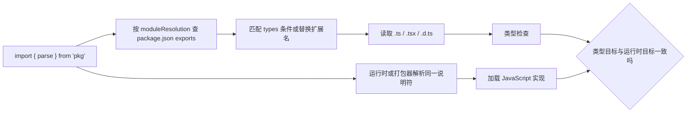

# Declaration File、Module Resolution、Compiler Options 与 Project References

声明文件描述 JavaScript 值的静态契约，模块解析把导入说明符映射到类型文件，编译选项定义检查与输出语义，Project References 把大型代码库拆成可独立构建的有向图。四者必须和真实运行时、打包器及包发布结构一致。

## 1. 一条 import 经历什么



编辑器能跳转到类型并不证明浏览器或 Node 能加载同一路径。TypeScript 的解析模式必须模仿实际宿主。

## 2. 声明文件 .d.ts

`.d.ts` 只包含类型声明，不包含普通可执行实现。它常用于：

- 为现有 JavaScript 库补充类型；
- 发布 TypeScript 库生成的公共 API；
- 声明非代码资源模块；
- 描述宿主提供的全局变量；
- 扩充已有模块的类型。

### 2.1 模块声明

```ts
// analytics.d.ts
export interface TrackOptions {
  userId?: string;
  properties?: Record<string, string | number | boolean>;
}

export declare function track(event: string, options?: TrackOptions): void;
```

`declare` 表示实现存在于别处。若运行时模块没有 `track` 或参数行为不同，声明文件会让错误更隐蔽。

### 2.2 从 JavaScript 生成声明

```json
{
  "compilerOptions": {
    "allowJs": true,
    "checkJs": true,
    "declaration": true,
    "emitDeclarationOnly": true,
    "outDir": "dist/types"
  },
  "include": ["src/**/*.js"]
}
```

JSDoc 和推断决定生成质量。公共函数应显式记录参数、返回值和泛型关系，生成后检查是否泄露内部路径或得到 `any`。

### 2.3 全局声明

```ts
// app-env.d.ts
export {};

declare global {
  interface Window {
    appVersion: string;
  }
}
```

`export {}` 使文件成为外部模块，再通过 `declare global` 显式扩充全局。无意把普通声明放进全局会造成名称冲突。

### 2.4 模块扩充

```ts
import "./router.js";

declare module "./router.js" {
  interface RouteMeta {
    requiresAuth?: boolean;
  }
}
```

模块扩充只能补充现有声明，不能随意替换默认导出；运行时若需要副作用注册，仍必须真正执行对应代码。

### 2.5 资源模块

```ts
declare module "*.svg?url" {
  const url: string;
  export default url;
}
```

该声明必须与打包器的 `?url` 行为一致。写成宽泛 `declare module "*"` 会让拼错路径也通过检查。

## 3. 包发布中的类型入口

现代包可通过 `exports` 同时描述运行时和类型：

```json
{
  "name": "@lili/math",
  "type": "module",
  "exports": {
    ".": {
      "types": "./dist/index.d.ts",
      "import": "./dist/index.js",
      "default": "./dist/index.js"
    },
    "./format": {
      "types": "./dist/format.d.ts",
      "import": "./dist/format.js",
      "default": "./dist/format.js"
    }
  }
}
```

TypeScript 在现代解析模式下会匹配 `types` 和宿主相关条件。每个可导入子路径都应有对应类型；不要让类型入口暴露运行时 `exports` 禁止访问的内部文件。

## 4. Module 与 Module Resolution

`module` 决定模块语义及输出形式，`moduleResolution` 决定如何寻找导入目标。

| 宿主 | 常见配置 | 关键行为 |
|---|---|---|
| Vite、Rollup、esbuild 等打包器 | `module: "ESNext"` 或 `"Preserve"`；`moduleResolution: "Bundler"` | 支持 package exports；通常允许相对路径省略 JS 扩展名 |
| 现代 Node 应用或库 | `module: "NodeNext"`；`moduleResolution: "NodeNext"` | 按 package type、文件扩展名和 Node ESM/CJS 规则逐文件判断 |
| Bun 等其他运行时 | 按运行时官方配置 | 必须验证条件导出、扩展名和内建模块规则 |

`bundler` 不是“更现代的 Node 模式”；它假设后续工具会处理浏览器或平台加载。Node 直接执行的代码应使用 Node 模式。

### 4.1 TypeScript 7 的移除项

TypeScript 7 将 TypeScript 6 的弃用项变成硬错误：

- `moduleResolution: node`、`node10`、`classic` 不再支持；
- `module: amd`、`umd`、`systemjs`、`none` 不再支持；
- `target: es5` 和 `downlevelIteration` 不再支持；
- `baseUrl` 不再支持，`paths` 目标直接相对 tsconfig 所在目录；
- `esModuleInterop`、`allowSyntheticDefaultImports` 和 `alwaysStrict` 不能关闭；
- import attribute 使用 `with`，不再使用旧 `assert` 关键字。

### 4.2 paths 不改变运行时

```json
{
  "compilerOptions": {
    "paths": {
      "@app/*": ["./src/*"]
    }
  }
}
```

这只告诉 TypeScript 如何解析。Node、测试运行器和打包器也必须配置相同别名，或通过 package imports/相对路径解决。类型检查通过但运行时报 `ERR_MODULE_NOT_FOUND`，首先检查这一点。

### 4.3 诊断解析

```bash
pnpm dlx typescript@7.0.2 --project tsconfig.json --traceResolution
```

输出会记录候选路径、package 条件、失败原因和最终文件。日志较长，应针对一个说明符搜索。

## 5. tsconfig 的范围和继承

一个典型浏览器项目：

```json
{
  "compilerOptions": {
    "target": "ES2025",
    "module": "ESNext",
    "moduleResolution": "Bundler",
    "strict": true,
    "noEmit": true,
    "verbatimModuleSyntax": true,
    "isolatedModules": true,
    "noUncheckedIndexedAccess": true,
    "exactOptionalPropertyTypes": true,
    "lib": ["ES2025", "DOM", "DOM.Iterable"],
    "types": []
  },
  "include": ["src/**/*.ts", "src/**/*.tsx"]
}
```

### 5.1 关键选项

| 选项 | 作用 | 边界 |
|---|---|---|
| `strict` | 启用严格检查族 | 仍不能验证运行时输入 |
| `target` | 控制语法降级与默认 lib | 不自动 polyfill API |
| `lib` | 声明可见标准 API | 写 DOM 不代表 Node 有 DOM |
| `types` | 指定注入的 `@types` 全局包 | TS7 默认 `[]`，Node/test globals 需显式列出 |
| `noEmit` | 只检查，不输出 | 需由打包器处理转换 |
| `declaration` | 生成 `.d.ts` | 公共库必须检查生成入口 |
| `noUncheckedIndexedAccess` | 索引查询加入 undefined | 促使处理缺失键 |
| `exactOptionalPropertyTypes` | 区分缺失与显式 undefined | 与 JSON patch 语义尤其相关 |
| `verbatimModuleSyntax` | 保留非 type-only import/export | 促使明确 `import type` |
| `isolatedModules` | 保证单文件转换安全 | 不代替完整项目类型检查 |

### 5.2 include、exclude 与 files

- `files` 是精确文件清单；
- `include` 是相对配置目录的 glob；
- `exclude` 只影响 include 扫描，不阻止被 import 的文件进入程序；
- TS7 的 `rootDir` 默认配置目录 `./`，源目录不同应显式设置，避免输出层级意外变化。

### 5.3 extends 覆盖

```json
{
  "extends": "../../tsconfig.base.json",
  "compilerOptions": {
    "lib": ["ES2025", "DOM"],
    "types": ["vite/client"]
  },
  "include": ["src"]
}
```

相对路径按声明它的配置文件解析。数组选项通常由子配置整体覆盖，不是自动拼接。使用 `--showConfig` 检查最终结果：

```bash
pnpm dlx typescript@7.0.2 --project tsconfig.json --showConfig
```

## 6. Project References

References 把仓库拆成 `composite` 项目：

```text
packages/
├── domain/
│   └── tsconfig.json
├── api-client/
│   └── tsconfig.json
└── web/
    └── tsconfig.json
tsconfig.json
```

根配置只描述依赖图：

```json
{
  "files": [],
  "references": [
    { "path": "./packages/domain" },
    { "path": "./packages/api-client" },
    { "path": "./packages/web" }
  ]
}
```

web 项目依赖另外两个项目：

```json
{
  "compilerOptions": {
    "composite": true,
    "declaration": true,
    "rootDir": "src",
    "outDir": "dist",
    "module": "ESNext",
    "moduleResolution": "Bundler",
    "strict": true
  },
  "references": [
    { "path": "../domain" },
    { "path": "../api-client" }
  ],
  "include": ["src"]
}
```

`composite` 要求输入文件可被明确确定，并默认生成构建信息和声明。编辑器通过依赖项目的 `.d.ts` 理解边界。

### 6.1 构建命令

```bash
pnpm dlx typescript@7.0.2 --build tsconfig.json
pnpm dlx typescript@7.0.2 --build tsconfig.json --clean
```

`tsc -b` 按拓扑顺序构建过期项目。TypeScript 7 能并行构建项目引用；并行度增加会提高内存占用，CI 应基于机器资源测量，不盲目设置最大值。

### 6.2 边界约束

Project References 改善构建和编辑器规模，但不会自动禁止跨包导入 `src/internal.ts`。必须用 package exports、lint 规则或仓库边界检查限制公共入口。

## 7. TypeScript 7 与 TypeScript 6 并存

TypeScript 7.0 提供 CLI 与 LSP，但没有 Compiler API。依赖 API 的工具可安装兼容包：

```json
{
  "devDependencies": {
    "@typescript/native": "npm:typescript@7.0.2",
    "typescript": "npm:@typescript/typescript6@6.0.2"
  },
  "scripts": {
    "typecheck": "tsc --noEmit",
    "typecheck:compat": "tsc6 --noEmit"
  }
}
```

这里 `tsc` 来自 TypeScript 7 别名，`typescript` 模块和 `tsc6` 来自兼容包。typescript-eslint、Vue、MDX、Astro、Svelte、Angular 模板等工作流应遵循工具自身兼容说明，不把 CLI 编译成功等同于插件链已经兼容。

## 8. 完整案例：发布双入口 ESM 包

目标：包公开根入口与 `./format`，禁止使用者导入内部文件。

仓库中的[完整可运行示例](../../examples/typescript-frameworks/ts05-package/)包含源码、构建配置、条件导出和运行时测试。

源文件：

```ts
// src/index.ts
export { formatCents } from "./format.js";

// src/format.ts
export function formatCents(value: number, currency: "CNY" | "USD"): string {
  if (!Number.isSafeInteger(value)) throw new TypeError("value 必须是安全整数");
  return new Intl.NumberFormat(currency === "CNY" ? "zh-CN" : "en-US", {
    style: "currency",
    currency,
  }).format(value / 100);
}
```

构建配置：

```json
{
  "compilerOptions": {
    "target": "ES2025",
    "module": "NodeNext",
    "moduleResolution": "NodeNext",
    "strict": true,
    "declaration": true,
    "rootDir": "src",
    "outDir": "dist",
    "types": []
  },
  "include": ["src"]
}
```

验证步骤：

1. `tsc -b` 生成 `dist/index.js`、`format.js` 及对应声明；
2. 在临时消费项目安装打包后的 tarball；
3. 用 Node 执行根入口与子路径入口；
4. 用 TypeScript 消费项目检查参数和返回类型；
5. 尝试导入 `@lili/math/dist/internal.js`，应被 exports 阻止；
6. 传入非整数金额，运行时应抛出 TypeError。

失败分支：若声明导出 `formatCents`，但 `exports` 指向旧 JS，类型检查会成功而运行时出现缺失导出。发布测试必须加载实际 tarball，不能只检查源码工作区链接。

## 9. 调试清单

- `tsc --showConfig`：确认最终配置和包含文件；
- `tsc --traceResolution`：定位导入解析；
- `tsc --listFilesOnly`：检查意外注入的 lib 或 @types；
- 检查 package.json `type`、`exports`、`types` 与实际 dist；
- 在真实 Node/浏览器/打包器中加载产物；
- 对 ESM 相对导入检查 `.js` 扩展名；
- 对项目引用检查依赖方向是否无环；
- 删除 dist 后做干净构建，避免陈旧声明掩盖错误；
- 在 TypeScript 7 和必要的 TypeScript 6 工具链分别验证。

## 10. 练习

建立 domain、api-client、web 三项目工作区。验收标准：

1. 使用 Project References，根配置 `files: []`；
2. domain 不依赖其他包，api-client 只依赖 domain，web 依赖二者；
3. 每个包只通过 exports 公开入口；
4. 浏览器包与 Node 脚本分别使用匹配的解析模式；
5. `tsc -b`、清理、增量重建均成功；
6. 一个内部深层导入必须失败；
7. 打包 tarball 后用独立消费项目验证运行时和声明；
8. 若使用 ESLint 或嵌入语言，记录并执行 TS6 兼容检查命令。

## 来源

- [TypeScript Handbook：Modules Theory](https://www.typescriptlang.org/docs/handbook/modules/theory.html)（访问日期：2026-07-17）
- [TypeScript Handbook：Modules Reference](https://www.typescriptlang.org/docs/handbook/modules/reference.html)（访问日期：2026-07-17）
- [TypeScript Handbook：Declaration Files](https://www.typescriptlang.org/docs/handbook/declaration-files/introduction.html)（访问日期：2026-07-17）
- [TypeScript Handbook：Project References](https://www.typescriptlang.org/docs/handbook/project-references.html)（访问日期：2026-07-17）
- [TypeScript Team：Announcing TypeScript 7.0](https://devblogs.microsoft.com/typescript/announcing-typescript-7-0/)（访问日期：2026-07-17）
