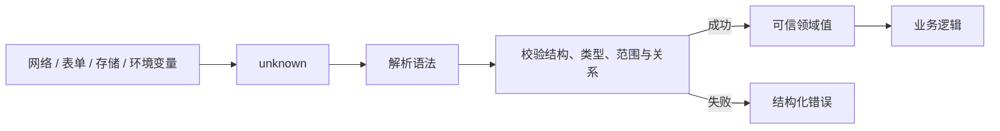

# Runtime Schema Validation：类型不能替代运行时校验

TypeScript 在编译后擦除类型。HTTP 响应、表单、URL、环境变量、存储、消息、文件和第三方 JavaScript 都可能提供与静态声明不一致的值。运行时校验读取真实值，检查结构与约束，并返回已证明的数据或可定位的错误。

## 1. 信任边界



`JSON.parse()` 只验证 JSON 语法，不验证业务结构。`response.json()` 得到的对象也不因赋给 `User` 变量而被检查。

```ts
interface User { id: string }

const unsafe = JSON.parse('{"id": 123}') as User;
unsafe.id.toUpperCase(); // 编译通过，运行时报错
```

`as User` 是开发者对编译器的承诺，不是验证操作。

## 2. 从 unknown 开始

`unknown` 接受任意值，但在证明前不能访问属性或调用方法：

```ts
function describe(value: unknown): string {
  if (typeof value === "string") return value;
  if (value instanceof Error) return value.message;
  return "未知值";
}
```

边界函数应尽早把不可信输入标为 `unknown`。使用 `any` 会让不安全值穿透多个模块，使错误远离入口。

## 3. 校验的层次

### 3.1 语法

例如 JSON 是否能解析、日期字符串是否符合声明格式。语法正确不代表值可用。

### 3.2 结构与基础类型

对象是否非 null、字段是否存在、值是否是 string/number/array。JavaScript 数组也是 object，日期 JSON 是字符串。

### 3.3 值域与格式

数字是否有限、安全整数、在范围内；字符串长度、枚举、正则格式；数组长度和元素约束。

### 3.4 跨字段规则

`startAt <= endAt`、折扣不超过总价、状态与字段组合一致。这类规则通常叫 refinement 或业务不变量。

### 3.5 转换与规范化

将表单字符串转为数字、去除首尾空白、把 ISO 字符串转成 Date。转换应明确：失败不能静默得到 `NaN` 或无效日期。

### 3.6 授权与外部事实

Schema 不能证明用户有权限、记录仍存在或库存充足。授权和数据库不变量必须由服务端和受控系统执行。

## 4. 验证、解析与断言的返回模型

### 4.1 boolean 谓词

```ts
function isString(value: unknown): value is string {
  return typeof value === "string";
}
```

适合简单分支，但不能解释哪个字段失败。

### 4.2 抛错解析

```ts
function parsePositiveInteger(value: unknown): number {
  if (typeof value !== "number" || !Number.isSafeInteger(value) || value <= 0) {
    throw new TypeError("必须是正安全整数");
  }
  return value;
}
```

适合配置启动失败等不可恢复路径。用户输入若只得到异常字符串，界面难以定位字段。

### 4.3 结果对象

```ts
type Issue = {
  path: readonly (string | number)[];
  code: "required" | "type" | "range" | "format" | "relation";
  message: string;
};

type ParseResult<T> =
  | { success: true; data: T }
  | { success: false; issues: readonly Issue[] };
```

结果对象适合表单、批量导入和 API 错误响应。路径如 `["items", 2, "price"]` 可映射到具体控件或表格单元格。

## 5. 手写验证器

```ts
function isRecord(value: unknown): value is Record<PropertyKey, unknown> {
  return typeof value === "object" && value !== null && !Array.isArray(value);
}

interface Profile {
  id: string;
  displayName: string;
  age?: number;
}

function parseProfile(value: unknown): ParseResult<Profile> {
  if (!isRecord(value)) {
    return { success: false, issues: [{ path: [], code: "type", message: "必须是对象" }] };
  }

  const issues: Issue[] = [];
  if (typeof value.id !== "string" || value.id.length === 0) {
    issues.push({ path: ["id"], code: "type", message: "id 必须是非空字符串" });
  }
  if (typeof value.displayName !== "string" || value.displayName.trim().length < 2) {
    issues.push({ path: ["displayName"], code: "range", message: "显示名至少 2 个字符" });
  }
  if (value.age !== undefined && (
    typeof value.age !== "number" || !Number.isInteger(value.age) || value.age < 0 || value.age > 150
  )) {
    issues.push({ path: ["age"], code: "range", message: "年龄必须是 0–150 的整数" });
  }
  if (issues.length > 0) return { success: false, issues };

  return {
    success: true,
    data: {
      id: value.id as string,
      displayName: (value.displayName as string).trim(),
      ...(value.age === undefined ? {} : { age: value.age as number }),
    },
  };
}
```

断言集中在所有检查之后，用于弥合手写累积错误与控制流分析的限制。该边界必须有测试。对象重建还实现了白名单：未知键不会进入可信 Profile。

## 6. Schema 库提供什么

成熟库通常组合以下能力：

- string、number、boolean、literal、enum、array、object、record、union；
- 可选、可空、默认值与转换；
- 嵌套错误路径和多错误收集；
- 从 schema 推导 TypeScript 类型，或从标准 schema 生成验证器；
- 严格对象、剥离未知键或透传未知键策略；
- 同步或异步 refinement；
- JSON Schema、OpenAPI 等标准互操作。

选择时检查：浏览器体积、执行性能、错误格式、异步支持、标准兼容、类型推导精度和维护状态。不要只比较链式 API 是否简短。

### 6.1 Schema 与 TypeScript 的单一来源

常见策略有三种：

1. 以运行时 schema 为源，推导 TypeScript 类型；
2. 以 JSON Schema/OpenAPI 为源，生成类型与验证器；
3. 类型和 schema 分开维护，并用双向类型测试与契约样本防漂移。

直接手写 `interface User` 和另一份独立 schema，若无一致性测试，字段新增后很容易只更新一侧。

## 7. 对象未知键策略

输入 `{ id, role, isAdmin }` 通过只检查 id 的验证后，额外字段如何处理必须明确：

| 策略 | 行为 | 适用场景 |
|---|---|---|
| reject | 有未知键即失败 | 严格协议、配置文件 |
| strip | 输出只保留已声明键 | 表单、外部 API 防止 mass assignment |
| passthrough | 保留未知键 | 代理、向前兼容数据，但需控制后续使用 |

类型系统的“多余属性检查”不是运行时未知键策略；变量传递也可能绕过静态多余属性提示。

## 8. 缺失、undefined 与 null

- 缺失：对象没有该键；
- `undefined`：键可能存在，值为 undefined；
- `null`：明确的 JSON 值；
- 空字符串：表单常见输入，通常不是缺失。

在 `exactOptionalPropertyTypes` 下，`name?: string` 默认允许缺失，但不允许显式 `name: undefined`。Schema 应按业务含义决定是否接受和规范化，不要把四种状态无条件合并。

## 9. 数字、日期和字符串陷阱

### 数字

`typeof NaN === "number"`，Infinity 也是 number。金额通常要求 `Number.isSafeInteger(cents)`，而不是任意 number。表单的 `<input type="number">` 仍可能提供空字符串。

### 日期

JSON 没有 Date 类型。`new Date(text)` 可能产生 Invalid Date；验证格式后还需检查 `Number.isNaN(date.getTime())`。日期时间还涉及时区和精度。

### 字符串

正则匹配邮箱或 UUID 只证明形式，不证明地址存在或 ID 有权限。长度应明确按 UTF-16 code unit、Unicode code point 还是 grapheme cluster 计算。

## 10. 完整案例：创建订单命令

领域输入：

```ts
type Currency = "CNY" | "USD";

interface CreateOrder {
  customerId: string;
  currency: Currency;
  items: readonly {
    sku: string;
    quantity: number;
    unitCents: number;
  }[];
  coupon?: string;
}
```

解析器必须检查：对象结构、customerId、币种、至少一个 item、SKU、数量 1–99、金额安全整数且非负、总金额不溢出；输出只保留白名单字段。

```ts
function parseCreateOrder(input: unknown): ParseResult<CreateOrder> {
  if (!isRecord(input)) {
    return { success: false, issues: [{ path: [], code: "type", message: "命令必须是对象" }] };
  }
  const issues: Issue[] = [];
  if (typeof input.customerId !== "string" || input.customerId.trim() === "") {
    issues.push({ path: ["customerId"], code: "required", message: "客户 ID 不能为空" });
  }
  if (input.currency !== "CNY" && input.currency !== "USD") {
    issues.push({ path: ["currency"], code: "format", message: "不支持的币种" });
  }
  if (!Array.isArray(input.items) || input.items.length === 0) {
    issues.push({ path: ["items"], code: "required", message: "至少需要一个商品" });
  }

  const items: { sku: string; quantity: number; unitCents: number }[] = [];
  if (Array.isArray(input.items)) {
    input.items.forEach((item: unknown, index: number) => {
      if (!isRecord(item)) {
        issues.push({ path: ["items", index], code: "type", message: "商品必须是对象" });
        return;
      }
      const validSku = typeof item.sku === "string" && item.sku.trim().length > 0;
      const validQuantity = typeof item.quantity === "number"
        && Number.isInteger(item.quantity) && item.quantity >= 1 && item.quantity <= 99;
      const validPrice = typeof item.unitCents === "number"
        && Number.isSafeInteger(item.unitCents) && item.unitCents >= 0;
      if (!validSku) issues.push({ path: ["items", index, "sku"], code: "required", message: "SKU 不能为空" });
      if (!validQuantity) issues.push({ path: ["items", index, "quantity"], code: "range", message: "数量必须为 1–99" });
      if (!validPrice) issues.push({ path: ["items", index, "unitCents"], code: "range", message: "金额必须是非负安全整数" });
      if (validSku && validQuantity && validPrice) {
        items.push({ sku: (item.sku as string).trim(), quantity: item.quantity as number, unitCents: item.unitCents as number });
      }
    });
  }

  const total = items.reduce((sum, item) => sum + item.quantity * item.unitCents, 0);
  if (!Number.isSafeInteger(total)) {
    issues.push({ path: ["items"], code: "relation", message: "订单总金额超出安全整数范围" });
  }
  if (input.coupon !== undefined && typeof input.coupon !== "string") {
    issues.push({ path: ["coupon"], code: "type", message: "优惠码必须是字符串" });
  }
  if (issues.length > 0) return { success: false, issues };

  return {
    success: true,
    data: {
      customerId: (input.customerId as string).trim(),
      currency: input.currency as Currency,
      items,
      ...(typeof input.coupon === "string" ? { coupon: input.coupon.trim() } : {}),
    },
  };
}
```

有效输入产生规范化的 `CreateOrder`。无效输入可一次返回多个路径，前端能分别标记 `items[1].quantity` 和 currency。

失败分支包括：items 非数组、空数组、成员非对象、数量小数、`NaN`、负金额、累计金额溢出。即使结构通过，服务端仍要检查 customerId 权限、SKU 是否存在、实时价格和优惠码规则；客户端提供的 unitCents 不能作为结算权威值。

## 11. 测试矩阵

至少覆盖：

- 每个必填字段缺失；
- null、数组、原始值代替对象；
- 边界值 0、1、99、100；
- `NaN`、Infinity、超安全整数；
- 未知枚举；
- 多个错误同时出现且路径正确；
- 未知键被剥离；
- 有效输入输出已规范化；
- 外部 schema 与静态类型的正反向一致性。

不要只用与实现结构相同的手写样本。可加入生成测试，随机产生 JSON 值，确保解析器不会对任意输入抛出非预期异常。

## 12. 性能与安全边界

- 在 API 边界验证一次，内部传递已验证领域值，不要每层重复全量解析；
- 对超大数组、深层对象和递归 schema 设置大小/深度上限，防止资源消耗攻击；
- 错误响应不要回显 secret、完整请求或内部堆栈；
- 正则避免灾难性回溯；
- 异步唯一性检查与数据库写入之间仍有竞态，最终约束放在数据库事务；
- 客户端校验改善反馈，服务端必须独立执行安全与业务校验。

## 13. 调试清单

1. 在入口记录值的真实类型和大小，不记录敏感全文；
2. 确认是 JSON 语法失败还是 schema 失败；
3. 查看错误 path、code 和原始字段；
4. 检查缺失、undefined、null 的策略；
5. 检查对象未知键策略；
6. 对数字检查有限性、整数性和安全范围；
7. 确认转换发生在校验前还是后；
8. 比较 schema 推导类型与公开接口；
9. 用失败样本重现并加入回归测试；
10. 检查安全规则是否错误地只存在客户端。

## 14. 练习

为 CSV 导入后的 `unknown[]` 编写批量解析器。验收标准：

1. 每行包含行号、成功数据或错误列表；
2. 一行失败不阻止其他行；
3. 日期、金额、枚举和跨字段起止时间均验证；
4. 输出剥离未知列；
5. 处理 10,000 行时记录时间和峰值内存；
6. 错误报告可下载且不包含敏感原值；
7. 使用 TypeScript 7 strict 编译；
8. 测试有效、边界、恶意深层值和多错误输入。

## 来源

- [TypeScript Handbook：The unknown Type](https://www.typescriptlang.org/docs/handbook/2/functions.html#unknown)（访问日期：2026-07-17）
- [TypeScript Handbook：Using Type Predicates](https://www.typescriptlang.org/docs/handbook/2/narrowing.html#using-type-predicates)（访问日期：2026-07-17）
- [JSON Schema：Getting Started](https://json-schema.org/learn/getting-started-step-by-step)（访问日期：2026-07-17）
- [JSON Schema Core Specification 2020-12](https://json-schema.org/draft/2020-12/json-schema-core)（访问日期：2026-07-17）
