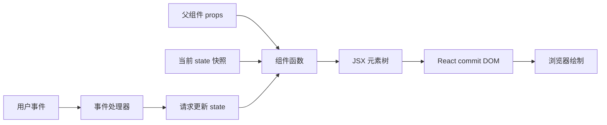

# 框架组件：Props、State、事件、条件、列表与生命周期

组件把一部分界面的结构、行为和状态组织成可组合单元。以 React 19.2 函数组件为例：props 是父级输入，state 是组件记忆，事件处理用户或外部动作，渲染把当前输入映射为 UI，Effect 只负责与 React 之外的系统同步。

## 1. 组件的输入与输出



组件函数应保持纯净：同一组 props、state 和 context 应返回相同描述，不在渲染阶段发请求、修改 DOM 或写外部变量。React 可以重复、暂停或放弃渲染，副作用放在事件处理器或 Effect。

## 2. 最小组件与 JSX

```tsx
interface LessonCardProps {
  title: string;
  completed: boolean;
}

export function LessonCard({ title, completed }: LessonCardProps) {
  return (
    <article aria-label={title}>
      <h2>{title}</h2>
      <p>{completed ? "已完成" : "学习中"}</p>
    </article>
  );
}
```

JSX 是 JavaScript 语法扩展，构建工具把它转换为 React 元素创建调用。组件名以大写开头；小写标签被当作宿主元素。花括号内是表达式，不能直接写 `if` 语句。

组件返回 ReactNode，可包含元素、字符串、数字、null、数组或 Fragment。返回 null 表示本次不产生 DOM，但组件仍参与渲染和生命周期。

## 3. Props：只读调用输入

```tsx
interface AvatarProps {
  name: string;
  imageUrl?: string;
  size?: "small" | "medium" | "large";
  onOpen?: (name: string) => void;
}

function Avatar({ name, imageUrl, size = "medium", onOpen }: AvatarProps) {
  const initials = name.trim().slice(0, 1).toUpperCase();
  return (
    <button type="button" className={`avatar avatar--${size}`} onClick={() => onOpen?.(name)}>
      {imageUrl ?  : <span aria-hidden="true">{initials}</span>}
      <span className="sr-only">打开 {name} 的资料</span>
    </button>
  );
}
```

### 3.1 Props 规则

- 父组件拥有数据，子组件不能修改 props；
- 默认值只在 prop 为 `undefined` 或缺失时生效，`null` 不触发默认值；
- 回调 prop 让子组件报告意图，真正的数据更新由拥有者决定；
- 不要把可从其他 props 计算出的值重复放入 state；
- `children` 是普通 prop，类型通常为 `ReactNode`，不是必须存在的隐式插槽；
- 对互斥 props 使用可辨识联合，避免无效组合。

```tsx
type ButtonProps =
  | { kind: "link"; href: string; onClick?: never; children: React.ReactNode }
  | { kind: "action"; href?: never; onClick: () => void; children: React.ReactNode };
```

## 4. State：由 React 保存的组件记忆

```tsx
import { useState } from "react";

function Counter() {
  const [count, setCount] = useState(0);

  function incrementThreeTimes() {
    setCount((current) => current + 1);
    setCount((current) => current + 1);
    setCount((current) => current + 1);
  }

  return <button onClick={incrementThreeTimes}>计数：{count}</button>;
}
```

state 是某次渲染的快照。调用 setter 不会修改当前闭包中的 `count`，而是排队下一次渲染。下一值依赖上一值时用 updater 函数；连续三个 `setCount(count + 1)` 都基于同一旧快照，结果通常只增加一次。

### 4.1 State 设计

保留最小、规范化、无矛盾的状态：

```tsx
const [items, setItems] = useState<readonly Lesson[]>([]);
const [selectedId, setSelectedId] = useState<string | null>(null);
const selected = items.find((item) => item.id === selectedId) ?? null;
```

不要同时存 `selectedItem`，否则 items 更新后副本可能过期。对象和数组更新必须创建新引用，不能原地修改后传回同一对象。

```tsx
setItems((current) => current.map((item) =>
  item.id === id ? { ...item, completed: true } : item
));
```

## 5. 事件

React 事件处理器接收合成事件对象，常用类型来自目标元素：

```tsx
function SearchForm({ onSearch }: { onSearch(query: string): void }) {
  const [query, setQuery] = useState("");

  function handleSubmit(event: React.FormEvent<HTMLFormElement>) {
    event.preventDefault();
    const normalized = query.trim();
    if (normalized) onSearch(normalized);
  }

  return (
    <form onSubmit={handleSubmit}>
      <label htmlFor="query">关键词</label>
      <input
        id="query"
        value={query}
        onChange={(event) => setQuery(event.currentTarget.value)}
      />
      <button type="submit">搜索</button>
    </form>
  );
}
```

传递函数引用 `onClick={handleClick}`，不要写 `onClick={handleClick()}`。事件默认冒泡；`stopPropagation()` 只在组件契约确实要求隔离时使用。按钮在 form 中默认是 submit，非提交动作显式 `type="button"`。

## 6. 条件渲染

```tsx
function Result({ state }: { state: RequestState<Lesson[]> }) {
  switch (state.status) {
    case "idle": return <p>输入条件后搜索</p>;
    case "loading": return <p role="status">加载中…</p>;
    case "failure": return <p role="alert">{state.error.message}</p>;
    case "success": return state.data.length === 0
      ? <p>没有结果</p>
      : <LessonList lessons={state.data} />;
  }
}
```

用状态联合覆盖 idle、loading、empty、error、success，不用多个布尔值制造矛盾。`condition && <View />` 在 condition 可能为 0 时会渲染 0；需要明确布尔表达式或三元运算。

## 7. 列表与 key

```tsx
function LessonList({ lessons }: { lessons: readonly Lesson[] }) {
  return (
    <ul>
      {lessons.map((lesson) => (
        <li key={lesson.id}>
          <LessonCard title={lesson.title} completed={lesson.completed} />
        </li>
      ))}
    </ul>
  );
}
```

key 帮助 React 在兄弟节点间识别身份。稳定数据库 ID 是合适 key；数组索引只适合永不插入、删除、排序且子项无持久局部状态的静态列表。`Math.random()` 每次渲染变化，会使节点和 state 被销毁重建。

key 不会作为 prop 传给组件；组件需要 ID 时另传 `id={lesson.id}`。相同位置换 key 可有意重置表单 state。

## 8. 组件身份与 state 保留

React 依据组件在渲染树中的位置和类型关联 state。相同位置、相同类型通常保留；类型或 key 改变会重置。不要在父组件函数内部定义子组件，否则每次渲染都创建新的组件类型。

```tsx
function Editor({ documentId }: { documentId: string }) {
  return <DocumentForm key={documentId} documentId={documentId} />;
}
```

文档切换时 key 改变，旧草稿 state 被明确重置。是否应保留草稿是产品决策，不能把 key 当作任意消除 bug 的工具。

## 9. 生命周期与 Effect

组件层面常说 mount、update、unmount；Effect 的准确周期是“开始同步—停止同步”，依赖变化可重复发生。

```tsx
import { useEffect, useState } from "react";

function OnlineStatus() {
  const [online, setOnline] = useState(navigator.onLine);

  useEffect(() => {
    const update = () => setOnline(navigator.onLine);
    window.addEventListener("online", update);
    window.addEventListener("offline", update);
    return () => {
      window.removeEventListener("online", update);
      window.removeEventListener("offline", update);
    };
  }, []);

  return <span>{online ? "在线" : "离线"}</span>;
}
```

Effect 在 commit 后执行。清理在下一次同步开始前以及卸载时执行。开发环境 Strict Mode 会额外执行一次 setup/cleanup 周期以暴露不完整清理，生产行为不应依赖“只运行一次”。

### 9.1 不需要 Effect 的情况

- 从 props/state 计算显示值：渲染时计算；
- 用户点击后发请求：事件处理器；
- 根据 prop 重置某个子树：key；
- 缓存昂贵纯计算：先测量，再考虑 memo；
- 在两个 state 间同步：通常合并或派生 state。

Effect 用于订阅、计时器、媒体 API、网络连接、第三方控件等外部系统同步。

## 10. 完整案例：课程筛选器

仓库中的[React 19.2 可运行示例](../../examples/typescript-frameworks/react-components/)包含 TypeScript 7 配置、Vite 8 生产构建和完整样式。

```tsx
interface Lesson {
  id: string;
  title: string;
  completed: boolean;
}

function LessonExplorer({ initialLessons }: { initialLessons: readonly Lesson[] }) {
  const [query, setQuery] = useState("");
  const [showCompleted, setShowCompleted] = useState(true);

  const normalized = query.trim().toLocaleLowerCase("zh-CN");
  const visible = initialLessons.filter((lesson) =>
    (showCompleted || !lesson.completed)
    && lesson.title.toLocaleLowerCase("zh-CN").includes(normalized)
  );

  return (
    <section aria-labelledby="lesson-heading">
      <h2 id="lesson-heading">课程</h2>
      <label>
        搜索
        <input value={query} onChange={(event) => setQuery(event.currentTarget.value)} />
      </label>
      <label>
        <input
          type="checkbox"
          checked={showCompleted}
          onChange={(event) => setShowCompleted(event.currentTarget.checked)}
        />
        显示已完成
      </label>
      <p aria-live="polite">{visible.length} 项</p>
      {visible.length === 0 ? (
        <p>没有匹配课程</p>
      ) : (
        <ul>{visible.map((lesson) => <li key={lesson.id}>{lesson.title}</li>)}</ul>
      )}
    </section>
  );
}
```

输入是固定课程数组和两个用户状态；筛选结果在渲染中派生，没有冗余 Effect。验证：输入“Type”后数量和列表一致；取消“显示已完成”后已完成项消失；清空输入恢复列表；无结果显示明确空状态；键盘能操作输入与复选框。

失败分支：若用索引作为 key 并允许排序，子项将来加入编辑 state 后可能错配；若把 visible 存进 state 并在 Effect 同步，会出现一次过期渲染和依赖遗漏。

## 11. 组件边界

拆组件的依据是责任和变化边界，而不是行数：

- 一段 UI 有独立语义和可复用契约；
- state 只属于局部子树；
- 需要独立测试或性能隔离；
- 同一数据在多个兄弟共享时提升到最近共同父级；
- 跨页面服务端数据不应默认塞进全局组件 state。

过度拆分会产生透传 props 和跳转成本；巨大组件则混合请求、表单、列表和对话框状态。先识别数据所有者和事件流，再决定边界。

## 12. 常见错误与调试

1. 渲染中修改 state 或外部变量，造成循环或重复副作用。
2. 修改 state 对象原值，React 看不到可靠的新快照。
3. 把可派生值存为 state，产生漂移。
4. Effect 缺依赖或用空数组隐藏闭包旧值。
5. 列表使用不稳定 key，state 跟错数据。
6. 条件分支遗漏 loading、empty、error 或权限状态。
7. 点击 div 代替 button，丢失键盘和语义。
8. 把服务端响应直接断言为类型，不做运行时验证。

React DevTools 查看 props、state 和组件重渲染；浏览器 Elements 检查真实语义；Console 检查 key 和 Hook 警告；Performance 中检查 React tracks；测试使用用户可见角色和名称定位元素。

## 13. 练习

实现带新增、编辑、筛选和删除确认的任务列表。验收：

1. props 与事件类型无 `any`；
2. state 不保存可派生 filteredTasks；
3. 每个列表 key 稳定；
4. 覆盖空列表、无筛选结果和编辑失败；
5. 删除对话框取消后焦点回触发按钮；
6. 切换编辑项时草稿按明确策略保留或重置；
7. 所有 Effect 都能指出同步的外部系统并有清理；
8. TypeScript strict 和组件测试通过。

## 来源

- [React：Your First Component](https://react.dev/learn/your-first-component)（访问日期：2026-07-17）
- [React：Passing Props to a Component](https://react.dev/learn/passing-props-to-a-component)（访问日期：2026-07-17）
- [React：State as a Snapshot](https://react.dev/learn/state-as-a-snapshot)（访问日期：2026-07-17）
- [React：Rendering Lists](https://react.dev/learn/rendering-lists)（访问日期：2026-07-17）
- [React：Lifecycle of Reactive Effects](https://react.dev/learn/lifecycle-of-reactive-effects)（访问日期：2026-07-17）
