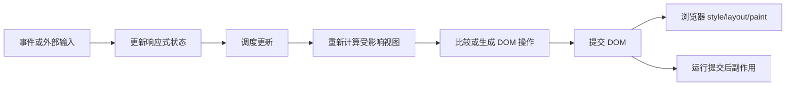

# 响应式更新与渲染模型

前端框架把状态变化映射为界面更新，但触发粒度、依赖追踪和 DOM 提交方式不同。理解模型的目标不是背内部名词，而是能解释“什么变化触发了什么计算、何时读取到哪个值、哪些 DOM 被更新、为什么副作用执行”。

## 1. 通用更新流水线



框架渲染不是浏览器渲染。前者计算 UI 并提交 DOM；后者执行样式、布局、绘制和合成。

## 2. React：组件重执行与 commit

React 更新包含 trigger、render、commit：

1. 初次 root render 或 state setter 触发工作；
2. React 调用组件函数，递归计算元素树；
3. commit 阶段把必要变化应用到 DOM；
4. 浏览器绘制；普通 Effect 随后同步外部系统。

渲染阶段应纯净，可被重复、暂停或放弃。commit 修改 DOM，不应被应用代码当作每次都重建整个页面。

```tsx
function Price({ cents }: { cents: number }) {
  console.log("render", cents);
  return <output>{(cents / 100).toFixed(2)}</output>;
}
```

组件函数运行不等于 DOM 一定变化。若输出文本相同，commit 可以不修改对应节点。

### 2.1 State 是快照

```tsx
function Counter() {
  const [count, setCount] = useState(0);

  function handleClick() {
    setCount(count + 1);
    console.log(count); // 当前事件闭包的旧快照
  }

  return <button onClick={handleClick}>{count}</button>;
}
```

setter 请求新渲染；旧函数调用中的变量不被改写。需要连续基于前值计算时用 `setCount(current => current + 1)`。

### 2.2 批处理与优先级

React 会批处理同一事件中的多个 state 更新，减少无意义中间 commit。`startTransition` 可把非紧急更新标记为可中断的 transition；输入框受控值等紧急反馈不要放进 transition。

```tsx
const [query, setQuery] = useState("");
const [filter, setFilter] = useState("");

function change(value: string) {
  setQuery(value);
  startTransition(() => setFilter(value));
}
```

transition 不会让计算自动变快，只让 React 能优先处理更紧急更新。性能仍需减少计算量、虚拟化或移动工作。

### 2.3 位置、类型与 key 决定身份

React 将 state 关联到渲染树位置。相同位置和组件类型保留 state；类型或 key 改变会重置。这解释了列表 key、条件分支和表单草稿行为。

## 3. Vue：响应式依赖追踪

Vue 3 使用 Proxy 处理响应式对象，并在 getter 读取时追踪当前作用，setter 写入时触发相关作用。`ref` 用 `.value` 保存响应式值，在模板中会自动解包。

```vue
<script setup lang="ts">
import { computed, ref } from "vue";

const price = ref(1990);
const quantity = ref(1);
const total = computed(() => price.value * quantity.value);
</script>

<template>
  <button @click="quantity++">数量 {{ quantity }}</button>
  <output>{{ total }}</output>
</template>
```

`computed` 根据读取到的依赖缓存结果；依赖未变时复用。`watch` 用于观察特定源并执行副作用，`watchEffect` 自动追踪同步执行期间读取的依赖。异步回调中第一个 await 之后的读取不属于初始同步追踪。

### 3.1 解构边界

直接从 reactive 对象解构原始值可能失去属性访问的响应式连接：

```ts
const state = reactive({ count: 0 });
const { count } = state; // 普通 number 快照
```

使用 `toRefs`、保持对象属性访问，或根据框架当前编译语法选择。不要把“变量看起来相同”当作依赖仍连接。

## 4. Svelte：编译期响应式转换

Svelte 把组件编译为针对性 DOM 更新代码。Svelte 5 runes 模式用 `$state` 声明状态、`$derived` 声明派生值、`$effect` 同步外部系统：

```svelte
<script lang="ts">
  let quantity = $state(1);
  let price = $state(1990);
  let total = $derived(quantity * price);
</script>

<button onclick={() => quantity++}>数量 {quantity}</button>
<output>{total}</output>
```

编译器分析依赖并生成更新逻辑，不代表没有运行时。Svelte 仍有状态、调度、组件生命周期和 DOM 操作，只是许多工作在构建期决定。

Svelte 5 仍支持 legacy mode，但新代码不能把旧 `$:`、`export let`、`on:` 语法和 runes 行为混写成同一套规则。

## 5. 三种模型的比较维度

| 维度 | React 19.2 | Vue 3 | Svelte 5 runes |
|---|---|---|---|
| 主要触发单位 | state 更新请求组件渲染 | 响应式写入触发依赖作用 | rune 状态写入触发编译生成的依赖更新 |
| 依赖表达 | 组件读取 + Hook 依赖/编译器分析 | 运行时读取追踪 | 编译转换与运行时信号 |
| 视图表达 | JSX/元素树 | template 或 render function | 模板 |
| DOM 更新 | render 后 commit 必要变化 | patch 组件虚拟 DOM/编译优化块 | 编译生成针对性更新 |
| 派生值 | 渲染计算、useMemo 等 | computed | $derived |
| 副作用 | useEffect/useLayoutEffect | watch/watchEffect/lifecycle | $effect/lifecycle |

表格描述默认模型，不代表绝对性能排序。真实结果取决于组件结构、数据规模、编译配置、浏览器工作和应用代码。

## 6. 派生值与副作用

派生值是纯计算，应尽量不写外部系统：

```tsx
const visible = products.filter((product) => product.name.includes(query));
```

副作用与外部系统同步：订阅 WebSocket、控制媒体、写 document title、启动计时器。把派生值放 Effect 会产生额外渲染：

```tsx
// 不推荐
useEffect(() => setVisible(products.filter(matches)), [products, matches]);
```

正确做法通常直接计算；仅当测量证明计算昂贵且依赖稳定时缓存。

## 7. 调度、微任务与 DOM 可见时机

框架通常把多个同步写入排队，在当前调用栈之后批量刷新。写 state 后立即查询 DOM，可能仍看到旧 DOM。React 使用 Effect/layout Effect，Vue 使用 `nextTick()`，Svelte 使用 `tick()` 等框架机制等待提交。

```ts
// Vue
count.value++;
await nextTick();
// 此时 DOM 已应用该批更新
```

等待 DOM 不应成为常规数据流。业务逻辑读取状态源，不从 DOM 反推 state；只有聚焦、测量布局和第三方组件集成需要关心提交时机。

## 8. Effect 的依赖和清理

React 示例：

```tsx
useEffect(() => {
  const controller = new AbortController();
  fetch(`/api/search?q=${encodeURIComponent(query)}`, { signal: controller.signal })
    .then((response) => response.json())
    .then(setResult)
    .catch((error: unknown) => {
      if (!(error instanceof DOMException && error.name === "AbortError")) throw error;
    });
  return () => controller.abort();
}, [query]);
```

每次 query 变化先停止旧同步，再启动新同步。仍需处理响应结构校验、加载/错误状态和服务端缓存。框架不会自动消除所有请求竞态。

## 9. 性能从哪里来

一次交互总耗时可能来自：

- 事件处理和数据转换；
- 框架调度与组件计算；
- DOM 创建/更新；
- style recalculation、layout、paint、composite；
- 网络、图片解码和主线程长任务；
- 开发模式额外检查。

不要仅凭“组件 render 次数”判断用户性能。一次快速 render 可能无关紧要，而一次同步布局或 10,000 节点绘制可能主导延迟。

### 9.1 测量顺序

1. 用浏览器 Performance 记录真实交互；
2. 找最长主线程任务和 layout/paint；
3. 用框架 DevTools 确认受影响组件；
4. 缩小状态范围、减少对象分配或昂贵计算；
5. 大列表虚拟化；
6. 再比较优化前后同一指标。

memoization 有比较、内存和复杂度成本。React Compiler 等工具可自动优化部分模式，但代码仍需遵守纯渲染规则，不能把编译器当作修复副作用的机制。

## 10. 完整案例：10,000 项筛选

输入：10,000 条产品、查询词和“只看有货”开关。要求输入字符立即可见，列表结果可延后更新。

```tsx
function ProductSearch({ products }: { products: readonly Product[] }) {
  const [query, setQuery] = useState("");
  const [filter, setFilter] = useState("");
  const [inStockOnly, setInStockOnly] = useState(false);
  const [pending, startTransition] = useTransition();

  const visible = products.filter((product) =>
    (!inStockOnly || product.stock > 0)
    && product.name.toLowerCase().includes(filter.toLowerCase())
  );

  function updateQuery(value: string) {
    setQuery(value);
    startTransition(() => setFilter(value));
  }

  return (
    <section>
      <input value={query} onChange={(event) => updateQuery(event.currentTarget.value)} />
      <label><input type="checkbox" checked={inStockOnly} onChange={(event) => setInStockOnly(event.currentTarget.checked)} />仅有货</label>
      <p aria-live="polite">{pending ? "正在筛选" : `${visible.length} 项`}</p>
      <ProductList products={visible} />
    </section>
  );
}
```

观察：query 每次键入紧急更新；filter 在 transition 中更新；pending 可展示非阻塞反馈。该方案不能降低 10,000 项过滤本身的 CPU，总量继续增长时应预索引、分片、Web Worker、服务端搜索或虚拟化。

失败分支：把 input 的 value 绑定 filter 并只在 transition 更新会使输入显得滞后；把每项 key 写成索引会在结果变化时错配局部 state；每次渲染重新创建复杂索引也会抵消优化。

## 11. 常见错误

1. 把“重新执行组件”误写成“重建所有 DOM”。
2. 在渲染阶段发请求或修改对象，遇到重复渲染就产生多次副作用。
3. 认为 setter 后当前变量立即改变。
4. 在 Vue 解构 reactive 原始属性后仍假设依赖连接。
5. 把 Svelte 编译期优化解释为零运行时成本。
6. 用 Effect 同步可派生数据。
7. 为消除所有 render 过度 memo，增加陈旧闭包与比较成本。
8. 忽略浏览器 layout/paint，只看框架 profiler。

## 12. 验证与练习

建立计数器、筛选列表和外部订阅三个小组件，分别记录：事件日志、组件计算日志、DOM MutationObserver、Effect setup/cleanup。验收：

1. 能按时间顺序解释一次更新；
2. 证明组件执行但 DOM 可不变；
3. 连续三个函数式更新得到 +3；
4. 订阅切换时旧监听器被移除；
5. 10,000 项筛选有优化前后 Performance 记录；
6. React/Vue/Svelte 中至少选择两个实现同一功能，并按触发、依赖、提交和清理比较，不用框架口号代替测量。

## 来源

- [React：Render and Commit](https://react.dev/learn/render-and-commit)（访问日期：2026-07-17）
- [React：State as a Snapshot](https://react.dev/learn/state-as-a-snapshot)（访问日期：2026-07-17）
- [React 19.2](https://react.dev/blog/2025/10/01/react-19-2)（访问日期：2026-07-17）
- [Vue：Reactivity in Depth](https://vuejs.org/guide/extras/reactivity-in-depth.html)（访问日期：2026-07-17）
- [Svelte：What are runes?](https://svelte.dev/docs/svelte/what-are-runes)（访问日期：2026-07-17）
